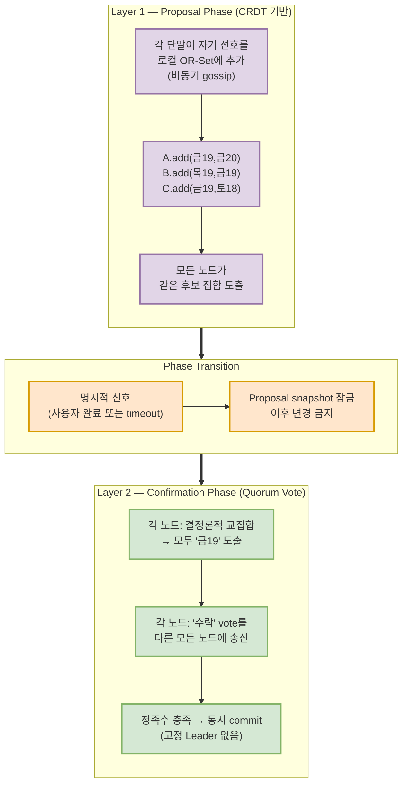
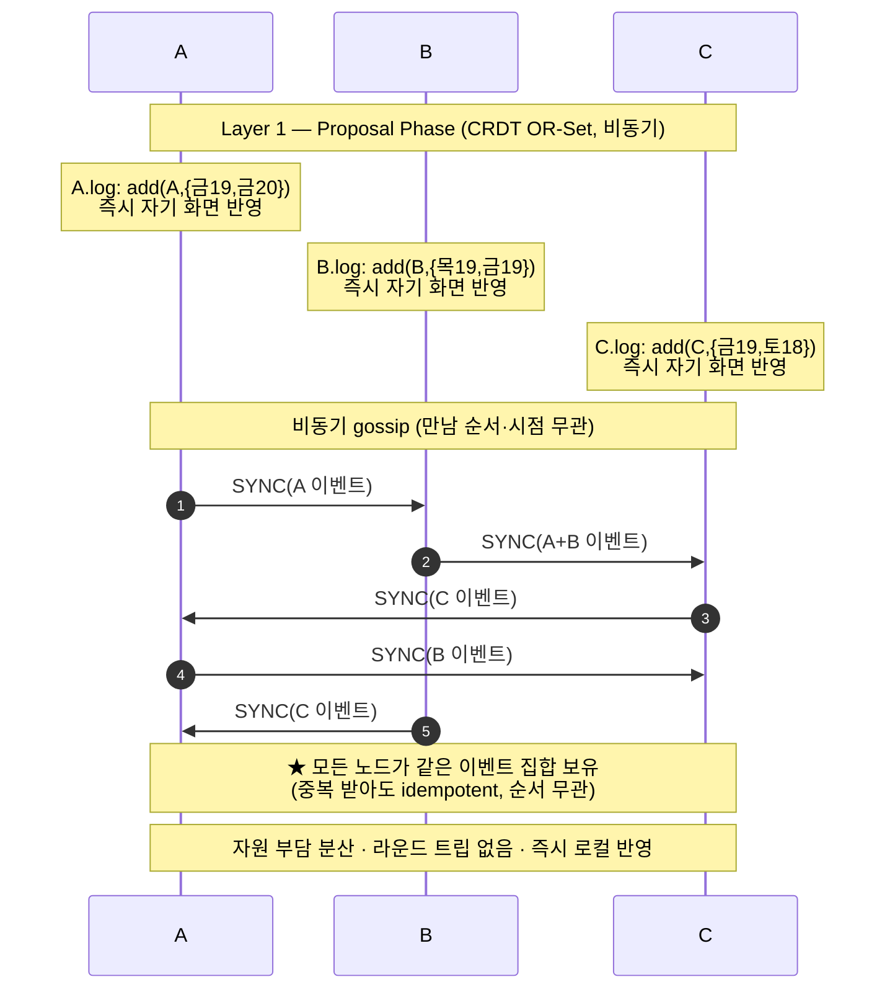
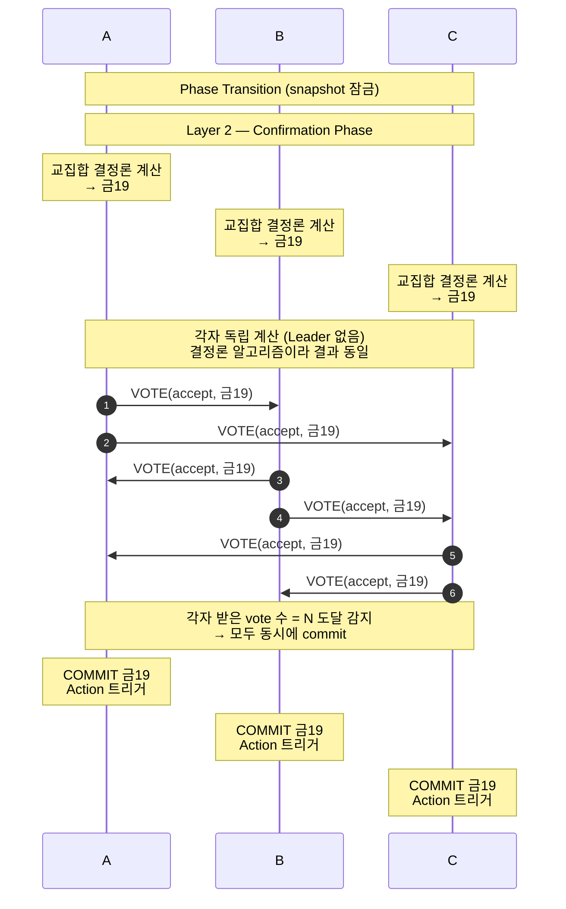
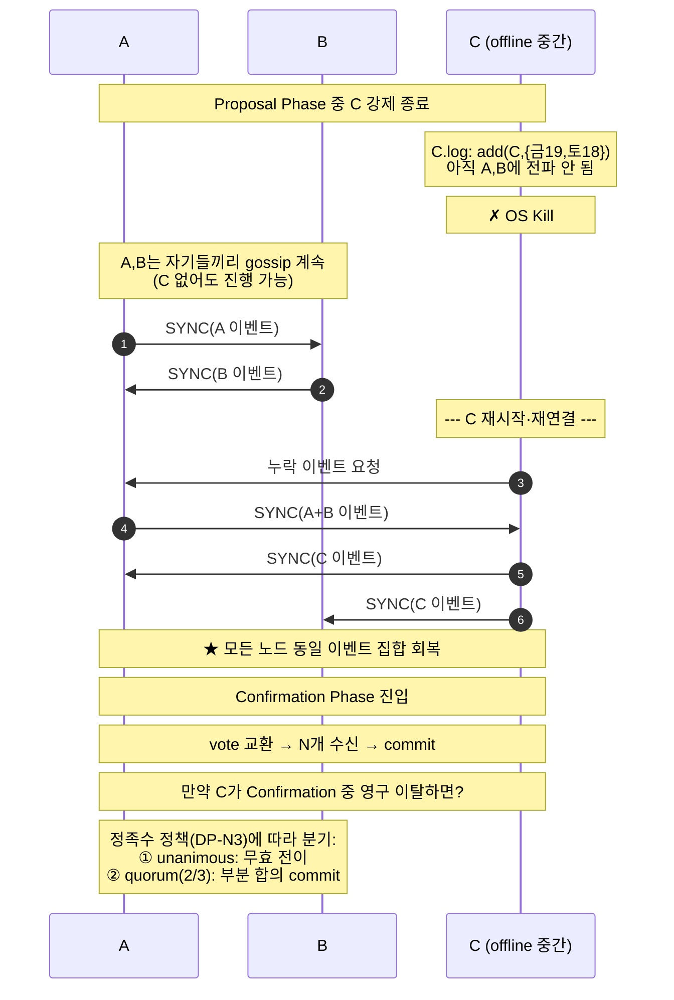

# DP01 — N명 커뮤니케이션(N-party) 협상 진행 구조

> **문서 성격**: Design Decision 후보 (v2 — 2-Layer 구조로 재정의)
> **솔루션 결정축**: 협상 단계별 데이터 일관성 모델 — *Proposal Phase는 CRDT 비동기, Confirmation Phase는 Quorum vote*
> **제약 사항**: 외부 server 미사용 — 모든 조율은 참여 단말(On-device) 내부 또는 단말 간(P2P)에서만 수행
> **⚡ 새 제안 (NEW PROPOSAL)**: 본 문서는 기존 [`DP01-N명 커뮤니케이션 시나리오.md`](DP01-N명%20커뮤니케이션%20시나리오.md)의 *대체 제안*이다. 기존 v1(토폴로지 결정축)과 *나란히 공존*하며, 팀 합의 후 채택 시 v1을 대체한다.
>
> **이전 버전**: v1은 *중앙형(Coordinator) vs 탈중앙(Mesh)* 토폴로지 결정축이었으나, ① 결정 차원이 빈약하고 ② QAS-014/015/016의 본질적 요구를 다루지 못해 본 v2로 재정의함. v1의 통찰(외부 서버 제약의 함의, SPOF가 남의 휴대폰, 정보 비대칭)은 본 DP의 *전제*로 흡수.
> **대응 QAS**: [QAS-014](../07-QAS.md#qas-014) · [QAS-015](../07-QAS.md#qas-015) · [QAS-016](../07-QAS.md#qas-016) — 세 QAS가 *각각 다른 sub-decision*에 대응 (8절 추적성 표 참조)
> **약어**: PPA = Personal Proxy Agent · CRDT = Conflict-free Replicated Data Type · OR-Set = Observed-Removed Set · SPOF = Single Point of Failure

---

## 1. 풀고자 하는 문제

서로 다른 사용자의 단말에 있는 PPA들이 공동 합의가 필요한 태스크(모임 일정·여행 계획)를 수행할 때, 참여자가 3명 이상(N-party)이 되는 순간 1:1 협상과는 *질적으로 다른 어려움*이 생긴다.

세 가지 QAS가 이 어려움을 정량 요구로 박았다:

- **QAS-014 — 자원 선형 확장**: 참여자가 1명 늘 때마다 CPU 피크 +2%, Memory +20MB 이내. N=7에서 CPU 50% / Memory 400MB.
- **QAS-015 — 상태 일관성 100%**: 협상 중 한 명이 상태 변경(제안·역제안·수락·거절·철회)하면 *모든 참여자가 2초 내에 동일 상태 공유*. 불일치율 0%.
- **QAS-016 — 합의 결과 일관성 100%**: 합의 타결 시 *모든 참여자 ACK 수신 후*에만 후속 Action 트리거. 결과 불일치 0%.

세 요구는 *서로 다른 결정 차원*에 속한다 — 014는 자원, 015는 런타임 동기화, 016은 원자적 commit. **단일 토폴로지 결정으로는 세 요구를 함께 풀 수 없다.** v1이 부닥쳤던 막다른 길이 여기다.

> **핵심 통찰 (v1에서 흡수):** 외부 서버를 못 쓰므로 "중앙"은 견고한 클라우드가 아니라 **참여자 단말 중 하나**가 된다. 따라서 *고정 Coordinator 모델은 SPOF가 남의 휴대폰*이라 본 PoC의 신뢰성·공정성 가설과 본질적으로 충돌한다 — 본 DP의 *결정 전제*로 채택한다.

---

## 2. 아키텍처적 난제

### 2.1 협상의 두 단계는 서로 다른 일관성 요구를 갖는다

협상은 *의미론적으로* 두 단계로 구성된다.

| 단계 | 성격 | 자연스러운 데이터 모델 | 일관성 요구 |
|---|---|---|---|
| **Proposal** | 누가 어떤 후보를 내는가 | *집합 누적* (add-mostly) | Eventual (결국 같으면 됨) |
| **Confirmation** | 합의 결과를 모두 동시에 인지·확정 | *원자적 commit* | Strong (순간에도 동일) |

이걸 *하나의 데이터 모델*로 묶으려 하면 — RSM(Raft) 류는 Proposal까지 동기 합의를 강제해 자원 부담↑(QAS-014 위협), CRDT 류는 Confirmation에서 "모두 ACK 받음" 시점 감지가 어려움(QAS-016 위협). **단일 모델 한계가 v1 토폴로지 결정의 모호함을 만든 진짜 원인이었다.**

### 2.2 N-party 고유 난제 (1:1에 없음)

- **부분 불일치 (Partial Inconsistency)**: 1:1엔 두 사본만 있어 split-brain만 막으면 되지만, N개 사본은 *A·B는 같은데 C만 다른* 부분 불일치가 가능. QAS-015의 0%는 *전원 동일*을 요구.
- **부분 ACK (Partial Acknowledgment)**: N명 중 일부 ACK만 받은 상태에서 Action 트리거 여부 결정. QAS-016이 "모든 ACK 후 Action"을 명시했지만, *지연자 한 명이 협상 전체를 멈출지*는 별도 정책 결정.
- **참여자 이탈 (Membership Drop)**: 참여자가 임의 시점에 강제 종료·네트워크 단절될 수 있고, 합의가 *그 단말을 기다려야 하는가*가 결정 포인트.

### 2.3 v1의 막다른 길

v1은 *중앙형 vs 탈중앙*이라는 단일 결정축으로 위 모든 어려움을 묶으려 했다. 결과:

- Coordinator(A): QAS-014·015·016 모두 *명목상* 만족하지만 *남의 휴대폰이 SPOF*라 외부 서버 제약과 충돌.
- Mesh(B): SPOF는 없지만 *모든 단계에서* O(N²) 메시지·split-brain 위험·종결 권위 부재라 *세 QAS 모두 위협*.
- 하이브리드는 7절에 한 줄 언급만 — *결정축이 단일 토폴로지*라 두 단계 분리 설계가 안 나왔음.

→ 본 v2는 **결정축을 토폴로지에서 *데이터 일관성 모델*로 옮기고, 협상의 두 단계를 분리해 각각에 맞는 모델을 적용한다.**

---

## 3. 해결 방안 — 2-Layer 구조

### 3.1 전체 구조

### 3.2 Layer 1 — Proposal Phase (CRDT, 비동기)

**핵심 메커니즘:**
- 각 단말이 *자기 선호를 자기 OR-Set에 즉시 추가*. 다른 단말 응답 기다리지 않고 *자기 화면에 즉시 반영* (UX 즉응성).
- 단말 간 만남 시점마다 *서로 모르는 이벤트만 교환*. 중복 받아도 안전, 순서 무관.
- 결국 모든 노드가 같은 이벤트 집합 보유 → *각자 독립적으로 같은 후보 집합* 도출.

**Layer 1이 답하는 QAS:**
- **QAS-014 (자원)**: 라운드 트립 없는 비동기 gossip이라 *피크 CPU 분산*. 동기 합의 모델보다 본질적으로 유리.
- **QAS-015 일부**: Proposal 단계의 eventual consistency. 다만 *2초 내 수렴*은 gossip 정책에 의존 → DP-N1·DP-N2 결정.

### 3.3 Phase Transition

Proposal에서 Confirmation으로 넘어가는 *명시적 신호*가 있어야 한다 — 이게 없으면 *언제까지 후보를 받을지*가 불명확.

세 가지 신호 후보 (DP-N2에서 선택):
- **사용자 명시적 완료**: "이제 결정하자" 버튼
- **Timeout**: 마지막 추가 후 N초 경과
- **Quiescence detection**: 모든 노드의 gossip이 정착했음 감지

신호 발생 시 *Proposal snapshot이 잠기고* 이후 추가는 거부됨. 이 잠금이 *Confirmation의 입력을 결정론적으로 만든다.*

### 3.4 Layer 2 — Confirmation Phase (Quorum Vote)

**핵심 메커니즘:**
- 잠긴 Proposal snapshot에서 *각 노드가 결정론적 알고리즘*(예: 교집합)으로 결과 산출. **고정 Coordinator 없음** — 모두 자기 단말에서 같은 결과 도달.
- 각자 "이 결과 수락" vote를 *다른 모든 N-1개 노드에 직접 송신* (N-to-N).
- 각 노드가 자기 단말에서 *N개 vote 수신 시점 감지* → *동시에 commit*.

**Layer 2가 답하는 QAS:**
- **QAS-015 (상태 일관성)**: Confirmation snapshot이 결정론적이라 모든 노드가 같은 결과. vote 교환의 round trip이 2초 내 가능.
- **QAS-016 (합의 결과 일관성)**: N개 vote 수신이 곧 "모든 ACK". commit이 자연스럽게 ACK 수집 후로 미뤄짐.

### 3.5 장애 케이스

**핵심:**
- Proposal Phase 중 이탈: *A·B는 진행 계속*. C 부활 시 자동 sync로 따라잡음 (CRDT의 본질적 강점).
- Confirmation Phase 중 이탈: *정족수 정책(DP-N3)*에 따라 두 갈래 — 전원 합의 강제(unanimous)면 무효 전이, 정족수(N/2+1)면 부분 합의 commit. **이 결정이 QAS-016 의미론을 정함.**

---

## 4. v1과의 비교 — 무엇이 달라졌나

| 항목 | v1 (Centralized vs Decentralized) | v2 (2-Layer Proposal/Confirmation) |
|---|---|---|
| **결정축** | 토폴로지 (단일 차원) | 일관성 모델 (단계별 분리) |
| **QAS-014 답** | 별점 비교 ("A 유리") | Layer 1의 비동기 gossip으로 자원 분산 |
| **QAS-015 답** | "Coordinator가 일관성 유지" 추상적 | Layer 2 결정론 계산 + vote round trip 명시 |
| **QAS-016 답** | "Coordinator가 종결자" 추상적 | Layer 2 vote N개 수신 → 동시 commit (자연 ACK) |
| **고정 SPOF** | 있음 (A) / 없음 (B) | **없음** — 매 순간 Coordinator도 Leader도 없음 |
| **시나리오 명확성** | 추상적 별점 | 메시지 단위 시퀀스로 표현 |

---

## 5. 4개 Sub-Decision Points

본 DP는 단일 결정이 아니라 *4개 sub-decision*의 묶음이다. 각 결정의 후보안 비교는 [`[새제안]DP01-sub-decisions.md`]([새제안]DP01-sub-decisions.md) 참조.

| Sub-DP | 결정 내용 | 핵심 트레이드오프 | 대응 QAS |
|---|---|---|---|
| **DP-N1** | Proposal Layer 데이터 구조 | OR-Set vs LWW-Map vs MV-Register | QAS-014 |
| **DP-N2** | Phase Transition 메커니즘 | Timeout vs Explicit signal vs Quiescence | QAS-014, QAS-015 |
| **DP-N3** | Confirmation Vote 정책 | Unanimous vs Quorum vs 가중치 | QAS-015, QAS-016 |
| **DP-N4** | 부분 ACK 처리 정책 | Wait vs Retry vs Drop vs Degrade | QAS-016 |

---

## 6. QAS 추적성 표

본 DP가 [`07-QAS.md`](../07-QAS.md)와 어떻게 맞물리는지를 명시적으로 박는다. QAS 동기화 규칙([`CLAUDE.md 7항`](../../CLAUDE.md))에 따라 본 표를 *QAS 변경 시 함께 갱신*해야 한다.

| QAS | 본 DP가 답하는 부분 | 본 DP가 답하지 못하는 부분 |
|---|---|---|
| **QAS-014** Capacity/Scalability | Layer 1 비동기 gossip으로 피크 CPU 분산. Layer 2의 vote는 N-to-N이라 노드당 N-1개 메시지 (O(N)) | 단말당 실제 CPU 2%/명·Memory 20MB/명 임계값 *측정*은 PoC 실측 필요 |
| **QAS-015** State Consistency | Layer 1 eventual + Layer 2 결정론적 snapshot으로 *Confirmation 시점에 100% 일관성*. vote round trip 2초 가능 | "협상 *중*" 상태 일관성은 Layer 1 eventual이라 *순간 불일치 허용* — QAS-015의 100%가 *어느 시점 기준인지* 정의 필요 |
| **QAS-016** Consensus Consistency | Layer 2 vote N개 수신이 곧 "모든 ACK". commit이 자연스럽게 ACK 후로 미뤄짐 | 정족수 미달 시 처리 (부분 합의 vs 무효) — DP-N3 결정에 의존 |

---

## 7. 권고 및 다음 단계

- **본 v2 채택을 권고한다.** v1의 토폴로지 단일 결정축으로는 QAS-014/015/016의 *서로 다른* 차원을 함께 풀 수 없음. 2-Layer 구조가 협상 의미론과 분산 시스템 이론(CRDT + Quorum) 양쪽에 정합.
- **다음 결정**: Sub-DP N1~N4를 각각 깊이 비교. 특히 *DP-N3 (Confirmation Vote 정책)* 가 QAS-016 의미론을 정하는 핵심.
- **PoC 검증 필요**: Layer 2 vote round trip이 *실제로 2초 내*에 가능한지 N=3,5,7에서 실측. QAS-015의 2초 한계가 이 측정에 의존.

---

## 8. 미해결 결정

1. **DP-N1~N4 각각의 후보안 채택** — [`[새제안]DP01-sub-decisions.md`]([새제안]DP01-sub-decisions.md)에서 분석.
2. **Phase 역방향 전환** — Confirmation 단계에서 합의 실패 시 Proposal로 돌아갈 것인가, 무효 전이로 종료할 것인가.
3. **참여자 동적 가입·이탈** — 협상 진행 중 새 참여자 합류 시 Layer 1·2 어디에 어떻게 통합할지.
4. **CRDT 자료구조의 도메인 매핑** — 협상 의미론이 OR-Set·LWW-Register 같은 *기존 CRDT*에 자연스럽게 맞는지, 도메인 특화 CRDT가 필요한지.

---

_v1에서 v2로의 전환 근거: QAS-014/015/016 정식 채택 후 단일 토폴로지 결정으로 세 요구를 함께 풀 수 없다는 점이 분석에서 드러남. v1의 통찰은 본 DP의 전제로 흡수._
