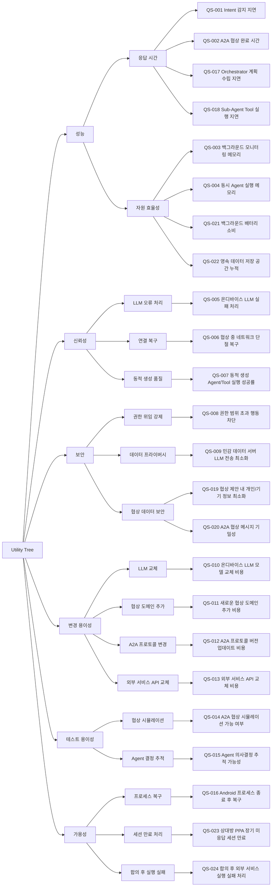

# 품질 시나리오 목록

## 개요

### 목적

Ondevice Agentic Platform의 구조 설계에 영향을 미치는 품질 속성을 도출하고, 아키텍처 결정의 근거가 되는 품질 시나리오를 정의합니다.

### 생성 기준

- **비즈니스 목표 연관성**: BG-1~4 달성에 영향을 미치는 품질
- **구조 설계 영향**: 아키텍처 결정(컴포넌트 분리, 계층 구조, 데이터 흐름)에 실질적 영향을 주는 품질
- **시스템 제약 반영**: 온디바이스 LLM, Android 플랫폼, PoC 성격 반영
- **중복 제외**: 동일한 설계 결정을 유발하는 시나리오는 하나로 통합

---

## Utility Tree

---

## 품질 시나리오 목록

### QS-001: Intent 감지 지연 시간

- **품질 속성**: 성능 — 응답 시간
- **관련 비즈니스 목표**: BG-1 (인지 부하 감소)
- **관련 Use Case**: UC-001, UC-002, UC-003
- **설명**: 사용자가 메신저 앱에서 메시지를 주고받는 동안 IDS가 Intent를 감지하기까지의 지연 시간. 온디바이스 LLM 추론이 포함되며, 지연이 길면 사용자가 이미 다른 행동을 취한 후 Intent가 감지되는 문제가 발생한다.
- **측정 방법**: 메시지 수신 이벤트 발생 시점부터 IntentDetector가 Intent 분류를 완료하는 시점까지의 시간 (ms)

---

### QS-002: A2A 협상 완료 시간

- **품질 속성**: 성능 — 응답 시간
- **관련 비즈니스 목표**: BG-3 (자율 협상 기술 선도)
- **관련 Use Case**: UC-013, UC-014
- **설명**: Meta Agent가 상대방 PPA와 A2A 협상을 시작한 시점부터 합의안이 도출되기까지의 전체 시간. 여러 라운드의 네트워크 왕복과 양측 LLM 추론이 포함된다. 협상이 너무 오래 걸리면 사용자 신뢰를 잃고 직접 개입 빈도가 높아진다.
- **측정 방법**: NegotiationController가 협상 세션을 시작한 시점부터 AgreementDB에 합의가 저장되는 시점까지의 총 시간 (분), 라운드 수별 측정

---

### QS-003: 백그라운드 모니터링 메모리 사용량

- **품질 속성**: 성능 — 자원 효율성
- **관련 비즈니스 목표**: BG-1 (인지 부하 감소 — 항상 켜져 있어야 함)
- **관련 Use Case**: UC-001, UC-002, UC-003
- **설명**: IDS가 백그라운드에서 기기 활동을 지속적으로 모니터링하는 동안 플랫폼이 점유하는 메모리 크기. Android OS는 일정 메모리 이상을 사용하는 백그라운드 프로세스를 강제 종료하므로, 상시 모니터링의 지속성이 이 값에 달려 있다.
- **측정 방법**: IDS 활성 상태, 협상 미진행, 대기 중 시나리오에서의 평균 RSS(Resident Set Size) (MB)

---

### QS-004: 동시 Agent 실행 시 최대 메모리 사용량

- **품질 속성**: 성능 — 자원 효율성
- **관련 비즈니스 목표**: BG-4 (동적 Agent/Tool 생성)
- **관련 Use Case**: UC-005, UC-006
- **설명**: 복합 Task 처리 시 Orchestrator, Meta Agent, 다수의 Sub-Agent가 동시에 동작하는 동안의 최대 메모리 사용량. 동시에 몇 개의 Agent를 생성·실행할 수 있는지가 이 값에 의해 결정된다.
- **측정 방법**: 복합 Task(UC-005, Sub-Agent 3개 이상 동시 실행) 시나리오에서 최대 메모리 사용량 (MB)

---

### QS-005: 온디바이스 LLM 추론 실패 처리

- **품질 속성**: 신뢰성 — LLM 오류 처리
- **관련 비즈니스 목표**: BG-1, BG-3
- **관련 Use Case**: UC-001~007, UC-013~015
- **설명**: 온디바이스 LLM이 타임아웃, OOM, 비정상 출력(파싱 불가 응답) 등으로 실패했을 때 시스템이 오류 상태에 빠지지 않고 사용자에게 상황을 알리거나 대체 처리를 수행하는 능력. LLMGateway가 모든 LLM 호출의 단일 진입점이므로, 이 컴포넌트의 실패 처리 설계가 전체 신뢰성을 결정한다.
- **측정 방법**: LLM 추론 실패를 주입(fault injection)했을 때 시스템이 정상 오류 처리 경로(사용자 알림 또는 대체 처리)를 완료하는 비율 (%)

---

### QS-006: 협상 중 네트워크 단절 복구

- **품질 속성**: 신뢰성 — 연결 복구
- **관련 비즈니스 목표**: BG-3 (자율 협상)
- **관련 Use Case**: UC-013, UC-016
- **설명**: A2A 협상 진행 중 네트워크가 단절되었다가 복구되었을 때, 협상 세션이 마지막 저장 상태에서 데이터 손실 없이 재개되는 능력. NegotiationSessionDB에 저장된 상태를 기반으로 재개해야 한다.
- **측정 방법**: 협상 N라운드 진행 중 네트워크 단절 주입 후 재연결 시 세션 재개 성공률 (%)과 재개까지 소요 시간 (초)

---

### QS-007: 동적 생성 Agent/Tool 실행 성공률

- **품질 속성**: 신뢰성 — 동적 생성 품질
- **관련 비즈니스 목표**: BG-4 (동적 Agent/Tool 생성 기술 검증)
- **관련 Use Case**: UC-006, UC-007
- **설명**: AgentFactory/ToolFactory가 LLM 프롬프팅으로 동적 생성한 Agent 및 Tool이 첫 실행에서 의도한 기능을 정상 수행하는 비율. 이 값이 낮으면 동적 생성의 실용성을 입증할 수 없으므로 BG-4의 핵심 검증 지표이다.
- **측정 방법**: 동적 생성된 Agent/Tool의 최초 실행 성공률 (%). 성공 기준: 의도된 외부 API 호출 완료 또는 의도된 협상 단계 수행

---

### QS-008: 권한 범위 초과 행동 차단

- **품질 속성**: 보안 — 권한 위임 강제
- **관련 비즈니스 목표**: BG-3 (자율 협상 신뢰성)
- **관련 Use Case**: UC-013, UC-019, UC-022
- **설명**: Agent가 사용자 설정 권한 범위(가격 상한, 허용 협상 유형 등)를 초과하는 행동을 시도할 때 AuthorizationChecker가 이를 빠짐없이 차단하는 능력. 권한 범위를 벗어난 합의가 실행되면 사용자 신뢰를 회복할 수 없다. 모든 자율 행동 경로에서 AuthorizationChecker를 반드시 거치는 설계가 요구된다.
- **측정 방법**: 권한 범위 초과 행동 100건 주입 시 차단 건수 / 전체 주입 건수 (%)

---

### QS-009: 민감 데이터 서버 LLM 전송 최소화

- **품질 속성**: 보안 — 데이터 프라이버시
- **관련 비즈니스 목표**: BG-2 (온디바이스 처리 우선)
- **관련 Use Case**: UC-005, UC-006
- **설명**: 사용자의 메시지 내용, 협상 조건, 개인 일정 등 민감한 데이터가 Orchestrator(서버 LLM)로 전송될 때, 원문 개인 식별 정보가 포함되지 않도록 처리해야 한다. 서버 LLM은 Task 분해와 Agent 생성 프롬프팅에만 사용되므로, 개인 데이터는 온디바이스 LLM 처리 범위 내에 머물러야 한다.
- **측정 방법**: 서버 LLM으로 전송되는 요청 중 원문 개인 식별 정보(이름, 연락처, 메시지 원문, 구체적 일정 내용)가 포함된 요청의 비율 (%)

---

### QS-010: 온디바이스 LLM 모델 교체 비용

- **품질 속성**: 변경 용이성 — LLM 교체
- **관련 비즈니스 목표**: BG-4 (기술 검증 — LLM 성숙도 의존)
- **관련 Use Case**: 전체 (LLMGateway 사용 UC)
- **설명**: 온디바이스 LLM을 다른 모델(예: Gemma → Phi → Llama)로 교체할 때 수정이 LLMGateway 컴포넌트 내부로 한정되어야 한다. 시스템이 특정 LLM 벤더에 종속되면 온디바이스 LLM 성숙도 변화에 대응하기 어렵다.
- **측정 방법**: 온디바이스 LLM 모델 교체 시 LLMGateway 외부에서 수정이 필요한 컴포넌트 수

---

### QS-011: 새로운 협상 도메인 추가 비용

- **품질 속성**: 변경 용이성 — 협상 도메인 추가
- **관련 비즈니스 목표**: BG-3 (자율 협상 확장), BG-4 (Self-extending)
- **관련 Use Case**: UC-013
- **설명**: 현재 지원하지 않는 새로운 협상 유형(예: 차량 공유, 가사 서비스)을 추가할 때 NegotiationController, ProposalGenerator 등 핵심 협상 컴포넌트를 수정하지 않고도 지원할 수 있어야 한다. 협상의 공통 흐름과 도메인별 조건이 명확히 분리된 설계가 요구된다.
- **측정 방법**: 새로운 협상 도메인 추가 시 NegotiationController, ProposalGenerator 수정 없이 완료 가능 여부 (O/X), 추가 필요 컴포넌트 수

---

### QS-012: A2A 프로토콜 버전 업데이트 비용

- **품질 속성**: 변경 용이성 — 프로토콜 변경
- **관련 비즈니스 목표**: BG-3, BD-4 (프로토콜 표준화 진행 중)
- **관련 Use Case**: UC-008~010, UC-013~016
- **설명**: A2A 프로토콜 메시지 형식이나 통신 방식이 변경되었을 때 수정이 A2AProtocolAdapter 내부로 한정되어야 한다. 프로토콜은 표준화 과정에서 빈번하게 변경될 수 있으므로, NegotiationController 등 비즈니스 로직 컴포넌트가 프로토콜 세부사항에 의존하면 안 된다.
- **측정 방법**: A2A 프로토콜 메시지 구조 변경 시 A2AProtocolAdapter 외부에서 수정이 필요한 컴포넌트 수

---

### QS-013: 외부 서비스 API 교체 비용

- **품질 속성**: 변경 용이성 — 외부 서비스 API 교체
- **관련 비즈니스 목표**: BG-1 (다양한 서비스 지원)
- **관련 Use Case**: UC-013 (외부 서비스 예약 경로)
- **설명**: 숙박/교통/식당 예약 외부 서비스 API 제공업체가 변경되거나 신규 서비스가 추가될 때 수정이 ExternalServiceAPIAdapter 내부로 한정되어야 한다.
- **측정 방법**: 외부 서비스 API 교체 시 ExternalServiceAPIAdapter 외부에서 수정이 필요한 컴포넌트 수

---

### QS-014: A2A 협상 시뮬레이션 가능 여부

- **품질 속성**: 테스트 용이성 — 협상 시뮬레이션
- **관련 비즈니스 목표**: BG-3, BG-4 (핵심 가설 검증 — PoC)
- **관련 Use Case**: UC-013, UC-014, UC-015
- **설명**: 실제 상대방 기기와 PPA 없이도 테스트 환경에서 A2A 협상 End-to-End 흐름(제안 → 반제안 → 교착 → 합의)을 시뮬레이션하고 검증할 수 있어야 한다. 이 시스템은 PoC이므로 가설 검증을 위한 재현 가능한 테스트가 핵심이다.
- **측정 방법**: Mock PPA를 사용한 협상 시뮬레이션 테스트 실행 가능 여부 (O/X), 실제 상대방 PPA 없이 실행 가능한 협상 시나리오 커버리지 (%)

---

### QS-015: Agent 의사결정 추적 가능성

- **품질 속성**: 테스트 용이성 — Agent 결정 추적
- **관련 비즈니스 목표**: BG-3, BG-4 (가설 검증 및 디버깅)
- **관련 Use Case**: UC-027
- **설명**: Agent(IntentDetector, NegotiationController, ProposalGenerator 등)가 특정 결정을 내린 이유를 AgentExecutionLogDB를 통해 사후 재구성할 수 있어야 한다. LLM 기반 결정은 비결정적이므로, 입력 컨텍스트와 LLM 응답을 로그로 보존하지 않으면 오동작의 원인을 파악할 수 없다.
- **측정 방법**: 임의의 Agent 결정 사건에 대해 입력 컨텍스트, LLM 프롬프트, LLM 응답, 최종 결정을 로그에서 재구성 가능한 비율 (%)

---

### QS-017: Orchestrator 계획 수립 지연 시간

- **품질 속성**: 성능 — 응답 시간
- **관련 비즈니스 목표**: BG-4 (동적 Agent/Tool 생성), BG-1 (인지 부하 감소)
- **관련 Use Case**: UC-005, UC-006, UC-007
- **설명**: IDS가 복합 Intent를 Orchestrator에 넘긴 시점부터 Orchestrator가 Task 분해와 Agent 생성 계획을 완료하는 시점까지의 시간. Orchestrator는 서버 LLM을 사용하므로 네트워크 왕복 지연과 고성능 추론 시간이 포함된다. 이 단계가 느리면 전체 Task 시작 자체가 지연된다.
- **측정 방법**: TaskDecomposer가 Orchestrator에 계획 수립을 요청한 시점부터 AgentFactory가 Agent 그룹 생성을 완료하는 시점까지의 시간 (초)

---

### QS-018: Sub-Agent Tool 실행 지연 시간

- **품질 속성**: 성능 — 응답 시간
- **관련 비즈니스 목표**: BG-1 (인지 부하 감소), BG-4 (동적 Tool 실행)
- **관련 Use Case**: UC-013 (외부 서비스 예약 경로), UC-004
- **설명**: Sub-Agent가 외부 서비스 API Tool(숙박/교통/식당 예약 등)을 호출한 시점부터 결과를 수신하는 시점까지의 지연. 여러 Sub-Agent가 병렬로 Tool을 호출하는 경우에도 전체 Task 완료 시간이 허용 범위 내에 있어야 한다.
- **측정 방법**: ExternalServiceAPIAdapter가 외부 API를 호출한 시점부터 응답을 수신하는 시점까지의 시간 (초), 병렬 호출 시 가장 긴 경로 기준

---

### QS-019: 협상 제안 내 개인/기기 정보 최소화

- **품질 속성**: 보안 — 협상 데이터 보안
- **관련 비즈니스 목표**: BG-2 (기기 중심 Ecosystem), BG-3 (자율 협상 신뢰성)
- **관련 Use Case**: UC-013, UC-017 (가전 컨텍스트 수집)
- **설명**: ProposalGenerator가 DPA로부터 수집한 기기 컨텍스트(세탁기 스케줄, TV 시청 패턴, 냉장고 상태 등)와 사용자의 개인 조건을 상대방 PPA에게 전송하는 협상 제안에 포함할 때, 협상 타결에 직접 필요한 정보만 포함되어야 한다. 불필요하게 많은 생활 패턴 정보가 상대방에게 노출되면 프라이버시 침해가 발생한다.
- **측정 방법**: A2AProtocolAdapter를 통해 전송되는 협상 제안 메시지 중 협상 조건 타결에 불필요한 개인/기기 식별 정보가 포함된 비율 (%)

---

### QS-020: A2A 협상 메시지 기밀성

- **품질 속성**: 보안 — 협상 데이터 보안
- **관련 비즈니스 목표**: BG-3 (자율 협상), BD-4 (A2A 신뢰 프로토콜)
- **관련 Use Case**: UC-008~010, UC-013~016
- **설명**: 두 PPA 간 교환되는 협상 메시지(제안, 반제안, 합의안 등)는 전송 중 제3자가 내용을 열람하거나 변조할 수 없어야 한다. 협상 내용에는 사용자의 선호, 예산, 일정 등 민감한 조건이 포함되므로, 통신 채널 보안이 A2AProtocolAdapter 설계에서 보장되어야 한다.
- **측정 방법**: A2A 메시지 전송 경로에서 암호화 적용 여부 (O/X), 전송 중 메시지 변조 시도 감지 및 거부 여부 (O/X)

---

### QS-021: 백그라운드 배터리 소비

- **품질 속성**: 성능 — 자원 효율성
- **관련 비즈니스 목표**: BG-1 (상시 모니터링 지속성)
- **관련 Use Case**: UC-001, UC-002, UC-003
- **설명**: IDS가 백그라운드에서 지속적으로 기기 활동을 모니터링하는 동안 플랫폼이 소비하는 배터리 전력. 과도한 배터리 소비는 사용자가 플랫폼을 비활성화하게 만들어 BG-1의 핵심 가치인 상시 모니터링을 무력화한다. Android의 배터리 최적화(Doze 모드, App Standby)와 상충하므로, 백그라운드 처리 스케줄링 방식이 아키텍처 결정에 영향을 미친다.
- **측정 방법**: IDS 활성 상태, 협상 미진행, 대기 중 시나리오에서 시간당 배터리 소비량 (% / hour)

---

### QS-022: 영속 데이터 저장 공간 누적

- **품질 속성**: 성능 — 자원 효율성
- **관련 비즈니스 목표**: BG-1 (장기 운용)
- **관련 Use Case**: UC-003, UC-027
- **설명**: IntentDB, UserActivityDB, NegotiationSessionDB, AgentExecutionLogDB 등 누적성 데이터가 시간이 지남에 따라 Android 기기 저장 공간을 잠식한다. 데이터 보존 기간(TTL)과 정리 정책이 없으면 장기 운용 시 저장 공간 부족으로 플랫폼이 동작 불가해진다. 데이터 수명 관리 컴포넌트의 필요 여부가 아키텍처 결정에 영향을 미친다.
- **측정 방법**: 30일 정상 운용 후 플랫폼이 점유하는 총 저장 공간 (MB), TTL 정책 적용 전후 비교

---

### QS-016: Android 프로세스 종료 후 협상 상태 복구

- **품질 속성**: 가용성 — 프로세스 복구
- **관련 비즈니스 목표**: BG-1 (자율 처리 신뢰성), BG-3 (협상 완결성)
- **관련 Use Case**: UC-013, UC-020
- **설명**: Android OS가 메모리 부족 등으로 플랫폼 프로세스를 강제 종료한 후 재시작 시, 진행 중이던 협상 세션이 NegotiationSessionDB에 저장된 마지막 상태에서 재개되어야 한다. 협상이 도중에 소실되면 사용자가 인지하지 못한 채 협상이 실패한 것으로 처리될 수 있다.
- **측정 방법**: 협상 진행 중 프로세스 강제 종료 후 재시작 시 세션 복구 성공률 (%), 재개까지 소요 시간 (초)

---

### QS-023: 상대방 PPA 장기 미응답 시 협상 세션 만료 처리

- **품질 속성**: 가용성 — 세션 만료 처리
- **관련 비즈니스 목표**: BG-3 (자율 협상 완결성), BG-1 (인지 부하 감소)
- **관련 Use Case**: UC-016, UC-023
- **설명**: QS-006이 단기 네트워크 단절 후 재연결을 다루는 것과 달리, 이 시나리오는 상대방 PPA가 수 시간~수일간 응답하지 않는 경우를 다룬다. 무한정 대기하면 세션과 자원이 묶이고, 너무 일찍 만료하면 협상 기회를 잃는다. 세션 만료 임계값 설정, 사용자 알림, 세션 상태 정리가 NegotiationSessionDB 설계와 세션 생명주기 관리 컴포넌트 필요 여부에 영향을 미친다.
- **측정 방법**: 설정된 만료 임계값 초과 후 세션이 올바른 만료 상태로 전환되고 사용자에게 알림이 전달될 때까지의 시간 (초), 만료 후 관련 자원 정리 완료 여부 (O/X)

---

### QS-024: 합의 후 외부 서비스 실행 실패 처리

- **품질 속성**: 가용성 — 합의 후 실행 실패
- **관련 비즈니스 목표**: BG-1 (인지 부하 감소), BG-3 (자율 협상 완결성)
- **관련 Use Case**: UC-024, UC-013 (외부 서비스 예약 경로)
- **설명**: 협상이 성공적으로 완료되고 사용자가 합의안을 승인했음에도, Sub-Agent가 외부 예약 API를 호출하는 시점에 서비스 장애가 발생하는 경우다. 협상 세션은 합의 상태로 유지되어야 하고, 실행 실패는 별도로 처리되어야 한다. 합의(AgreementDB)와 실행 결과를 분리하지 않으면 재시도 시 협상 전체를 다시 해야 하는 문제가 발생한다.
- **측정 방법**: 합의 후 외부 서비스 장애 주입 시 시스템이 합의 상태를 보존한 채 실행 재시도 또는 사용자 안내를 완료하는 비율 (%)
