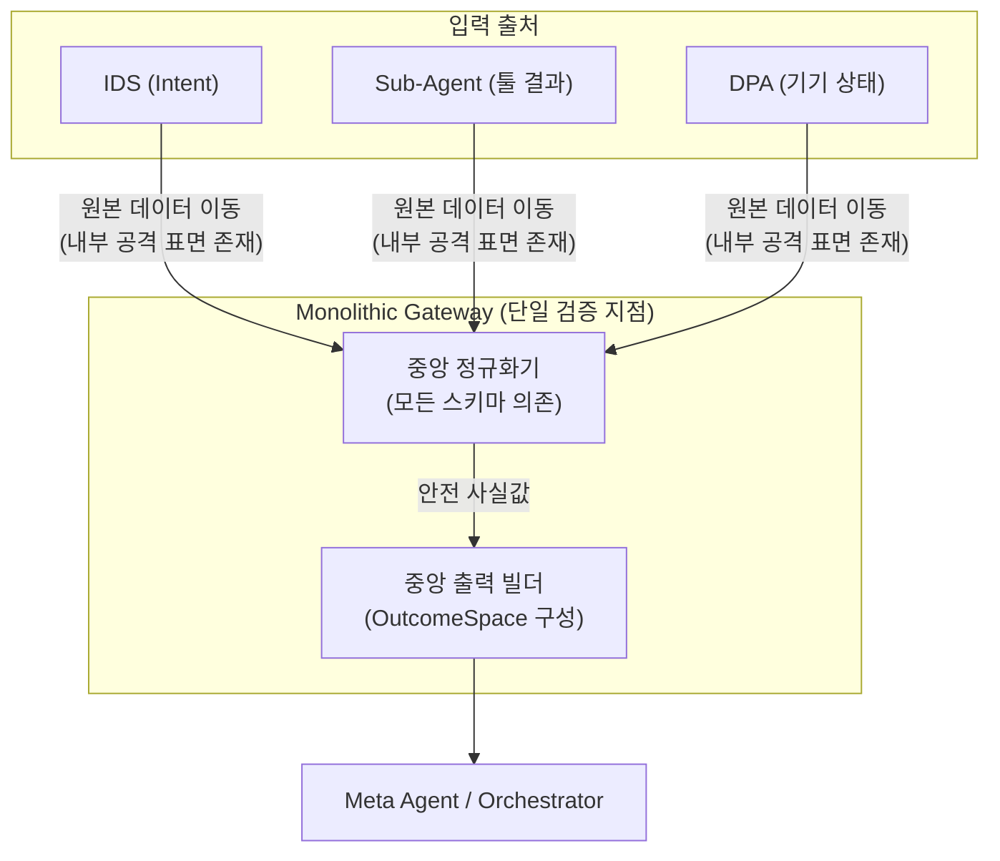
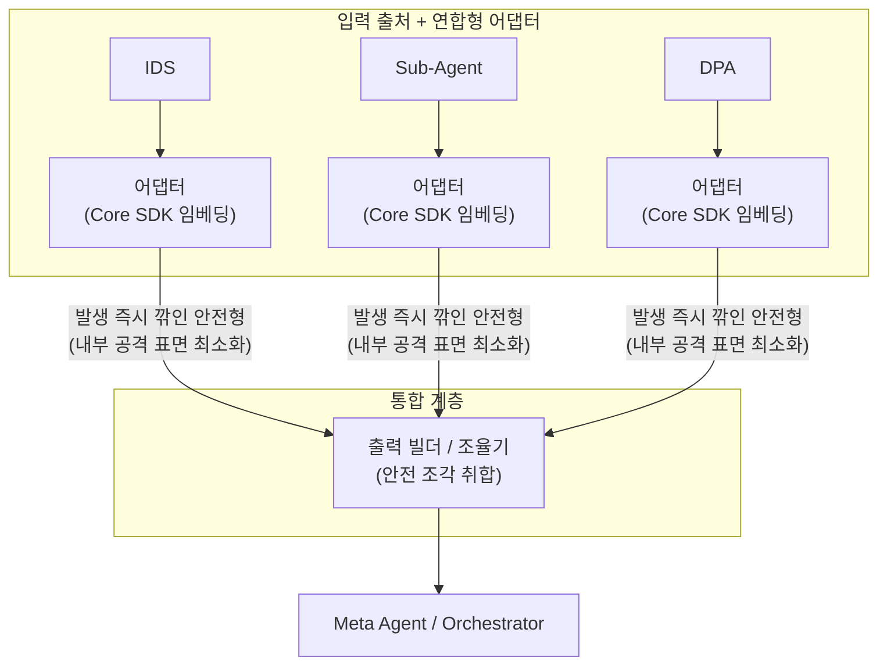

# DP02 — 게이트웨이 구조 비교 (모놀리식 vs 연합형)

> 본 문서는 민감정보 처리의 핵심 불변식인 "설계타임 배제 + 프라이버시 게이트웨이"를 채택한 후, **해당 게이트웨이의 아키텍처 패러다임을 어떻게 가져갈 것인가**에 대한 팽팽한 트레이드오프를 다룬다.
> **핵심 쟁점:** 단일 지점에서 모든 것을 통제할 것인가(Monolithic), 아니면 통제 룰은 중앙에서 관리하되 실행 위치를 분산하여 확장성을 취할 것인가(Federated).

---

## 1. 아키텍처적 난제

단말 내 민감정보 처리 구조 설계 시, 다음과 같은 아키텍처적 충돌이 발생한다.

| 쟁점 | Monolithic 측면 | Federated 측면 |
|---|---|---|
| **감사(Audit)와 통제** | "밖으로 나갈 수 있는 것"은 오직 하나의 문지기가 100% 통제해야 검증이 쉽다. | 코드를 프라이버시 SDK로 제공하면, 실행이 분산되어도 로직은 통제 가능하다. |
| **내부 보안 (체류 구간 최소화)** | 게이트웨이에 도달하기 전까지는 원본이 단말 내 이벤트 버스를 통해 이동한다. | 데이터가 발생하는 즉시 안전형으로 변환되면 내부 공격 표면이 최소화된다. |
| **시스템 확장성** | 새로운 기기/툴이 생길 때마다 중앙 게이트웨이가 그 스키마를 알아야 한다(God Object 위험). | 툴 개발자가 SDK 가이드에 맞춰 어댑터를 직접 제공하면 되므로 독립적 확장이 용이하다. |

---

## 2. 후보 A — Monolithic Gateway (관문 수비수 모델)

### 개념
모든 입력 채널(IDS, Sub-Agent, DPA)에서 발생한 원본 데이터가 **단일한 중앙 프라이버시 게이트웨이**로 모인 뒤에 일괄적으로 정규화(분류/어휘매핑)와 출력 빌드가 수행된다.

### 구조도

### 강점 (통제의 확실성)
- **결정론적 보안 감사:** "무엇이 밖으로 나가는가"를 확인하려면 게이트웨이 모듈 하나만 감사하면 된다.
- **교차 일관성:** 모든 데이터를 한 곳에서 보므로, 캘린더 시간대와 디바이스 상태를 통합된 협상 문맥으로 조율하기가 매우 쉽다.

### 약점 (강결합과 병목)
- **God Object 리스크:** 시스템 규모가 커지고 새로운 센서/툴이 추가될 때마다 중앙 게이트웨이 코드가 수정되어야 하는 강결합(Tight Coupling) 문제가 발생한다.

---

## 3. 후보 B — Federated Adapters (독립 변환 모델)

### 개념
정규화 책임을 각 입력 출처에 결합된 **연합형 어댑터(Federated Adapter)** 로 위임한다. 단, 어댑터는 무작위로 짜는 것이 아니라 **코어 프라이버시 SDK**를 임베딩(import)하여 구현한다. 출력 빌더는 이 안전한 조각들을 모으는 역할만 한다.

### 구조도

### 강점 (확장성과 내부 보안)
- **관심사 분리와 독립적 확장:** 각 데이터 출처가 자신의 데이터 스키마를 가장 잘 안다. 외부 벤더나 다른 팀이 툴을 만들 때 SDK 스펙만 맞추면 되므로 중앙 병목 없이 확장 가능하다.
- **내부 공격 표면 최소화:** 원본 PII가 발생 즉시 안전형으로 변환된 후 전송되므로, 내부 모듈 간 통신(메시지 버스 등)에서의 유출 위험이 줄어든다.

### 약점 (조율의 복잡성)
- **통합의 난제:** 분산된 어댑터들에서 날아오는 조각난 안전 데이터들을 매끄러운 하나의 협상 컨텍스트(교차 일관성)로 조율하는 별도의 오케스트레이션 로직 구현이 까다롭다.
- **버전 파편화 리스크:** 통제 로직을 SDK로 일원화했더라도, 모듈별로 구버전 SDK가 방치될 경우 보안 홀(Security Hole)이 발생할 수 있다.

---

## 4. 종합 비교 및 아키텍처 딜레마

> 척도: ★★★ 강함 · ★★☆ 보통 · ★☆☆ 취약

| 평가축 | 방안 A (Monolithic Gateway) | 방안 B (Federated Adapters) | 판단 |
|---|:---:|:---:|---|
| **감사 및 통제 용이성** | **★★★** | **★★☆** | A는 단일 모듈만 검증하면 됨. B는 코어 SDK로 통제하나 버전 파편화 추적이 필요. |
| **내부 보안 (원본 체류 창)** | **★★☆** | **★★★** | B는 발생 즉시 변환하여 이동 간 노출 위험 감소. A는 중앙 도달 전까지 원본이 흐름. |
| **시스템 확장성 (Extensibility)**| **★☆☆** | **★★★** | 새로운 가전/툴 추가 시, A는 중앙 코드 수정 필요. B는 툴 개발자의 자율적 대응 가능. |
| **교차 일관성 조율** | **★★★** | **★☆☆** | A는 한 곳에서 조율. B는 각자 변환해 보내므로 이를 묶어줄 별도 조율 계층 필수. |
| **유지보수 리스크** | **중앙 모듈 비대화** (God Object) | **버전 파편화 및 통합의 어려움** | 두 방안이 고전적인 소프트웨어 설계 트레이드오프를 형성함. |

### 핵심 긴장 (Core Tension)

> **"단일 검증 지점 확보(A) vs 병목 없는 컴포넌트 확장성(B)"**

이 쟁점은 보안과 소프트웨어 공학의 전형적인 대립입니다.
**방안 A**는 강력한 통제력을 주지만 시스템의 비대화를 유발하는 관문 수비수 모델입니다. 반면 **방안 B**는 분산형 아키텍처 원칙에 부합하여 컴포넌트 간 결합도가 낮고 내부 유출 표면이 최소화되지만, 분산된 데이터들을 통합된 문맥으로 조율하는 설계 비용이 큽니다.

현재 PoC 단계에서는 교차 일관성과 통제의 확실성을 담보하기 위해 **방안 A(모놀리식)** 로 시작하는 것이 리스크를 줄이는 길이나, 향후 생태계(제3자 툴, 다양한 센서)가 확장되는 페이즈에서는 SDK 기반의 **방안 B(연합형)** 로 아키텍처를 진화시키는 로드맵이 타당합니다.
