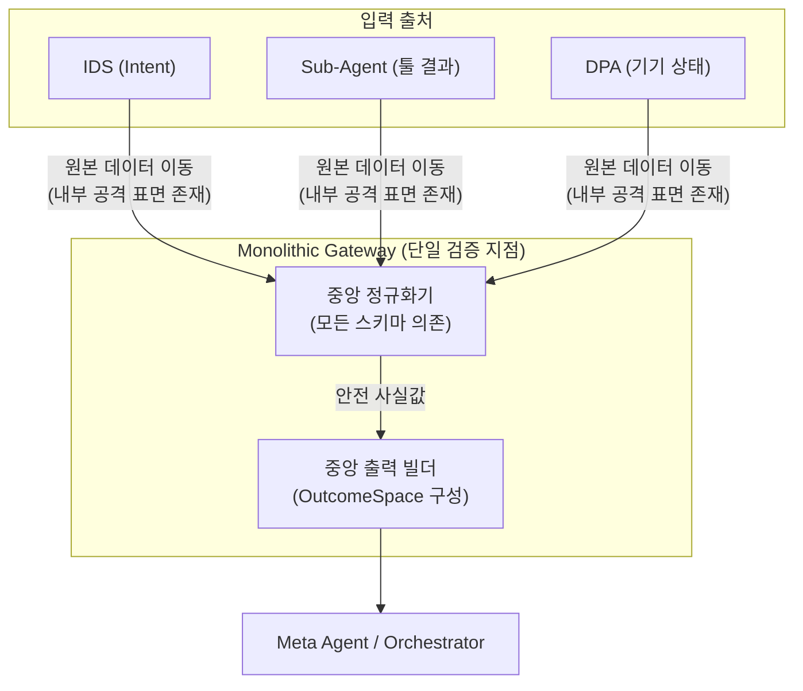
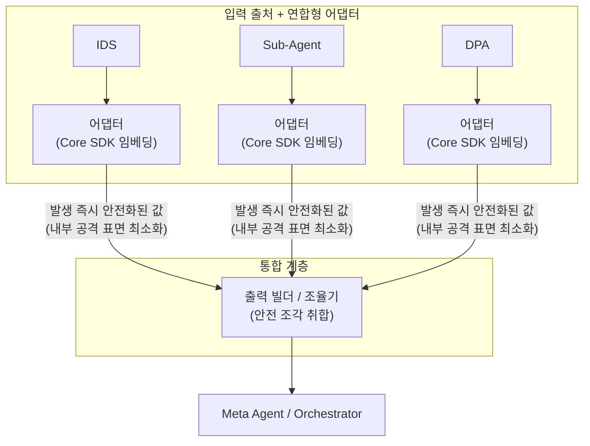

# DP03 — 개인정보 처리 게이트웨이 구조

> 본 문서는 민감정보 처리를 위한 핵심 설계 원칙인 "설계 단계 배제 + 프라이버시 게이트웨이"를 전제로, **해당 게이트웨이의 아키텍처 패러다임을 어떻게 가져갈 것인가**에 대한 팽팽한 트레이드오프를 다룬다.
> **핵심 쟁점:** 단일 지점에서 모든 것을 통제할 것인가(Monolithic), 아니면 통제 룰은 중앙에서 관리하되 실행 위치를 분산하여 확장성을 취할 것인가(Federated).

---

## 1. 아키텍처적 난제

단말 내 민감정보 처리 구조 설계 시, 다음과 같은 아키텍처적 충돌이 발생한다.

| 쟁점 | Monolithic 측면 | Federated 측면 |
|---|---|---|
| **감사(Audit)와 통제** | "밖으로 나갈 수 있는 것"은 오직 하나의 문지기가 100% 통제해야 검증이 쉽다. | 코드를 프라이버시 SDK로 제공하면, 실행이 분산되어도 로직은 통제 가능하다. |
| **내부 보안 (체류 구간 최소화)** | 게이트웨이에 도달하기 전까지는 원본이 단말 내 이벤트 버스를 통해 이동한다. | 데이터가 발생하는 즉시 안전형으로 변환되면 내부 공격 표면이 최소화된다. |
| **동시 다중 입력 처리** | IDS·DPA·Sub-Agent 입력이 동시에 몰리면 중앙 게이트웨이에 큐와 원본 대기 구간이 생길 수 있다. | 입력 출처별 어댑터가 병렬로 안전화할 수 있어 peak/tail latency를 줄일 여지가 있다. |
| **시스템 확장성** | 새로운 기기/툴이 생길 때마다 중앙 게이트웨이가 그 스키마를 알아야 한다(God Object 위험). | 툴 개발자가 SDK 가이드에 맞춰 어댑터를 직접 제공하면 되므로 독립적 확장이 용이하다. |

---

## 2. 후보 A — Monolithic Gateway (관문 수비수 모델)

### 개념
모든 입력 채널(IDS, Sub-Agent, DPA)에서 발생한 원본 데이터가 **단일한 중앙 프라이버시 게이트웨이**로 모인 뒤에 일괄적으로 정규화(분류/어휘매핑)와 출력 빌드가 수행된다.

### 구조도

### 강점 (통제의 확실성)
- **결정론적 보안 감사:** "무엇이 밖으로 나가는가"를 확인하려면 게이트웨이 모듈 하나만 감사하면 된다.
- **중앙 조율의 단순성:** 여러 입력 출처의 정규화와 출력 빌드가 한 곳에 모이므로, 어댑터 간 계약을 별도로 맞추는 부담이 작다. 단, 이는 구현 단순성의 이점이지 Task 성공률 자체의 본질적 차이는 아니다.

### 약점 (강결합과 병목)
- **God Object 리스크:** 시스템 규모가 커지고 새로운 센서/툴이 추가될 때마다 중앙 게이트웨이 코드가 수정되어야 하는 강결합(Tight Coupling) 문제가 발생한다.

---

## 3. 후보 B — Federated Adapters (독립 변환 모델)

### 개념
정규화 책임을 각 입력 출처에 결합된 **연합형 어댑터(Federated Adapter)** 로 위임한다. 단, 어댑터는 무작위로 짜는 것이 아니라 **코어 프라이버시 SDK**를 임베딩(import)하여 구현한다. 출력 빌더는 이 안전한 조각들을 모으는 역할만 한다.

### 구조도

### 강점 (확장성과 내부 보안)
- **관심사 분리와 독립적 확장:** 각 데이터 출처가 자신의 데이터 스키마를 가장 잘 안다. 외부 벤더나 다른 팀이 툴을 만들 때 SDK 스펙만 맞추면 되므로 중앙 병목 없이 확장 가능하다.
- **내부 공격 표면 최소화:** 원본 PII가 발생 즉시 안전형으로 변환된 후 전송되므로, 내부 모듈 간 통신(메시지 버스 등)에서의 유출 위험이 줄어든다.

### 약점 (조율의 복잡성)
- **통합 계약 관리:** 각 어댑터가 안전값을 먼저 만들기 때문에, 통합 계층은 어댑터 산출 스키마·우선순위 규칙·SDK 버전을 명시적으로 관리해야 한다.
- **버전 파편화 리스크:** 통제 로직을 SDK로 일원화했더라도, 모듈별로 구버전 SDK가 방치될 경우 보안 홀(Security Hole)이 발생할 수 있다.

---

## 4. 종합 비교 및 아키텍처 딜레마

> 평가축은 DP02·PoC에서 고정한 품질속성을 우선 사용한다. 단, **확장성**은 고정 품질속성은 아니지만, 모놀리식/연합형 토폴로지 차이를 설명하는 보조 설계 관점으로 별도 표기한다.  
> 아래 평가는 IDS·DPA·Sub-Agent가 동시에 여러 입력을 발생시키는 burst 상황을 주요 운영 조건으로 포함한다.  
> PoC는 burst를 직접 측정하지 않았으므로, Latency·자원·세션 복구 평가는 구조 기반 정성 판단이다.  
> 척도: ★ = 1점, ☆ = 0.5점. 별점은 설계 비교용 정성 점수이며, 절대 성능 측정값이 아니다.

| 품질속성/설계 관점 | 방안 A (Monolithic Gateway) | 방안 B (Federated Adapters) | 판단 |
|---|:---:|:---:|---|
| **기밀성** | **★★★★** | **★★★★☆** | 외부 출구는 두 안 모두 구조화 메시지만 허용한다. A는 단일 검증 지점이라 감사가 단순하지만, burst 시 원본 입력이 중앙 큐에 머무를 수 있다. B는 출처 근처에서 즉시 안전화해 원본 체류 구간을 줄인다. |
| **Latency** | **★★★☆** | **★★★★☆** | A는 모든 입력이 중앙 게이트웨이를 거치므로 burst 상황에서 중앙 큐가 병목이 될 수 있다. B는 출처별 어댑터가 병렬 정규화할 수 있어 peak/tail latency에 유리하다. |
| **자원** | **★★★★** | **★★★☆** | A는 정규화 로직과 상태가 중앙에 모여 중복 실행이 작다. B는 Core SDK를 공유하더라도 어댑터별 실행·로컬 상태·버전 관리 비용이 추가된다. |
| **Task 성공률** | **★★★★** | **★★★★** | 동일한 안전 사실값과 OutcomeSpace로 수렴한다면 구조 차이만으로 성공률이 크게 달라지지 않는다. 단, A의 큐 지연이 입력 최신성 문제를 만들면 간접 영향은 가능하다. |
| **세션 복구** | **★★★★** | **★★★☆** | A는 중앙 큐·게이트웨이 상태를 기준으로 복구하기 쉽다. B는 어댑터별 처리 상태, SDK 버전, 통합 계층 수신 상태를 함께 맞춰야 한다. |
| **유지보수성** | **★★★★** | **★★★☆** | A는 정책·정규화 로직이 중앙에 있어 코드 변경·테스트·버전 관리가 단순하다. B는 출처별 변경 국소화에는 유리하지만, 어댑터 코드·SDK 버전·통합 계약을 여러 곳에서 관리해야 한다. |
| **확장성** (보조 설계 관점) | **★★★☆** | **★★★★** | 신규 입력 출처나 외부 툴이 늘어날수록 A는 중앙 게이트웨이가 새 스키마를 알아야 한다. B는 Core SDK 계약을 지키는 어댑터를 추가하는 방식으로 출처 확장에 대응하기 쉽다. |
| **종합** | **자원·복구·유지보수 단순성 우세** | **Latency·원본 체류 최소화·확장성 우세** | burst 조건을 넣으면 A/B 차이가 더 선명해진다. A는 중앙 단순성, B는 병렬성과 출처별 확장성이 강점이다. |

### 핵심 긴장 (Core Tension)

> **"단일 검증·자원/복구/유지보수 단순성(A) vs 출처별 병렬 처리·체류 구간 최소화·확장성(B)"**

동시 다중 입력을 주요 운영 조건으로 보면, 두 후보의 차이는 단순한 배치 차이를 넘어선다. **방안 A**는 중앙 집중 구조 덕분에 감사·자원 관리·복구 기준점·코드 유지보수가 단순하지만, 입력 폭주 시 중앙 큐와 원본 체류 구간이 커질 수 있고 신규 입력 출처가 늘수록 중앙 게이트웨이가 비대해질 수 있다. 반면 **방안 B**는 입력 출처별 어댑터에서 즉시 안전화하므로 peak/tail latency와 내부 원본 체류 구간, 출처 확장성 측면에서 유리하지만, 어댑터별 SDK 버전·상태·통합 계약을 관리해야 한다.

따라서 이 표만으로 **방안 A(모놀리식)** 또는 **방안 B(연합형)** 중 하나가 명확히 우세하다고 보기 어렵다. 선택은 자원·복구·유지보수 단순성을 더 중시할지, 동시 입력 burst에서의 병렬 처리·원본 체류 최소화·출처 확장성을 더 중시할지의 아키텍처 방향성에 달려 있다.
