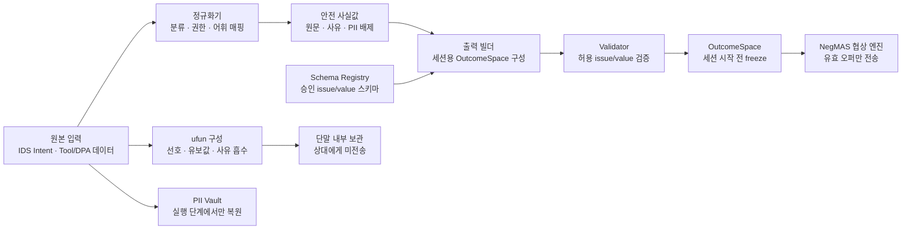

# DP03 — 전제·배경 및 공통 설계

> 본 문서는 [DP03-개인정보-처리-게이트웨이-구조](./DP03-개인정보-처리-게이트웨이-구조.md)의 **모놀리식·연합형 두 후보가 공통으로 전제하는 사항**을 정리한다. 비교는 오직 게이트웨이 토폴로지에서만 갈린다.

---

## 1. 전제 / 배경

### 1.1 포지셔닝

본 DP는 민감정보 처리를 위한 핵심 설계 원칙인 **"설계 단계 배제 + 프라이버시 게이트웨이"** 를 전제로, 게이트웨이의 **아키텍처 패러다임**(모놀리식 / 연합형)을 정한다.

- **설계 단계 배제:** 외부로 나갈 수 있는 메시지의 필드와 값 집합을 사전에 제한해, 민감정보가 들어갈 자리 자체를 만들지 않는 설계 원칙. NegMAS 협상에서는 승인된 issue/value 스키마 안에서 세션용 OutcomeSpace를 구성하는 방식으로 적용한다. (예: OutcomeSpace 어휘에 "당뇨" 같은 값을 두지 않고, "식이 제약 있음/없음"처럼 협상에 필요한 수준의 값만 둠.)

### 1.2 상위 설계 원칙

- 신뢰경계 = **온디바이스.**
- 밖으로 나가는 모든 메시지는 **구조화**(필드·값이 사전 정의, 자유 텍스트 없음).
- **사유·PII·원본은 탐지가 아니라 어휘·인터페이스에서 배제.**

### 1.3 NegMAS로 고정된 부분

- A2A 협상은 **NegMAS(SAO, Stacked Alternating Offers = 교대 제안 프로토콜)** 로 수행한다. 협상은 **고정·공유 OutcomeSpace** 위에서 오퍼를 주고받는 방식이다.
- OutcomeSpace(이슈·값 집합)는 **협상 시작 시 고정** — 협상 *도중* 변경 불가(세션 전에 합의, 세션 내 고정).
- **ufun(효용함수)** 은 단말 내에서 구성·보관되며 **전송되지 않는다.**
  > **ufun이란:** "어떤 합의안이 사용자에게 얼마나 좋은가"를 점수로 매기는 함수. 사용자의 *선호*와 *유보값(받아들일 수 있는 최저선)* 을 담는다. 단말 내(Meta Agent)가 위임 권한·의도·tool 데이터로부터 자동 구성하며, 상대는 보지 못한다. 만들 때는 원본 정밀값을 쓰지만 ufun 자체는 단말을 떠나지 않는다.
- 오퍼는 공유 OutcomeSpace의 *유효 값*만 담을 수 있다 → **와이어(전송 경로) 중간에서 값을 거를 수 없다**(중간에 값을 바꾸면 "내가 낸 것 ≠ 상대가 받은 것"이 되어 공유 OutcomeSpace 해석이 깨짐). → 따라서 ㉡(상대행) 안전은 **"안전한 OutcomeSpace를 입력에서 구성"** 하는 것으로만 달성된다.
- 상대(상대 Meta Agent)는 **불투명한 외부 NegMAS 에이전트**로 취급한다(구현 무관).

#### NegMAS 입력값 생성 흐름

### 1.4 Cloud Orchestrator로 고정된 부분

- Orchestrator는 **온디바이스 컴포넌트**이며, 계획(Task 분해·Agent/Tool 생성)을 위해 **외부 Cloud LLM을 호출**한다.
- → **㉠(Cloud LLM행) 외부 출구가 반복적으로 존재**한다(초기 계획 + 재계획).
- 사용자/디바이스 데이터 중에서 Cloud LLM으로 나가는 것은 **구조화 계획 요청**(원문·사유·PII 배제)뿐이다. *계획서는 Orchestrator/Cloud가 작성하고, 우리는 그 입력(요청)만 보낸다.*
- 재계획 트리거도 **구조화(닫힌 분류)** 로 표현하고, 현재 협상 원문은 보내지 않는다.
- **Cloud LLM의 물리 배치·사용 범위는 별도 DP**이다(본 DP는 "출구가 구조화 요청뿐"임만 보장).

### 1.5 기타 고정 결정

- 자유 텍스트 미전송 · 역추론 대응은 본 DP 범위 밖 · knowledge_sharing 제외.

---

## 2. 공통 설계사항 (모놀리식·연합형 둘 다 전제)

- **2.1 통제 룰의 단일 출처.** 두 안 모두 "무엇이 밖으로 나갈 수 있나"의 *로직*은 한 출처에서 관리한다(A=중앙 모듈 / B=Core SDK). 갈리는 것은 *실행 위치*뿐.
- **2.2 게이트웨이 내부 책임 3종.** 정규화기(분류·권한·어휘 매핑) / 출력 빌더(OutcomeSpace·계획 요청 구성) / PII 금고 — 두 안 공통, **배치만 다르다.**
- **2.3 입력 정규화 강제(IDS 포함).** IDS Intent·Sub-Agent·DPA 원본을 *모두* 동일하게 정규화한다. IDS도 예외가 아니다(PII→금고, 사유·원문 배제).
- **2.4 세 출구의 안전화 방식.** ㉡=안전 OutcomeSpace로 사전 보장(와이어 필터 없음) / ㉠=구조화 계획 요청 / 실행=PII 사용. — 두 안 동일.
- **2.5 사유 처리.** 어떤 출구 값에도 사유는 들어가지 않는다 → ufun(비공개)으로만 흡수된다.
- **2.6 OutcomeSpace와 승인 스키마.** 도메인별 issue/value 스키마는 사전 승인되어 Schema Registry에 버전 등록된다. 런타임에는 출력 빌더가 이 승인 스키마 안에서 세션용 OutcomeSpace를 구성하고, Validator가 허용 issue/value만 통과시킨 뒤 협상 시작 전에 고정한다. LLM은 후보 생성 보조로 사용할 수 있으나, 승인되지 않은 issue/value를 확정할 권한은 없다.

---

## 3. 짚어둘 점

- **연합형(B)도 "로직은 단일 Core SDK"를 전제**한다. 즉 B는 "각 컴포넌트가 멋대로 구현"이 아니라 **통제된 분산**이다 — 이 전제를 못 박아야 B가 "통제 룰 일원화 + 실행 분산"임이 분명해지고, A와의 비교가 *오직 실행 위치*에서만 갈린다.

---

_2026-06-26 작성. DP03 비교 문서의 공유 토대(전제·공통 설계). 결정 근거는 [poc/dp03-privacy/00-결정사항.md](../../poc/dp03-privacy/00-결정사항.md)._
