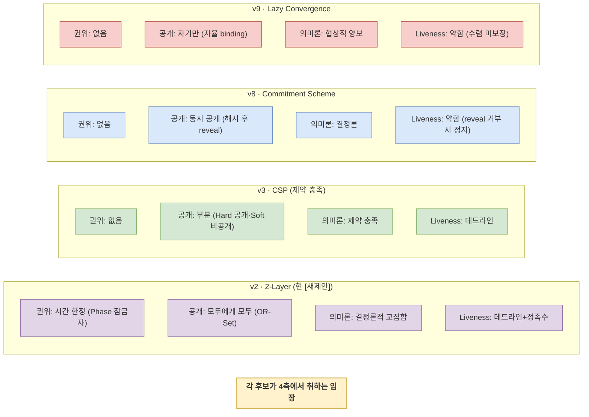
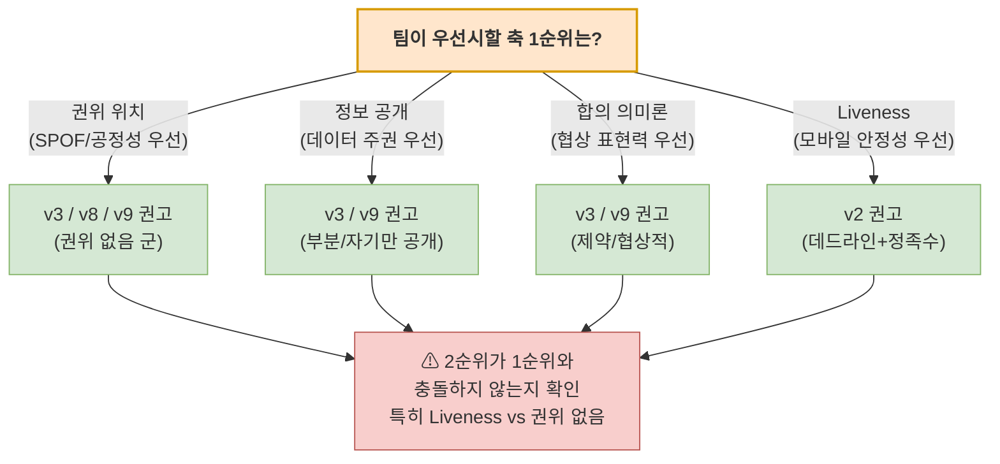

# [새제안2] DP01 — N-party 협상 결정 축 프레임워크 (Decision Framework)

> **⚡ 새 제안 (NEW PROPOSAL 2)**: 본 문서는 기존 [`DP01-N명 커뮤니케이션 시나리오.md`](DP01-N명%20커뮤니케이션%20시나리오.md)(v1)와 [`[새제안]DP01-N명 커뮤니케이션 시나리오.md`]([새제안]DP01-N명%20커뮤니케이션%20시나리오.md)(v2, 2-Layer)과 **나란히 공존**한다. *후보 안 하나를 더 제시하는 게 아니라*, DP01 결정에서 *팀이 먼저 합의해야 할 우선순위*를 명시하는 의사결정 도구다.
>
> **문서 성격**: Decision Framework — 후보안 비교가 아니라 *결정 축의 명시*. 팀이 *축 우선순위*를 합의하면 후보안이 자동으로 좁혀진다.
>
> **만든 이유**: 지금까지 DP01 후보안이 v1(Centralized/Decentralized) → v2(2-Layer) → v3/v7/v8/v9(여러 변형)로 늘어났지만, *어느 후보가 최선인가*에 대한 합의가 없다. 정직히 보면 *단일 최선은 존재하지 않고*, 답은 *팀이 정할 우선순위*에 달려 있다. 본 문서는 그 우선순위를 결정 가능한 형태로 정리한다.
>
> **대응 QAS**: [QAS-014](../07-QAS.md#qas-014) · [QAS-015](../07-QAS.md#qas-015) · [QAS-016](../07-QAS.md#qas-016)

---

## 1. 본 문서가 답하려는 것

DP01에서 *후보안의 개수가 아니라* 다음 질문이 진짜 결정 사항이다.

**"N-party 협상을 설계할 때, 다음 네 가지 품질 사이에서 *무엇을 우선*할 것인가?"**

- 권위가 어디에도 집중되지 않는 것 (공정성·SPOF 회피)
- 정보가 단말 밖으로 새지 않는 것 (데이터 주권)
- 협상의 풍부한 의미론(차선·창발·양보)이 표현되는 것 (협상 표현력)
- 어떤 상황에서도 협상이 *끝나는 것*이 보장되는 것 (Liveness·모바일 안정성)

**이 네 가지는 동시에 100% 만족시킬 수 없다.** 분산 시스템 이론(CAP·FLP)과 60년의 N-party 합의 연구가 이미 증명한 *근본 트레이드오프*다. 팀이 *우선순위를 정직히 합의*하지 않으면, *어떤 후보안을 채택해도* 다른 축에서 약점이 드러나 결정이 반복적으로 흔들린다.

> **솔직히 짚을 점**: 본 문서는 *정답을 제시*하지 않는다. 팀의 *가치 판단*을 명시화하는 도구다. 이 결정은 기술적 결정이 아니라 *프로덕트 정체성* 결정에 가깝다.

---

## 2. 결정 축 4개의 명세

### 2.1 네 개 축의 전체 그림

### 2.2 축 1 — 권위 위치 (Authority Locus)

**무엇을 묻는가**: 협상의 *결정 권한·메시지 흐름·상태 보유*가 어디에 모이는가.

**선택지** (왼쪽일수록 권위 집중, 오른쪽일수록 분산):

| 위치 | 의미 | 영향 |
|------|------|------|
| **단일 단말** (고정 Coordinator) | 한 명이 모든 메시지·결정 통과 | SPOF 강함, 공정성 약함, 구현 단순 |
| **시간 한정** (RSM Leader) | 매 순간 단일 Leader지만 자동 재선출 | SPOF 시간 한정, 구현 복잡 |
| **역할만** (Initiator) | 형식적 개시자 역할, 결정 권한 없음 | SPOF 잔존, 권한 분리 모호 |
| **메시지 경로** (Sequencer) | 한 단말이 메시지 순번만 부여 | 경로상 통과, 내용은 안 봄 |
| **없음** (완전 P2P) | 어떤 단말도 특별한 위치 없음 | SPOF 없음, Liveness 약함 |

**상위 NFR/QAS 연결**: NFR-MAF-03(Recoverability) · NFR-MAF-01(Fault Tolerance) · 데이터 주권 원칙

### 2.3 축 2 — 정보 공개 모델 (Information Disclosure)

**무엇을 묻는가**: 협상 중 *각 단말의 선호·제약 정보*가 어디까지·누구에게 공개되는가.

**선택지**:

| 모델 | 의미 | 영향 |
|------|------|------|
| **모두에게 모두 공개** | 모든 단말이 모든 선호 사본 보유 (OR-Set 등) | 합의 쉬움, 보안 약함 |
| **부분 공개** | Hard Constraint(공개) / Soft Preference(비공개) 분리 | 합의 가능, 보안 일부 확보 |
| **동시 공개** (Commitment) | 해시로 commit 후 동시 reveal | 비대칭 없음, 추가 라운드 |
| **자기만 보유** | 어떤 정보도 단말 밖으로 안 나감 | 보안 최강, 합의 매우 어려움 |

**상위 NFR/QAS 연결**: NFR-MAF-07(개인정보 보안) · DP02(최소 공개) · Private Knowledge 0건 원칙

### 2.4 축 3 — 합의 의미론 (Consensus Semantics)

**무엇을 묻는가**: "합의에 도달했다"는 것이 *어떤 종류의 동의*를 의미하는가.

**선택지**:

| 의미론 | 의미 | 영향 |
|------|------|------|
| **단순 집계** (투표·합산) | Borda·다수결 등 점수 집계 | 빠름, 거부권 없음 |
| **결정론적 교집합** | 모든 선호의 교집합 자동 계산 | 일관성 강함, 차선·창발 없음 |
| **제약 충족** (Hard+Soft) | Hard 만족 + Soft 최대화 | 거부권 자연, NP-hard 위험 |
| **협상적 양보** (LLM 창발) | 라운드별 양보·반제안·창발 | 표현력 최강, 비결정·시간 가변 |

**상위 NFR/QAS 연결**: QAS-016(합의 결과 일관성) · QAS-002(협상 완료 시간) · NFR-MAF-08(추적성)

### 2.5 축 4 — Liveness 보장 강도 (Progress Guarantee)

**무엇을 묻는가**: *어떤 상황에서도* 협상이 *언젠가 끝남*을 어떻게 보장하는가.

**선택지**:

| 보장 | 의미 | 영향 |
|------|------|------|
| **데드라인 강제 종료** | timeout으로 무조건 종료 | 종료 강함, 사용자 의도 절단 가능 |
| **정족수 commit** | 과반 응답하면 commit, 나머지 catch-up | 균형형, QAS-016 정의와 마찰 |
| **자발적 수렴** | 모든 노드가 자율 판단으로 수렴 | 의미론 자연, 보장 약함 |
| **무한 대기** (전원 필수) | 모든 응답 받기 전 진행 안 함 | QAS-016 정의 정확, Liveness 위험 |

**상위 NFR/QAS 연결**: QAS-016(모든 ACK 후 Action) · QAS-002(완료 시간) · QAS-006(네트워크 단절 복구)

---

## 3. 후보안이 4축에서 취하는 입장

지금까지 도출된 주요 후보들이 *4축에서 각각 어느 위치*에 있는지 매핑한다.

### 3.1 후보 정리 표 (4축 한눈에 보기)

| 후보 | 축1 권위 | 축2 공개 | 축3 의미론 | 축4 Liveness | 핵심 강점 |
|------|---------|---------|----------|------------|---------|
| **v1 Cent** | 단일 단말 | 모두에게 모두 | 단순 집계 | 데드라인 | 단순함·빠름 |
| **v1 Decent** | 없음 | 모두에게 모두 | 결정론 | 약함 | SPOF 회피 |
| **v2 2-Layer** | 시간 한정 (Phase 잠금자) | 모두에게 모두 | 결정론 교집합 | 데드라인+정족수 | 모바일 친화·구현 단순 |
| **v3 CSP** | 없음 | 부분 (Hard/Soft) | 제약 충족 | 데드라인 | 보안+거부권 자연 |
| **v8 Commitment** | 없음 | 동시 공개 | 결정론 | 약함 | 비대칭 0·보안 강 |
| **v9 Lazy Conv** | 없음 | 자기만 | 협상적 | 약함 | 의미론 표현력·자율성 |

**근본 트레이드오프의 시각화**: 표를 가로로 보면 *어떤 후보도 4축 모두에서 강하지 않음*이 드러난다. 이게 *근본 트레이드오프*의 실증.

---

## 4. 축 우선순위 → 후보 권고

팀이 *축 1순위*를 정하면 후보가 자동으로 좁혀진다.

### 4.1 충돌 페어 — 동시에 1·2순위로 두면 안 되는 조합

네 축 모두를 동시에 강하게 가져갈 수는 없다. *주요 충돌 페어*:

| 충돌 페어 | 이유 | 의미 |
|---------|------|------|
| **권위 없음 + Liveness 강함** | 권위 없으면 합의가 늦어지거나 멈출 가능성 (FLP 정리) | 둘 다 1순위면 → 어느 한 쪽 양보 필요 |
| **자기만 공개 + 결정론 의미론** | 정보 안 공유하면 결정론적 교집합 불가능 | 둘 다 1순위면 → 의미론을 협상적으로 |
| **협상적 양보 + Liveness 강함** | LLM 협상은 라운드 수 가변 → 데드라인과 마찰 | 둘 다 1순위면 → 데드라인 완화 또는 의미론 단순화 |
| **모두에게 모두 공개 + 권위 없음** | 모두에게 공개하면 정보 비대칭은 없지만 *전원에게 보안 책임 분산* | 사실상 호환되나 데이터 주권 약화 |

### 4.2 PoC 정체성과의 정합성 — 솔직한 분석

본 PoC의 핵심 정체성은 *"단말이 사용자의 데이터 주권을 지키며 자율 협상"*이다 (`01-과제-배경-및-목적.md`, DP02). 이 정체성과 4축의 *암묵적 우선순위*가 맞는지 솔직히 봐야 한다.

- **축 2 (정보 공개)** 가 약하면 → PoC가 자기 가치 부정. *우선순위 상위여야*.
- **축 1 (권위)** 가 단일 단말이면 → "단말 sovereign"이 무너짐. *권위 약화 또는 제거 방향*.
- **축 3 (의미론)** 은 *도메인별 다름*. 일정 협상은 단순, 가격 협상은 복잡. *유연 결정 가능*.
- **축 4 (Liveness)** 는 *모바일 환경 가정*에서 일정 비용 받아들일 수 있음. *유연 결정 가능*.

**솔직한 권고 우선순위**: **축 2 (정보 공개) > 축 1 (권위) > 축 3 (의미론) > 축 4 (Liveness)**.

이 우선순위에서 *자동으로 좁혀지는 후보군*은 **v3 (CSP) 또는 v9 (Lazy Convergence)**. v2는 *축 2·1에서 약점*이 두드러져 1순위 후보에서 빠짐.

> 단, 이 우선순위는 *내 추론*이지 *팀 합의*가 아니다. 팀이 *다른 우선순위*를 합의하면 후보군이 달라진다 (예: 축 4 우선이면 v2가 1순위).

---

## 5. 의사결정 워크플로우

본 문서를 *실제로 결정에 사용하는 단계*:

### Step 1 — 팀 워크숍에서 4축 우선순위 합의

각 팀원이 *축 1~4의 우선순위*에 투표. 단순 다수결보다 *왜 그 순서인지*의 토론이 중요. 다음 질문이 도움:

- *"이 PoC가 데모에서 보여주려는 가장 큰 가치는?"* → 축 1순위와 직결
- *"실패해도 받아들일 수 있는 약점은?"* → 축 4순위와 직결
- *"PoC 이후 Production 진입 시 가장 중요한 강점은?"* → 향후 진화 방향

### Step 2 — 충돌 페어 점검 (4.1절 참조)

1순위·2순위 조합이 *충돌 페어*에 들어가는지 확인. 들어가면 *2순위 조정 또는 트레이드오프 명시*.

### Step 3 — 후보군 자동 좁힘

축 1·2순위에 부합하는 후보를 *3.1 표*에서 추출. 보통 2~3개로 좁혀짐.

### Step 4 — 정량 검증으로 단일 선택

좁혀진 후보들을 *PoC 측정*으로 비교 (QAS-014/015/016 실측). 별점·추측이 아닌 *측정 데이터*로 결정.

### Step 5 — 결정 기록

선택된 후보 + *그 결정의 트레이드오프(포기한 축)* 를 `[새제안]DP01-N명 커뮤니케이션 시나리오.md`(또는 새 버전)에 명시적으로 박음.

---

## 6. 본 문서가 답하지 않는 것

정직히 짚어둔다.

1. **"축 우선순위의 정답"** — 본 문서는 *내 의견*(축 2 > 1 > 3 > 4)을 제시하지만 *정답은 아님*. 팀 가치 판단의 결과.
2. **"각 후보의 정량 측정"** — 별점·언어 평가만 있고 *실측 수치 없음*. PoC 측정 후에 보강해야.
3. **"PoC 이후 Production 진입 시의 진화 경로"** — 본 PoC에서 채택한 후보가 *Production에서도 적합한가*는 별도 결정.
4. **"4축 외 누락 가능성"** — 본 문서가 4축으로 분해했지만 *5번째 축*이 있을 수 있음 (예: 도메인 적합성, 사용자 경험). 토론 중 추가 발견 시 본 문서 갱신.

---

## 7. 권고 다음 단계

본 문서를 *결정의 끝*이 아니라 *결정의 시작*으로 사용한다.

1. **팀 워크숍 안건으로 상정** — 5절 워크플로우대로 진행.
2. **합의된 우선순위를 본 문서에 기록** — Step 1 결과를 본 문서 8절로 추가.
3. **좁혀진 후보를 정식 [새제안3]로 작성** — Step 3 결과를 본문 단일 문서로 정리.
4. **PoC 측정 결과로 4축 별점 → 수치 교체** — Step 4 결과를 3.1 표에 반영.

---

## 8. 합의된 우선순위 (TBD — 팀 워크숍 후 기록)

> 이 절은 *팀 워크숍 후* 채워진다. 현재 비어 있음.
>
> 기록 예시:
> - **합의 일자**: 2026-MM-DD
> - **참석**: starabi, jongin, changbae, sunwoo
> - **1순위 축**: ___ (이유: ___)
> - **2순위 축**: ___ (이유: ___)
> - **3순위 축**: ___
> - **4순위 축**: ___ (포기 가능 항목)
> - **선택된 후보군**: ___
> - **포기한 트레이드오프**: ___

---

_본 문서는 [`[새제안]DP01-N명 커뮤니케이션 시나리오.md`]([새제안]DP01-N명%20커뮤니케이션%20시나리오.md)의 *자체 검증 3회 루프* 결과로 도출되었다. v2(2-Layer) 단독 채택의 한계가 드러나, "후보 비교"에서 "축 우선순위 합의"로 결정 작업을 재구성하는 게 필요하다는 결론._
