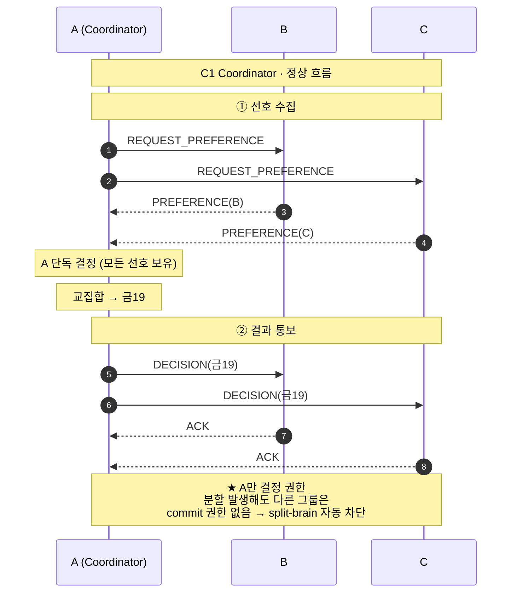
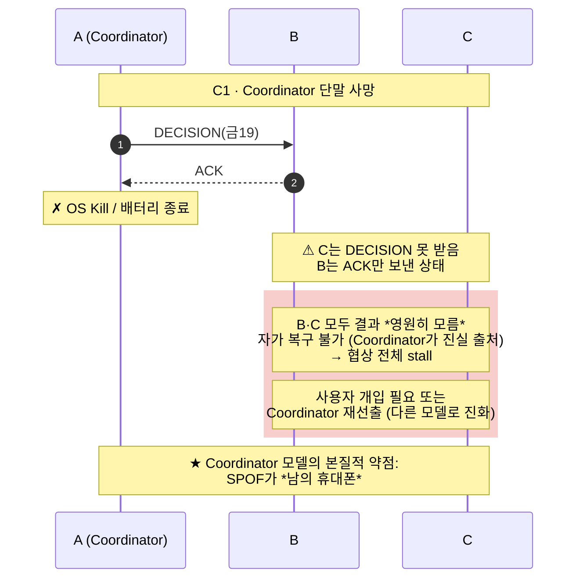
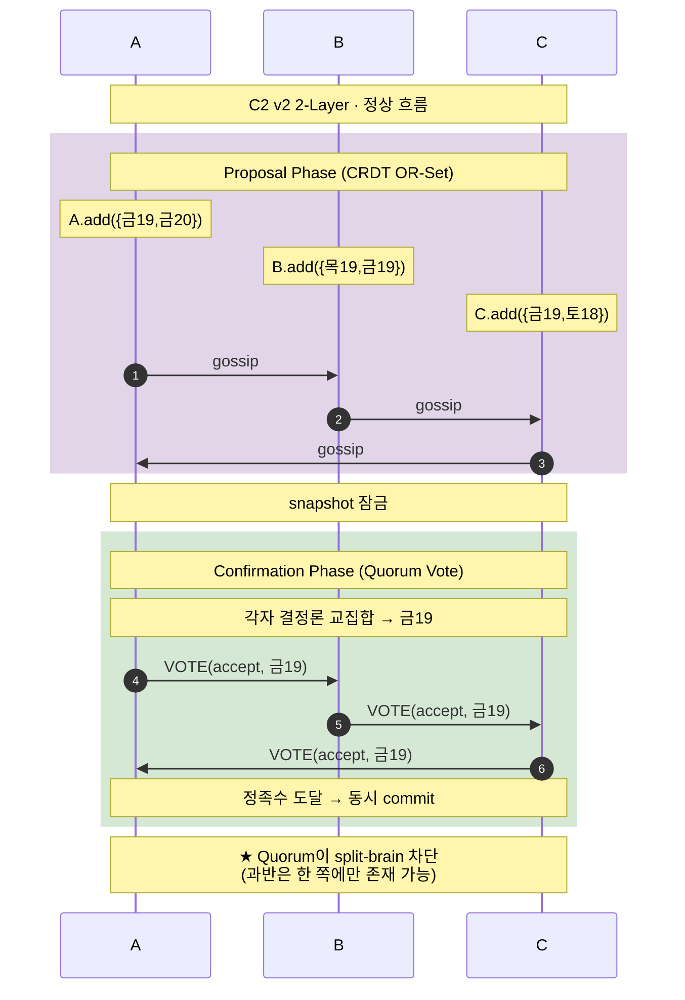
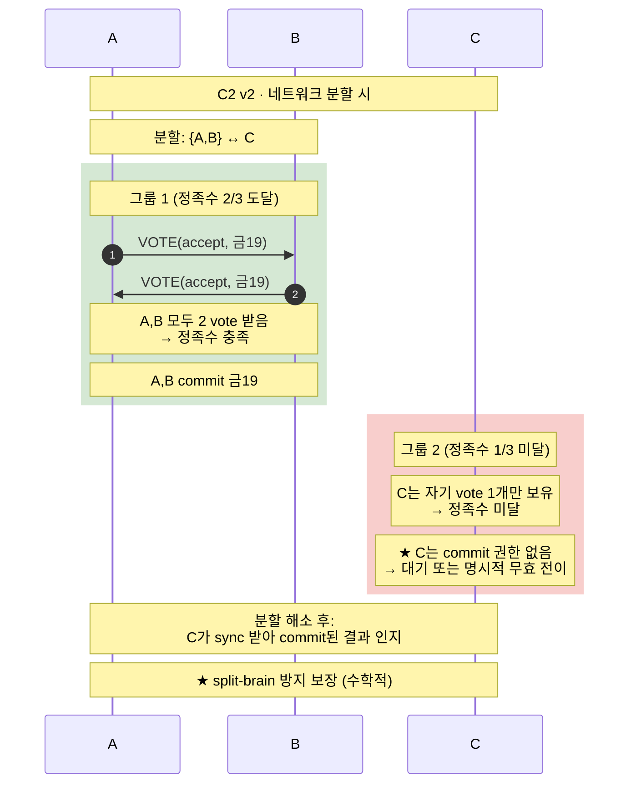
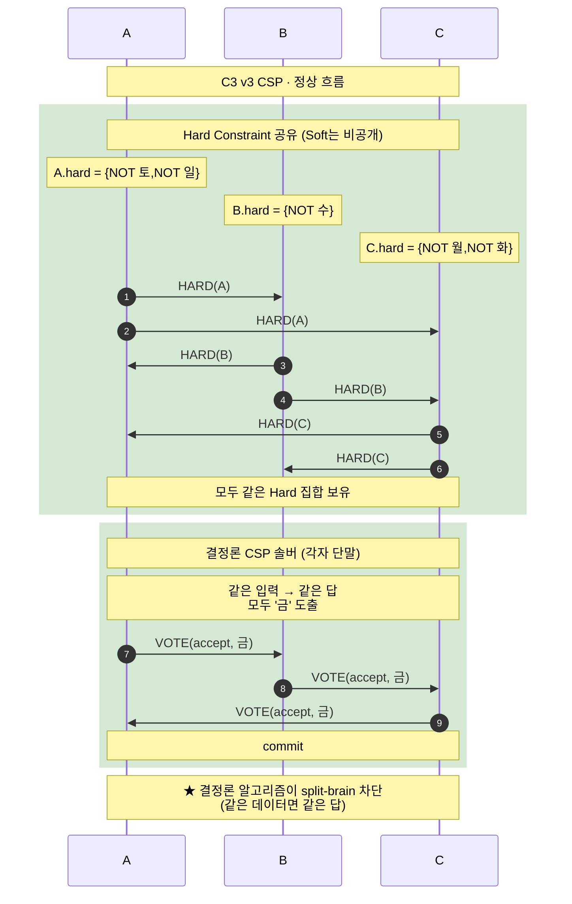
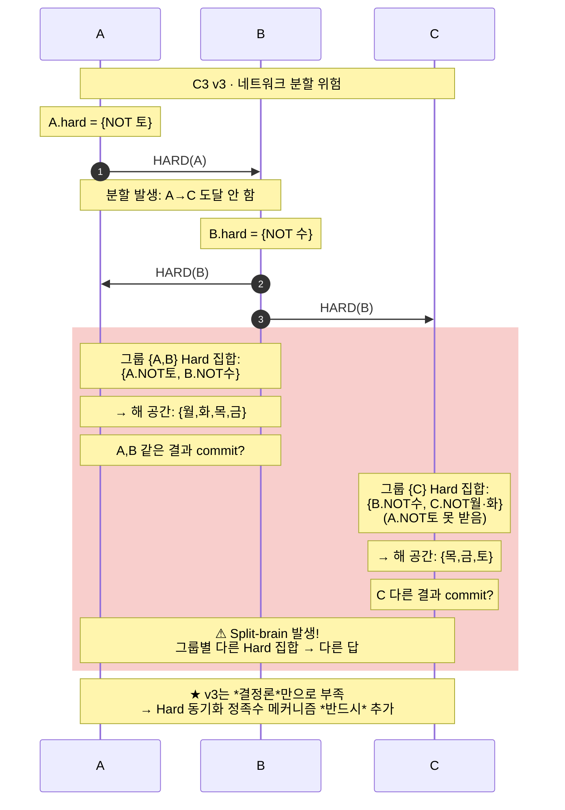

# [새제안3] DP01 — 3개 후보안 정리 (Split-Brain 방지 관점)

> **⚡ 새 제안 (NEW PROPOSAL 3)**: 본 문서는 이전 [새제안] 시리즈의 후보들을 *split-brain 방지 메커니즘 관점*에서 다시 정리. 기존 v2/v3/v8/v9 비교를 좁혀, **Coordinator + 비-Coordinator 2개**의 3개 후보 구도로 재구성한다.
>
> **만든 이유**: 비-Coordinator 후보들이 *split-brain 위험을 어떻게 막는지*가 본 시스템의 핵심 결정 사항인데, 기존 본문이 이를 *명시적으로* 다루지 않았다. Coordinator를 *기각된 안*이 아니라 *후보 중 하나*로 다시 포함시켜 *그 강점(split-brain 자동 차단)도 정직히 평가*하고, 비-Coordinator 후보의 *split-brain 보완 메커니즘*을 핵심 평가축으로 둠.
>
> **3개 후보**:
> - **C1 Coordinator (고정 단말)** — 단일 진실 출처
> - **C2 v2 2-Layer (Quorum)** — 정족수 기반
> - **C3 v3 CSP (결정론)** — 결정론 알고리즘 기반
>
> **대응 QAS**: [QAS-014](../07-QAS.md#qas-014) · [QAS-015](../07-QAS.md#qas-015) · [QAS-016](../07-QAS.md#qas-016)
>
> **약어**: SPOF = Single Point of Failure · OR-Set = Observed-Removed Set · CSP = Constraint Satisfaction Problem · CAP = Consistency/Availability/Partition tolerance · FLP = Fischer-Lynch-Paterson 합의 불가능성 정리

---

## 1. 본 문서가 묻는 질문

지금까지 DP01 분석에서 *간과된 본질적 질문*이 하나 있다:

> **"Coordinator를 빼면 split-brain 위험이 본질적으로 떠오른다. 비-Coordinator 후보들은 이걸 *어떻게* 막는가?"**

이 질문이 후보 평가의 *진짜 결정축*이어야 한다. 단순 "공정성·자가복구·데이터 주권" 비교만으로는 *시스템이 둘로 갈라져 다른 답을 commit할 위험*을 평가할 수 없다. 분산 시스템의 *근본 합의 문제*가 여기에 있다.

본 문서는:
1. **Split-brain이 무엇인지**, 왜 본 시스템에서 중요한지 명확히
2. **각 후보가 어떤 메커니즘으로 막는지** 시각적으로
3. **그 메커니즘의 강점과 약점** 정직히 평가
4. **CAP/FLP 이론**이 어떤 *근본 한계*를 강제하는지

---

## 2. Split-Brain이란 무엇인가

**Split-brain은 *시스템이 둘 이상의 부분으로 갈라져 각자 다른 결론을 동시에 갖는 상황*** 이다. 이름 그대로 *뇌가 둘로 갈라진 상태*.

### 본 시스템에서 발생 시나리오

A·B·C가 협상 중인데 *네트워크가 일시 분할*되어 두 그룹으로 나뉘면:

- 그룹 1: A·B (서로 통신 가능)
- 그룹 2: C (혼자 격리)

이 상태에서:
- 그룹 1이 *자체적으로* "금19로 합의" commit
- 그룹 2가 *자체적으로* "다른 결과" commit

→ **같은 협상에 대해 두 개의 다른 commit이 동시에 존재**. 이게 split-brain이다.

### 본 시스템에서 왜 위험한가

협상 결과가 *후속 Action*(예약·약속·결제)에 연결되므로 split-brain은 다음 사고를 직접 일으킨다:

- 한 명은 "예약됐다"고 인지해서 *나타남*, 다른 명은 "취소됐다"고 인지해서 *안 나타남*
- 한 명의 캘린더에는 *들어가있고* 다른 명에겐 *없음*
- 결제가 *한 쪽에서만 처리*되어 환불 분쟁

→ Split-brain 방지는 **NFR-MAF-10(상태 일관성 100%)·NFR-MAF-11(합의 결과 일관성 100%)의 *전제 조건*** 이다. 이걸 못 막으면 다른 NFR 충족이 *수학적으로 불가능*.

---

## 3. 세 후보의 Split-Brain 방지 메커니즘

각 후보가 split-brain을 *어떻게* 막는지가 본 문서의 핵심.

### 3.1 C1 Coordinator — 단일 진실 출처

**메커니즘**: *결정 권한이 단 하나의 단말*에 있다. 분할이 발생하면 Coordinator 측만 *진행 권한*을 갖고, 다른 그룹은 *자체 commit 권한 없음*.

#### 정상 흐름

#### Coordinator 단말 사망 시

#### C1 평가

| 항목 | 평가 | 근거 |
|------|------|------|
| **Split-brain 방지** | ★★★ 자연 보장 | 결정자가 단 하나 → 분할 자체가 무의미 |
| **모바일 환경 적합** | ★☆☆ 약함 | 외부 서버 못 쓰므로 SPOF가 *남의 휴대폰* |
| **자가 복구** | ★☆☆ 불가 | Coordinator 죽으면 협상 stall |
| **데이터 주권** | ★☆☆ 약함 | Coordinator가 모든 선호 보유 (Private Knowledge 노출) |
| **공정성** | ★☆☆ 약함 | 한 명이 모든 결정 권한 |
| **구현 단순성** | ★★★ 매우 강함 | 가장 단순한 분산 패턴 |

#### C1의 진짜 자리

Coordinator를 *완전 기각*하는 게 정직한가? 솔직히 보면 — **Coordinator는 *split-brain 방지 측면에서 가장 단순하고 강력*하지만, *외부 서버 못 쓰는 환경*과 *데이터 주권 정체성*에 정합하지 않는다.** 후보로 평가하되 다른 두 후보보다 *환경 제약과 충돌*이 더 큼.

### 3.2 C2 v2 2-Layer (Quorum) — 정족수 기반

**메커니즘**: *N개 노드 중 과반(N/2+1)의 vote*가 모여야 commit. 네트워크가 분할되면 *한 쪽만 정족수를 가질 수 있음* → 다른 쪽은 *진행 권한 없음*.

#### 정상 흐름

#### 네트워크 분할 시

#### Quorum의 수학적 보장

*Quorum intersection 원리*: 정족수가 N/2+1이면 *서로 다른 두 정족수의 합*은 항상 *N+2 > N*이다. 즉 *두 정족수가 반드시 한 명 이상 겹친다*. 분할 시 *두 그룹이 동시에 정족수를 가질 수 없음*이 수학적으로 보장됨.

→ **이게 Quorum 모델의 *근본 강점*이다.** 결정자가 분산돼 있어도 *split-brain 자동 차단*.

#### C2 평가

| 항목 | 평가 | 근거 |
|------|------|------|
| **Split-brain 방지** | ★★★ 수학적 보장 | Quorum intersection 원리 |
| **모바일 환경 적합** | ★★★ 강함 | SPOF 없음, 정족수 단말 살아있으면 진행 |
| **자가 복구** | ★★☆ 중간 | 정족수 살아있으면 진행, 분할 해소 시 sync |
| **데이터 주권** | ★☆☆ 약함 | OR-Set으로 모든 선호 공유 |
| **공정성** | ★★★ 강함 | 매 결정에 정족수 동의 |
| **구현 단순성** | ★★☆ 중간 | OR-Set + Quorum vote 메커니즘 필요 |

#### C2의 미해결 사항

본 v2 본문이 *Phase Transition 메커니즘이 미정의*라는 약점을 갖고 있는데, 이게 *split-brain 위험과 직결*된다. snapshot 잠금 시점에 *그룹별로 다른 OR-Set*을 갖고 있으면 *그룹별로 다른 결과 commit*. 보완 택틱 T1·T2·T3이 사실은 *split-brain 방지의 필수 요소*다.

### 3.3 C3 v3 CSP — 결정론 알고리즘 기반

**메커니즘**: *모든 노드가 같은 Hard Constraint를 보유하면, 같은 결정론 알고리즘으로 같은 답을 낸다.* 데이터 동기화만 보장되면 split-brain 자동 차단.

#### 정상 흐름

#### 네트워크 분할 위험 — Hard 동기화 실패 시

#### C3의 본질적 위험

**C3는 *결정론*만으로 split-brain 방지가 *불완전*하다.** 결정론은 *같은 입력*을 전제하는데, *입력 자체가 동기화 안 되면* 같은 알고리즘이라도 다른 답이 나온다.

→ C3가 split-brain을 본격 막으려면 **Hard Constraint 동기화에 *정족수 보장*이 추가 필요**하다. 사실상 *C2의 Quorum + C3의 결정론 조합*이 진정한 방어. 단독 C3는 위험.

#### C3 평가

| 항목 | 평가 | 근거 |
|------|------|------|
| **Split-brain 방지** | ★★☆ 조건부 | 결정론은 입력 동기화에 의존, 추가 정족수 필요 |
| **모바일 환경 적합** | ★★★ 강함 | SPOF 없음 |
| **자가 복구** | ★★☆ 중간 | 분할 해소 후 Hard 재동기화 필요 |
| **데이터 주권** | ★★★ 강함 | Soft 비공개, Hard만 공유 |
| **공정성** | ★★★ 강함 | 모두 같은 결정론 |
| **구현 단순성** | ★★☆ 중간 | CSP 솔버 + Hard 동기화 |

---

## 4. 세 후보 종합 비교

### 4.1 Split-Brain 방지 메커니즘 요약

| 후보 | 방지 메커니즘 | 보장 강도 | 본질적 한계 |
|------|--------------|---------|-----------|
| **C1 Coordinator** | 단일 결정자 (다른 그룹 commit 권한 없음) | ★★★ 자연 보장 | SPOF가 *남의 휴대폰* (모바일 환경 부적합) |
| **C2 v2 Quorum** | 정족수 intersection (수학적) | ★★★ 수학적 보장 | Phase Transition 미정의 시 위험 (보완 필수) |
| **C3 v3 결정론** | 같은 데이터 → 같은 답 | ★★☆ 조건부 | 데이터 동기화 보장 추가 필요 |

### 4.2 솔직한 통찰 — 세 후보의 본질적 위치

**C1**: *Split-brain 방지가 가장 강한 모델*이지만 *환경 제약과 가장 충돌*. 외부 서버를 쓸 수 있는 환경이라면 *자연스러운 선택*이나, 본 시스템 제약상 *권고 어려움*.

**C2**: *Quorum이 수학적으로 split-brain 차단*. 단 v2의 *Phase Transition 약점*이 보완 안 되면 *허울 좋은 보장*. 보완 택틱 T1·T2·T3이 *반드시* 추가돼야 진짜 안전.

**C3**: *결정론 자체로는 split-brain 방지 불충분*. **C3는 사실상 C2의 Quorum 메커니즘을 *내부적으로* 사용해야 안전하다** — 즉 C3는 *순수형*이 아니라 *C2 위에 올라간 결정 의미론*에 가까움.

→ **중요한 발견**: **C3가 단독 후보로 의미를 가지려면 C2의 Quorum을 흡수해야 한다**. 즉 진짜 후보는 *두 개*다 — **C1 (단일 결정자)** vs **Quorum 기반** (C2 또는 C3 모두 Quorum이 핵심). C3는 *C2의 변형*에 가깝다.

### 4.3 CAP/FLP 이론에서의 위치

분산 시스템 이론이 강제하는 *근본 트레이드오프*를 솔직히 짚는다.

**CAP 이론**: 분산 시스템은 Consistency(일관성)·Availability(가용성)·Partition tolerance(분할 내성) 세 가지를 *동시에* 만족시킬 수 없다. 본 시스템은 *모바일 환경*이라 Partition tolerance 포기 불가. 따라서 *C와 A 사이에서 선택*해야 함.

| 후보 | CAP 선택 | 의미 |
|------|---------|------|
| **C1 Coordinator** | CP | Coordinator 살아있으면 일관성 유지, 죽으면 가용성 잃음 |
| **C2 Quorum** | CP | 정족수 미달 시 진행 거부 (일관성 우선) |
| **C3 결정론 + Quorum** | CP | 같은 답 보장 우선, Hard 동기화 안 되면 진행 거부 |

→ **세 후보 모두 CP 시스템**(일관성 우선). 본 시스템 정체성이 *split-brain 방지를 최우선*으로 한다면 *CAP 중 A를 양보*하는 것이 일관된 선택. 이건 *NFR-MAF-10/11이 일관성 100%를 명시*한 것과 정합.

**FLP 이론**: 비동기 네트워크에서 결정론적 합의는 *유한 시간에 종료 보장 안 됨*. → 어느 후보든 *완벽한 종료 보장*은 수학적으로 불가능. *데드라인·정족수 강제*가 *실용적 종료 보장의 유일한 길*.

---

## 5. 권고와 다음 단계

### 5.1 본 문서의 솔직한 결론

세 후보를 *split-brain 방지 관점*에서 정직히 평가한 결과:

1. **C1 Coordinator** — Split-brain 방지는 최강이나 *모바일 환경 부적합*. 환경이 바뀌면(외부 서버 허용·견고한 클라우드 인프라) 다시 검토 가치 있음.
2. **C2 v2 Quorum** — *split-brain 방지의 진짜 메커니즘*. Phase Transition 보완 택틱과 결합해야 *실질적 보장*. **권고 1순위**.
3. **C3 v3 결정론** — *단독으론 부족*. C2의 Quorum을 흡수한 *확장형*으로만 의미. **C2의 의미론적 확장으로 통합 권고**.

→ **실용 후보는 C2를 중심으로** 좁아진다. 단, C3의 *Hard/Soft 분리 + 데이터 주권* 강점은 *C2 위에 의미론 레이어로 올림*. 결과적으로 **C2 + C3 의미론**이 가장 단단한 안.

### 5.2 [새제안] 시리즈와의 관계

- **[새제안] v2 본문**: 본 문서의 C2와 같은 모델. *Quorum 메커니즘이 더 명시적으로 강조*돼야 함.
- **[새제안2] 4축 프레임워크**: 본 문서의 split-brain 분석이 *축 4 (Liveness) ↔ 축 1 (권위 위치)* 트레이드오프의 *수학적 근거*를 제공.
- **[새제안] 상세 시나리오**: 본 문서가 *split-brain 시나리오*를 명시적으로 추가. 다라운드 시나리오와 합치면 완성도 ↑.

### 5.3 미해결 결정

1. **C2의 Phase Transition 보완 택틱 정식 채택** — T1·T2·T3 sub-decision으로 본문에 명시.
2. **C2 + C3 의미론 통합** — Hard/Soft 분리를 v2 OR-Set 위에 어떻게 올릴지 상세 설계.
3. **Quorum 임계값 결정** — N=3이면 2, N=5면 3, ... 단순 과반 vs 가중치 정족수.
4. **Hard 동기화 정족수 메커니즘** — C3 통합 시 Hard Constraint 동기화에 어떤 정족수 보장 추가할지.

---

## 6. 솔직히 짚을 점 — 본 문서의 한계

본 문서가 *완벽한 답*은 아니다. 정직히 짚어야 할 한계:

1. **Coordinator 후보의 *재선출 변형*은 다루지 않음** — RSM(Raft)처럼 *동적 Leader 재선출*하는 모델은 Coordinator의 변형으로 평가 가치 있으나 *모바일 환경 구현 부담*이 크다는 이유로 본 문서에서 제외. 추가 분석 필요 시 별도 후보로 다룰 수 있음.

2. **C2 + C3 의미론 통합의 *구체 설계 미정***. 본 문서는 *방향*만 제시했고, *실제로 Hard/Soft 분리를 OR-Set·Quorum vote와 어떻게 결합*하는지는 후속 작업.

3. **Byzantine Fault Tolerance (악의적 노드) 미고려** — 본 문서는 *정직한 노드*를 가정. 협상이 *금전 거래·약속*과 연결되면 *전략적 침묵·거짓 vote* 가능성이 있는데 이는 별도 결정 사항.

4. **정량 검증 부재** — 별점 평가는 *방향성*. 실제 N=3·5·7에서 *Quorum vote round trip이 2초 내 가능한지* 같은 수치는 측정 필요.

---

_본 문서는 [`[새제안]DP01-N명 커뮤니케이션 시나리오.md`]([새제안]DP01-N명%20커뮤니케이션%20시나리오.md), [`[새제안]DP01-후보안-상세-시나리오.md`]([새제안]DP01-후보안-상세-시나리오.md), [`[새제안2]DP01-결정-축-프레임워크.md`]([새제안2]DP01-결정-축-프레임워크.md)와 *나란히 공존*. Coordinator를 다시 후보로 넣고 split-brain 방지를 핵심 평가축으로 두어 *분산 시스템의 근본 결정*을 명시적으로 다룬다._
