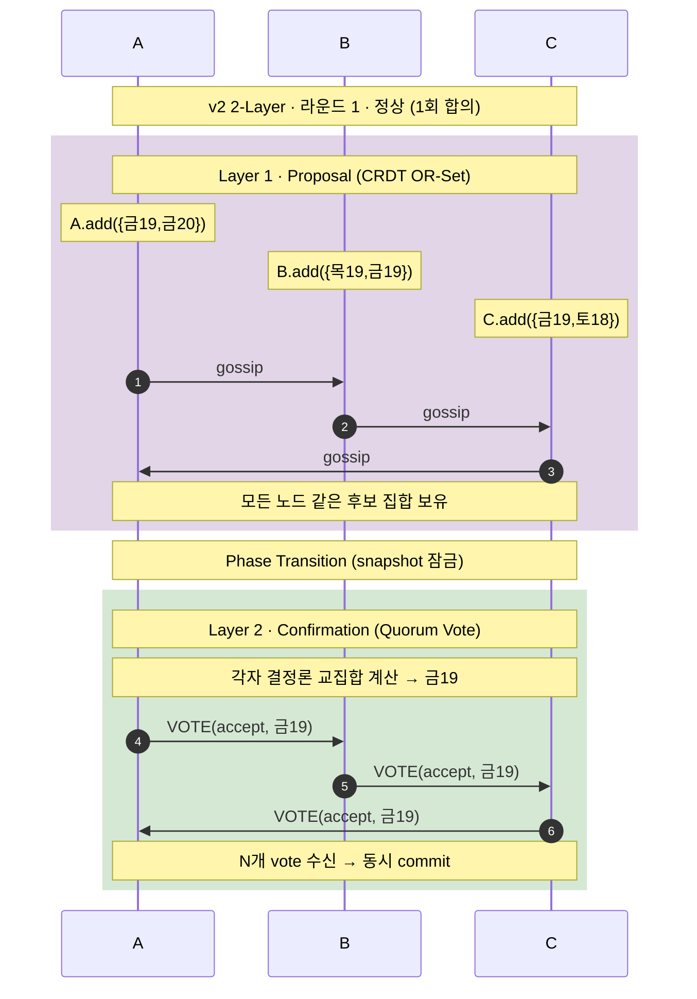
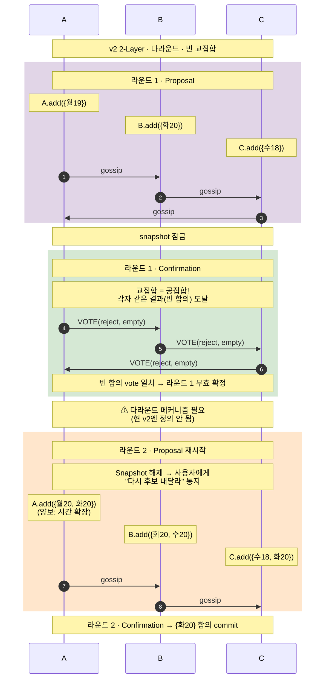
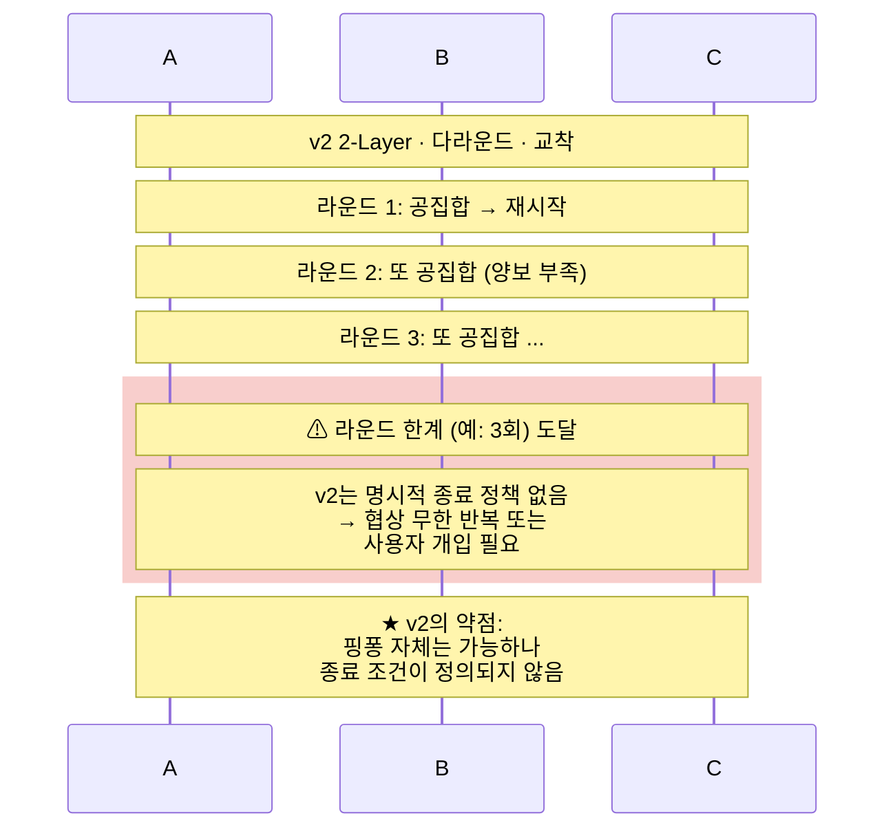
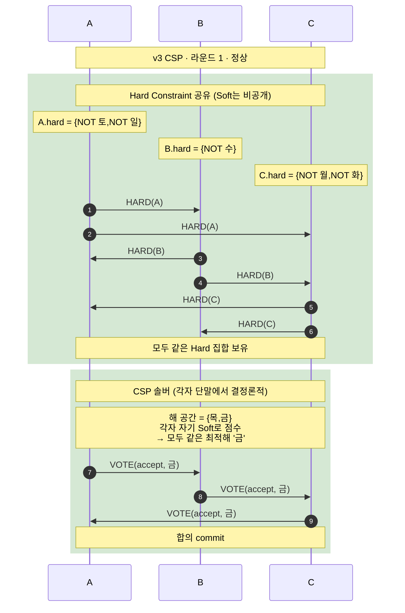
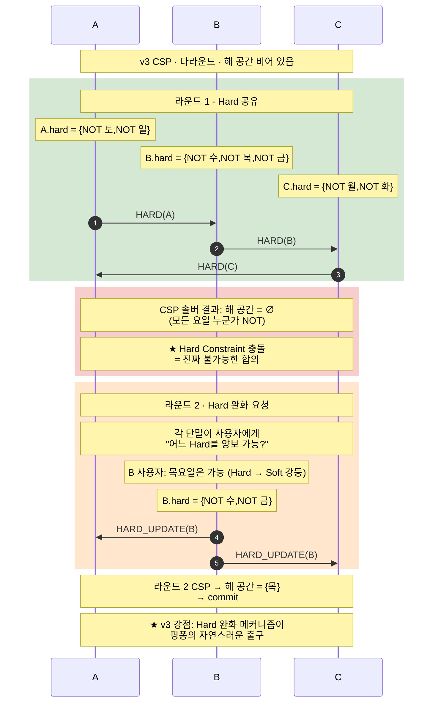
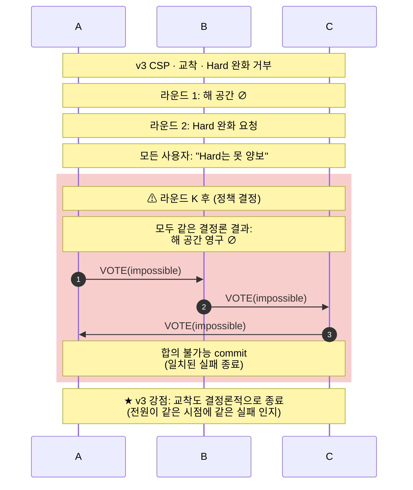
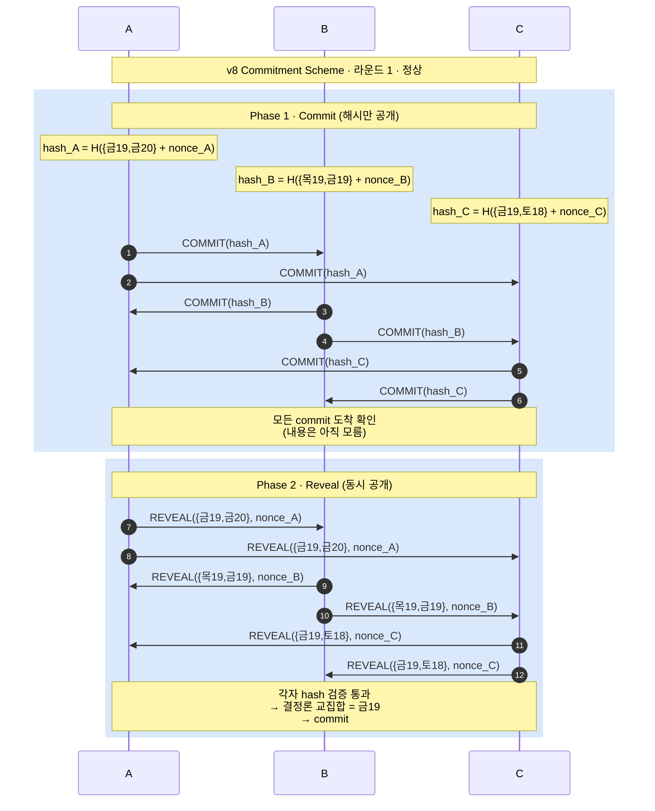
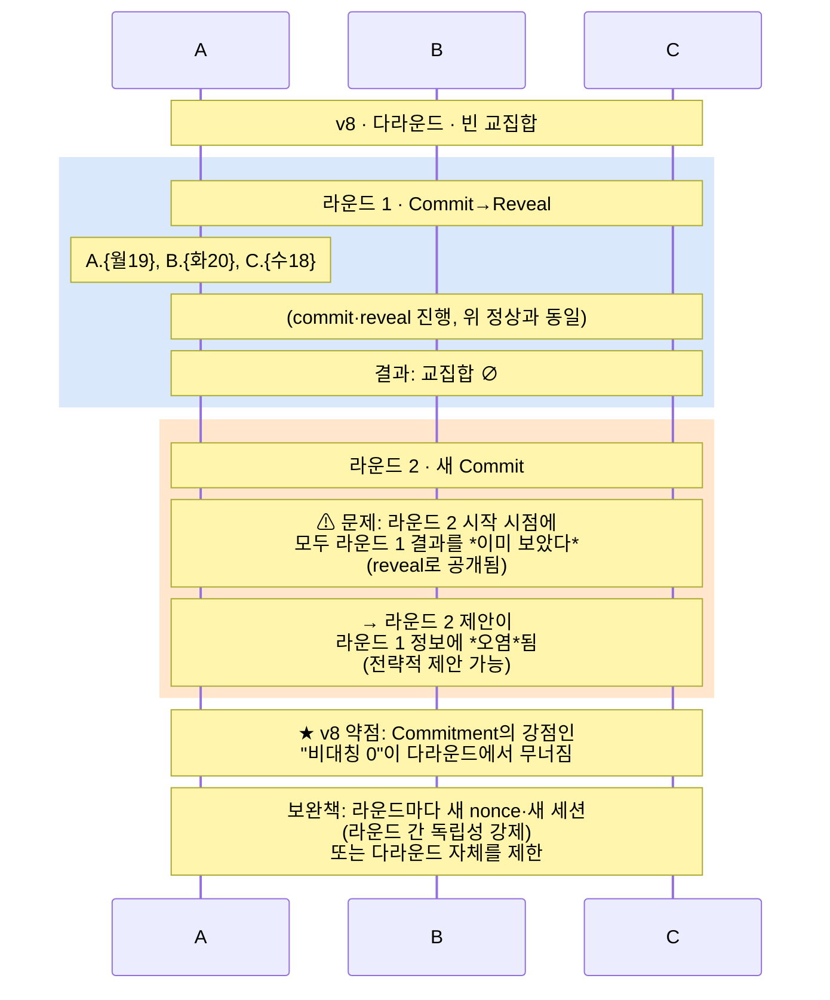
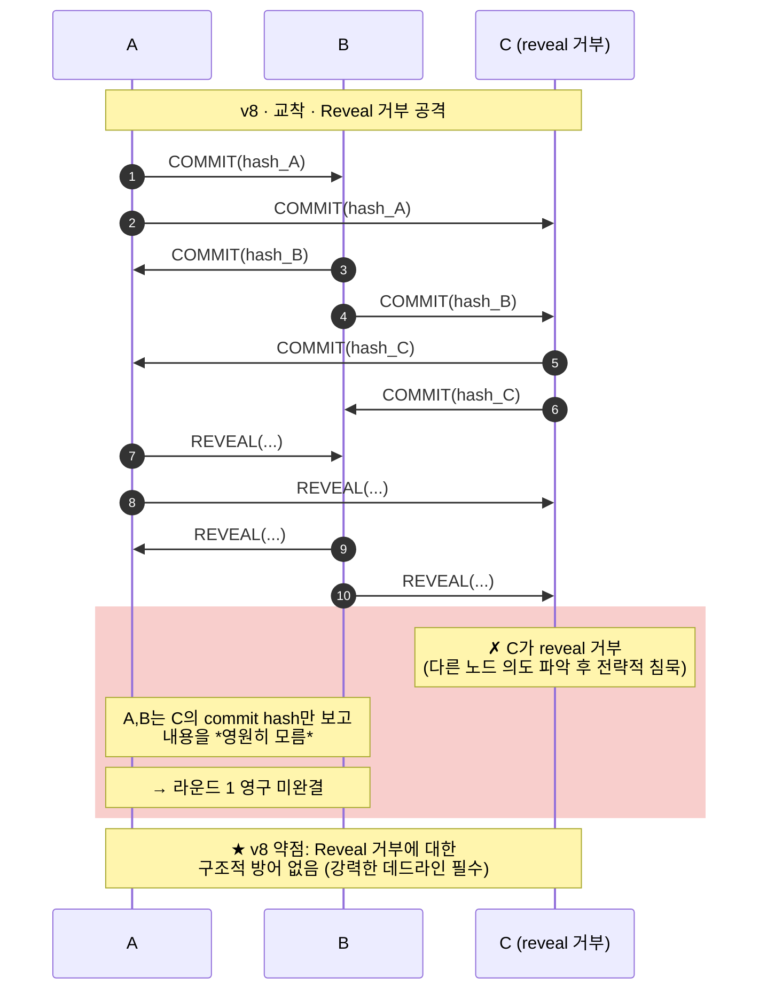

# [새제안] DP01 — 후보안 상세 시나리오 (Multi-Round 협상 포함)

> **본 문서의 위치**: [`[새제안]DP01-N명 커뮤니케이션 시나리오.md`]([새제안]DP01-N명%20커뮤니케이션%20시나리오.md)(v2 본문)과 [`[새제안2]DP01-결정-축-프레임워크.md`]([새제안2]DP01-결정-축-프레임워크.md)(결정 도구)의 **보조 자료**. 후보안들이 *추상적 메커니즘*으로만 묘사돼 이해가 어렵다는 피드백을 받아, **각 후보가 실제로 어떻게 작동하는지** 메시지·라운드 단위로 풀어낸다.
>
> **추가 다루는 것**: 협상이 *1회로 끝나지 않는 경우*(다라운드 핑퐁)를 본격적으로 다룬다. 빈 교집합·반제안·양보·교착 같은 *현실 협상의 동역학*이 각 후보에서 어떻게 다르게 풀리는지가 핵심. 더불어 **각 후보의 단점을 어떻게 보완하는지** *보완 택틱*도 후보별로 정리.
>
> **대상 후보**: v2 2-Layer / v3 CSP / v8 Commitment Scheme / v9 Lazy Convergence
>
> **약어**: OR-Set = Observed-Removed Set · CSP = Constraint Satisfaction Problem · CRDT = Conflict-free Replicated Data Type · hash() = 암호 해시 함수

---

## 0. 시나리오 설정

### 공통 참여자

세 사용자(A·B·C)의 PPA들이 *저녁 약속*을 협상한다. 각자 단말에서 자기 선호를 산출.

### 다라운드를 만드는 세 가지 케이스

본 문서는 *세 가지 시나리오*를 각 후보에 적용해 비교한다.

| 케이스 | 입력 | 의미 |
|--------|------|------|
| **CASE-1 정상** | A:{금19,금20}, B:{목19,금19}, C:{금19,토18} | 1회 합의로 끝남. *기준선* |
| **CASE-2 빈 교집합** | A:{월19}, B:{화20}, C:{수18} | 1회로 안 끝남. *반제안·양보·재라운드 필요* |
| **CASE-3 교착** | 위 + 모두 양보 거부 | 다라운드 후에도 합의 불가. *명시적 실패 종료 필요* |

CASE-2와 CASE-3가 *진짜 협상의 본질*. 실제 협상은 한 번에 끝나는 게 드물고, *반복적 조정과 양보*가 동역학의 핵심이다. 후보별 상세 시나리오에서 이 동역학을 어떻게 다루는지가 진짜 차이를 만든다.

---

## 1. v2 · 2-Layer (Proposal/Confirmation) 상세

### v2의 핵심 발상

**Proposal Phase**(CRDT OR-Set)에서 선호 누적 → **Phase Transition**으로 잠금 → **Confirmation Phase**(Quorum Vote)에서 결과 commit. 두 단계가 *명확히 분리*된다.

### CASE-1 v2 정상

**핵심**: 한 번의 Proposal로 후보가 모이고, 한 번의 Confirmation으로 commit. *깔끔하지만 1라운드만 가정한 시나리오*.

### CASE-2 v2 빈 교집합 → 다라운드

**핵심 발견**: v2 본문은 *라운드 1로 끝나는 경우만* 다뤘다. 빈 교집합이 나면 *snapshot을 해제하고 라운드 2를 시작*해야 하는데, **본문에 이 메커니즘이 명시되어 있지 않다**. 다라운드 전환의 의미·트리거·반복 한계가 모두 미해결.

### CASE-3 v2 교착

### v2 종합 평가 (다라운드 관점)

- **강점**: 1라운드는 깔끔. Phase 분리가 *디버깅·추적*에 유리.
- **약점 1**: 다라운드 메커니즘이 *본문에 정의 없음*. 라운드 간 전환의 트리거·snapshot 해제 시점·이전 라운드 정보 활용이 모호.
- **약점 2**: 종료 조건 부재. 무한 반복 가능성.
- **다라운드 보강에 필요한 추가 결정**: 라운드 한계, 라운드 간 양보 메커니즘, 최종 실패 처리.

### 🔧 v2 보완 택틱

v2의 두 약점은 **구조적 한계가 아니라 본문 공백**이라 보완 효과가 강함. 다음 세 택틱으로 다라운드를 본격 수용한다.

**T1 — Snapshot 해제 + 라운드 카운터**
Confirmation에서 *빈 합의 vote 일치*가 감지되면 자동으로 snapshot 잠금을 해제하고 라운드 카운터 +1. 라운드 한계 K(예: 3) 도달 시 *명시적 실패 종료*. 종료 조건의 부재를 해결.

**T2 — 라운드 간 후보 이월**
라운드 1의 후보 집합을 라운드 2의 *기본 상태로 유지*하고, 사용자에게 *"추가 후보 또는 양보 후보를 내달라"* 만 요청. 처음부터 다시 모으는 비용 절감 + 라운드 간 *진전 추적 가능*.

**T3 — 양보 표시 필드**
OR-Set 이벤트에 *"양보된 후보(concession=true)"* 플래그를 명시. 라운드 2의 후보가 *양보의 결과임*을 모든 노드가 인지 가능. 사용자 UX에도 *"○○님이 양보했습니다"* 표시 가능 + 결정론 알고리즘이 *양보 비용을 점수에 반영* 가능.

**보완 효과**: ★★★ **강함**. v2의 *깔끔한 두 단계* 강점은 유지되면서 다라운드의 구조적 공백이 메워짐. 본문 sub-decision 3개로 추가하면 v3에 근접한 다라운드 적합성 확보.

---

## 2. v3 · CSP (Constraint Satisfaction) 상세

### v3의 핵심 발상

각 단말이 자기 선호를 **Hard Constraint(절대 불가, *공개*)**와 **Soft Preference(상대적 선호, *비공개*)** 로 분리. Hard만 공유하면 모두 같은 *해 공간*을 인지. 그 안에서 각자 자기 Soft로 점수 매겨 결정론 최적해 도출.

### CASE-1 v3 정상

**핵심**: Hard와 Soft를 *명시적으로 분리*. Soft는 단말 밖으로 안 나가므로 **데이터 주권에 자연 정합**.

### CASE-2 v3 빈 해 공간 → Hard 완화 메커니즘

**핵심 발견**: v3는 *다라운드 메커니즘이 데이터 모델에 자연 내장*돼 있다. Hard → Soft 강등이 *반제안·양보의 직접 표현*. v2처럼 별도 "라운드 2 메커니즘"을 추가 결정으로 정의할 필요 없음.

### CASE-3 v3 교착 — *결정론적 실패*

**핵심 발견**: v3는 교착도 *결정론적으로* 끝낸다. 모두가 같은 해 공간 ∅를 보므로 *어느 한 명이 임의로 종료 선언하는 게 아니라* 시스템 자체가 실패를 인지. *QAS-016의 "100% 결과 일관성"이 실패 케이스에서도 자연 보장*.

### v3 종합 평가 (다라운드 관점)

- **강점 1**: 다라운드 메커니즘이 *데이터 모델에 내장*. Hard → Soft 강등이 반제안·양보의 자연 표현.
- **강점 2**: 교착도 *결정론적 실패*. 모두 같은 시점에 같은 실패 인지.
- **강점 3**: Soft 비공개로 *데이터 주권* 자연 보장.
- **약점 1**: Hard와 Soft의 *경계가 도메인에 의존*. "절대 불가"와 "선호도 낮음"의 구분이 사용자에게 어려울 수 있음.
- **약점 2**: CSP 솔버의 *연산 부담*. 일정 협상 같은 작은 도메인은 가벼우나, 복잡한 다차원 협상은 NP-hard 영역 가능.

### 🔧 v3 보완 택틱

**T1 — 사용자 인터페이스 단계화** *(약점 1 대응)*
사용자에게 *"이건 안 됩니다 (절대)"* vs *"되긴 하지만 별로 (선호도)"* 의 명확한 이분 선택만 제시. 회색 영역은 *기본값 Soft*로 보수적 분류. 사용자가 잘못 표시해도 *Soft에 들어가면 Hard 강등 비용이 없음* → 안전한 기본값.

**T2 — LLM 보조 분류 + 사용자 확인** *(약점 1 대응)*
사용자가 자연어로 표현한 선호를 단말 LLM이 Hard/Soft로 *자동 분류*. 단, 분류 결과를 사용자에게 *반드시 확인*받아 해석 오류 방지. *LLM이 비결정성을 가져오지만 분류 결과는 사용자가 검증*하므로 결정론 유지.

**T3 — Hard 사후 강등 허용** *(약점 1 대응)*
협상 진행 중 *"역시 Hard 아니었네"* 라며 강등 가능. v3가 이미 다라운드에서 Hard → Soft 강등을 다루므로 자연 확장. 잘못 표시한 Hard를 *복구할 출구*가 항상 열려 있음.

**T4 — 도메인 한정 + 변수 수 제한** *(약점 2 대응)*
일정 협상 같은 *작은 도메인*에 한정. 복잡 협상(가격·조건·옵션 다차원)은 v3 적용 범위 밖으로 명시. 동시 협상 가능 차원 수를 *고정*(예: 시간만 또는 시간+장소). N-party의 복잡도가 폭발하지 않도록.

**T5 — 휴리스틱 솔버** *(약점 2 대응)*
완전 최적해 대신 *근사 최적해*. 모든 노드가 *같은 휴리스틱 알고리즘*을 쓰면 *결정론성은 유지*. 연산 부담 감소.

**보완 효과**: ★★★ **강함**. 약점 1은 UX·LLM 보조·사후 강등으로 *충분히 보완*. 약점 2는 적용 범위 한정으로 *회피*. v3의 본질 강점(다라운드 내장·데이터 주권)은 유지하면서 약점 흡수.

---

## 3. v8 · Commitment Scheme 상세

### v8의 핵심 발상

각자 자기 선호를 *해시(commit)*해서 먼저 공개. 모든 commit이 도착한 *후에야* 원본을 reveal. *"누가 먼저 보고 결정했나"* 의 비대칭을 제거.

### CASE-1 v8 정상

**핵심**: Commit Phase에서는 *내용을 모르고* 위치만 확인. Reveal Phase에서 *모두가 동시에* 내용을 인지. **누구도 다른 사람 선호를 *먼저 보고* 자기 선호를 조정할 수 없다**.

### CASE-2 v8 빈 교집합 — *다라운드의 본질적 약점*

**핵심 발견**: v8의 *근본적 약점*. Commitment Scheme은 *1라운드의 비대칭은 막지만 다라운드에서 정보가 누적*된다. → **Commitment의 본질적 보안 강점이 다라운드에서 무너진다**.

### CASE-3 v8 교착 — Reveal 거부 공격

### v8 종합 평가 (다라운드 관점)

- **강점**: 1라운드 비대칭 완전 제거. Coordinator·Leader·Sequencer 없이 *대칭성 보장*.
- **약점 1 (치명적)**: 다라운드에서 *비대칭 강점 무력화*. 라운드 1의 reveal이 라운드 2의 *입력*에 영향.
- **약점 2**: Reveal 거부 공격에 *구조적 방어 없음*.
- **약점 3**: Commit·Reveal 2 라운드 트립이 *기본*. 협상 시간 부담.
- **결론**: *1라운드 협상에서만 강점*. 본질적으로 다라운드에 부적합.

### 🔧 v8 보완 택틱 — 솔직히 제한적

v8의 약점은 *구조적 한계*가 많아 보완 효과가 다른 후보보다 약함. 솔직히 짚어야 할 부분.

**T1 — 라운드 간 완전 독립 강제** *(약점 1 대응, 효과 제한적)*
새 nonce·새 세션 ID·새 commit 키로 *형식적 독립* 강제. **그러나 *내용 정보*는 reveal로 이미 노출됐으므로 *전략적 제안* 가능성은 본질적으로 남음.** 형식만 막고 본질을 못 막는 한계.

**T2 — 다라운드 금지 정책** *(약점 1 대응, 효과 있으나 v8 적용 범위 제한)*
1회 협상 후 *실패 시 새 협상 세션 시작*만 허용. 같은 세션 내 다라운드는 *원천 차단*. **이건 사실상 v8을 *1회 협상 전용으로 명시*하는 것과 같음** — 다라운드 협상 후보군에서 자진 제외.

**T3 — Reveal 데드라인 + 미응답자 제외** *(약점 2 대응)*
Reveal 단계 timeout 후 *자동으로 미응답자 제외하고 진행*. 미응답자의 commit hash는 *그대로 폐기*. 시스템 복잡도가 증가하나 Reveal 거부 공격은 일부 완화.

**T4 — 평판 시스템** *(약점 2 대응, 무거움)*
반복적 reveal 거부 단말에 *낮은 평판* 부여, 다음 협상에서 *제외 또는 가중치 하향*. **추가 기반 시설이 필요해 비용 큼.** 본 DP 범위를 넘어 별도 시스템 결정 필요.

**보완 효과**: ★☆☆ **약함**. v8은 *구조적 한계*가 본질이라 보완으로 다라운드 적합성을 얻기 어려움. T2(다라운드 금지) 외엔 효과 제한적이고, T2는 사실상 *적용 범위를 1회 협상으로 좁히는 것*. 결과적으로 v8은 다라운드 협상 후보에서 빠지는 게 정직한 결론.

---
