# [새제안] DP01 — 후보안 상세 시나리오 (Multi-Round 협상 포함)

> **본 문서의 위치**: [`[새제안]DP01-N명 커뮤니케이션 시나리오.md`]([새제안]DP01-N명%20커뮤니케이션%20시나리오.md)(v2 본문)과 [`[새제안2]DP01-결정-축-프레임워크.md`]([새제안2]DP01-결정-축-프레임워크.md)(결정 도구)의 **보조 자료**. 후보안들이 *추상적 메커니즘*으로만 묘사돼 이해가 어렵다는 피드백을 받아, **각 후보가 실제로 어떻게 작동하는지** 메시지·라운드 단위로 풀어낸다.
>
> **추가 다루는 것**: 협상이 *1회로 끝나지 않는 경우*(다라운드 핑퐁)를 본격적으로 다룬다. 빈 교집합·반제안·양보·교착 같은 *현실 협상의 동역학*이 각 후보에서 어떻게 다르게 풀리는지가 핵심.
>
> **대상 후보**: v2 2-Layer / v3 CSP / v8 Commitment Scheme / v9 Lazy Convergence
>
> **약어**: OR-Set = Observed-Removed Set · CSP = Constraint Satisfaction Problem · CRDT = Conflict-free Replicated Data Type · hash() = 암호 해시 함수

---

## 0. 시나리오 설정

### 공통 참여자

세 사용자(A·B·C)의 PPA들이 *저녁 약속*을 협상한다. 각자 단말에서 자기 선호를 산출.

### 다라운드를 만드는 세 가지 케이스

본 문서는 *세 가지 시나리오*를 각 후보에 적용해 비교한다.

| 케이스 | 입력 | 의미 |
|--------|------|------|
| **CASE-1 정상** | A:{금19,금20}, B:{목19,금19}, C:{금19,토18} | 1회 합의로 끝남. *기준선* |
| **CASE-2 빈 교집합** | A:{월19}, B:{화20}, C:{수18} | 1회로 안 끝남. *반제안·양보·재라운드 필요* |
| **CASE-3 교착** | 위 + 모두 양보 거부 | 다라운드 후에도 합의 불가. *명시적 실패 종료 필요* |

CASE-2와 CASE-3가 *진짜 협상의 본질*. 실제 협상은 한 번에 끝나는 게 드물고, *반복적 조정과 양보*가 동역학의 핵심이다. 후보별 상세 시나리오에서 이 동역학을 어떻게 다루는지가 진짜 차이를 만든다.

---

## 1. v2 · 2-Layer (Proposal/Confirmation) 상세

### v2의 핵심 발상

**Proposal Phase**(CRDT OR-Set)에서 선호 누적 → **Phase Transition**으로 잠금 → **Confirmation Phase**(Quorum Vote)에서 결과 commit. 두 단계가 *명확히 분리*된다.

### CASE-1 v2 정상

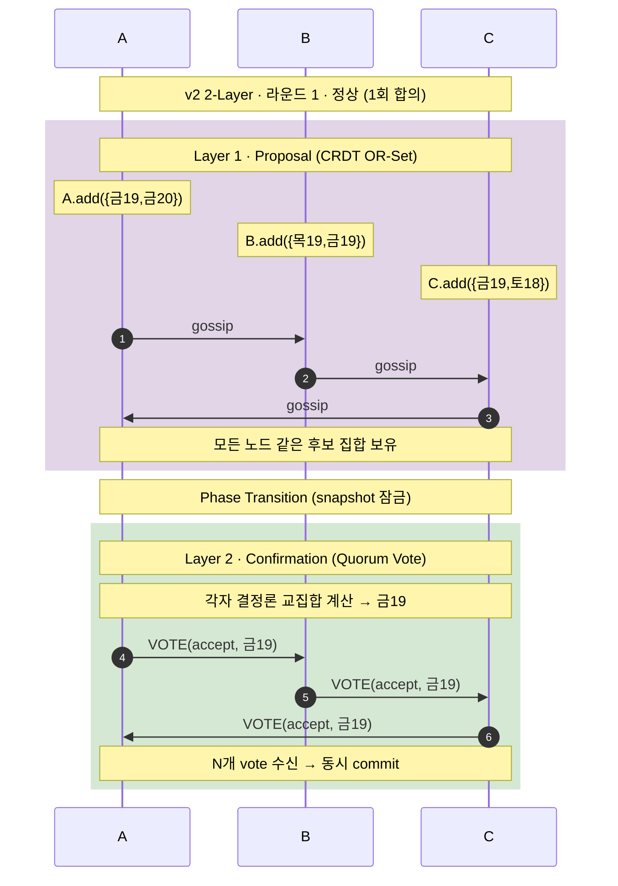

**핵심**: 한 번의 Proposal로 후보가 모이고, 한 번의 Confirmation으로 commit. *깔끔하지만 1라운드만 가정한 시나리오*.

### CASE-2 v2 빈 교집합 → 다라운드

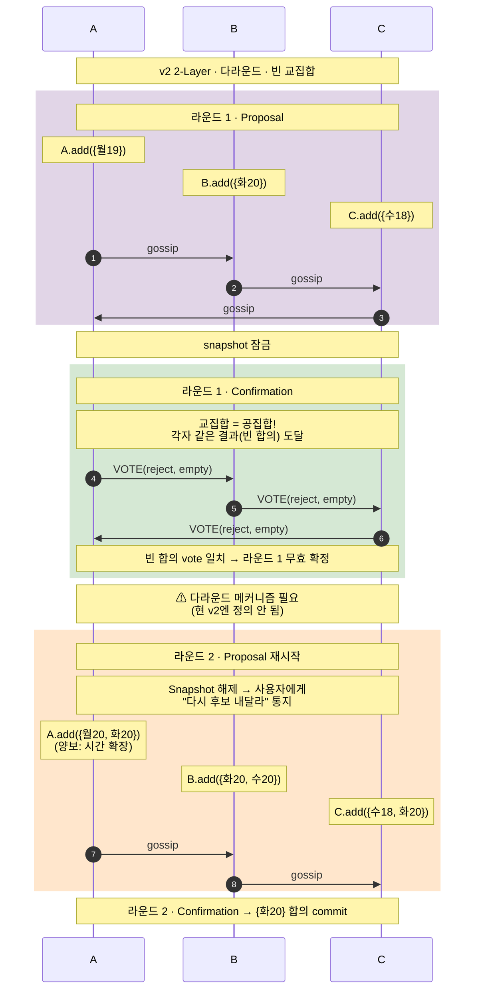

**핵심 발견**: v2 본문은 *라운드 1로 끝나는 경우만* 다뤘다. 빈 교집합이 나면 *snapshot을 해제하고 라운드 2를 시작*해야 하는데, **본문에 이 메커니즘이 명시되어 있지 않다**. 다라운드 전환의 의미·트리거·반복 한계가 모두 미해결.

### CASE-3 v2 교착

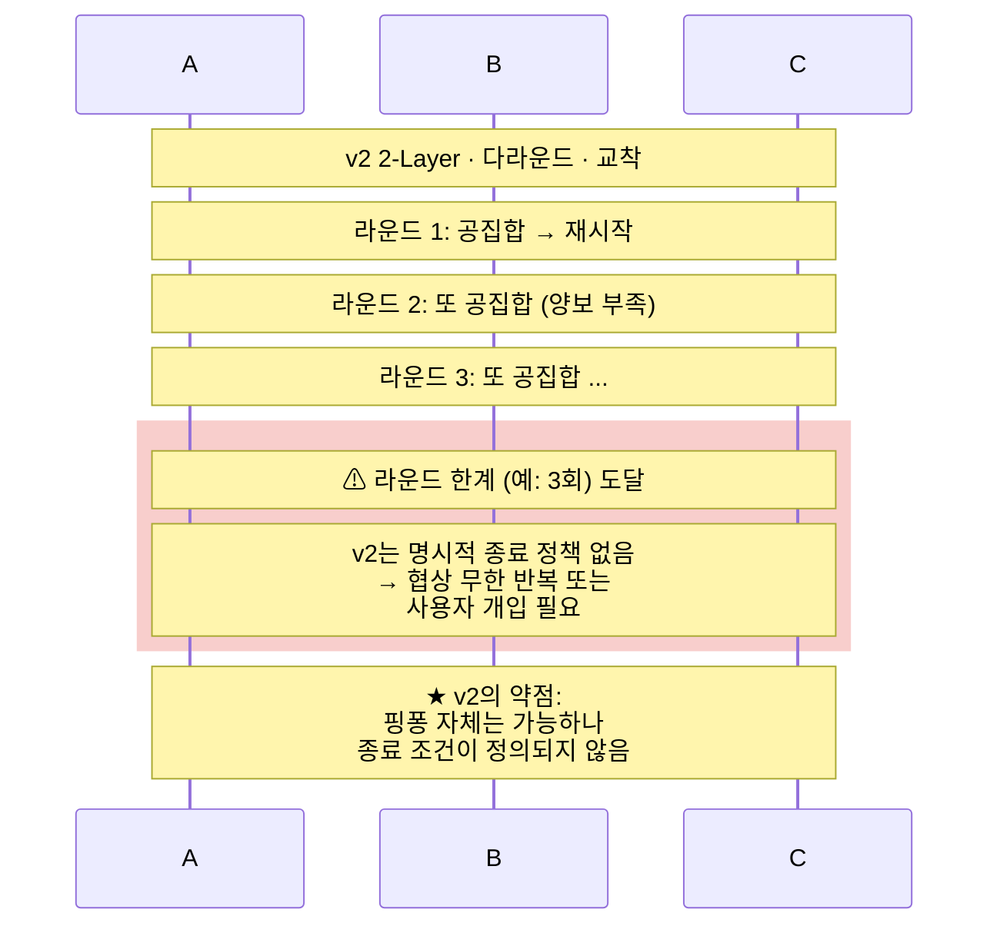

### v2 종합 평가 (다라운드 관점)

- **강점**: 1라운드는 깔끔. Phase 분리가 *디버깅·추적*에 유리.
- **약점 1**: 다라운드 메커니즘이 *본문에 정의 없음*. 라운드 간 전환의 트리거·snapshot 해제 시점·이전 라운드 정보 활용이 모호.
- **약점 2**: 종료 조건 부재. 무한 반복 가능성.
- **다라운드 보강에 필요한 추가 결정**: 라운드 한계, 라운드 간 양보 메커니즘, 최종 실패 처리.

---

## 2. v3 · CSP (Constraint Satisfaction) 상세

### v3의 핵심 발상

각 단말이 자기 선호를 **Hard Constraint(절대 불가, *공개*)**와 **Soft Preference(상대적 선호, *비공개*)** 로 분리. Hard만 공유하면 모두 같은 *해 공간*을 인지. 그 안에서 각자 자기 Soft로 점수 매겨 결정론 최적해 도출.

### CASE-1 v3 정상

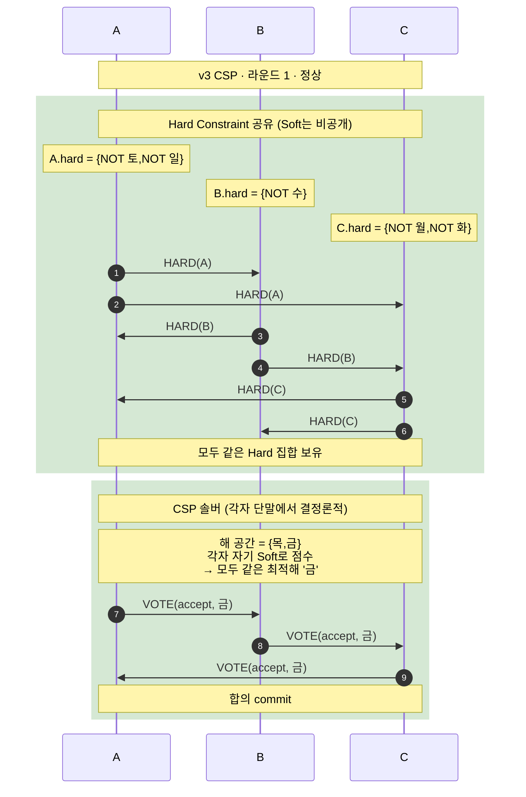

**핵심**: Hard와 Soft를 *명시적으로 분리*. Soft는 단말 밖으로 안 나가므로 **데이터 주권에 자연 정합**.

### CASE-2 v3 빈 해 공간 → Hard 완화 메커니즘

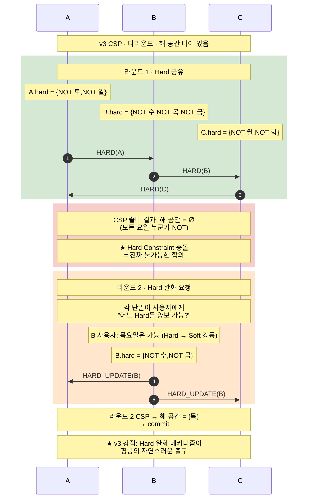

**핵심 발견**: v3는 *다라운드 메커니즘이 데이터 모델에 자연 내장*돼 있다. Hard → Soft 강등이 *반제안·양보의 직접 표현*. v2처럼 별도 "라운드 2 메커니즘"을 추가 결정으로 정의할 필요 없음.

### CASE-3 v3 교착 — *결정론적 실패*

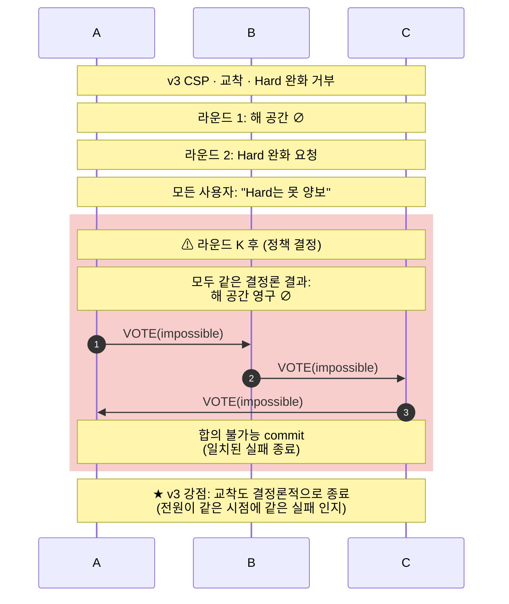

**핵심 발견**: v3는 교착도 *결정론적으로* 끝낸다. 모두가 같은 해 공간 ∅를 보므로 *어느 한 명이 임의로 종료 선언하는 게 아니라* 시스템 자체가 실패를 인지. *QAS-016의 "100% 결과 일관성"이 실패 케이스에서도 자연 보장*.

### v3 종합 평가 (다라운드 관점)

- **강점 1**: 다라운드 메커니즘이 *데이터 모델에 내장*. Hard → Soft 강등이 반제안·양보의 자연 표현.
- **강점 2**: 교착도 *결정론적 실패*. 모두 같은 시점에 같은 실패 인지.
- **강점 3**: Soft 비공개로 *데이터 주권* 자연 보장.
- **약점 1**: Hard와 Soft의 *경계가 도메인에 의존*. "절대 불가"와 "선호도 낮음"의 구분이 사용자에게 어려울 수 있음.
- **약점 2**: CSP 솔버의 *연산 부담*. 일정 협상 같은 작은 도메인은 가벼우나, 복잡한 다차원 협상은 NP-hard 영역 가능.

---

## 3. v8 · Commitment Scheme 상세

### v8의 핵심 발상

각자 자기 선호를 *해시(commit)*해서 먼저 공개. 모든 commit이 도착한 *후에야* 원본을 reveal. *"누가 먼저 보고 결정했나"* 의 비대칭을 제거.

### CASE-1 v8 정상

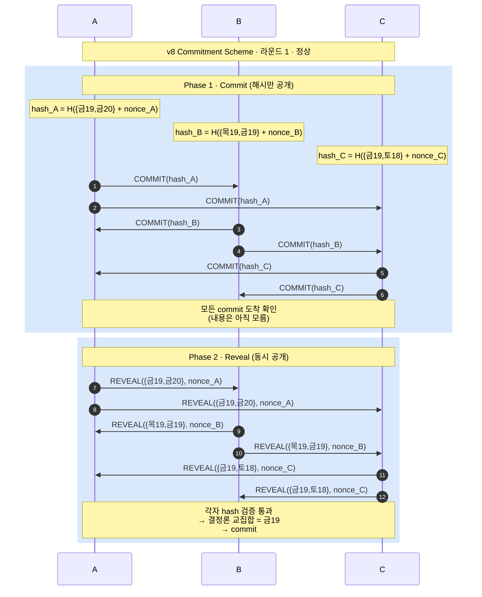

**핵심**: Commit Phase에서는 *내용을 모르고* 위치만 확인. Reveal Phase에서 *모두가 동시에* 내용을 인지. **누구도 다른 사람 선호를 *먼저 보고* 자기 선호를 조정할 수 없다**.

### CASE-2 v8 빈 교집합 — *다라운드의 본질적 약점*

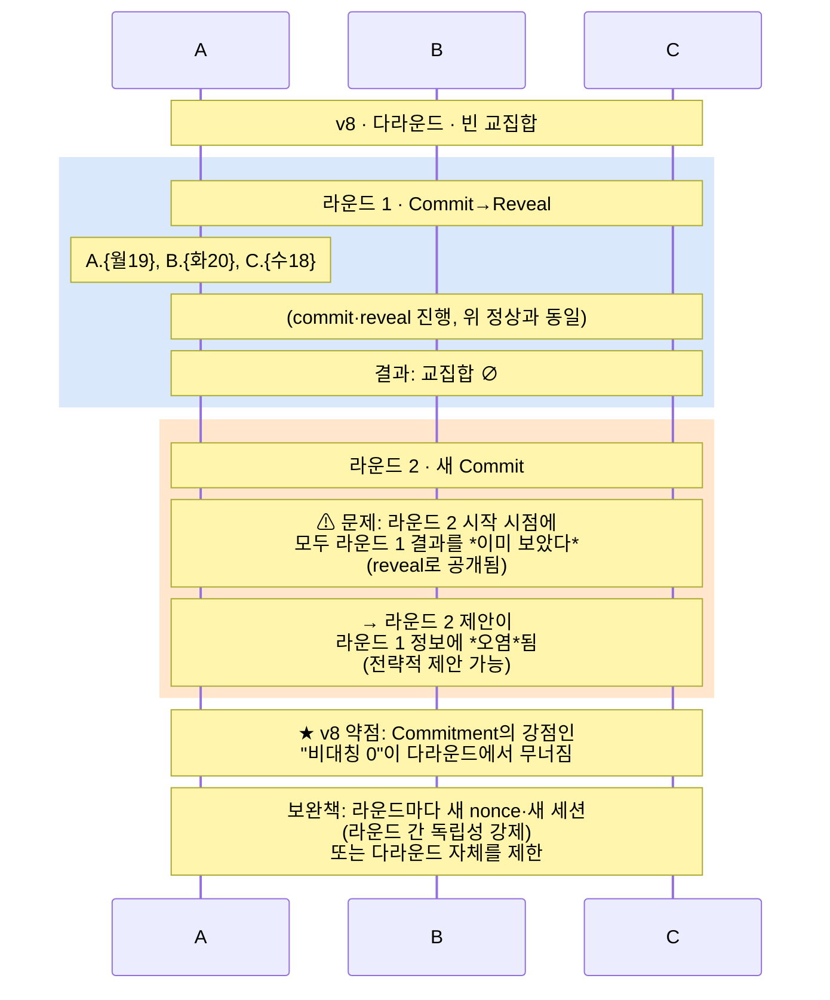

**핵심 발견**: v8의 *근본적 약점*. Commitment Scheme은 *1라운드의 비대칭은 막지만 다라운드에서 정보가 누적*된다. "A가 라운드 1에서 월19를 냈음을 본 후, B가 라운드 2에서 *그 정보에 기반해* 전략적 제안". → **Commitment의 본질적 보안 강점이 다라운드에서 무너진다**.

### CASE-3 v8 교착 — Reveal 거부 공격

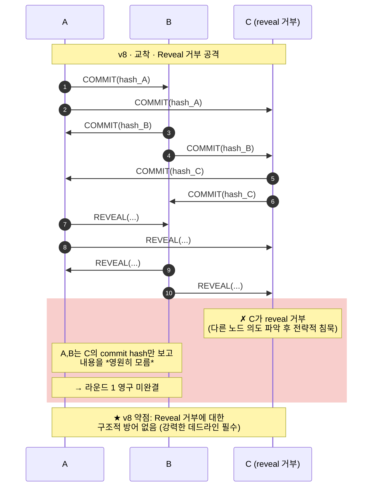

**핵심 발견**: Reveal 거부 자체가 *전략적 정보* (C가 reveal 거부했다는 사실로 A·B는 C의 의도를 일부 추론 가능). 이건 알고리즘 수준 결함이 아니라 *Commitment 패러다임의 본질적 한계*.

### v8 종합 평가 (다라운드 관점)

- **강점**: 1라운드 비대칭 완전 제거. Coordinator·Leader·Sequencer 없이 *대칭성 보장*.
- **약점 1 (치명적)**: 다라운드에서 *비대칭 강점 무력화*. 라운드 1의 reveal이 라운드 2의 *입력*에 영향.
- **약점 2**: Reveal 거부 공격에 *구조적 방어 없음*.
- **약점 3**: Commit·Reveal 2 라운드 트립이 *기본*. 협상 시간 부담.
- **결론**: *1라운드 협상에서만 강점*. 본질적으로 다라운드에 부적합.

---

## 4. v9 · Lazy Convergence 상세

### v9의 핵심 발상

Phase 구분 없음. 각자 자유롭게 *추가·수정·철회* 가능. 어느 시점이든 자기 단말이 "이 스냅샷 좋음"이라 판단하면 *binding vote*. 모두 같은 스냅샷에 binding 하면 commit. **다라운드가 *동역학의 기본*이 되는 모델**.

### CASE-1 v9 정상

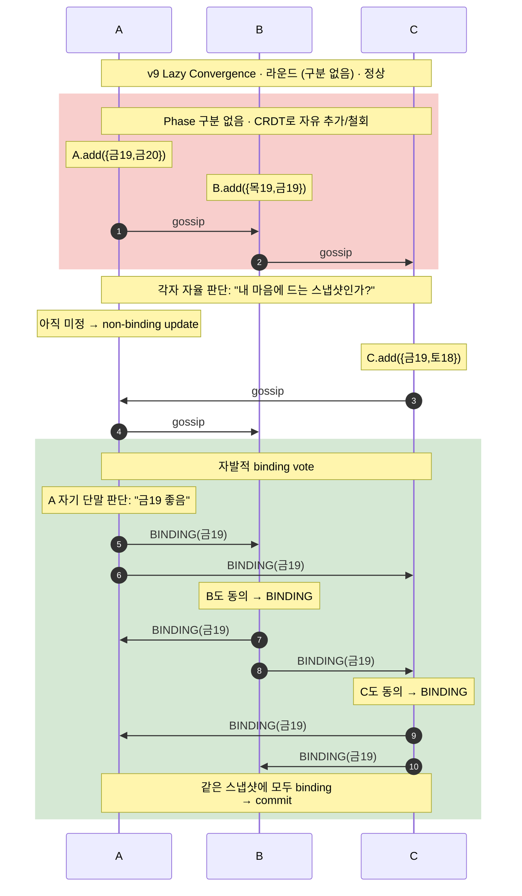

**핵심**: 별도 Phase 잠금 없이 *자율 판단*으로 binding. 누구도 "Confirmation 시작" 신호를 내리지 않음.

### CASE-2 v9 핑퐁 — *자연스러운 다라운드*

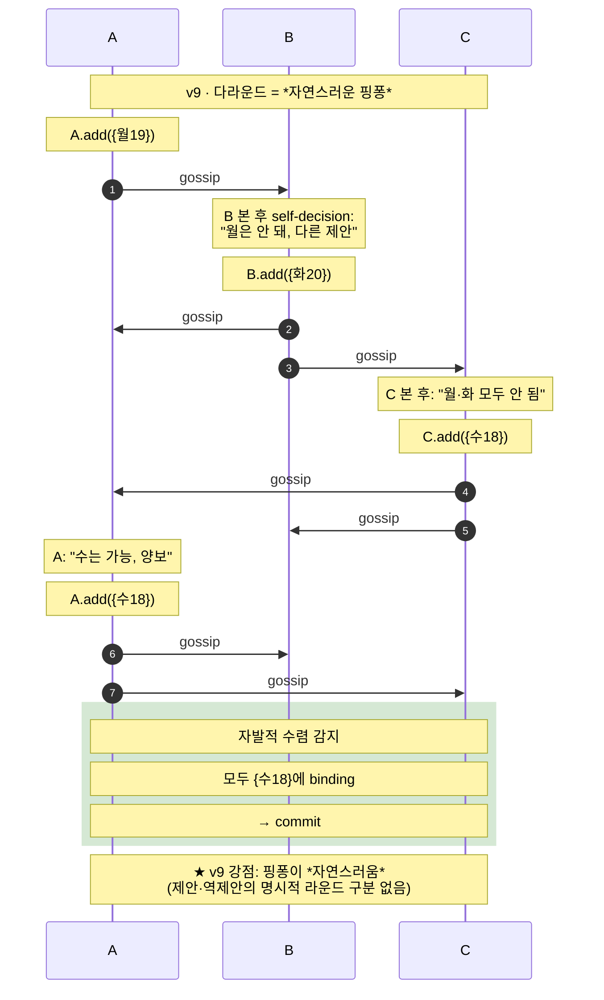

**핵심 발견**: v9에서 *다라운드는 별도 메커니즘이 아니라 모델 자체*. 사용자 입장에선 "내가 양보하고 새 제안을 내는" 일이 *자연스럽게 한 흐름*으로 표현된다. v2의 "Snapshot 해제 → 재시작" 같은 인위적 전환 없음.

### CASE-3 v9 교착 — *무한 핑퐁 위험*

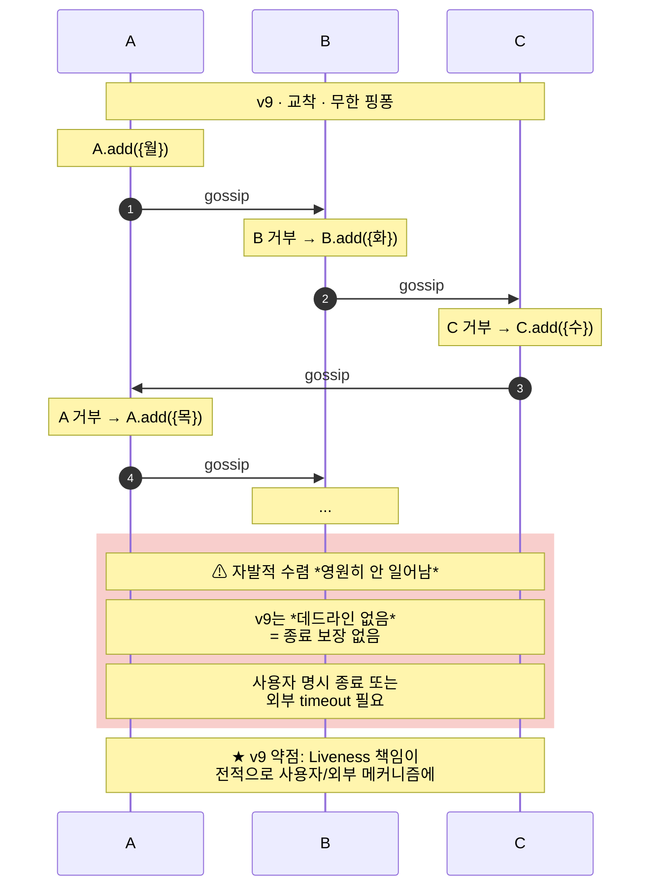

**핵심 발견**: v9의 *치명적 약점*. *자발적 수렴 가정*이 깨지면 시스템 자체로는 종료 못 함. 사용자 개입이 *필수*.

### v9 종합 평가 (다라운드 관점)

- **강점 1 (결정적)**: 다라운드가 *모델의 본질*. 별도 메커니즘 정의 없이 자연스럽게 핑퐁.
- **강점 2**: 사용자 경험이 *실제 협상에 가까움*. 양보·반제안이 명시적 라운드 없이 흐름으로.
- **강점 3**: 정보 공개가 *자기 단말 자율* — 데이터 주권 강.
- **약점 1 (치명적)**: Liveness 보장 *없음*. 무한 핑퐁 가능.
- **약점 2**: "binding vote 시점 판단"이 *각 단말 LLM에 의존*. 비결정성 들어옴 → QAS-014/015 측정 어려움.

---

## 5. 4개 후보 비교 — 다라운드 동역학 관점

### 5.1 핑퐁 처리 방식 비교

| 후보 | 1라운드 합의 | 빈 교집합 처리 | 교착 종료 | 다라운드 의미론 |
|------|------------|---------------|---------|---------------|
| **v2 2-Layer** | 깔끔 | **본문에 미정의** (snapshot 해제 메커니즘 추가 필요) | 명시 없음 (무한 반복 위험) | 별도 메커니즘으로 *추가* |
| **v3 CSP** | 깔끔 | Hard → Soft 강등 (데이터 모델 내장) | 결정론적 실패 (전원 일치) | 모델에 *내장* |
| **v8 Commitment** | 비대칭 0 | 라운드 간 정보 오염 — *치명적 약점* | Reveal 거부 무방비 | 본질적 부적합 |
| **v9 Lazy Conv** | 자율 binding | 자연스러운 흐름 | 무한 핑퐁 위험 | 모델의 *본질* |

### 5.2 핵심 통찰 — 후보별 *다라운드 적합성*

**v2**: 1라운드는 최강이지만 *다라운드는 별도 결정으로 풀어야 함*. 본문이 다라운드를 *암시만* 하고 메커니즘은 미정의. 실제 적용 시 *snapshot 해제·라운드 한계·재제안 정책* 같은 sub-decision이 추가됨.

**v3**: 다라운드가 *데이터 모델에 자연 내장*. Hard와 Soft의 *분리*가 양보 메커니즘 그 자체. 가장 *협상적 의미론*과 정합.

**v8**: 다라운드 *부적합*. Commitment의 강점이 다라운드에서 본질적으로 무너짐. *1회 협상* 전용 모델.

**v9**: 다라운드가 *모델의 본질*. 핑퐁이 가장 자연스러우나, *수렴 보장이 없음*이라는 근본적 약점.

### 5.3 정직한 평가 — 어느 후보가 *진짜 협상*을 표현하는가

실제 인간 협상의 동역학을 보면:
1. 처음 선호 제시
2. 빈 교집합 또는 부분 합의
3. *어느 한 명이 양보*하거나 *대안 제안*
4. 다른 사람들이 *그 양보에 반응*
5. 수렴 또는 교착

이 흐름과 *가장 자연스럽게 정합하는 후보*는 **v3 (CSP) 또는 v9 (Lazy Convergence)**. v2는 *1라운드 모델*이고 v8은 *1회 합의 패러다임*.

**v3 vs v9의 차이**:
- v3: *구조화된 양보* (Hard → Soft 강등). 결정론적 수렴.
- v9: *자유로운 양보* (자율 추가·수정). 비결정적 수렴.

v3가 *예측 가능성과 종료 보장*에서 강하고, v9가 *표현력과 자연스러움*에서 강함.

---

## 6. 다라운드 핵심 결정 사항

본 상세 시나리오에서 드러난 *추가 결정 사항들*. 후보 채택 후 *반드시 정의*해야 한다.

### 6.1 다라운드 트리거 (라운드 종료 조건)

- **v2**: snapshot 잠금 후 *공집합 vote 일치 감지 → 자동 재시작* (현재 미정의)
- **v3**: CSP 해 공간 ∅ 감지 → *Hard 완화 요청 단계* 진입
- **v8**: 라운드 1 reveal 후 *결과 평가 → 새 commit 라운드 시작 결정*
- **v9**: 자발적 수렴 *안 감지되면 무한 반복* (트리거 자체가 모호)

### 6.2 라운드 간 정보 보존

- **v2**: 이전 라운드 후보를 새 라운드에서 *재사용 가능?* 정책 결정 필요
- **v3**: Hard 완화는 *누적* (한 번 강등하면 그대로)
- **v8**: 라운드 간 *완전 독립*(새 nonce·새 세션) 강제 권고
- **v9**: 모든 정보 누적 (CRDT 본질)

### 6.3 최종 실패 종료

- **v2**: 라운드 한계 K 정의 필요. K 후 사용자 통지 정책 추가.
- **v3**: 해 공간 ∅ + Hard 완화 거부 → *결정론적 실패* (전원 일치)
- **v8**: Reveal 거부 시 데드라인 후 *불완전 종료*
- **v9**: 사용자 명시 종료 *외에* 자동 종료 없음

### 6.4 양보·반제안 의미론

- **v2**: 라운드 2 Proposal에서 *후보 확장*으로 표현. 명시적 양보 표시 없음.
- **v3**: *Hard → Soft 강등*이 양보. 의미론 명확.
- **v8**: 새 라운드 commit에서 *암묵적* 양보. 표현 안 됨.
- **v9**: *자기 단말의 새 add*가 양보. 자유 형식.

---

## 7. 결론 — 다라운드 관점의 권고

### 7.1 단일 후보의 한계

본 상세 분석에서 드러난 것:

- **v2 단독**: 다라운드 메커니즘이 *별도 결정으로 추가됨*. 본문 보강 필수.
- **v3 단독**: 다라운드와 양보가 *데이터 모델에 자연*. 가장 정합적이나 CSP 솔버 부담.
- **v8 단독**: 다라운드 *부적합*. 1회 협상 전용.
- **v9 단독**: 다라운드 *최적*이나 종료 보장 없음.

→ **단일 후보로 모든 다라운드 케이스를 우아하게 다루는 안은 없다.**

### 7.2 다라운드 관점의 솔직한 권고

**1순위 후보**: **v3 CSP**. 다라운드가 *모델에 내장*, 결정론적 종료, 데이터 주권 자연 보장. 약점은 CSP 솔버 부담뿐.

**2순위 후보**: **v2 2-Layer + 다라운드 보강**. 본문에 다라운드 메커니즘(snapshot 해제·라운드 한계·재제안 정책)을 *명시적으로 추가*하면 v3에 근접.

**제외 권고**: **v8 Commitment**. 다라운드 부적합이 본질적이라 보강으로도 안 됨.

**보류**: **v9 Lazy Convergence**. 표현력은 최강이나 *Liveness 약점*이 너무 큼. *사용자 경험 우선*이면 재검토 가치 있음.

### 7.3 [새제안2] 결정 프레임워크와의 연결

[새제안2]의 4축 우선순위에서 **축 3 (협상 의미론)** 을 1순위로 두면 v3 또는 v9가 자동 선택됨. 본 다라운드 분석은 그 4축 분석의 *상세 근거*를 제공한다.

만약 팀이 *현재 v2 채택* 방향으로 가면, **다라운드 메커니즘을 본문 sub-decision에 *반드시 추가*** 해야 한다. 6절의 4가지 추가 결정이 그 내용.

---

## 8. 미해결 사항

본 상세 분석에서 드러난 *후속 작업*:

1. **다라운드 라운드 한계 K의 결정 근거** — 무엇으로 K를 정하나? (사용자 인내·NFR-MAF-04 협상 시간·이전 라운드 진전도)
2. **v3 Hard/Soft 사용자 인터페이스** — "절대 불가"와 "선호도 낮음"의 구분을 사용자가 어떻게 표현하나
3. **v9 종료 보장 메커니즘** — 자율 binding 외에 *외부 종료 신호* 필요한가
4. **각 후보의 협상 시간 측정** — QAS-002·NFR-MAF-04 기준 N=3,5,7에서 실측

---

_본 문서는 [`[새제안]DP01-N명 커뮤니케이션 시나리오.md`]의 *후보안이 이해 어렵다*는 피드백에 대응. 협상의 *다라운드 동역학*을 명시적으로 다루어 각 후보의 *진짜 차이*를 드러낸다._
