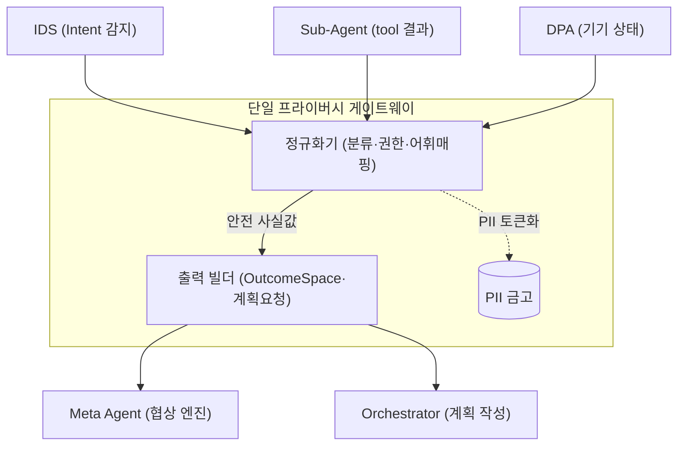
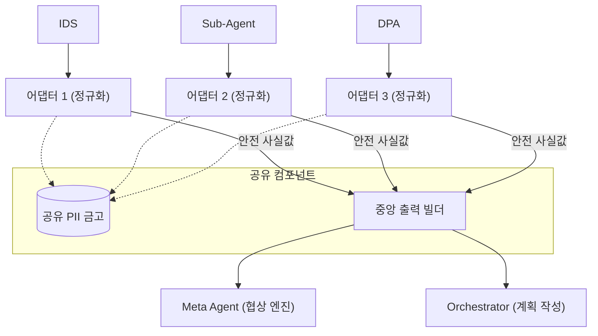

# DP02 — 모듈 토폴로지 (축 1) 설계

> 본 문서는 민감정보 처리의 핵심 불변식인 "설계타임 배제 + 프라이버시 게이트웨이"를 채택한 후, **그 게이트웨이의 내부 기능을 모듈적으로 어떻게 배치할 것인가(Module Topology)** 에 대한 세부 대안을 다룬다.
> **다이어그램 원본:** [축1-모듈토폴로지-AB비교.drawio](../../poc/dp03-privacy/축1-모듈토폴로지-AB비교.drawio)

---

## 1. 풀고자 하는 문제

프라이버시 게이트웨이는 다음 세 가지 핵심 책임을 수행해야 한다.
1. **정규화:** PII 분류, 권한 결속, 어휘 매핑 (원본 → 안전형 변환)
2. **출력 빌드:** OutcomeSpace 값 구성, 구조화된 계획 요청 구성
3. **PII 금고(Vault):** PII 토큰화 및 보관

이러한 책임을 수행하기 위해 데이터가 단말 내에서 흘러가야 하는데, **책임을 한 곳에 모아둘 것인가(중앙 집중형)** 아니면 **입력이 발생하는 곳 가까이로 분산할 것인가(분산 인라인형)** 가 이 축이 해결하려는 핵심 문제다.

---

## 2. 아키텍처적 난제

| 난제 | 내용 |
|---|---|
| **원본 체류 창(Window) 최소화** | 입력이 들어온 뒤 안전형으로 변환되기 전까지 단말 메모리에 원본(PII 등)이 평문으로 체류한다. 이 창을 좁힐수록 안전하다. |
| **감사·검증의 용이성 (Enforcement)** | "무엇이 밖으로 나갈 수 있는지"를 결정하는 규칙이 시스템 어디에 존재하는가? 규칙이 파편화될수록 동기화 누락과 유출 검증의 난이도가 치솟는다. |
| **교차 일관성 (Cross-Consistency)** | 캘린더의 시간대와 디바이스 상태의 시간대가 함께 조율되어야 할 때, 변환이 독립적으로 일어나면 통합된 문맥을 구성하기 어렵다. |

---

## 3. 방안 1 — 중앙 집중형 (단일 프라이버시 게이트웨이)

### 개념
모든 입력 채널(IDS, Sub-Agent, DPA)에서 발생한 원본 데이터가 **단일한 프라이버시 게이트웨이 모듈**로 모인 뒤에 정규화와 출력 빌드가 일괄적으로 수행된다.

### 구조도

### 장점
- **단일 Enforcement 지점:** "밖으로 나갈 수 있는 것"을 단 한 곳에서 결정하므로 감사와 검증이 결정론적이다. 어휘나 권한 규칙 변경이 게이트웨이 한 곳에 국소화된다.
- **교차 일관성 자연 보장:** 모든 입력을 한 모듈에서 통합적으로 보므로, 안전형 교차 점검 및 정합성 유지가 쉽다.
- **세션 복구 용이:** 비민감 상태가 한 곳에 집중되어 직렬화 경계가 명확하다.

### 위험
- **원본 체류 경로:** 입력 데이터가 발생 지점에서 게이트웨이까지 이동하는 동안 원본 평문이 메모리를 흐른다.
- **단일 병목(비대화):** 기능이 추가될수록 게이트웨이 모듈이 비대해질 위험(God Object)이 있다.

---

## 4. 방안 2 — 분산 인라인형 (어댑터 분산)

### 개념
정규화(분류 및 토큰화) 책임을 **각 입력 출처의 전용 어댑터(Adapter)** 에 내장시켜 입력 즉시 처리하고, PII Vault와 출력 빌더만 공유 서비스로 남기는 하이브리드 분산 구조.

### 구조도

### 장점
- **원본 체류 창 최소화:** 원본 데이터가 발생 즉시 각자의 인라인 어댑터에서 변환되므로 위험 경로가 매우 짧다.
- **병목 완화:** 다중 입력이 동시 발생할 때 각 어댑터에서 병렬로 정규화를 수행할 수 있다.

### 위험
- **Enforcement 파편화 (치명적):** 동일한 권한 규칙과 어휘 매핑 로직이 N개의 어댑터에 복제되어야 한다. 한 곳이라도 갱신이 누락되면 그 채널이 유출 통로가 되며, 감사 비용이 N배로 증가한다.
- **독립 변환으로 인한 불일치:** 각 어댑터가 독립적으로 안전형 변환을 수행하므로, 이후 출력 빌더에서 상태를 취합할 때 정합성이 맞지 않는 문제가 생길 수 있다.
- **반쪽짜리 분산:** 결국 출력을 빌드하려면 모든 값이 한 곳(중앙 출력 빌더)에 모여야 하므로 완전한 분산의 이점을 살리지 못한다.

---

## 5. 종합 비교

> 척도: ★★★ 강함 · ★★☆ 보통 · ★☆☆ 취약

| 평가축 | 방안 1 — 중앙 집중형 | 방안 2 — 분산 인라인형 | 판단 |
|---|:---:|:---:|---|
| **기밀성 (Enforcement 확실성)** | ★★★ | ★☆☆ | 1은 단일 지점 통제로 확정적. 2는 규칙 파편화로 유출 리스크 존재. |
| **자원 (원본 체류 및 메모리)** | ★★☆ | ★★★ | 2가 원본 이동을 즉시 차단하여 더 유리. |
| **교차 일관성 (Task 성공률)** | ★★★ | ★☆☆ | 1은 통합 관점 보유. 2는 별도 조율 계층 필요. |
| **유지보수성 (변경 국소화)** | ★★★ | ★☆☆ | 1은 게이트웨이 한 곳만 관리. 2는 채널 추가 시마다 어댑터 구현 필요. |

### 핵심 긴장 및 결론

두 방안은 **"원본 체류 창을 줄이는 것(분산형)"** 과 **"결정론적 감사를 보장하는 것(중앙 집중형)"** 의 대립이다.

방안 2(분산 인라인형)는 체류 시간이라는 성능/자원적 측면에서 이점이 있으나, DP02 구조가 가장 중시하는 **"밖으로 나갈 수 있는 것을 결정론적으로 통제하고 검증한다"** 는 불변식을 훼손한다. 출력 빌더가 결국 중앙에 존재해야 하므로 완전 분산도 성립하지 못한다.

따라서 단일 Enforcement 지점을 통해 강력한 기밀성과 유지보수성을 제공하는 **방안 1 (중앙 집중형) 프라이버시 게이트웨이**를 최종 구조로 확정한다. 방안 1의 단점인 모듈 비대화는 배치를 분산하는 것이 아니라, 단일 모듈 내부의 함수(정규화기/빌더)를 분리하는 **내부 설계 분해(Internal Decomposition)** 를 통해 해결한다.
