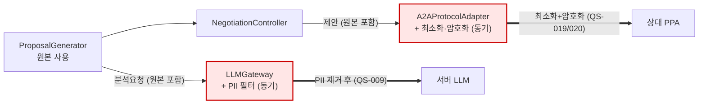
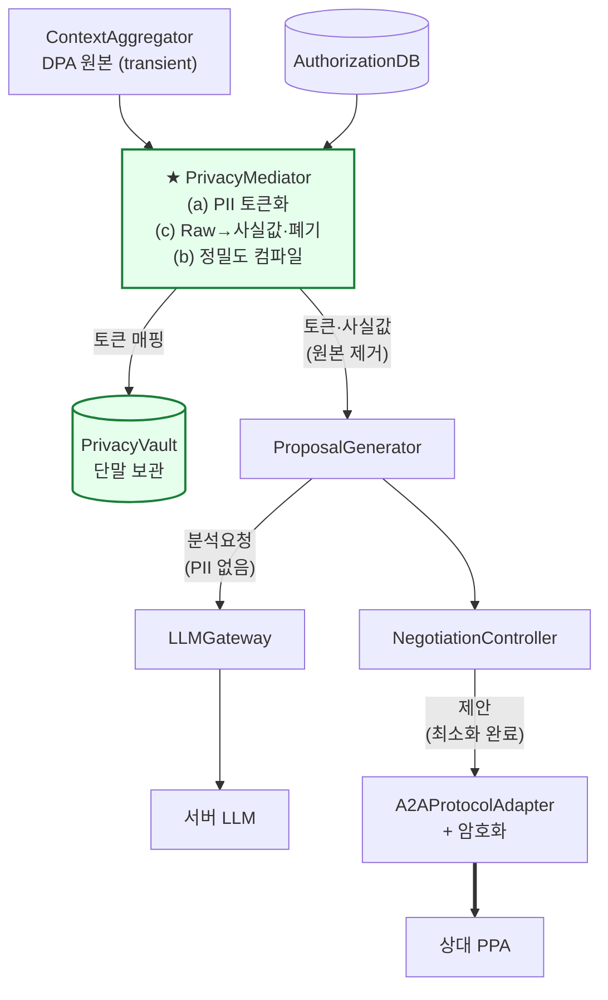
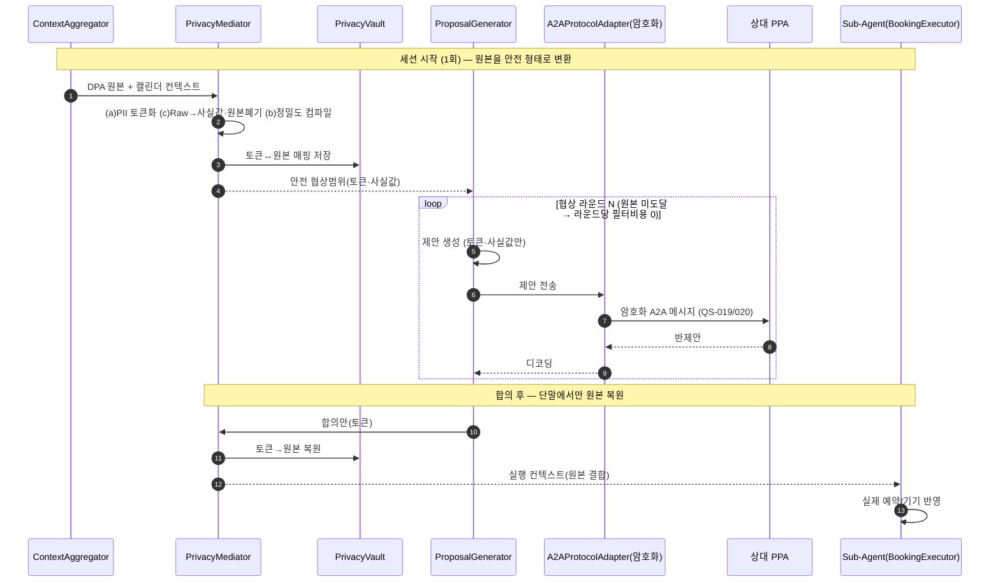
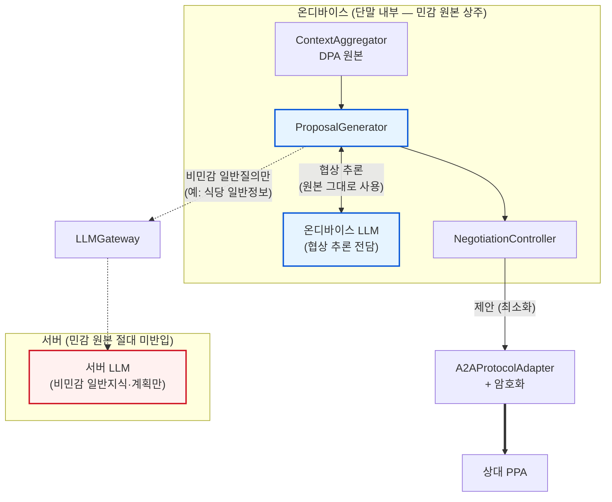

### **DP 06. 협상 시 민감정보 처리 설계**

> 관련 QA/QS: QS-002(협상 완료 시간) · QS-009(서버 LLM PII 전송) · QS-019(제안 내 정보 최소화) · QS-020(A2A 메시지 기밀성) · QS-008(권한 범위 초과 차단), 연계 QS-022(영속 데이터 누적) · QS-016(프로세스 종료 후 복구)
>
> **약어 표기:** PPA = Personal Proxy Agent(개인 대리 에이전트, 메타 에이전트와 동일) · DPA = Device Proxy Agent(가전 탑재) · A2A = Agent-to-Agent(에이전트 간 통신) · LLM = Large Language Model · PII = Personally Identifiable Information(개인식별정보) · IDS = Intent Driven Secretary

#### **1. 풀고자 하는 문제**

자율 협상이 성립하려면 단말은 상대에게 무언가를 말해야 한다. 그런데 그 "무언가"가 곧 사용자의 사생활이다. 협상 조건(가능 시간대·예산 상한·선호 장소)은 그 자체가 개인의 생활 패턴이고, 협상 근거가 되는 DPA(가전) 컨텍스트(세탁 완료 시각·재실 여부)는 더 노골적인 생활 데이터다. 시스템은 사용자의 사적인 데이터가 기기 밖으로 원형 그대로 유출되는 것을 방지하면서, 외부와 협상할 때는 철저히 익명화·추상화된 의도(Intent) 수준의 정보만 교환하여 데이터 주권을 단말 내부에 유지해야 한다.

따라서 풀어야 할 문제는, **민감정보의 0% 유출(QS-009/019/020)과 권한 100% 통제(QS-008)를 보장하면서, 협상 속도(QS-002)를 어떻게 확보할 것인가** 이다. 핵심 통찰은 민감정보를 한 덩어리로 다루지 않고 처리 방식이 근본적으로 다른 세 종류로 분리하는 것이다.

* **(a) 식별정보 (PII):** 이름·전화번호·계정·정확한 주소. 협상에 불필요하므로 **완전히 가린다(토큰화/제거).**
* **(b) 협상 사실값 (Negotiable Fact):** "토요일 저녁 가능", "1인 5만원 이하", "강남 인근". 협상하려면 전달이 필수이므로 **드러내되 정밀도를 낮춰 최소화·추상화한다.**
* **(c) 협상 근거 컨텍스트 (Raw Context):** DPA 원본("19:30 세탁 종료", "21시까지 재실"). 원본은 출구로 나가면 안 되므로 **단말에서 사실값으로 변환 후 폐기한다.**

"익명화"라는 단일 해법으로는 (b)를 다룰 수 없다 — 익명화하면 협상 자체가 불가능해지기 때문이다. (a)는 토큰화, (b)는 정밀도 제어, (c)는 단말 내 변환·폐기라는 서로 다른 메커니즘이 필요하다는 점이 이 설계의 출발점이다.

#### **2. 아키텍처적 난제**

* **출구 다중화 (Multiple Egress Points):** 민감정보가 단말을 떠나는 출구는 세 곳이다 — ① 서버 LLM행(LLMGateway, QS-009), ② 상대 PPA행(A2AProtocolAdapter, QS-019/020), ③ 클라우드 빌드 요청행(Capability Builder, 신규 출구). 어떤 처리 전략을 쓰든 이 세 출구를 우회 불가능하게 통제해야 하며, 속도를 위해 게이트를 건너뛰는 분기를 만들면 0% 보장이 즉시 깨진다.

```
[수집] DPA(가전) ─▶ ContextAggregator ─▶ AggregatedContext (단말 내부, transient)
[추론] AuthorizationDB(권한범위) ─▶ ProposalGenerator
[출구1] ProposalGenerator ─▶ LLMGateway ─▶ 서버 LLM            (QS-009: PII 0%)
[출구2] NegotiationController ─▶ A2AProtocolAdapter ─▶ 상대 PPA   (QS-019/020: 불필요정보 0%·기밀성)
[출구3] Capability 빌드 요청 ─▶ Cloud Builder                    (신규 출구)
```

* **기밀성과 속도의 상충 (Confidentiality ↔ Latency):** 협상 시간은 `T_negotiation ≈ Σ(추론 + 프라이버시 처리 + 네트워크 RTT + 영속화)`로 분해된다. 민감정보 안전화 비용(`T_privacy`)이 매 협상 라운드의 임계 경로(critical path)에 누적되면 협상이 느려진다(QS-002 위반). 따라서 "어디서·언제 안전하게 만드는가"가 기밀성과 속도를 동시에 좌우한다.

* **드러냄과 가림의 경계 (Disclosure Boundary):** 협상 사실값(b)은 가리면 협상이 불가능하고, 그대로 드러내면 사생활이 노출된다. "강남 인근"까지 말할지 "강남역 도보 5분"까지 말할지의 **정밀도(granularity)** 가 노출 수준을 가르며, 이 경계를 누가·어떤 기준으로 정하느냐가 확정적 로직으로 통제되어야 한다.

> 후보 방안을 가르는 핵심 결정축은 **민감정보를 안전하게 만드는 시점(When)·보장 방식(How)·처리 위치(Where)** 이다. 즉 "출구 직전에 거를(filter)" 것인가 "협상 시작 시 한 번에 변환(transform)"할 것인가(When), "위험한 원본을 들고 다니다 나가기 전에 제거"할 것인가 "애초에 원본을 협상 경로에 들이지 않을" 것인가(How), 그리고 "민감 추론을 단말 안에서만 수행"할 것인가(Where). 컴포넌트가 어느 레이어에 놓이는지는 이 전략에서 따라오는 부수 결과로만 다룬다.

#### **3. 해결 방안 1: 출구 제거 전략 (Filter-at-Egress)**

협상 추론은 원본 민감정보를 자유롭게 쓰되, 단말을 떠나는 출구 직전에 동기적으로 제거·최소화한다. 위험한 원본을 들고 있다가 "마지막 문턱에서 거른다". (결정축: When = 출구 직전 / How = 나가기 전 제거. 부수적으로 필터는 출구 게이트인 LLMGateway·A2AProtocolAdapter에 귀속된다.)

* **SW 아키텍처 관점의 핵심 메커니즘:** 이 방식의 본질은 **출구 단일화(Single Egress Choke Point)** 와 **동기 위생 처리(Synchronous Sanitization)** 를 게이트웨이 패턴에 적용한 것이다.
  1. **출구 독점:** 기기 밖으로 나가는 모든 트래픽은 LLMGateway 또는 A2AProtocolAdapter라는 두 게이트를 반드시 통과한다. 게이트를 우회하는 분기는 존재하지 않으므로, 0% 보장의 검증·감사 지점이 단 두 곳으로 자명해진다(QS-015 추적성 유리).
  2. **동기 필터 차단:** 게이트는 매 호출 시 PII 제거(QS-009)·정보 최소화(QS-019)·암호화(QS-020)를 동기적으로 수행하며, 검증을 통과하지 못한 페이로드는 전송 자체가 차단된다. AuthorizationChecker를 게이트 전단에 두어 권한 초과 전송도 차단한다(QS-008).
  3. **원본 보존-말단 제거:** 협상 추론(ProposalGenerator)은 원본을 그대로 사용해 제안 품질 손실이 없다(라운드 수 N 최소화에 유리). 다만 원본이 출구 직전까지 협상 경로 전체에 흐르므로, 0% 보장이 **필터의 신뢰성에 100% 의존**한다는 구조적 약점이 있다.



#### **4. 해결 방안 2: 사전 변환 전략 (Transform-Upfront) — 권고안**

협상 시작 시 원본을 단 한 번 안전한 형태로 변환한다 — PII는 토큰화(a), Raw 컨텍스트는 사실값으로 변환·폐기(c), 협상 사실값은 권한범위에 맞춰 정밀도를 미리 낮춤(b). 이후 협상 추론은 안전 형태만 보고, 원본은 협상 경로에 아예 들어오지 않는다. (결정축: When = 세션 시작 1회 / How = 원본 미도달. 부수적으로 변환을 담당하는 PrivacyMediator와 토큰 매핑 보관소 PrivacyVault가 도입된다.)

* **SW 아키텍처 관점의 핵심 메커니즘:** 이 방식의 본질은 **데이터 토큰화(Tokenization)** 와 **사전 컴파일된 안전 협상범위(Pre-compiled Safe Scope)** 를, 원본이 위험 경로에 도달하지 못하게 하는 **차단 격벽(Bulkhead)** 으로 결합한 것이다.
  1. **세션 1회 변환:** 세션 시작 시 PrivacyMediator가 (a) PII를 토큰으로 치환하고, (c) DPA 원본을 협상에 필요한 사실값으로 변환한 뒤 원본을 폐기하며, (b) AuthorizationDB의 권한범위를 참조해 "노출 가능한 협상 변수 집합"의 정밀도를 사전 컴파일한다. 토큰↔원본 매핑은 PrivacyVault에 단말 내부 보관한다.
  2. **원본 미도달 보장:** ProposalGenerator는 토큰·사실값만 받으므로 원본 PII·Raw 컨텍스트에 접근할 수 없다. 0%를 "필터로 거른다"가 아니라 "원본이 출구 경로에 애초에 존재하지 않는다"로 달성하므로, 필터 버그가 나더라도 새어 나갈 원본 자체가 없다(해결 방안 1보다 구조적으로 강함). 또한 변환이 세션당 1회뿐이라 라운드당 프라이버시 비용이 제거되어 협상이 길어질수록(다라운드·교착) 속도 이득이 커진다(QS-002 유리).
  3. **권한-기밀성 결속 및 합의 후 복원:** 정밀도 컴파일이 권한범위(QS-008)에 결속되어 권한을 초과하는 사실값은 생성 단계에서 차단된다 — 기밀성과 무결성을 한 메커니즘으로 묶는다. 협상이 합의에 도달하면 PrivacyVault가 토큰을 원본으로 복원(de-tokenize)하여, 온디바이스 실행 단계(BookingExecutor 등)에서만 실제 예약·기기 반영에 사용한다.



협상 라운드의 전체 흐름(세션 시작 시 1회 변환 → 라운드 반복 → 합의 후 원본 복원)은 다음과 같다.



#### **5. 해결 방안 3: 온디바이스 추론 격리 전략 (On-device Inference Isolation)**

민감정보를 다루는 협상 추론 자체를 **단말 안의 온디바이스 LLM에 가두고**, 서버 LLM에는 민감 원본이 필요 없는 일반 작업(일반지식 질의, 비민감 계획 등)만 위임한다. 데이터를 가공해서 내보내는 대신, **민감 추론이 일어나는 위치를 단말 밖으로 내보내지 않는다**는 발상이다. (결정축: Where = 추론 위치를 온디바이스로 고정. 부수적으로 LLMGateway가 "민감/비민감 작업 분리 라우팅" 책임을 갖는다.)

* **SW 아키텍처 관점의 핵심 메커니즘:** 이 방식의 본질은 **연산 지역성(Compute Locality)** 과 **작업 분리 라우팅(Workload Partitioning)** 을 결합해, 민감 데이터가 신뢰 경계(단말)를 넘지 않도록 하는 것이다.
  1. **민감 추론의 온디바이스 고정:** 협상 제안 생성·반제안 분석 등 사용자 컨텍스트(가능 시간·예산·DPA 상태)를 입력으로 쓰는 추론은 전부 온디바이스 LLM이 수행한다. 민감 원본은 단말 메모리 안에서만 LLM 입력으로 들어가므로, 출구1(서버 LLM행)을 통한 PII 유출 경로가 **구조적으로 닫힌다**(QS-009를 "거름"이 아니라 "경로 부재"로 달성).
  2. **작업 분리 라우팅:** LLMGateway는 요청을 검사해 민감 컨텍스트가 포함되면 온디바이스 LLM으로, 비민감 일반 작업(예: "이 지역 식당 영업시간 일반정보")만 서버 LLM으로 라우팅한다. 민감/비민감 경계를 게이트가 강제하므로, 개발자가 실수로 민감 데이터를 서버로 보내는 분기를 만들 수 없다.
  3. **상대 PPA행은 별도 보장 필요:** 이 전략은 출구1(서버 LLM)을 닫는 데 특화되며, 출구2(상대 PPA행)의 정보 최소화·암호화(QS-019/020)는 여전히 A2AProtocolAdapter에서 별도로 처리해야 한다. 즉 방안 1·2와 결합되어야 출구2까지 커버된다. 또한 온디바이스 LLM은 서버 LLM보다 추론이 약하고 느려, 협상 품질(라운드 수)과 단말 자원(QS-021 배터리·QS-004 메모리)에 부담을 준다(가설 ⓒ 온디바이스 LLM 실용성 검증과 직결).



> 세 전략은 배타적이지 않다. 해결 방안 3(온디바이스 추론 격리)은 출구1(서버 LLM)을 닫는 데 가장 강력하지만 출구2를 커버하지 못하므로, **방안 2(사전 변환)와 결합**하여 "민감 추론은 단말에 고정 + 상대에게 나가는 정보는 사전 변환"으로 쓰는 것이 이상적이다. 방안 1은 PoC 초기 최소 구현으로 활용한다.

#### **6. Quality Attribute Trade-off 종합 평가**

| 품질 속성 (QA) | 해결 방안 1 (출구 제거) | 해결 방안 2 (사전 변환) | 해결 방안 3 (온디바이스 추론 격리) | 아키텍트의 분석 (Trade-off) |
| :--- | :--- | :--- | :--- | :--- |
| **기밀성 — 서버 LLM PII (QS-009)** | **[○] 게이트 차단** | **[+] 원본 미도달** | **[+] 경로 자체 부재** | 방안 1은 출구를 독점하나 원본을 들고 있다 "늦게 거름"이라 필터 신뢰에 의존한다. 방안 2는 원본이 경로에 없어 강하고, 방안 3은 민감 추론을 단말에 고정해 서버행 경로 자체를 닫으므로 QS-009에 가장 직접적이다. |
| **기밀성 — 제안 정보 최소화 (QS-019)** | **[○] 게이트 최소화** | **[+] 정밀도 사전 컴파일** | **[△] 별도 보장 필요** | 방안 3은 출구1(서버)에 특화되어 출구2(상대 PPA)의 정보 최소화는 커버하지 못한다 → 방안 1·2와 결합 필요. 방안 2는 권한범위 기반 정밀도로 안정적으로 최소화한다. |
| **기밀성 — 메시지 기밀성 (QS-020)** | **[○] 게이트 암호화** | **[○] 게이트 암호화** | **[○] 게이트 암호화** | 전송 구간 암호화는 세 방안 모두 A2AProtocolAdapter에서 공통으로 보장한다. |
| **무결성 — 권한 초과 차단 (QS-008)** | **[○] 게이트 전단 검증** | **[+] 정밀도=권한 결속** | **[○] 게이트 전단 검증** | 방안 2는 권한 초과 사실값을 생성 단계에서 차단해 기밀성·무결성을 한 메커니즘으로 묶는다. 방안 1·3은 게이트에서 별도 검증이 필요하다. |
| **시간 반응성 — 협상 완료 시간 (QS-002)** | **[-] 라운드당 필터 누적** | **[+] 세션 1회 비용** | **[-] 온디바이스 추론 지연** | 방안 1은 매 라운드 동기 필터가 임계 경로에 쌓인다. 방안 2는 세션당 1회라 유리하다. 방안 3은 약한 온디바이스 LLM이 라운드당 추론을 느리게 해 가장 불리할 수 있다. |
| **자원 효율 — 배터리·메모리 (QS-021/QS-004)** | **[○] 영향 적음** | **[○] 영향 적음** | **[-] 온디바이스 LLM 부담** | 방안 3은 무거운 협상 추론을 단말 NPU에서 돌려 배터리·메모리 압박이 크다(가설 ⓒ 실용성과 직결). 방안 1·2는 서버 추론을 병용할 수 있어 부담이 작다. |
| **구현 복잡도 / 운영성** | **[+] 최저** | **[-] 신규 컴포넌트 2개** | **[△] 라우팅 분리** | 방안 1은 기존 게이트만 손대면 된다. 방안 2는 PrivacyMediator·PrivacyVault 도입과 토큰 매핑 보관/복원(QS-022/QS-016)이 필요하다. 방안 3은 민감/비민감 라우팅 분리와 온디바이스 모델 운용이 필요하다. |

* **종합 권고:** **해결 방안 2(사전 변환)를 1차 채택하되, 출구1(서버 LLM)에 한해 해결 방안 3(온디바이스 추론 격리)을 결합**한다. 방안 2는 0%를 "원본 미도달"로 달성하고 정밀도-권한 결속으로 기밀성·무결성을 동시에 처리하며 협상 속도에도 유리하다. 여기에 방안 3을 얹어 민감 협상 추론을 단말에 고정하면 서버행 PII 유출 경로 자체가 닫혀, "데이터 주권을 단말에 둔다"는 PoC 정체성이 가장 강하게 구현된다. 단계적으로는 ① 방안 1로 출발해 0%·추적성을 빠르게 확보하고 → ② `T_privacy`가 병목이거나 원본이 출구 직전까지 흐르는 위험이 부각되면 방안 2로 이행하며 → ③ 가설 ⓒ(온디바이스 LLM 실용성)가 측정으로 뒷받침되면 방안 3을 출구1에 결합하는 전략을 권고한다.

* **미해결 결정 (팀 합의 필요):** ① 정밀도(b) 정책의 주체 — "강남 인근"까지 vs "강남역 도보 5분"까지를 누가 정하나(사용자 설정 UC-019 / 기본정책 / 협상 단계별). ② 토큰 매핑 영속화 — 메모리만 둘지(QS-016 복원 불가 위험) DB 영속화할지(QS-022 누적), 협상 흔적 삭제(UC-023 강제종료)와 연계. ③ 협상 추론 위치 — ProposalGenerator를 온디바이스 LLM에 둘지 서버 LLM에 둘지(방안 3 채택 여부와 직결). 온디바이스로 두면 QS-009는 구조적으로 해결되나 QS-002·QS-021·QS-004 부담이 커지므로, 가설 ⓒ의 실측 성능이 이 결정의 전제가 된다.
