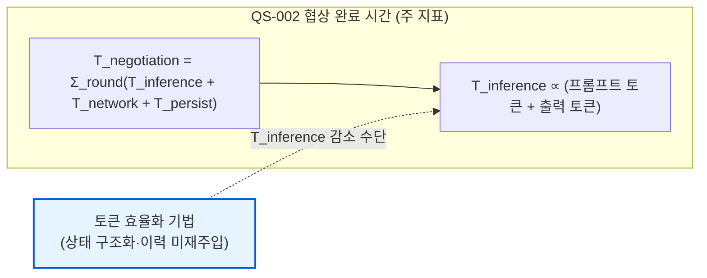
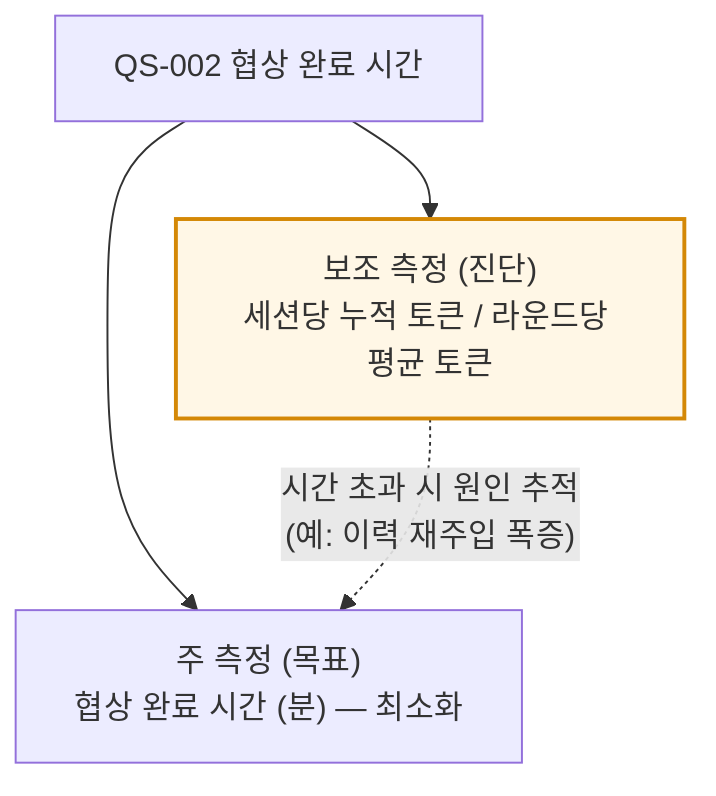
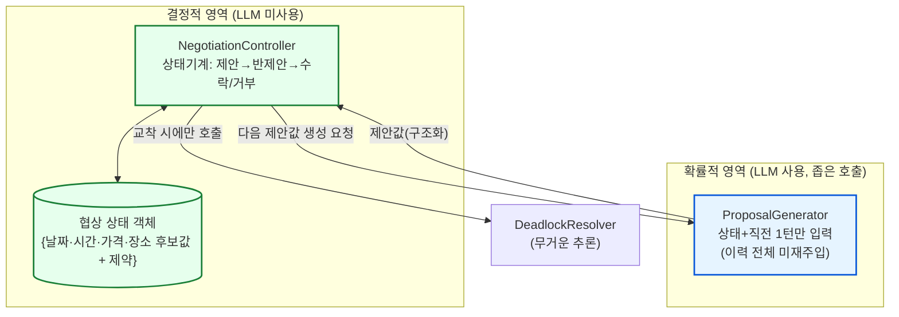

### **DP 08. 협상 토큰 효율화 설계 (QS-002 흡수)**

> 관련 QA/QS: QS-002(협상 완료 시간, 주 대상) · 연계 QS-021(백그라운드 배터리) · QS-004(동시 Agent 메모리) · QS-014(협상 시뮬레이션 재현성) · QS-015(의사결정 추적성)
>
> **약어 표기:** PPA = Personal Proxy Agent(개인 대리 에이전트, 메타 에이전트와 동일) · A2A = Agent-to-Agent(에이전트 간 통신) · LLM = Large Language Model · NPU = Neural Processing Unit(단말 추론 가속기)
>
> **위상:** 본 설계는 독립 품질 시나리오를 신설하지 않고, **토큰 효율화를 QS-002(협상 완료 시간) 안에 흡수**한다. 즉 "토큰을 적게 쓴다"가 목표가 아니라 "토큰을 적게 써서 협상을 빠르게 한다"는 인과로 다룬다. 따라서 아래 세 해결 방안은 서로 다른 설계가 아니라, **토큰 효율화를 QS-002에 흡수하는 세 가지 방식**이며 결합 가능하다.

#### **1. 풀고자 하는 문제**

자율 협상은 다중 라운드로 진행되며, 라운드마다 온디바이스 LLM 추론이 일어난다. 협상 시간은 다음과 같이 분해된다.

```
T_negotiation ≈ Σ_round(T_inference + T_network + T_persist)
              where T_inference ∝ (프롬프트 토큰 + 출력 토큰)
```

문제는 라운드별 프롬프트가 보통 **누적 협상 이력(history)을 통째로 다시 주입**하기 때문에, 라운드가 진행될수록 프롬프트 토큰이 라운드 수에 비례(누적 시 제곱)하여 불어난다는 점이다. 단말 NPU의 제한된 연산 능력에서 토큰이 늘면 추론 시간(`T_inference`)이 직접 늘어나 **협상 완료 시간(QS-002)이 악화**되고, 동시에 배터리(QS-021)·메모리(QS-004) 부담도 커진다.

따라서 풀어야 할 문제는, **협상 품질을 유지하면서 라운드당 토큰 소모를 억제하여 QS-002(협상 완료 시간)를 달성하는가** 이다. 핵심은 토큰을 별도 품질 목표로 세우지 않고 QS-002의 하위 수단으로 흡수하되, 효율화가 설계에 실제로 강제되도록 만드는 것이다.

#### **2. 아키텍처적 난제**

* **이력 재주입에 의한 토큰 폭발 (History Re-injection):** LLM은 상태가 없으므로(stateless) 매 호출 시 협상 맥락을 프롬프트로 다시 넣어야 한다. 맥락을 "그동안 오간 대화 전문"으로 누적하면 라운드 수에 비례해 프롬프트가 커진다. 이것이 협상 토큰 비용의 지배적 원인이다.

* **흐름 판단의 LLM 위임 (Control-Flow Delegation):** 협상의 골격(제안→반제안→수락/거부→교착판정)은 본래 결정적 상태 전이인데, 이를 매 라운드 LLM에게 "지금 무슨 단계인가"까지 묻게 하면 불필요한 토큰을 소모한다. 결정적 제어와 비결정적 추론이 섞이면 토큰뿐 아니라 재현성(QS-014)·추적성(QS-015)도 함께 나빠진다.

* **측정 동일성 vs 진단 가능성 (Metric Identity ↔ Diagnosability):** 토큰을 QS-002에 흡수하면 측정 지표가 "협상 완료 시간" 하나로 단순해져 평가가 깔끔해진다. 그러나 시간이 악화됐을 때 "토큰 폭증이 원인인지"를 사후에 분리해 진단하기 어려워진다. 흡수의 깊이를 어디까지 둘 것인가가 결정 포인트다.

> 후보 방안을 가르는 핵심 결정축은 **토큰 효율화를 QS-002에 흡수하는 깊이** 이다. ① 개념적 흡수(토큰을 시간의 잠재 변수로만 인정), ② 측정적 흡수(보조 지표로 토큰을 진단용으로 유지), ③ 설계적 흡수(효율화 기법을 QS의 응답 요구로 명문화). 세 방식은 배타적이지 않으며 결합 시 상호 보완된다.

#### **3. 해결 방안 1: 개념적 흡수 — 토큰을 시간의 잠재 변수로 명시 (Latent-Variable Absorption)**

QS-002의 협상 시간 분해식에 추론 시간이 토큰 수에 비례한다는 관계(`T_inference ∝ 토큰`)를 명시하여, 토큰 효율화 기법을 전부 **"`T_inference`를 줄이는 수단"** 으로 QS-002 아래에 귀속시킨다. 토큰은 독립 목표가 아니라 시간을 줄이는 지렛대로만 다룬다. (흡수 깊이: 개념적. 측정은 기존 "협상 완료 시간" 하나로 통일하고, 토큰은 설명용 보조 개념으로만 둔다.)

* **SW 아키텍처 관점의 핵심 메커니즘:** 이 방식의 본질은 **품질 지표의 단일화(Single Metric)** 와 **수단-목표 위계(Means-End Hierarchy)** 를 명확히 하는 것이다.
  1. **측정식 명문화:** QS-002 문서에 `T_inference ∝ (프롬프트 토큰 + 출력 토큰)` 관계를 기재하여, 토큰이 시간의 구성 변수임을 공식적으로 인정한다.
  2. **목표 단일화:** 합격/불합격 판정은 오직 협상 완료 시간(분)으로만 내린다. 토큰 자체에는 별도 목표치를 두지 않아 QS 평가가 단순해진다.
  3. **수단 귀속:** 이후 등장하는 모든 토큰 절감 기법(이력 미재주입, 상태 구조화 등)은 "QS-002 달성을 위한 설계 수단"으로 분류되어, 별도 QS 신설 없이 관리된다.



#### **4. 해결 방안 2: 측정적 흡수 — 보조 지표로 토큰 유지 (Sub-metric Absorption)**

QS-002의 주 지표는 "협상 완료 시간"으로 두되, **보조 지표로 "협상 세션당 누적 토큰 소모량"을 함께 기록**한다. 토큰은 합격/불합격 기준이 아니라 시간이 왜 길어졌는지 진단하는 계기판 역할만 한다. (흡수 깊이: 측정적. 주 측정은 시간, 보조 측정은 토큰.)

* **SW 아키텍처 관점의 핵심 메커니즘:** 이 방식의 본질은 **주 지표-진단 지표 분리(Primary vs Diagnostic Metric)** 를 통해 측정 단순성과 원인 추적성을 양립시키는 것이다.
  1. **이중 측정 구조:** 주 측정(목표)은 협상 완료 시간(분), 보조 측정(진단)은 세션당 누적 토큰 및 라운드당 평균 토큰으로 둔다. 합격 판정은 주 측정으로만 한다.
  2. **원인 추적 활용:** 시간이 목표치를 초과하면 보조 지표를 보고 "라운드당 토큰이 폭증 → 이력 재주입이 원인" 식으로 병목 원인을 분리한다. AgentExecutionLogDB에 프롬프트/응답 토큰 수를 기록해 두면 추적성(QS-015)과도 자연스럽게 연계된다.
  3. **PoC 튜닝 지원:** 온디바이스 LLM 성능을 실측·튜닝하는 PoC 단계에서, 토큰 지표는 모델 선택·컨텍스트 관리 전략의 효과를 정량 비교하는 근거가 된다.



#### **5. 해결 방안 3: 설계적 흡수 — 효율화 기법을 QS-002 응답에 명문화 (Design-Requirement Absorption) — 권고안**

QS-002의 응답(Response) 항목에 토큰 효율화 기법을 **설계 요구사항으로 명시**하여, 효율화가 "권장"이 아니라 "QS-002를 만족하기 위해 반드시 구현해야 하는 제약"이 되도록 한다. (흡수 깊이: 설계적. 측정은 시간 하나지만, "그 시간을 달성하려면 이렇게 만들어야 한다"가 QS 안에 못 박힌다.)

* **SW 아키텍처 관점의 핵심 메커니즘:** 이 방식의 본질은 **결정적 제어와 비결정적 추론의 분리(Control/Inference Separation)** 와 **구조화 상태 유지(Structured State, 이력 미재주입)** 를, QS-002의 응답 명세에 설계 제약으로 박는 것이다.
  1. **흐름의 상태기계화:** NegotiationController가 협상 골격(제안→반제안→수락/거부→교착판정)을 결정적 상태기계로 관리한다. LLM은 "이 조건에서 다음 제안값만 생성"하는 좁은 호출에만 쓰여, 흐름 판단에 드는 토큰이 제거된다. 부수적으로 재현성(QS-014)·추적성(QS-015)이 향상된다.
  2. **구조화 상태 유지(이력 미재주입):** 협상 맥락을 자연어 대화 전문이 아니라, 협상의 본질 변수(날짜·시간·가격·장소의 현재 후보값 + 양측 제약)를 담은 작은 구조화 상태 객체로 유지한다. 매 라운드 프롬프트에는 이 상태 + 직전 1턴만 넣어, 라운드당 토큰이 라운드 수에 비례해 늘던 것을 거의 상수로 만든다(토큰 폭발의 지배 원인 제거).
  3. **선택적 무거운 추론:** 단순 수락/거부·범위 내 카운터제안은 결정적 로직으로 처리하고, DeadlockResolver가 실제 교착에 빠졌을 때만 무거운 창의적 추론을 호출한다. "비싼 추론을 꼭 필요할 때만" 호출해 평균 토큰을 낮춘다.



> 세 방식은 배타적이지 않다. **해결 방안 1(개념적 흡수)로 토큰의 위상을 "시간의 수단"으로 정하고, 해결 방안 3(설계적 흡수)으로 효율화 기법을 QS-002 응답에 명문화**하면, 별도 QS 없이도 토큰 효율화가 설계에 강제된다. 해결 방안 2(보조 지표)는 PoC에서 온디바이스 LLM 실측·튜닝이 필요할 때 덧붙인다.

#### **6. Quality Attribute Trade-off 종합 평가**

| 품질 속성 (QA) | 해결 방안 1 (개념적 흡수) | 해결 방안 2 (측정적 흡수) | 해결 방안 3 (설계적 흡수) | 아키텍트의 분석 (Trade-off) |
| :--- | :--- | :--- | :--- | :--- |
| **시간 반응성 — 협상 완료 시간 (QS-002)** | **[○] 위상만 정의** | **[○] 진단 지원** | **[+] 효율화 강제** | 방안 1·2는 토큰의 위상·진단을 다룰 뿐 효율화를 강제하진 못한다. 방안 3은 이력 미재주입·상태기계화를 설계 제약으로 박아 `T_inference`를 실제로 줄인다. |
| **측정 단순성 (평가 용이성)** | **[+] 지표 단일** | **[-] 이중 지표** | **[+] 지표 단일** | 방안 1·3은 합격 판정을 시간 하나로 하여 평가가 깔끔하다. 방안 2는 보조 지표가 추가되어 평가가 다소 복잡해진다. |
| **진단 가능성 (병목 원인 추적)** | **[-] 사후 추적 곤란** | **[+] 토큰으로 원인 분리** | **[○] 구조로 원인 국소화** | 방안 2는 토큰 지표로 시간 악화 원인을 직접 분리한다. 방안 1은 토큰을 안 재므로 사후 추적이 어렵다. 방안 3은 결정적/확률적 분리 덕에 원인 위치가 좁혀진다. |
| **자원 효율 — 배터리·메모리 (QS-021/QS-004)** | **[○] 간접** | **[○] 간접** | **[+] 직접 절감** | 방안 3의 토큰 절감은 NPU 연산량을 직접 줄여 배터리·메모리 부담을 낮춘다. 방안 1·2는 측정·위상 차원이라 자원에 직접 작용하지 않는다. |
| **재현성·추적성 (QS-014/QS-015)** | **[○] 영향 없음** | **[+] 토큰 로그 연계** | **[+] 결정적 흐름** | 방안 3은 흐름을 결정적 상태기계로 빼내 재현성·추적성이 향상된다. 방안 2는 토큰 로그가 추적성에 보탬이 된다. |
| **구현 복잡도 / 운영성** | **[+] 최저(문서 명시)** | **[○] 로깅 추가** | **[-] 상태기계·상태객체 설계** | 방안 1은 측정식 기재만으로 끝나 가장 가볍다. 방안 2는 토큰 로깅을 추가하면 된다. 방안 3은 상태기계·구조화 상태 객체 설계가 필요해 구현 부담이 가장 크다. |

* **종합 권고:** **해결 방안 3(설계적 흡수)을 1차 채택하고, 해결 방안 1(개념적 흡수)을 전제로 깐다.** 방안 1로 "토큰은 QS-002를 달성하는 수단"이라는 위상을 공식화하고, 방안 3으로 이력 미재주입·흐름 상태기계화·선택적 무거운 추론을 QS-002의 응답 요구로 명문화하면, 별도 QS를 만들지 않고도 토큰 효율화가 설계에 강제된다. 이는 `T_inference`를 직접 줄여 협상 속도(QS-002)와 자원(QS-021/QS-004)을 동시에 개선하고, 결정적 흐름 분리로 재현성·추적성(QS-014/QS-015)까지 보완한다. 해결 방안 2(보조 지표)는 PoC에서 온디바이스 LLM 성능을 실측·튜닝할 계획이 있을 때 결합한다.

* **미해결 결정 (팀 합의 필요):** ① 토큰을 측정 지표로 남길지 여부 — 남기면(방안 2) 진단력은 좋아지나 QS-002가 두 지표를 갖게 되어 평가가 복잡해지고, 안 남기면(방안 1·3) QS는 깔끔하나 토큰 폭증을 사후에 잡기 어렵다. PoC의 온디바이스 LLM 튜닝 계획 유무가 결정 기준. ② 구조화 상태 객체의 스키마 주체 — 협상 상태 변수 집합을 도메인마다 고정 스키마로 둘지, 협상 도메인 추가(QS-011) 시 확장 가능하게 둘지. ③ A2A 메시지 포맷 연계 — 단말 내부 구조화 상태를 상대 PPA와의 A2A 메시지에도 구조화 포맷으로 확장할지(토큰·QS-019 추가 이득) vs 자연어 레거시 상대와의 상호운용성 유지 사이의 절충.
