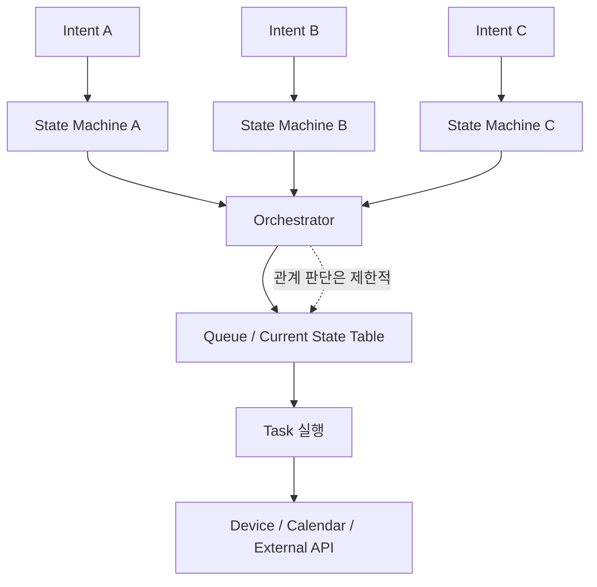
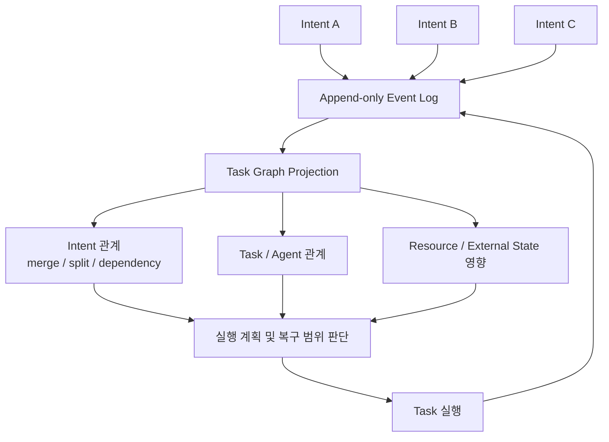

# Intent 실행 흐름의 상태 모델링 및 변경·복구 범위 관리 방식

## 문제 인식

On-device Orchestrator는 Intent를 단순한 요청 단위로만 처리하는 것이 아니라, 실행 전후의 상태와 책임 범위를 지속적으로 추적해야 합니다.
Intent는 사용자 발화, 센서 이벤트, 예약된 작업, device 상태 변화, 외부 Agent 요청 등 다양한 경로에서 발생하며, 단독으로 처리될 수도 있고 기존 Intent와 병합·대체·충돌·종속 관계를 가질 수도 있습니다.
또한 Intent 실행 과정에서는 device 제어, 캘린더 수정, 외부 예약 API 호출처럼 외부 상태를 변경하는 실행이 발생할 수 있습니다.
이런 실행이 이미 일부 수행된 뒤 Intent가 실패하거나 취소되거나 다른 Intent에 의해 변경되면, 시스템은 현재 상태가 어디까지 유효한지, 어떤 실행을 유지하거나 되돌려야 하는지 판단해야 합니다.
단순한 요청 큐나 현재 실행 중인 Task 목록만으로는 Intent 간 관계, 실행 이력, 변경 가능 범위, 복구 책임을 충분히 표현하기 어렵습니다.
따라서 Intent 처리 구조에는 각 Intent의 현재 상태뿐 아니라, Intent 간 관계와 실행 결과의 반영 범위를 함께 관리할 수 있는 상태 모델이 필요합니다.

## Decision 포인트

다중 Intent를 처리할 때는 단순히 “현재 어떤 Intent가 실행 중인가”만 알면 부족합니다.
동시에 들어온 Intent가 서로 병합되거나, 하나의 Intent가 여러 Task로 분해되거나, 실행 중인 Task가 새 Intent에 의해 중단될 수 있기 때문입니다.
또한 어떤 Intent는 이미 device 제어, 캘린더 수정, 외부 예약 API 호출처럼 **외부 상태를 변경하는 실행**을 수행한 뒤 실패할 수 있으므로, 실패 시 어디까지 되돌릴 수 있는지도 상태 모델에 포함되어야 합니다.
따라서 이 decision point의 핵심은 **현재 상태를 단순하고 빠르게 관리할 것인지**, 아니면 **Intent 간 관계와 변경 이력을 풍부하게 남겨 복구와 정합성을 강화할 것인지**입니다.
이 선택은 성능 효율성, 보안성, 기능적합성, 신뢰성에 직접적인 영향을 줍니다.

|  | 1안. **Intent 단위 State Machine** | 2안. **Event Log 기반 Task Graph** |
|---|---|---|
| 설명 | 각 Intent가 독립적인 상태값을 가지며, `received → classified → queued/running → completed/failed/canceled` 같은 명시적 상태 전이를 따릅니다. | Intent, Task, Agent, Resource 간 관계를 graph로 표현하고, 모든 상태 변화와 의사결정을 event log로 기록합니다. |
| QA 종합 평가 | 단순하고 가볍기 때문에 성능 효율성과 보안성에 유리하지만, 복잡한 merge/split 및 rollback 표현에는 약합니다. | Intent 간 관계와 이력을 풍부하게 남길 수 있어 기능적합성과 신뢰성에 유리하지만, 성능 비용과 민감 정보 관리 부담이 큽니다. |
| 성능 효율성 | ★★★ | ★☆☆ |
| 보안성 | ★★★ | ★☆☆ |
| 기능적합성 | ★☆☆ | ★★★ |
| 신뢰성 | ★★☆ | ★★★ |

종합하면, **Intent 단위 State Machine**은 성능 효율성과 보안성을 우선하는 단순한 상태 관리 방식입니다.
반면 **Event Log 기반 Task Graph**는 기능적합성과 신뢰성을 우선하는 방식으로, 복잡한 다중 Intent 관계와 장애 복구를 더 정확하게 다룰 수 있지만 상태 관리 비용과 민감 정보 관리 부담이 커집니다.

## 대안 구조 비교

### 1안. Intent 단위 State Machine

1안은 Intent별 현재 상태를 빠르게 조회하고 전이시키는 데 초점을 둡니다.
각 Intent의 상태는 단순하지만, Intent 간 병합·분기·종속 관계나 실행 이력은 별도 구조가 없으면 표현하기 어렵습니다.

### 2안. Event Log 기반 Task Graph

2안은 Intent, Task, Agent, Resource의 관계와 상태 변경 이력을 함께 남기는 데 초점을 둡니다.
현재 상태 조회와 저장 비용은 커지지만, 병합·분기·중단·복구 범위를 더 정확하게 판단할 수 있습니다.

