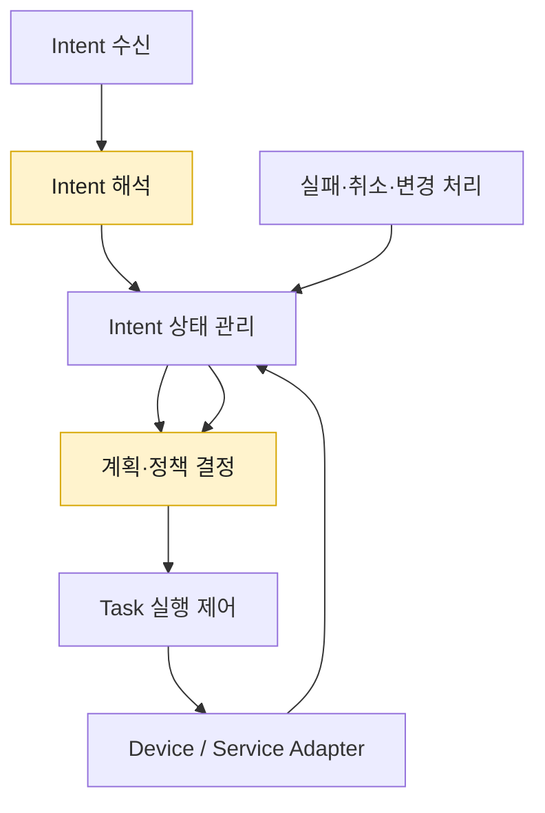
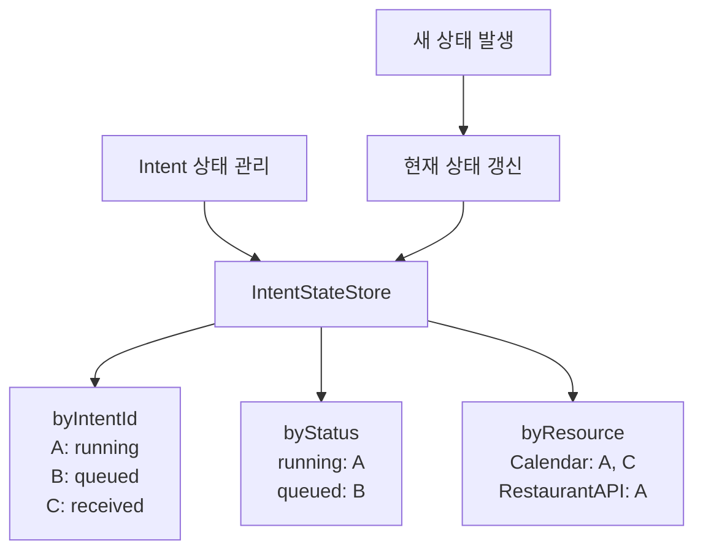
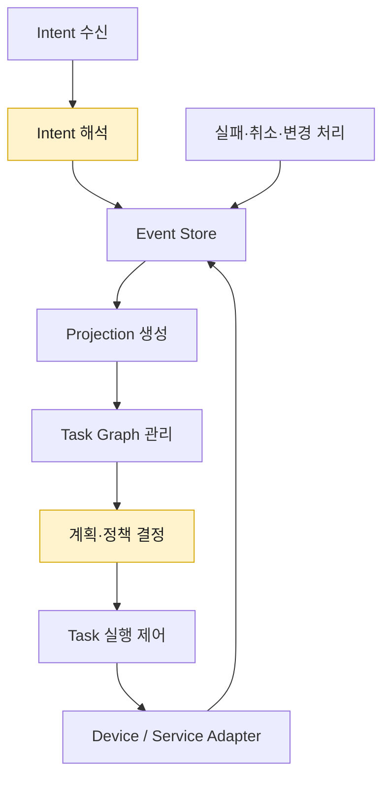
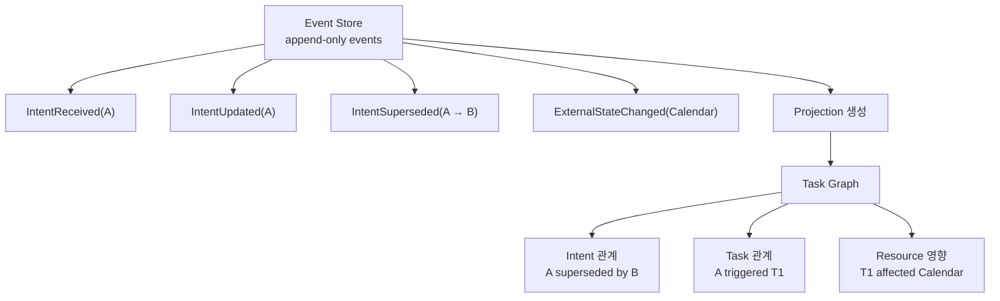

# Intent 실행 흐름의 상태 모델링 및 변경·복구 범위 관리 방식

## 문제 인식

On-device Orchestrator는 Intent를 단순한 요청 단위로만 처리하는 것이 아니라, 실행 전후의 상태와 책임 범위를 지속적으로 추적해야 합니다.
Intent는 사용자 발화, 센서 이벤트, 예약된 작업, device 상태 변화, 외부 Agent 요청 등 다양한 경로에서 발생하며, 단독으로 처리될 수도 있고 기존 Intent와 병합·대체·충돌·종속 관계를 가질 수도 있습니다.
또한 Intent 실행 과정에서는 device 제어, 캘린더 수정, 외부 예약 API 호출처럼 외부 상태를 변경하는 실행이 발생할 수 있습니다.
이런 실행이 이미 일부 수행된 뒤 Intent가 실패하거나 취소되거나 다른 Intent에 의해 변경되면, 시스템은 현재 상태가 어디까지 유효한지, 어떤 실행을 유지하거나 되돌려야 하는지 판단해야 합니다.
단순한 요청 큐나 현재 실행 중인 Task 목록만으로는 Intent 간 관계, 실행 이력, 변경 가능 범위, 복구 책임을 충분히 표현하기 어렵습니다.
따라서 Intent 처리 구조에는 각 Intent의 현재 상태뿐 아니라, Intent 간 관계와 실행 결과의 반영 범위를 함께 관리할 수 있는 상태 모델이 필요합니다.

## Decision 포인트

다중 Intent를 처리할 때는 단순히 “현재 어떤 Intent가 실행 중인가”만 알면 부족합니다.
동시에 들어온 Intent가 서로 병합되거나, 기존 Intent를 대체하거나, 실행 중인 Task가 새 Intent에 의해 중단될 수 있기 때문입니다.
또한 어떤 Intent는 이미 device 제어, 캘린더 수정, 외부 예약 API 호출처럼 **외부 상태를 변경하는 실행**을 수행한 뒤 실패할 수 있으므로, 실패 시 어디까지 되돌릴 수 있는지도 상태 모델에 포함되어야 합니다.
따라서 이 decision point의 핵심은 **현재 상태를 단순하고 빠르게 관리할 것인지**, 아니면 **Intent 간 관계와 변경 이력을 풍부하게 남겨 복구와 정합성을 강화할 것인지**입니다.
이 선택은 성능 효율성, 보안성, 기능적합성, 신뢰성에 직접적인 영향을 줍니다.

|  | 1안. **Intent 단위 State Machine** | 2안. **Event Log 기반 Task Graph** |
|---|---|---|
| 설명 | 각 Intent가 독립적인 상태값을 가지며, `received → classified → queued/running → completed/failed/canceled` 같은 명시적 상태 전이를 따릅니다. | Intent, Task, Agent, Resource 간 관계를 graph로 표현하고, 모든 상태 변화와 의사결정을 event log로 기록합니다. |
| QA 종합 평가 | 단순하고 가볍기 때문에 성능 효율성과 보안성에 유리하지만, 복잡한 merge/replace/conflict 및 rollback 표현에는 약합니다. | Intent 간 관계와 이력을 풍부하게 남길 수 있어 기능적합성과 신뢰성에 유리하지만, 성능 비용과 민감 정보 관리 부담이 큽니다. |
| 성능 효율성 | ★★★ | ★☆☆ |
| 보안성 | ★★★ | ★☆☆ |
| 기능적합성 | ★☆☆ | ★★★ |
| 신뢰성 | ★★☆ | ★★★ |

종합하면, **Intent 단위 State Machine**은 성능 효율성과 보안성을 우선하는 단순한 상태 관리 방식입니다.
반면 **Event Log 기반 Task Graph**는 기능적합성과 신뢰성을 우선하는 방식으로, 복잡한 다중 Intent 관계와 장애 복구를 더 정확하게 다룰 수 있지만 상태 관리 비용과 민감 정보 관리 부담이 커집니다.

## 대안 구조 비교

다이어그램에서 연한 노란색 노드는 LLM 기반 의미 해석 또는 계획 후보 판단이 필요한 지점입니다.
Projection은 LLM이 아니라 Event Log를 정해진 규칙으로 읽어 현재 graph를 재구성하는 deterministic 과정으로 둡니다.
두 대안 모두 Intent 해석과 실행 계획 후보 판단에 LLM을 사용할 수 있으며, 차이는 LLM이 참고하는 상태 컨텍스트가 현재 상태 Store인지, Event Log에서 재구성된 Task Graph인지에 있습니다.

### 1안. Intent 단위 State Machine

1안은 Intent별 현재 상태를 빠르게 조회하고 전이시키는 데 초점을 둡니다.
각 Intent의 상태는 단순하지만, Intent 간 병합·대체·충돌·종속 관계나 실행 이력은 별도 구조가 없으면 표현하기 어렵습니다.

#### 상태 저장 방식: 현재 상태 Store

이 흐름에서는 `Intent 수신`이 사용자, 센서, 예약, 외부 Agent로부터 Intent를 받습니다.
`Intent 해석`은 Intent 의미와 관계 후보를 해석하고, `Intent 상태 관리`는 Intent별 현재 상태와 `priority`, `supersedes`, `blocked-by` 같은 단순 metadata를 관리합니다.
`계획·정책 결정`은 현재 상태 Store를 바탕으로 실행 계획 후보를 만들고, policy 검증을 거쳐 실행할지, 대기시킬지, 완료/실패/취소 처리할지를 확정합니다.
`Task 실행 제어`는 확정된 Task 실행을 제어하고, `Device / Service Adapter`를 통해 device, calendar, external API 같은 외부 상태를 변경합니다.
실패, 취소, 변경이 발생하면 `실패·취소·변경 처리`가 이를 상태 변경으로 반영하고, 시스템은 주로 현재 상태값을 기준으로 유지, 재시도, 취소 여부를 판단합니다.
즉 1안의 핵심 데이터 구조는 `IntentStateStore`이며, 여러 Intent의 현재 상태를 `byIntentId`, `byStatus`, `byResource` 같은 index로 빠르게 조회하는 방식입니다.
따라서 빠르고 단순하지만, 하나의 사용자 목표가 여러 하위 Intent/Task로 분해되거나, 여러 Intent가 하나의 Task로 병합되거나, 변경·취소 시 과거 실행 결과를 기준으로 유지/취소 범위를 판단해야 하는 경우에는 판단 근거가 부족할 수 있습니다.

### 2안. Event Log 기반 Task Graph

2안은 Intent, Task, Agent, Resource의 관계와 상태 변경 이력을 함께 남기는 데 초점을 둡니다.
현재 상태 조회와 저장 비용은 커지지만, 병합·대체·중단·복구 범위를 더 정확하게 판단할 수 있습니다.

참고: [Event Log, Projection, Task Graph 설명](참고자료/DP11-Event%20Log%20Projection%20Task%20Graph%20설명.md)

#### 상태 생성 방식: Event Log에서 Graph Projection

이 흐름에서는 `Intent 수신`이 받은 raw Intent를 `Intent 해석`이 구조화된 event 후보로 변환하고, 이후 변경, 취소, 실행 결과가 모두 `Event Store`에 append-only event로 기록됩니다.
`Projection 생성`은 Event Store를 deterministic하게 읽어 현재 graph view를 만들고, `Task Graph 관리`는 Intent/Task/Agent/Resource 관계, 실행 이력, 외부 상태 영향을 관리합니다.
`계획·정책 결정`은 Task Graph를 바탕으로 실행 계획 후보를 만들고, graph의 기계적 제약과 policy 검증을 거쳐 최종 실행 계획과 복구 범위를 확정합니다.
`Task 실행 제어`는 확정된 실행을 수행하고, `Device / Service Adapter`를 통한 외부 상태 변경 결과는 다시 Event Store에 기록됩니다.
실패, 취소, 변경이 발생하면 `실패·취소·변경 처리`가 이를 event로 기록하여, 이후 Projection과 Task Graph가 동일한 이력을 기준으로 재구성될 수 있게 합니다.
즉 2안의 핵심 데이터 구조는 `Event Store`와 `Task Graph`이며, 현재 상태를 직접 덮어써서 보관하기보다 사건 이력을 replay하여 판단 가능한 graph view를 생성하는 방식입니다.
따라서 비용은 커지지만, 어떤 Intent가 어떤 실행을 유발했는지와 어디까지 되돌리거나 유지해야 하는지를 더 명확하게 판단할 수 있습니다.

## 참고 시나리오

### Intent 병합·대체와 외부 상태 반영 범위가 함께 얽히는 경우

예를 들면 다음과 같은 상황을 가정할 수 있습니다.

1. 사용자가 “토요일 저녁 식사 예약해줘”라고 말합니다.
2. 이후 배우자가 “아이도 갈 수 있는 곳이면 좋겠어”라고 추가 조건을 줍니다.
3. IDS가 캘린더를 보고 “토요일 저녁에는 일정 충돌이 있음”을 감지합니다.
4. 사용자가 다시 “그럼 일요일 점심으로 바꿔”라고 변경합니다.
5. 시스템은 기존 식당 후보 검색, 일부 예약 hold, 캘린더 임시 블록을 이미 수행했습니다.

여기서 여러 Intent는 단순히 따로따로 처리되는 것이 아닙니다.

- “아이 동반 가능” 조건은 기존 식사 예약 Intent에 병합됩니다.
- “일요일 점심으로 변경”은 기존 시간 조건을 대체합니다.
- “일정 충돌 감지”는 기존 예약 진행을 차단합니다.
- “예약 hold”와 “캘린더 임시 블록”은 이미 외부 상태에 일부 반영되어 있습니다.

이 경우 시스템은 현재 상태가 `running`인지 `failed`인지 정도만 알아서는 부족합니다.
“어떤 Intent가 어떤 조건을 추가했는지”, “어떤 실행이 그 조건 때문에 발생했는지”, “변경 후 어떤 실행을 유지하고 어떤 실행을 취소해야 하는지”를 따라가야 합니다.
