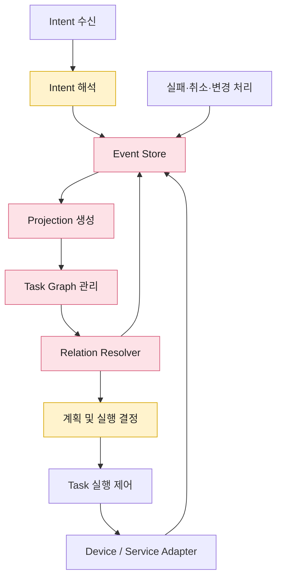
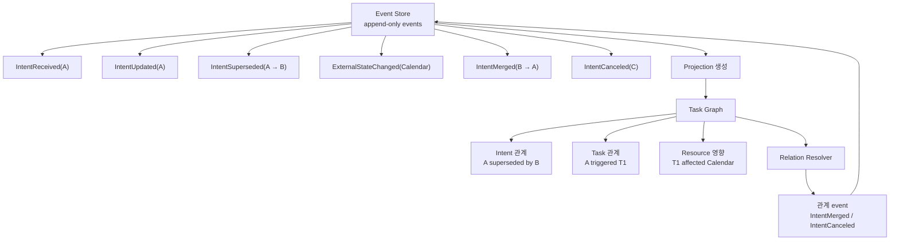
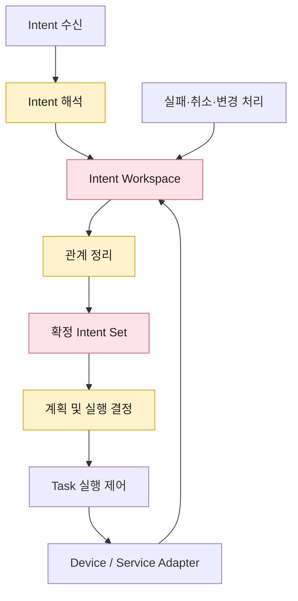
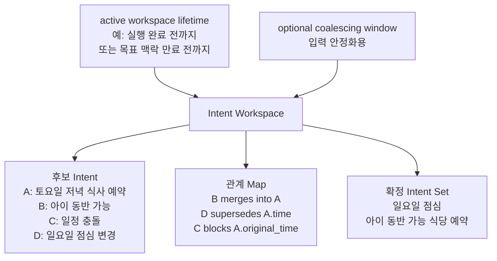

# Intent 실행 흐름의 상태 모델링 및 변경·복구 범위 관리 방식

## 문제 인식

Orchestrator는 Intent를 단순한 요청 단위로만 처리하는 것이 아니라, 실행 전후의 상태와 책임 범위를 지속적으로 추적해야 합니다.
Intent는 사용자 발화, 센서 이벤트, 예약된 작업, device 상태 변화, 외부 Agent 요청 등 다양한 경로에서 발생하며, 단독으로 처리될 수도 있고 기존 Intent와 병합·대체·충돌·종속 관계를 가질 수도 있습니다.
또한 Intent 실행 과정에서는 device 제어, 캘린더 수정, 외부 예약 API 호출처럼 외부 상태를 변경하는 실행이 발생할 수 있습니다.
이런 실행이 이미 일부 수행된 뒤 Intent가 실패하거나 취소되거나 다른 Intent에 의해 변경되면, 시스템은 현재 상태가 어디까지 유효한지, 어떤 실행을 유지하거나 되돌려야 하는지 판단해야 합니다.

단순한 요청 큐나 현재 실행 중인 Task 목록만으로는 다음을 충분히 표현하기 어렵습니다.

- 어떤 Intent가 어떤 Intent에 병합되었는지
- 어떤 Intent가 기존 Intent를 대체하거나 차단했는지
- 어떤 Task가 어떤 Intent 조건 때문에 실행되었는지
- 어떤 외부 상태 변경이 이미 발생했고, 실패·취소·변경 시 어디까지 보상해야 하는지

따라서 Intent 처리 구조에는 각 Intent의 현재 상태뿐 아니라, Intent 간 관계와 실행 결과의 반영 범위를 함께 관리할 수 있는 상태 모델이 필요합니다.

## Decision 포인트

다중 Intent를 처리할 때는 단순히 “현재 어떤 Intent가 실행 중인가”만 알면 부족합니다.
동시에 들어온 Intent가 서로 병합되거나, 기존 Intent를 대체하거나, 실행 중인 Task가 새 Intent에 의해 중단될 수 있기 때문입니다.
또한 어떤 Intent는 이미 device 제어, 캘린더 수정, 외부 예약 API 호출처럼 **외부 상태를 변경하는 실행**을 수행한 뒤 실패할 수 있으므로, 실패 시 어디까지 되돌릴 수 있는지도 상태 모델에 포함되어야 합니다.

이 decision point의 핵심은 다음 두 요구 중 어디에 더 무게를 둘 것인지입니다.

- **실행 이력과 외부 상태 변경까지 추적해 복구 정합성을 강화할 것인가**
- **같은 목표 맥락에서 이어지는 Intent들을 빠르게 정리해 병합·대체·취소 UX를 강화할 것인가**

두 방식은 모두 다중 Intent 처리에 적합하지만, 강점의 위치가 다릅니다.
Event Log 기반 Task Graph는 실행 이후의 원인 추적과 복구 판단에 강하고, Intent Workspace 기반 관계 정리는 active goal/session 안에서 이어지는 Intent들의 병합·취소·대체 결정에 강합니다.

|  | 1안. **Event Log 기반 Task Graph** | 2안. **Intent Workspace 기반 관계 정리** |
|---|---|---|
| 설명 | Intent, Task, Agent, Resource 간 관계를 graph로 표현하고, 주요 상태 변화와 실행 결과를 event log로 기록합니다. | 같은 목표 맥락의 Intent들을 active Workspace에서 관리하며 병합, 대체, 차단, 취소, 병렬 실행 여부를 정리합니다. |
| QA 종합 평가 | Intent 간 관계와 이력을 풍부하게 남길 수 있어 기능적합성과 신뢰성에 유리하지만, 성능 비용과 민감 정보 관리 부담이 큽니다. | active goal/session 안의 Intent 관계 정리에 강하고 1안보다 가볍지만, 이력 기반 복구와 과거 실행 원인 추적은 별도 보완이 필요합니다. |
| 성능 효율성 | ★☆☆ | ★★☆ |
| 보안성 | ★☆☆ | ★★☆ |
| 기능적합성 | ★★★ | ★★★ |
| 신뢰성 | ★★★ | ★★☆ |

종합하면, **Event Log 기반 Task Graph**는 기능적합성과 신뢰성을 우선하는 방식으로, 복잡한 다중 Intent 관계와 장애 복구를 더 정확하게 다룰 수 있지만 상태 관리 비용과 민감 정보 관리 부담이 커집니다.
**Intent Workspace 기반 관계 정리**는 같은 목표 맥락에서 이어지는 Intent를 빠르게 병합·대체·취소하는 UX 중심 처리에 강하며, Event Log 기반 Task Graph보다 가볍지만 실행 이력 기반 복구 판단은 약합니다.

두 안은 우열이 명확하지 않습니다.
외부 상태 변경이 많고 감사 가능성, 장애 복구, 원인 추적이 중요하면 1안이 더 적합합니다.
반대로 사용자 발화, 센서 이벤트, 외부 Agent 요청이 하나의 목표 맥락 안에서 이어지고 이를 자연스럽게 병합·취소·대체하는 것이 핵심 UX라면 2안이 더 적합합니다.

## 대안 구조 비교

### 1안. Event Log 기반 Task Graph

1안은 Intent, Task, Agent, Resource의 관계와 상태 변경 이력을 함께 남기고, 그 이력을 바탕으로 Intent 간 병합·대체·차단·취소 관계를 확정하는 데 초점을 둡니다.
현재 상태 조회와 저장 비용은 커지지만, relation resolver와 relation event schema를 명확히 설계하면 병합·대체·중단·복구 범위를 더 정확하게 판단할 수 있습니다.

참고: [Event Log, Projection, Task Graph 설명](참고자료/DP11-Event%20Log%20Projection%20Task%20Graph%20설명.md)

#### 상태 생성 방식: Event Log에서 Graph Projection

이 흐름에서는 `Intent 수신`이 받은 raw Intent를 `Intent 해석`이 구조화된 event 후보로 변환하고, 이후 변경, 취소, 실행 결과가 모두 `Event Store`에 append-only event로 기록됩니다.
`Projection 생성`은 Event Store를 deterministic하게 읽어 현재 graph view를 만들고, `Task Graph 관리`는 Intent/Task/Agent/Resource 관계, 실행 이력, 외부 상태 영향을 관리합니다.
`Relation Resolver`는 Task Graph와 correlation key, 충돌 정책을 바탕으로 Intent 간 병합, 대체, 차단, 취소 관계를 확정하고, 그 결과를 `IntentMerged`, `IntentSuperseded`, `IntentCanceled` 같은 relation event로 다시 Event Store에 기록합니다.
`계획 및 실행 결정`은 relation event까지 반영된 Task Graph를 바탕으로 실행 계획을 만들고, 실행할지, 대기시킬지, 취소할지, 복구 범위를 어떻게 잡을지를 확정합니다.
`Task 실행 제어`는 확정된 실행을 수행하고, `Device / Service Adapter`를 통한 외부 상태 변경 결과는 다시 Event Store에 기록됩니다.
실패, 취소, 변경이 발생하면 `실패·취소·변경 처리`가 이를 event로 기록하여, 이후 Projection과 Task Graph가 동일한 이력을 기준으로 재구성될 수 있게 합니다.

즉 1안의 핵심 데이터 구조는 `Event Store`, `Task Graph`, relation event schema이며, 핵심 처리 컴포넌트는 `Relation Resolver`입니다.
Event Log는 판단 근거를 남기고, Projection은 판단 가능한 graph view를 재구성하며, Relation Resolver는 그 view를 기준으로 병합·취소 관계를 확정합니다.
따라서 비용은 커지지만, 어떤 Intent가 어떤 실행을 유발했는지와 어디까지 되돌리거나 유지해야 하는지를 더 명확하게 판단할 수 있습니다.

### 2안. Intent Workspace 기반 관계 정리

2안은 같은 목표 맥락에 속한 Intent를 하나의 active `Intent Workspace`에서 관리하고, 새 Intent가 들어올 때마다 기존 Intent와의 관계를 다시 정리하는 방식입니다.
`Intent Workspace`는 단순한 짧은 임시 버퍼가 아니라, 실행 중이거나 아직 목표 맥락이 살아 있는 Intent 후보와 확정 Intent Set을 함께 관리하는 작업 공간입니다.
여기서 병합, 대체, 차단, 취소, 병렬 실행 여부를 판단합니다.
정리 결과는 `확정 Intent Set`으로 만들어지고, 이후 실행 단계는 이 확정 상태를 기준으로 진행합니다.
이 방식은 Event Log 기반의 완전한 이력 재구성보다는 가볍지만, 단순한 실행 큐보다 후속 Intent 관계 처리에 강합니다.

#### 상태 정리 방식: Workspace에서 확정 Intent Set 구성

이 흐름에서는 `Intent 수신`이 IDS로부터 들어오는 Intent들을 받습니다.
`Intent 해석`은 각 Intent의 의미와 관계 후보를 해석하고, `Intent Workspace`는 같은 목표 맥락에 속한 Intent들을 active workspace lifetime 동안 유지합니다.
`관계 정리`는 Workspace 안의 Intent들을 비교하여 병합할지, 기존 Intent를 대체할지, 특정 Intent를 차단할지, 병렬 실행할지를 판단합니다.
그 결과 실행 기준이 되는 `확정 Intent Set`이 만들어지고, `계획 및 실행 결정`은 이 확정 상태를 기준으로 실행 계획을 확정합니다.
실패, 취소, 변경이 발생하면 `Intent Workspace`가 현재 활성 상태를 다시 정리하여 후속 실행 여부를 판단합니다.
필요한 경우에는 실행 시작 전 아주 짧은 입력 안정화용 coalescing window를 둘 수 있지만, 이는 Workspace 방식의 핵심이 아니라 선택적 debounce 장치입니다.

## 동시 Intent 병합·취소 처리

### 1안. Event Log 기반 Task Graph에서의 처리

1안도 동시 Intent 병합·취소 처리가 가능합니다.
다만 Event Log만으로 병합·취소가 자동으로 해결되는 것은 아니며, 동시 유입된 Intent들을 같은 목표 또는 같은 resource scope로 묶어 관계를 확정하는 `relation resolver`가 필요합니다.

처리 흐름은 다음과 같습니다.

1. 동시에 들어온 Intent를 모두 `IntentReceived` event로 append합니다.
2. `goalKey`, `conversationId`, `userScope`, `resourceId`, `timeWindow` 같은 correlation key로 관련 Intent 후보를 묶습니다.
3. relation resolver가 후보들을 비교해 병합, 대체, 차단, 취소, 병렬 실행 여부를 결정합니다.
4. 결정 결과를 relation event로 다시 append합니다.
5. Projection이 relation event를 replay하여 현재 유효한 Intent Set, 중단 대상 Task, 보상 대상 외부 effect를 계산합니다.
6. Task 실행 제어가 계산된 결과를 바탕으로 신규 실행, 중단 요청, 보상 실행을 수행합니다.

이때 다음과 같은 event와 projection 규칙이 명시되어야 합니다.

- `IntentMerged(sourceIntentId, targetIntentId, mergedFields)`
- `IntentSuperseded(oldIntentId, newIntentId, supersededScope)`
- `IntentCanceled(intentId, cancelScope)`
- `IntentBlocked(intentId, blockedBy, affectedScope)`
- `TaskCancelRequested(taskId, reason, requestedByIntentId)`
- `TaskCompensated(taskId, resourceId, compensationResult)`

예를 들어 “토요일 저녁 식사 예약”과 “아이 동반 가능”이 거의 동시에 들어오면 두 Intent는 각각 event로 남고, relation resolver가 `IntentMerged`를 기록합니다.
이후 Projection은 두 Intent를 하나의 유효 목표로 계산하되, 조건의 출처는 각각 보존합니다.
반대로 “일요일 점심으로 바꿔”가 들어오면 `IntentSuperseded`가 기록되고, Projection은 기존 토요일 시간 조건을 무효화하면서 아이 동반 조건은 유지할 수 있습니다.
사용자가 취소하면 `IntentCanceled`와 `TaskCancelRequested`가 기록되고, 이미 예약 hold나 캘린더 임시 블록이 있었다면 해당 effect를 찾아 `TaskCompensated` 대상에 포함합니다.

장점은 병합·취소 이후에도 “왜 이 Intent가 취소되었는지”, “어떤 Task가 어떤 Intent 조건 때문에 실행되었는지”, “어떤 외부 effect를 되돌려야 하는지”가 남는다는 점입니다.
단점은 동시 유입을 즉각 정리하는 UX에는 상대적으로 무겁고, event schema, projection versioning, idempotency, 민감 정보 masking, retention 정책이 반드시 필요하다는 점입니다.

### 2안. Intent Workspace 기반 관계 정리에서의 처리

2안은 동시 Intent 병합·취소 처리에 가장 직접적으로 대응합니다.
새 Intent를 즉시 개별 Task로 흘려보내지 않고, active Workspace 안에서 기존 Intent와의 관계를 먼저 정리할 수 있기 때문입니다.
여기서 “동시”는 반드시 100~500ms 안에 들어온 이벤트만 의미하지 않습니다.
Workspace가 같은 active goal/session을 유지하고 있다면, 몇 초 전에 들어온 Intent라도 아직 실행 중이거나 목표 맥락이 살아 있는 경우 현재 들어온 Intent와 병합·대체·취소 관계를 다시 정리할 수 있습니다.

- 같은 목표에 대한 조건 추가는 기존 Intent에 병합합니다.
- 더 최신의 명시적 변경은 기존 조건을 대체합니다.
- 리소스 충돌이나 정책 위반은 해당 실행을 차단합니다.
- 사용자의 취소 발화는 아직 실행 전인 Task를 제거하고, 실행 중인 Task에는 중단 요청을 전파합니다.
- 독립적인 목표는 별도 Intent Set으로 분리해 병렬 실행합니다.

다만 2안이 안정적으로 동작하려면 Workspace가 단순한 임시 버퍼에 머물러서는 안 됩니다.
최소한 다음 정보를 관리해야 합니다.

- 활성 Intent 후보와 확정 Intent Set의 관계
- 병합, 대체, 차단, 취소 결정의 근거
- 실행 전 Task, 실행 중 Task, 이미 완료된 Task의 구분
- 외부 상태 변경이 발생한 Task의 effect metadata
- Workspace 종료 이후에도 필요한 최소 이력 또는 effect ledger

특히 예약 hold, 캘린더 임시 블록, device 제어처럼 외부 상태 변경이 발생한 뒤 변경·취소가 들어오는 경우에는 Workspace만으로 복구 범위를 판단하기 어렵습니다.
이 경우 `Execution Effect Ledger` 또는 경량 event log를 붙여 “어떤 Task가 어떤 Resource에 어떤 변경을 남겼는지”를 별도로 추적해야 합니다.

### 판단

두 안은 모두 동시 Intent 병합·취소 기능을 구현할 수 있습니다.
다만 1안은 병합·취소의 결과와 복구 범위를 장기적으로 추적하는 데 강하고, 2안은 병합·취소 결정을 빠르게 내리는 데 강합니다.

따라서 선택은 다음 기준으로 결정하는 것이 적합합니다.

- 외부 상태 변경이 많고 실패·취소 후 보상 실행의 정확성이 중요하면 **1안**을 선택합니다.
- 사용자 경험상 같은 목표 맥락에서 이어지는 Intent를 자연스럽게 묶고, 실행 전후 변경·취소를 빠르게 반영하는 것이 중요하면 **2안**을 선택합니다.
- 두 요구가 모두 중요하다면 **2안의 Workspace를 전단에 두고, 확정된 실행과 외부 effect만 1안 방식의 event/effect log로 남기는 hybrid**가 가장 현실적입니다.

## 두 안의 선택 기준 별 검토

| 선택 기준 | 1안. Event Log 기반 Task Graph | 2안. Intent Workspace 기반 관계 정리 |
|---|---|---|
| 주된 관심사 | 실행 이력, 원인 추적, 복구 정합성 | active goal/session 기반 Intent 정리, 빠른 병합·취소 UX |
| 병합·대체 처리 | 가능하지만 resolver와 relation event 설계 필요 | Workspace의 핵심 기능으로 자연스럽게 처리 |
| 취소 처리 | 취소 원인과 영향 범위를 이력으로 남기기 좋음 | 실행 전 취소와 초기 중단 처리에 강함 |
| 외부 상태 복구 | 가장 강함 | effect ledger 없이는 제한적 |
| 감사·디버깅 | 가장 강함 | Workspace snapshot을 남기지 않으면 약함 |
| 지연 시간 | 상대적으로 불리 | 상대적으로 유리 |
| 저장 비용 | 높음 | 중간 |
| 민감 정보 관리 | event retention, masking 부담이 큼 | 저장 범위를 제한하기 쉬움 |

## 참고 시나리오

### Intent 병합·대체와 외부 상태 반영 범위가 함께 얽히는 경우

예를 들면 다음과 같은 상황을 가정할 수 있습니다.

1. 사용자가 “토요일 저녁 식사 예약해줘”라고 말합니다.
2. 이후 배우자가 “아이도 갈 수 있는 곳이면 좋겠어”라고 추가 조건을 줍니다.
3. IDS가 캘린더를 보고 “토요일 저녁에는 일정 충돌이 있음”을 감지합니다.
4. 사용자가 다시 “그럼 일요일 점심으로 바꿔”라고 변경합니다.
5. 시스템은 기존 식당 후보 검색, 일부 예약 hold, 캘린더 임시 블록을 이미 수행했습니다.

여기서 여러 Intent는 단순히 따로따로 처리되는 것이 아닙니다.

- “아이 동반 가능” 조건은 기존 식사 예약 Intent에 병합됩니다.
- “일요일 점심으로 변경”은 기존 시간 조건을 대체합니다.
- “일정 충돌 감지”는 기존 예약 진행을 차단합니다.
- “예약 hold”와 “캘린더 임시 블록”은 이미 외부 상태에 일부 반영되어 있습니다.

이 경우 시스템은 현재 상태가 `running`인지 `failed`인지 정도만 알아서는 부족합니다.
“어떤 Intent가 어떤 조건을 추가했는지”, “어떤 실행이 그 조건 때문에 발생했는지”, “변경 후 어떤 실행을 유지하고 어떤 실행을 취소해야 하는지”를 따라가야 합니다.

1안은 이 판단 근거를 event와 graph로 남기는 데 강합니다.
2안은 여러 Intent가 들어오는 초기에 관계를 정리해 불필요한 실행을 줄이는 데 강합니다.
따라서 이 시나리오에서는 두 안 모두 적용 가능하지만, 이미 외부 상태 변경이 발생한 이후의 복구까지 중요하게 보면 1안이 더 안정적이고, 실행 전 병합·대체를 최대한 잘 처리하는 것이 중요하면 2안이 더 적합합니다.
