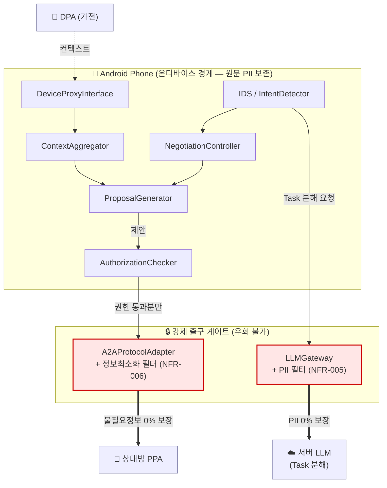
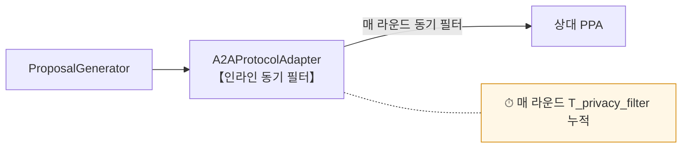
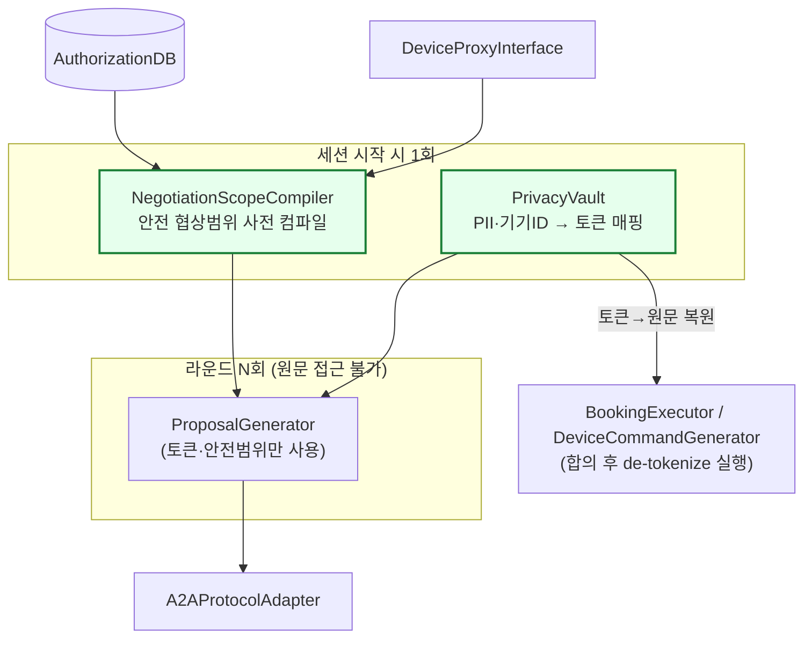
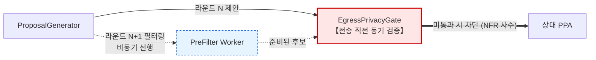
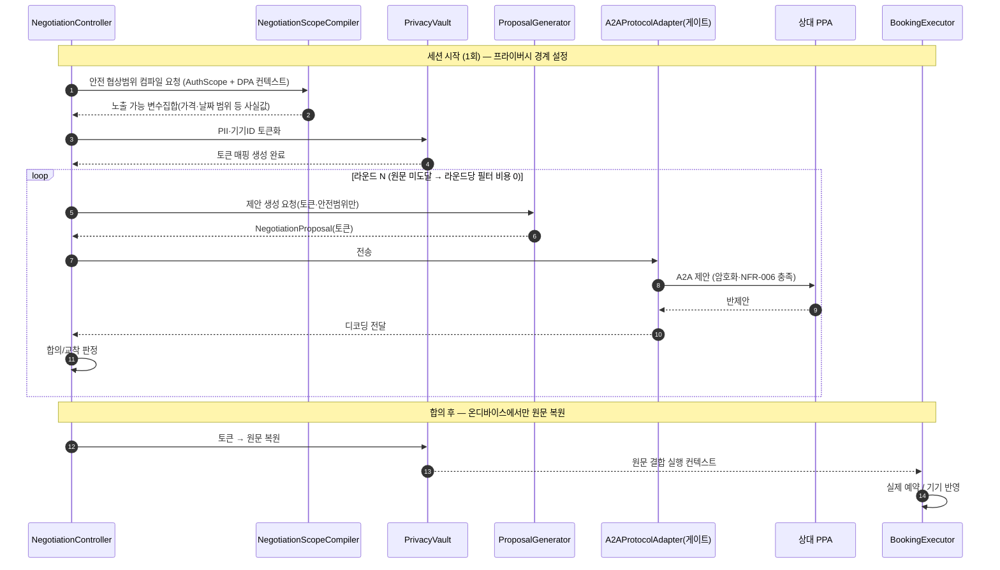
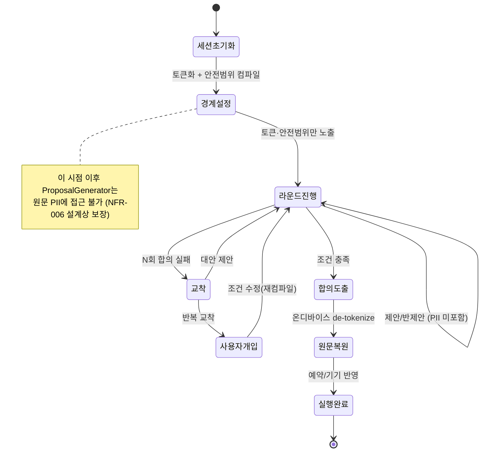

# QS-002 프라이버시 보존 협상 속도 — 설계 뷰 (UML)

> 본 문서의 다이어그램은 Mermaid로 작성되어 GitHub에서 그대로 렌더링된다.
> 후보 구조 본문은 [`QS-002-프라이버시-보존-협상-속도.md`](./QS-002-프라이버시-보존-협상-속도.md) 참조.

---

## 1. 컴포넌트 뷰 — 프라이버시 경계와 출구 게이트 (공통)

기기 밖으로 데이터가 나가는 출구는 **두 곳뿐**이며(서버 LLM행, 상대 PPA행), 모든 후보는 이 두 출구를 강제 게이트로 막는다.

---

## 2. 컴포넌트 뷰 — 후보별 차이

### CA-DP1: 인라인 동기 필터

### CA-DP2: 세션 토큰화 + 안전범위 사전 컴파일

### CA-DP3: 비동기 파이프라인 + 전송 직전 동기 게이트

---

## 3. 시퀀스 뷰 — CA-DP2 협상 라운드 (권고안)

---

## 4. 상태 뷰 — 협상 세션과 프라이버시 경계

---

## 5. 측정 매핑

| 다이어그램 요소 | 측정 지표 | 요구사항 |
|------------------|-----------|----------|
| 출구 게이트(LLMGateway) | `R_pii_leak = 0%` | NFR-005 / QS-009 |
| 출구 게이트(A2AProtocolAdapter) | `R_unnecessary_info = 0%` | NFR-006 / QS-019 |
| 라운드 루프 총 시간 | `T_negotiation` (분), 라운드 수 N | QA-001 / QS-002 |
| 라운드당 필터 비용 | `T_privacy_filter` per round | DP-2 효과 검증 |
