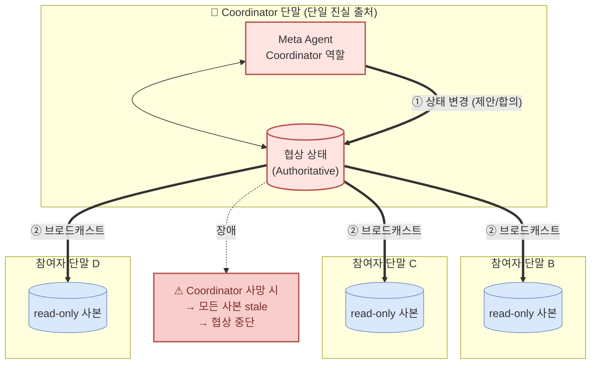
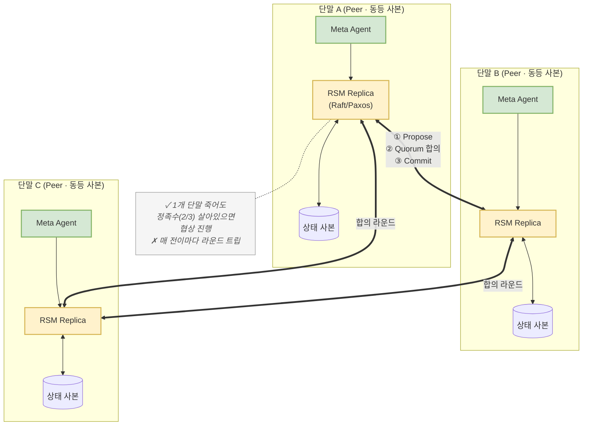
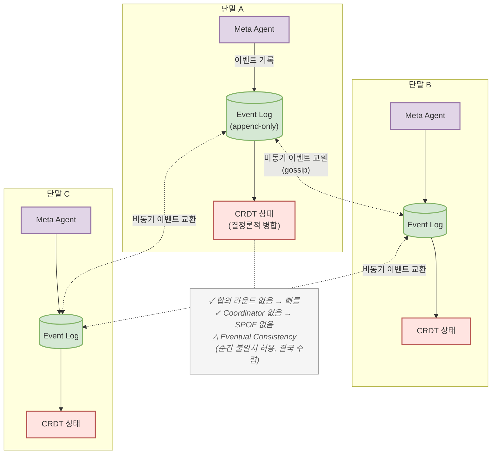

파일을 받아 분석한 뒤 QA를 추천하겠습니다.

FR 문서를 정확히 읽었습니다. 기존 06-QAS.md의 24개 QS를 이 새로운 기능 요구사항(FR) 기준으로 재정렬해서, 어떤 QA가 더 중요해지고 어떤 게 새로 필요해지는지 분석해드리겠습니다.

## 새 FR에서 읽히는 변화

기존 유스케이스에 없거나 약했던 게 FR로 명시되면서 시스템의 성격이 일부 바뀌었습니다. 세 가지가 눈에 띕니다.

**확장된 입력 범위 (FR-IDS-01)** — 화면 컨텍스트·GPS·배터리·생체리듬까지 주기 수집. 기존 명세가 메시지/캘린더/가전 위주였던 것에 비해 **항상 켜진 멀티센서 모니터링**으로 폭이 넓어졌습니다.

**Knowledge Sharing이 정식 기능 (FR-MAF-05, 06)** — 단순 협상을 넘어 **에이전트 간 지식 공유**가 생겼고, 그 안에 Privacy 격리(Shared vs Private)가 별도 요구로 박혔습니다. 기존엔 협상 메시지 안의 정보 최소화(QS-019)였는데, 이제 *지식 단위*의 분류·격리가 필요합니다.

**Remote Monitoring (FR-MAF-07)** — 보호자/피보호자처럼 한 사람이 다른 사람의 단말을 권한 위임 기반으로 들여다보는 기능. **권한 위임 모델**과 **상대방 단말 데이터 접근 통제**가 명시적으로 들어왔습니다.

**런타임 직접 개입 (FR-MAF-09)** — 협상 중 사용자가 조건 변경·강제 수락·취소를 *즉각 반영*. DP09의 동시성 문제가 정식 FR이 됐습니다.

**실시간 가시성 (FR-MAF-08)** — 협상 진행 상태를 UI로 언제든 확인. 기존 QS에서 약했던 부분입니다.

## 추천 QA — 8개 (기존 8개 재정렬)

이 FR들을 기준으로 다시 뽑으면 이렇게 됩니다. 기존 06-QAS.md에서 우선순위가 바뀌고, 일부는 새 QS가 필요합니다.

| 순위 | QA | 매핑 FR | 변화 |
|------|----|---------|------|
| 1 | **시간 반응성 — 협상 완료 시간 (QS-002)** | FR-MAF-02, 03 | 유지 (1순위 그대로) |
| 2 | **기밀성 — Knowledge Privacy 격리 (신규 QS 필요)** | **FR-MAF-06** | **승격.** 기존 QS-019(제안 내 정보 최소화)를 확장해 *지식 단위 분류 정확도*까지 측정 |
| 3 | **무결성 — 권한 위임 범위 통제 (QS-008 확장)** | FR-MAF-07 | **승격.** 기존 권한 100%에 더해 *Remote Monitoring 위임 범위* 명시 측정 추가 |
| 4 | **시간 반응성 — 런타임 개입 반영 지연 (신규 QS 필요)** | **FR-MAF-09** | **신규.** 사용자 개입이 즉각 반영되는 시간(예: 3초 이내). 기존 QS에 없음 |
| 5 | **가용성 — N-party 교착 회피 (신규 QS 필요)** | **FR-MAF-03** | **신규.** "무한 루프·교착 없이" 다자간 합의 도달. 기존 QS-002(시간)와 분리 |
| 6 | **자원 효율 — 다중 센서 수집 배터리 (QS-021 확장)** | **FR-IDS-01** | **승격.** GPS·생체리듬 상시 수집이 배터리에 직접 영향. 기존 QS-021을 멀티센서 기준으로 재정의 |
| 7 | **시간 반응성 — 상태 가시성 응답 (신규 QS 필요)** | **FR-MAF-08** | **신규.** UI에서 협상 상태 조회 요청 시 표시까지의 지연 |
| 8 | **신뢰성 — 합의 후 실행 완결성 (QS-024 유지)** | FR-MAF-10 | 유지 |

## 어떤 변화를 권하는지 정리

**유지할 것 (3개):** QS-002 협상 시간 / QS-008 권한 통제 / QS-024 실행 실패 — 이건 FR이 늘어도 본질이 같음

**신규 QA로 뽑을 것 (3개):**
- **Knowledge Privacy 격리** (FR-MAF-06) — 정보 *최소화*에서 *분류·격리*로 의미 확장
- **런타임 개입 반영 지연** (FR-MAF-09) — DP09를 사용자 관점 QA로 끌어올림
- **N-party 교착 회피** (FR-MAF-03) — DP08의 다자간 합의를 정식 QA로

**기존 QA에서 빠질 가능성이 있는 것:** QS-014(시뮬레이션 재현성), QS-015(추적성) — 중요하지만 FR이 사용자 가치 쪽으로 무게가 옮겨가서 1군 8개에서는 빠지고 NFR로 격하될 수 있음

## 짚어둘 점

솔직히 말하면, 이 FR 묶음은 **기존 06-QAS.md의 PoC 범위를 살짝 넘어섭니다.** Knowledge Sharing·Collaboration·Remote Monitoring은 본격 제품 기능에 가까워서, PoC에 다 넣으면 24개 QS로도 부족할 수 있어요. 그래서 두 갈래로 갈립니다:

- **A안 — PoC 범위 유지:** 위 표에서 FR-MAF-02/03/09/10만 1군에 두고, Knowledge Sharing·Remote Monitoring은 NFR 또는 후속 단계로 미룸. 8개 QA 중 4~5개만 교체
- **B안 — FR 전면 반영:** 위 표 그대로. Knowledge Privacy 격리, 런타임 개입, N-party 교착이 신규 QA로 정식 진입. 24개 QS를 추가/재정의 필요

제 권고는 **A안에서 시작해서, Knowledge Privacy 격리(FR-MAF-06) 하나만 신규로 정식 추가하는 것**입니다. 이게 PoC의 데이터 주권 정체성과 가장 직결되고 측정도 명확하거든요. 나머지 신규 QA(런타임 개입, N-party 교착)는 기존 QS-002/QS-016의 하위 측정으로 흡수할 수 있습니다.

어느 방향으로 가실지 정하시면 그에 맞춰 QA 8개를 확정하고 신규 QS 명세까지 만들어 드리겠습니다.

깊이 들어가서 한 개를 추천하겠습니다. 두 후보를 끝까지 따져봤습니다.

## 두 후보 비교

**후보 A — Coordinator 단말 장애 시 협상 진행 가능성 (Availability under Coordinator Failure)**

측정 가능합니다 — "Coordinator 단말이 협상 중 강제 종료될 때, 잔여 참여자들이 X초 내에 협상을 이어가거나 안전하게 종료하는 비율". 시나리오도 명확하고 PoC에서 단말 강제 종료로 재현하기 쉽습니다.

다만 솔직한 약점이 있습니다. 이 QA는 사실상 **"Coordinator 모델을 폐기하라"는 결론으로 직진**합니다. 왜냐면 Coordinator를 두는 이상 그 단말의 가용성은 다른 단말과 동일한데(어차피 폰), "장애 시 진행률 100%"를 달성하려면 Coordinator 역할을 동적으로 이양하는 메커니즘이 필요하고 그건 사실상 Peer 모델로 가는 길입니다. QA를 측정으로 두면 결과적으로 **아키텍처 결정을 무력화**합니다 — 정작 팀이 결정해야 할 "Coordinator vs Peer"라는 진짜 갈림길을 측정으로 비껴가는 거죠.

또한 단일 단말 장애는 결국 *가용성*의 일반적 문제고, 이 시스템 *특유*의 N-party 속성은 아닙니다. 1:1 협상에서도 같은 문제가 있어요(상대방 죽으면 끝). 즉 N-party의 본질적 어려움을 정확히 짚지는 못합니다.

**후보 B — 합의 상태의 N개 사본 간 불일치 발생률 (Distributed Consensus Consistency)**

이건 N-party에서만 새로 발생하는 문제입니다. 1:1엔 두 사본만 있어 split-brain만 막으면 되지만, N개 사본은 *부분 불일치*(A·B는 같은데 C만 다름)가 가능해서 질적으로 다른 어려움이 생깁니다. 이게 진짜 "N-party 고유" 아키텍처 속성이에요.

그리고 결정적 장점이 있습니다 — 이 QA는 **어느 아키텍처를 택하든 의미가 살아있습니다.** Coordinator 모델이면 Coordinator의 진실 vs 참여자들이 인지하는 진실의 일치, Peer 모델이면 N개 동등 사본의 일치 — 두 경우 모두 측정 가능하고, 측정 결과로 어느 모델이 이 속성에 강한지가 드러납니다. 즉 결정을 가두는 게 아니라 **결정을 평가하는 잣대**가 됩니다. 그게 QA의 본래 역할이고요.

게다가 이 속성은 다른 DP들과 직접 맞물립니다. DP07(네트워크 단절 복구)의 본질이 정확히 "단절 후 재연결 시 양측 사본이 같아지는가"이고, DP09(인텐트 변경 동시성)의 split-brain 위험이 N에선 N-split이 되며, DP11(다중 Intent 실행 상태)의 보상 트랜잭션도 모든 사본에 일관되게 반영되어야 합니다. 즉 **N-party 아키텍처가 잘 설계됐는지를 가늠하는 단일 지표**가 될 수 있습니다.

## 추천 — 후보 B

다음 형태로 정식 QA(품질 시나리오)를 제안합니다.

---

**QS-N: N-party 협상 상태의 분산 일관성**

- **자극 (Stimulus):** N(≥3)명 참여 협상이 진행되는 중에 임의 시점에서 ① 한 명 이상의 단말이 네트워크 단절, ② 임의 단말이 OS에 의해 강제 종료, ③ 사용자 인텐트 변경(DP09 연계) 중 하나의 사건이 발생한다.

- **자극원 (Source):** Android OS 메모리 관리 / 모바일 네트워크 환경 / 사용자.

- **환경 (Environment):** 협상이 합의에 도달하기 전, 모든 참여자가 자기 단말에 협상 상태 사본을 보유한 정상 운영 중.

- **응답 (Response):** 사건 해소 후(재연결·재기동·이벤트 반영 완료) 일정 시간 T_reconcile 이내에, 살아있는 모든 참여자의 협상 상태 사본이 다음 세 가지 중 하나로 수렴한다:
  - (a) 동일한 합의 상태 — 합의 도달 케이스
  - (b) 동일한 실패 상태 — 합의 불가능 케이스, 모두 같은 이유로 종료
  - (c) 동일한 진행 상태 — 사건 이전과 같은 라운드/제안 컨텍스트로 협상 재개

  세 경우 모두 **부분 불일치(살아있는 사본 중 일부가 다른 상태)는 0%**.

- **응답 측정 (Response Measure):**
  - 주 지표: 사건 발생 시나리오 100회 반복 시 부분 불일치 발생률 = 0%
  - 보조 지표: T_reconcile(사건 해소 후 모든 사본 수렴까지의 시간) ≤ X초
  - 보조 지표: 죽은 사본 비율이 정족수 미만일 때, 시스템이 명시적으로 "협상 무효" 상태로 전이하는 비율 = 100%

- **아키텍처적 함의:** 이 측정을 만족하려면 다음 결정들이 필요해진다 — 합의 상태의 권위적 출처(Coordinator vs Peer), 멱등성 보장된 상태 동기화 메시지(DP07), 멤버십 변화 감지·반영(quorum), 부분 합의 잠금 또는 무효화 정책. 측정 결과는 이 결정들의 적절성을 평가하는 잣대가 된다.

---

## 왜 이게 의미있는 QA인지

세 가지 차원에서 가치가 있습니다.

첫째, **N-party 고유성**. 사본 수 N이 본질적 변수로 들어가는 첫 QA입니다. 기존 QS들은 N에 무관하게 정의 가능한 것들(시간·자원·기밀성·복구)이었는데, 이건 N≥3에서 비로소 의미를 갖습니다.

둘째, **결정을 평가하지 가두지 않음**. Coordinator든 Peer든 둘 다 이 QA의 측정 대상이 되고, 측정 결과가 어느 쪽이 우월한지를 데이터로 보여줍니다. PoC 가설(자율 협상 신뢰성)을 객관적으로 검증할 수 있어요.

셋째, **횡단 효과**. 이 QA 하나가 DP07·08·09·11의 분산 측면을 동시에 자극합니다 — 각 DP가 자기 영역에서 잘 설계됐어도 *합쳐졌을 때* 사본 일관성이 깨지면 이 QA가 잡아냅니다. 통합 검증 지표로 기능해요.

## 미해결 결정 (이 QA를 채택하면 따라오는 것)

- **T_reconcile 허용치를 얼마로?** 협상 속도(QS-002)와 trade-off. 너무 짧으면 달성 불가, 너무 길면 무의미.
- **"살아있는"의 정의?** 응답이 늦은 단말을 죽은 것으로 볼 임계는? Quorum과 직결.
- **부분 합의 처리 정책?** N명 중 K명이 합의한 부분을 잠글지(보존) 무효화할지(공정).

이 셋은 QA를 채택한 뒤 정량값을 정할 때 결정해야 합니다.

---
세 방안 각각에 Mermaid UML을 만들겠습니다. 각 방안의 핵심 메커니즘이 시각적으로 드러나도록 설계하겠습니다.

먼저 다이어그램을 작성하고 검증한 뒤 보여드리겠습니다.

3개 모두 통과. 실제 렌더 결과를 시각 확인하고, 필요하면 보강하겠습니다.

세 다이어그램 모두 깔끔하게 렌더됩니다. 각 방안의 핵심 메커니즘이 시각적으로 잘 드러나네요.

이제 세 다이어그램을 이전 답변의 방안 설명에 끼워넣어 정리해 드리겠습니다.

---

## QA 대표안 — 분산 협상 상태의 일관성 (Distributed Consensus Consistency)

이 QA를 채택할 때 따라오는 새 DP("분산 협상 상태의 일관성 보장 방식")의 세 후보안과 각 UML입니다.

### 방안 1 — Authoritative Coordinator

Coordinator 단말이 협상 상태의 단일 진실 출처. 다른 단말은 read-only 사본을 들고 있고, 모든 상태 변경은 Coordinator를 거쳐 브로드캐스트.

**장점:** 일관성 보장이 단순·강함, 구현 가장 쉬움. **단점:** Coordinator SPOF — 그 단말이 죽으면 모든 사본이 stale 상태가 되어 협상 중단.

### 방안 2 — Replicated State Machine (RSM)

모든 N개 단말이 동등한 사본을 들고, 각 상태 전이를 Raft/Paxos류 합의 프로토콜로 결정. 다수가 동의한 전이만 적용되므로 사본이 결정론적으로 같아짐.

**장점:** SPOF 없음, 분산 일관성이 프로토콜 수준에서 보장. **단점:** 매 상태 전이에 라운드 트립이 추가되어 협상 시간(QS-002) 악화, 모바일에서 합의 프로토콜 구현이 본질적으로 복잡.

### 방안 3 — Event-Sourced CRDT (권고)

각 단말이 자기 변경을 append-only 이벤트 로그에 기록하고 비동기로 다른 단말과 교환(gossip). 충돌은 CRDT 자료구조 자체가 결정론적으로 해소.

**장점:** 합의 라운드 트립 없어 빠름, SPOF 없음, DP07의 이벤트 소싱과 직접 결합. **단점:** CRDT 설계가 까다로움(어떤 자료구조가 협상 상태에 맞는지), eventual consistency라 순간적 불일치는 허용.

---

세 다이어그램의 시각적 차이가 핵심을 잘 드러냅니다:

- **방안 1**: 굵은 화살표가 한 노드(Coordinator)에 집중 → SPOF의 시각적 증거
- **방안 2**: 모든 노드 간 굵은 양방향 라운드 트립 → 라운드 트립 부담의 시각적 증거
- **방안 3**: 점선(비동기) 교환만 있음 → 강한 동기화 없이도 수렴한다는 게 한눈에 보임

세 다이어그램의 색·구조 일관성을 위해 모두 같은 노드 폭/구조로 그렸습니다.

DP06 템플릿에 맞춘 정식 문서로 작성해드릴까요? 그러면 풀고자 하는 문제·아키텍처적 난제·세 방안·QA Trade-off 평가표까지 포함된 완성된 DP 문서로 만들어드리겠습니다.

