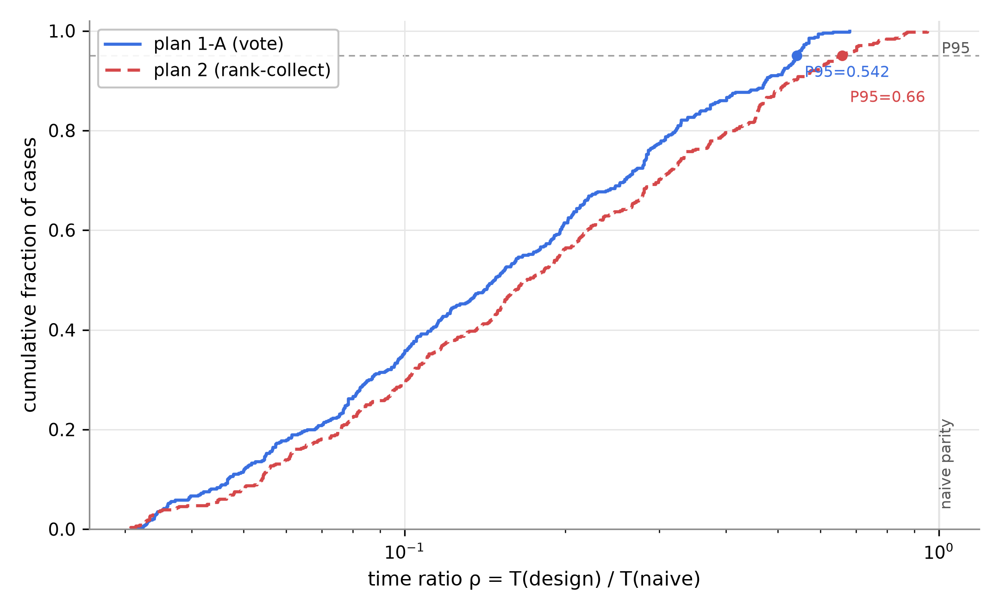
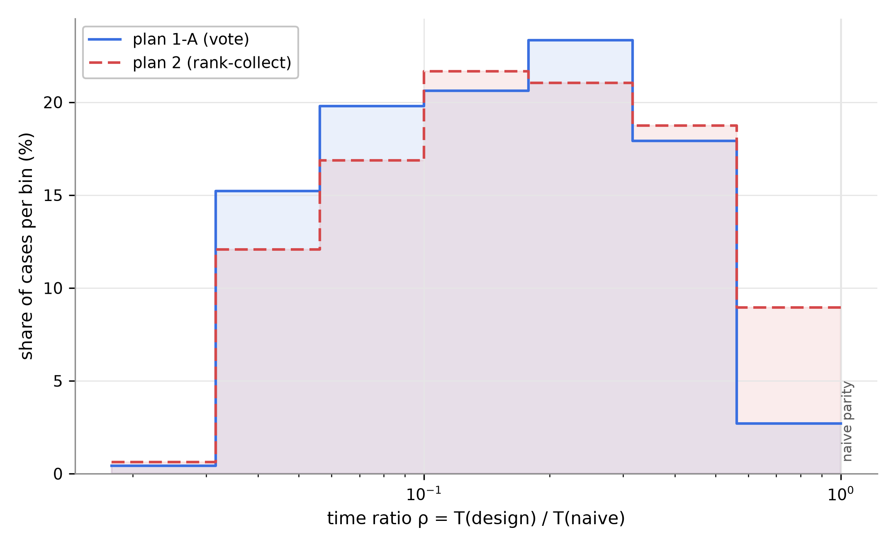

# 60. nparty 정본 측정 결과 보고 — functional-ext2 480건 (방안 1-A vs 방안 2)

> **지위**: nparty 시나리오 **정본 측정 결과 보고서**. 판정 기준의 정본은 [`24`](24-QA-측정-핸드북.md) §0, 측정값의 정본은 `poc/total/results/`이며, 본 문서는 실측값을 보고용으로 정리·해석한다.
> **정본 데이터셋 계보**: functional 160건 → functional-ext 480건(N 확장) → **functional-ext2 480건** (2026-08-14 PL 확정 승격 — ext의 미끼 배치 인위성 제거판, [`64`](64-functional-ext2-교차검증-측정.md)). 구판 기준 수치가 필요하면 64의 ext↔ext2 대조표를 참조.
> **실측 원본**: [`nparty-tracks-20260814T001421Z/`](../../poc/total/results/nparty-tracks/nparty-tracks-20260814T001421Z/) — raw.json(집계+측정 메타) · cases.jsonl(케이스×방안, 스키마 = [`RAW-SCHEMA.md`](../../poc/total/results/nparty-tracks/RAW-SCHEMA.md)) · breakdowns.json/md(재집계 파생물). 본 문서의 표는 이 run의 plan1a·plan2 행에서 파생.
> **판정 체계**: 2026-08-13 PL 확정 완료판 — FC = 달성률 · CF = 후보안 노출률(2026-08-14 방향 전환 — 잔여 비밀률과 판정 동치) · TB = ρ P95.

---

# 요약 (임원 보고용 — 본편)

## 슬라이드 1 — 무엇을 쟀고, 결과는

**대상**: 온디바이스 에이전트의 다자간(N-party) 일정 협상 프로토콜 설계안 2종.

- **방안 1-A (투표형)** — 라운드마다 각자 후보 1개를 제안하고, 만장일치 O가 나온 **첫 후보로 즉시 합의**. 빠르고 덜 드러내지만, 더 좋은 안을 기다리지 않는다.
- **방안 2 (순위 수집형)** — BlackBoard가 전원의 순위 제출을 기다려 **순위 종합이 가장 좋은 후보로 합의**. 최적을 찾지만, 늦게 닫히고 많이 드러낸다.

**측정 판**: functional-ext2 — 참여자 3-50명 8레벨 × 검증 유형 5종 × 12건 = **480케이스 전수** (nparty 담당 QA 3종).

| 핵심 QA (판정 지표) | 방안 1-A | 방안 2 | 우세 |
|---|---|---|---|
| **1. 기능 정확성** — 최적 합의안 효용 달성률 | 0.873 ★3 | **0.950 ★4** | **방안 2** (승패 259:29) |
| **3. 기밀성** — 최악 관찰자에게 노출되는 내 선호 비율 (낮을수록 좋음) | **31.7% ★3** | 48.3% ★2 | **방안 1-A** |
| **4. 시간** — naive 대비 시간 비율 ρ의 P95 | **0.543 ★3** | 0.660 ★2 | **방안 1-A** |

**한 줄 결론**: **"정확한 방안 2 vs 빠르고 은밀한 방안 1-A"** — 세 QA가 한 방향이 아니라 구조적 트레이드오프이며, QA 서열 1위가 FC이므로 종합 우위는 방안 2다. (보완 택틱 적용판 "방안 2+"는 FC 0.987 ★5 · CF 92.1% ★5 · TB 0.383 ★4로 전 축 우위 — [`62`](62-방안2-보완-택틱-설계-측정.md).)

## 슬라이드 2 — 판정의 근거와 조건

1. **정확성 격차는 인원이 많을수록 커진다.** 방안 2는 전 N에서 0.94-0.96(N≤15 ★5, N≥20 ★4), 1-A는 N=3 ★4에서 N≥20 ★2로 하락(0.938 → 0.835). N=30부터 1-A는 단 1건도 이기지 못한다. 특히 1-A의 무작위 대비 개선율 s는 0.07로, **아무거나 뽑기보다 거의 낫지 않다** (방안 2는 s=0.63).
2. **기밀성·시간은 1-A의 구조적 우위.** 1-A의 노출률 31.7%는 1:1 협상 실측(29.2%)에 근접하고, 방안 2는 48.3%(케이스 중앙 기준 13.9%p 추가 노출). 시간 꼬리(P95)에서 방안 2는 소인원 판에서 naive에 근접(N=3에서 0.867)하는 반면 1-A는 최악도 0.681이다.
3. **바닥 요건은 양쪽 다 완벽**: 결렬이 정답인 96케이스에서 두 방안 모두 96/96 정확히 결렬, 억지 합의·FR 위반·ρ>1 결함 0건.

**의사결정 프레임**: 합의 품질이 우선(QA 서열 1위 FC)이면 **방안 2**, 프라이버시·응답성 요구가 지배적인 소인원 판이면 **1-A**가 유리하다. 방안 2의 두 열세 축은 보완 택틱(적응 배치 + 커밋 매칭)으로 모두 역전 가능함이 실측됐다 (62).

---

# 부록 (Appendix) — 상세 방어 자료

## A. 측정 체계 — QA 정의와 판정 규칙

### A1. 판정 지표 한눈에

| QA | 판정 지표 (한 줄) | 별점 사다리 | 경계의 근거 | 확정일 |
|---|---|---|---|---|
| FC | **달성률** = U(도달 결과) ÷ U(최적 합의안 x\*) — 표본 평균 | ≥0.95 ★5 / ≥0.90 ★4 / ≥0.85 ★3 / ≥0.80 ★2 / ≥0.70 ★1 / 미만 ★0 | 만점 1.0부터 5%p 계단 (잠정) | 2026-08-13 |
| CF | **후보안 노출률** = 최악 관찰자 노출 깊이 — 합의 세션의 피해자 평균 | ≤12% ★5 / ≤30% ★4 / ≤48% ★3 / ≤66% ★2 / ≤84% ★1 / >84% ★0 | **실측 앵커 등분** — naive SAOP 66% = ★2 · 1:1 30% = ★4, 18%p 연장 (경계 포함 ≤) | 2026-08-14 (3차) |
| TB | **시간 비율 ρ** = T_설계 ÷ T_naive — 케이스 **P95** | ≤0.2 ★5 / ≤0.4 ★4 / ≤0.6 ★3 / ≤0.8 ★2 / ≤1.0 ★1 / 초과 결함 | naive 등가 1 - 순간 완료 0 등분 | 2026-08-13 |

세 지표 모두 [`24`](24-QA-측정-핸드북.md) §1·§3·§4가 정본이다. RU-메모리·SC-의제는 composite 시나리오 담당분이라 본 보고 범위 밖이다 (QA 분업 — PL 확정, composite 정본은 [`63`](63-composite-final-측정-결과-보고.md)).

### A2. FC 상세 — 왜 달성률인가

- **달성률** = 협상이 실제 도달한 결과의 총효용 ÷ 도달 가능했던 최적(x\*)의 총효용. 결렬이 정답인 판에서 정확히 결렬하면 1.0.
- **무작위 베이스라인 R̄** = 유효 후보(결렬 포함) 중 하나를 무작위로 고르는 전략의 기대 달성률 — 이 표본에서 0.863. 즉 "아무거나 뽑아도 86%"인 판이므로, 달성률 별점만 보면 과대평가 위험이 있다.
- 그 방어가 **보조 s** = (달성률 − R̄) ÷ (1 − R̄) — "무작위 위에 남은 개선 여지 중 채운 비율". **s ≤ 0(무작위 이하)은 별점과 무관하게 즉시 결함**. 이번 측정: 1-A s = 0.070 (개선 근소), 방안 2 s = 0.634.
- FR 위반(바닥선 밑 수락 등)은 점수와 분리해 별도 집계 — 이번 측정 **양쪽 0건**.

### A3. CF 상세 — 후보안 노출률의 정확한 뜻

- **노출 깊이** = 관찰자에게 귀속 공개된 내 후보 개수 ÷ **전체 후보 수(12)**. 분모가 전체 후보인 이유: 어떤 후보를 거부하는지·하위 서열도 비밀의 일부다.
- **판정** = 나를 가장 많이 아는 관찰자의 깊이(노출률), 피해자 **평균** (중앙값은 1/12 격자에 스냅되어 N별 추이를 지움 — 24 §3.2). 잔여 비밀률 = 1 − 노출률은 참고 병기.
- **모수 = 합의 완료 세션만** (합의율 80%, 두 방안 동일 — 병기 의무). 결렬 세션은 전 목록 소진이 본성이라 방안 변별 정보가 없다.
- **앵커 2점 (사다리의 기준)**: 같은 판의 1:1 협상 실측 노출 29.2%(e₂ = 0.2917)가 ★4 앵커, N명 naive SAOP 유도 실측 65.6%가 ★2 앵커 — "★4 이상 = 1:1 수준, ★2 이하 = naive 수준"으로 읽는다 (24 §3.3 3차).
- **보조 m(노출 배수)** = 관찰자 전원의 깊이 합 ÷ e₂ — 관찰자 폭 담당. 이번 측정 1-A 1.09 vs 방안 2 1.66.

### A4. TB 상세 — baseline과 P95

- **naive baseline** = 다자 SAOP round-robin: 전 후보를 순위화해 두고 **1명씩 돌아가며** 후보 1개를 전원에 배포·전원 회신. 제안 1건 = 2 phase. threshold·양보 전략은 설계안과 동일 조건.
- **합성 시간 모델** (24 §4.4): T = phase 수 × 75ms(LTE 릴레이 편도) + 평가 횟수÷N × 1.4µs(실측) + 전송량 ÷ 20Mbps. 결정론적 합성 — 벽시계가 아니라 재현 가능.
- **판정 = P95**: 시간 성능은 "평소 빠른가"가 아니라 "**느린 꼬리에서도 보장되는가**" — SLO의 p95/p99 관행. 중앙값(0.147 vs 0.169)은 전형 차이가 작아 두 방안을 동급으로 뭉갠다.
- 결렬 세션은 양 방안의 ρ 분포가 동일(중앙 0.472)해 모수 논쟁이 없다 — 전 케이스 포함.

## B. 데이터셋 — functional-ext2 구성

### B1. 개요

| 항목 | 값 |
|---|---|
| 총 케이스 | **480건** = N 8레벨 × 60건 (레벨 균등) |
| 참여자 수 N | 3 / 5 / 7 / 10 / 15 / 20 / 30 / 50 |
| 후보 수 | 12개 고정 (S01-S12) |
| 유형 | 5종 × 레벨당 12건 (B2) |
| 공통 유효 후보 K | 유형별 0-4개 **의도 배치(planted)** — 실측 검산 480/480 일치 |
| threshold | 참여자별 0.30-0.55 (케이스 40%는 전원 동일 0.40) |
| 저장 위치 | [`datasets/nparty/functional-ext2/`](../../poc/total/datasets/nparty/functional-ext2/) — `FX2-<NN>p-<seq>-<유형>.json` |
| 생성기 | [`generate_functional.py`](../../poc/total/scripts/generate_functional.py) `--owner-random-depth`, 레벨별 시드 20260814+N (재현 가능) |

**ext 대비 유일한 변경** = 미끼 주인의 순위에서 x\*를 **수락 구간 내 무작위 깊이**에 배치 (구판은 항상 미끼 바로 다음 2순위 — 인접 배치 100%가 26% 우연 수준으로 해소, 주인 기준 x\* 순위 2-10위 분산). 나머지 컨셉은 functional 계열 그대로다.

### B2. 유형 5종 — 각 판이 검증하는 것

| 유형 | K | 구성 | 검증 질문 |
|---|---|---|---|
| wide_common | 4 | 전원 수락 가능 후보 여럿 + 미끼 | 선택지가 많을 때 최적을 고르는가 |
| single_common | 1 | 실후보가 하나뿐 | 유일해를 찾아내는가 |
| utility_tradeoff | 3 | 유효 후보 간 총효용 격차 큼(bimodal) + 미끼 | 어느 것으로 닫히는지가 크게 갈리는 판 |
| bottleneck_participant | 2 | 한 명의 높은 바닥선(0.70)이 유효 영역 제한 + 미끼 | 병목 참여자가 있어도 최적 도달하는가 |
| no_deal_optimal | 0 | 실후보 없음 | **결렬이 정답**일 때 억지 합의를 안 만드는가 |

### B3. 미끼(decoy) 구조 — 변별 장치

무작위 utility만으로는 최적 x\*가 대체로 전원 상위권이라 어느 방안이든 도달해 버린다 (구 파일럿 판별율 10%). 그래서 역방향 구성으로 **"총효용은 낮지만 한 명에게는 1순위인 실후보(미끼)"** 를 심는다 — 빨리 닫히는 방안은 미끼에 걸리고, 기다리는 방안은 x\*에 도달한다.

공정성 장치 3개:
- **plan2-miss 변형** (미끼 2유형의 44%): 방안 2도 x\*를 놓치도록 순위 깊이를 조작 — 표본이 한쪽의 우세를 구조적으로 보장하지 않게 한다 (실효는 G1).
- **깊이 밴드 순환**: x\*의 순위 깊이를 early(2-3위)/middle(4-7위)/late(8-10위)로 순환 배치 — 깊이 편향 차단 (G2).
- **주인 내 x\* 무작위 깊이** (ext2 신설): 특정 제출 폭이 미끼 구조를 기계적으로 해독하는 인위성 차단 (64).

### B4. utility 분포 특성

- 후보별 utility 직접 무작위 추출 → **0-1 거의 균등** — "뚜렷한 최적"이 존재하는 변별 극대화 판.
- 개인 유효 비율(자기 바닥선 이상 후보) 중앙 약 50% — 깐깐한 개인들의 판.
- 대비: main 트랙(의제 가중합, 700건)은 종형·개인 유효 87%의 관대한 현실 모사 판. **ext2 = 변별 극대화, main = 현실 모사**로 상보적.

### B5. 재현 방법

`python scripts/generate_functional.py --participants <N> --per-type 12 --seed <20260814+N> --out datasets/nparty/functional-ext2 --owner-random-depth` × 8레벨 → FX2- 접두 개명. 생성 직후 로더 검증·K 검산 480/480 통과.

## C. 측정 환경과 RAW 데이터 체계

### C1. 실행 환경

| 항목 | 값 |
|---|---|
| 실행 | `experiments/nparty_tracks.py --tracks functional-ext2 --plans plan1a,plan2` (정본 run은 택틱 10종 포함 12방안, 70.8초) |
| 결정론 | 시드 고정 프로토콜 — 재실행 시 동일 값 (벽시계 아닌 합성 시간) |
| 합성 상수 | phase 75ms(편도) · 평가 1.4µs(실측) · 대역폭 20Mbps — raw.json meta에 스냅샷 |
| 코드 스냅샷 | raw.json meta의 commit 해시 + 판정 규칙 문자열 |

### C2. RAW 데이터 체계 (RAW-SCHEMA.md)

- **cases.jsonl** (정본): 케이스×방안 1행 — 식별·구성(유형/변형/깊이/K), FC 원값(달성률·R̄·s·FR), **CF 원재료(피해자별 노출 깊이·개수 목록)**, TB 항 분해, 통신 관측.
- **breakdowns.json/md** (파생): [`aggregate_nparty_ext.py`](../../poc/total/scripts/aggregate_nparty_ext.py)가 cases.jsonl만 읽어 전 분해표를 1초에 재생성. 본 부록의 모든 표가 이 산출물이다.

## D. 전체 결과 (정본 수치)

### D1. 종합 판정표

| 지표 | 방안 1-A | 방안 2 |
|---|---|---|
| FC 달성률 (판정) | 0.8726 **★3** | 0.9499 **★4** |
| FC 보조 s (무작위 대비 개선율) | 0.0702 | 0.6342 |
| 무작위 베이스라인 R̄ | 0.8630 | 0.8630 (방안 무관 동일 — 정상) |
| FR 위반 | 0건 | 0건 |
| CF 노출률 (판정 — 합의 세션 384건 평균) | 31.7% ±19.4 **★3** | 48.3% ±23.7 **★2** |
| CF 보조 m (노출 배수) | 1.09 | 1.66 |
| 합의율 (CF 모수 병기 의무) | 80.0% | 80.0% (동일) |
| TB ρ P95 (판정) | 0.5425 **★3** | 0.6596 **★2** |
| TB ρ 중앙값 (전형) / 최대 / 결함 | 0.147 / 0.681 / 0건 | 0.169 / 0.951 / 0건 |

### D2. 승패와 쌍대(같은 케이스 직접 비교)

| 통계 | 값 |
|---|---|
| FC 케이스 승패 (1-A / 무 / 2) | **29 / 192 / 259** — 무승부는 정답 유일 판(단일해 96 + 결렬 96) |
| 시간 쌍대: T(1-A) ÷ T(2)의 중앙값 | 0.873 — 1-A가 케이스당 약 13% 빠름 (480건 중 303건 우세) |
| 기밀 쌍대: 노출(2) − 노출(1-A)의 중앙값 | +13.9%p — 합의 384케이스 중 294건에서 1-A가 덜 노출 |

## E. N(참여자 수)별 분석

| N | 1-A 달성률(★) | 2 달성률(★) | 승(1A/무/2) | 1-A 노출률(★) | 2 노출률(★) | 1-A ρP95(★) | 2 ρP95(★) |
|---|---|---|---|---|---|---|---|
| 3 | 0.938 (★4) | 0.954 (★5) | 11/24/25 | 20% (★4) | 29% (★4) | 0.606 (★2) | **0.867 (★1)** |
| 5 | 0.904 (★4) | 0.958 (★5) | 7/24/29 | 26% (★4) | 41% (★3) | 0.407 (★3) | 0.590 (★3) |
| 7 | 0.886 (★3) | 0.950 (★5) | 5/24/31 | 27% (★4) | 43% (★3) | 0.308 (★4) | 0.451 (★3) |
| 10 | 0.871 (★3) | 0.955 (★5) | 3/24/33 | 29% (★4) | 45% (★3) | 0.213 (★4) | 0.307 (★4) |
| 15 | 0.858 (★3) | 0.952 (★5) | 1/24/35 | 31% (★3) | 48% (★3) | 0.153 (★5) | 0.198 (★5) |
| 20 | 0.848 (★2) | 0.937 (★4) | 2/24/34 | 33% (★3) | 50% (★2) | 0.115 (★5) | 0.157 (★5) |
| 30 | 0.842 (★2) | 0.944 (★4) | 0/24/36 | 33% (★3) | 50% (★2) | 0.083 (★5) | 0.110 (★5) |
| 50 | 0.835 (★2) | 0.949 (★4) | 0/24/36 | 33% (★3) | 50% (★2) | 0.051 (★5) | 0.068 (★5) |

**FC**: 방안 2는 N 무관 0.94-0.96으로 평평(전원 제출 대기 구조), 1-A는 단조 하락 — 미끼 합의의 1인당 효용이 N과 함께 바닥선으로 수렴. **N=30부터 1-A 전패.**

**CF**: 격차는 전 구간 9-21%p로 안정. 1-A는 전 구간 "1:1 협상 수준(노출 29.2%)" 근방을 지키고, 방안 2는 N≥20에서 노출 50%에 붙는다. 편차는 방안 2가 큼(±23.7 vs ±19.4).

**TB**: 변별은 소인원에서 — N=3 1-A ★2 vs 방안 2 ★1(naive 근접 0.867). N=15부터 둘 다 ★5 수렴 (naive가 N 비례로 느려지는 반면 두 설계안은 병렬 제출 — I 참조).

## F. 유형별 분석 — 격차의 출처

| 유형 | 1-A 달성률(★) | 2 달성률(★) | 승(1A/무/2) | 1-A 노출률(★) | 2 노출률(★) |
|---|---|---|---|---|---|
| wide_common | 0.795 (★1) | 0.947 (★4) | 9/0/87 | 26% (★4) | 52% (★2) |
| utility_tradeoff | 0.671 (★0) | 0.803 (★2) | 20/0/76 | 36% (★3) | 51% (★2) |
| bottleneck | 0.897 (★3) | 1.000 (★5) | 0/0/96 | 22% (★4) | 45% (★3) |
| single_common | 1.000 (★5) | 1.000 (★5) | 0/96/0 | 43% (★3) | 44% (★3) |
| no_deal | 1.000 (★5) | 1.000 (★5) | 0/96/0 | 모수 제외 | 모수 제외 |

- **FC 격차는 전부 미끼 3유형에서** 난다. 정답 유일 판 2종은 만점 동률 — 1-A는 "정답을 못 찾는" 방안이 아니라 "**더 좋은 답을 기다리지 못하는**" 방안이다.
- **결렬 판별 96/96 완벽** (양쪽), 억지 합의 0건.
- **유일해 판(single_common)은 CF도 동률**(노출 43 vs 44%) — 교집합 소진 탐색의 구조적 하한.

## G. 공정성 검증 — 변형·깊이별

### G1. plan2-miss 변형 (미끼 2유형 한정)

| 변형 | 건수 | 1-A 달성률 | 방안 2 달성률 | 승(1A/무/2) |
|---|---|---|---|---|
| 일반 (미끼만) | 108 | 0.744 (★1) | **0.969 (★5)** | 3/0/105 |
| plan2-miss (방안 2 함정) | 84 | 0.719 (★1) | **0.754 (★1)** | 26/0/58 |

함정이 실제로 작동한다 — plan2-miss 판에서 방안 2도 ★1로 추락하고 1-A가 26건을 이긴다. 방안 2의 종합 우세는 함정을 44% 포함한 표본에서의 결과다.

### G2. x\* 순위 깊이별

| 깊이 | 1-A 달성률 | 2 달성률 | 1-A 노출률 | 2 노출률 |
|---|---|---|---|---|
| early (2-3위) | 0.851 | 0.933 | 17.8% | 26.4% |
| middle (4-7위) | 0.879 | 0.955 | 32.0% | 48.7% |
| late (8-10위) | 0.888 | 0.962 | 45.2% | **69.8%** |

FC는 깊이에 둔감(배치 편향 없음). **CF는 깊이에 강하게 의존** — 합의 후보가 깊을수록 전원이 순위를 더 꺼내야 하므로, late 판에서 방안 2의 노출은 70%까지 오른다.

## H. 분포 분석 — 대표값이 못 보여주는 것

**FC 달성률 분포** (미끼 3유형 288건×방안): 방안 2는 **이봉** — 186건(65%)이 만점 1.0이고 실패 시 0.5-0.7로 추락. 1-A는 0.5-0.99에 **넓게 퍼짐**.

```
달성률 구간   0.5-  0.6-  0.7-  0.8-  0.9-  1.0
1-A            26    57    53    76    76     0    (퍼진 단봉)
방안 2         15    30    10    22    25   186    (이봉 — 전부 아니면 손실)
```

**노출 개수 분포** (합의 케이스 피해자별): 1-A는 2-3개에 몰리고(최빈), 방안 2는 2-10개에 평평하게 퍼진다. 12개 전부 노출은 양쪽 0 — 거부 후보의 서열은 구조적으로 비밀로 남는다.

**ρ 분포 꼬리**:

| 분위 | 1-A | 방안 2 |
|---|---|---|
| P50 | 0.148 | 0.170 |
| P75 | 0.284 | 0.333 |
| P90 | 0.475 | 0.535 |
| **P95 (판정)** | **0.543** | **0.660** |
| 최대 | 0.681 | **0.951** (naive 근접 — 소인원 판) |

전형(P50)은 대등하고 꼬리로 갈수록 벌어진다 — P95 판정의 실증 근거.

**분포 전체 공개** (판정이 P95 분위수이므로 — 63 H절과 동일 규약): (a) 누적분포(ECDF, x 로그축)는 곡선과 y=0.95 판정선의 교점이 곧 P95이고, (b) 밀도(PDF 추정)는 로그 등간격 구간당 케이스 비율(%)로 질량이 어느 규모 대역에 모이는지를 보인다. nparty에서 P95 판정 항목은 TB의 ρ 하나다 (FC·CF는 평균 판정 — 24 §0).

**그림 H-1a — TB: 시간 비율 ρ의 누적분포** (480건/방안, 결렬 포함):



**그림 H-1b — TB: ρ의 밀도(로그 구간 히스토그램).** 두 곡선의 봉우리는 같은 대역(0.1-0.3)에 있지만, 경계(naive 등가) 직전 구간(ρ 0.6-1.0)의 질량이 방안 2는 7.7%, 1-A는 0.6%다 — P95 격차(0.543 vs 0.660)의 실체가 이 꼬리 질량이다:



> 원본: [`figures/60/fig-tb-rho-ecdf.tex`](figures/60/fig-tb-rho-ecdf.tex) · [`fig-tb-rho-hist.tex`](figures/60/fig-tb-rho-hist.tex) (standalone pgfplots) · 생성: [`poc/total/scripts/plot_nparty_dist.py`](../../poc/total/scripts/plot_nparty_dist.py) (cases.jsonl 재집계 — 재시뮬레이션 없음)

## I. 통신·시간 관측 (N별 중앙값)

| N | 방안 | 라운드 | 메시지 | 전송량 | 합성 T |
|---|---|---|---|---|---|
| 3 | 1-A / 2 | 10 / 13 | 52 / 59 | 1.6KB / 0.8KB | 1.95s / 2.36s |
| 10 | 1-A / 2 | 12 / 15 | 259 / 289 | 14.5KB / 4.2KB | 2.18s / 2.59s |
| 30 | 1-A / 2 | 15 / 17 | 1,042 / 1,016 | 72.6KB / 14.6KB | 2.73s / 3.01s |
| 50 | 1-A / 2 | 15 / 17 | 1,712 / 1,676 | 133.2KB / 24.2KB | 2.68s / 2.93s |

- 절대 시간은 두 방안 다 **N=50에서도 3초 이내** — naive(N=50에서 64.0초)와의 격차가 ρ 급감의 실체다.
- 라운드·메시지 수는 비슷(방안 2가 2-3라운드 더). **전송량은 1-A가 5배** (후보 배포+투표 회신 vs 수집자 단방향 제출) — 절대량이 수십-수백 KB라 T 기여는 미미.

## J. 예상 질문 방어 (FAQ)

**Q1. 달성률 0.87이면 꽤 좋은 것 아닌가?** — 이 판은 무작위 선택도 0.86을 얻는다(R̄). 1-A의 s=0.07은 무작위 대비 개선이 근소하다는 뜻이다. 그래서 달성률 별점에 s ≤ 0 즉시 결함 규칙과 R̄ 병기를 붙여 운영한다.

**Q2. 미끼를 심은 판이면 1-A에게 불공평한 것 아닌가?** — 미끼는 "빠른 성립이 낮은 안에 일찍 닫히는가"라는 검증 질문의 구현이고, 방안 2용 함정(plan2-miss)도 44% 심어 균형을 맞췄다(G1 — 그 판에서 방안 2도 ★1, 1-A가 26건 승). 무작위 현실 모사 판(main 트랙 700건)에서는 두 방안의 FC가 백중이었다 — "1-A는 평균적 판에서 대등하나 적대 구도에서 무너지며 그 취약성이 N에 비례한다"가 두 트랙을 관통하는 결론이다.

**Q3. 결렬 케이스를 CF에서 왜 뺐나?** — 결렬은 전 목록 소진이 본성이라 어느 방안이든 전량 노출이며(실측 동일), 변별 정보가 없다. 대신 합의율(80%, 두 방안 동일)을 병기해 모수 왜곡을 감시한다. 결렬 판별 자체는 FC가 잰다(96/96).

**Q4. 노출률 100%가 없는 이유는?** — 분모가 전체 후보(12)인데 제출은 수락 가능 후보만 이뤄지므로, 거부 후보의 서열은 구조적으로 비밀로 남는다.

**Q5. TB에서 왜 평균이 아니라 P95인가?** — 시간 품질은 SLO 관행대로 느린 꼬리로 판정한다. 전형(중앙값) 차이는 작고, 실재하는 차이는 꼬리에 있다(H). 사다리·참조점은 그대로다.

**Q6. naive baseline이 너무 약한 상대 아닌가?** — naive는 NegMAS 표준 SAOP의 최단순 다자 확장으로 "설계 없이 그냥 돌리면"의 실체다. 두 방안 간 미세 비교는 쌍대 T 비율(0.873)로 별도 보고한다(D2).

**Q7. 시간 2-3초는 실측인가?** — 합성값이다: 시뮬레이션 계수 × 실측 기반 상수(75ms/1.4µs/20Mbps). 재현 가능하고 하드웨어 무관하며, 상수는 raw.json meta에 봉인된다.

**Q8. 12후보는 너무 작지 않나?** — 변별 통제를 위한 고정이다. 후보 공간이 큰 판의 강건성은 main 트랙(288조합·700건)이 담당하며, 방향성 결론은 두 트랙에서 일관됐다.

**Q9. 별점 경계는 누가 정했나?** — 참조점 등분 원칙 (FC 5%p 계단·CF 20%p 등분·TB 0.2 등분). 잠정 표시 경계는 실측 분포 축적 후 PL 조율 대상이다.

**Q10. 데이터셋이 ext에서 ext2로 바뀐 이유는?** — ext의 미끼 288건 전부가 "주인의 2순위 = x\*" 인접 배치라는 생성기 인위성이 발견됐고(특정 제출 폭이 이를 기계적으로 해독 — 62 §6.2), 무작위 깊이로 고쳐 재생성했다. 서열·결론은 불변이고 유일한 등급 변화는 방안 2 FC ★5→★4(0.950, 경계 직하)다 — 전 변형 대조는 [`64`](64-functional-ext2-교차검증-측정.md).

**Q11. 재현하려면?** — B5(생성) + C1(측정) + C2(재집계). 전 과정 시드 고정 결정론.

## K. 한계와 후속

1. **FC 별점 사다리 잠정** (★1 구간만 10%p) — 실측 분포 기반 조율 여지. 방안 2의 0.950은 ★5 경계 직하라 사다리 민감 구간에 있다.
2. **방안 2의 CF·TB 보완**: 적응 배치 + 커밋 매칭("방안 2+")으로 FC 0.987 ★5 · CF 92.1% ★5 · TB 0.383 ★4 실측 — 상세·신뢰 모델 한계는 [`62`](62-방안2-보완-택틱-설계-측정.md).
3. **RU·SC-의제는 composite 담당분** — 정본은 [`63`](63-composite-final-측정-결과-보고.md).
4. 비핵심 QA(SC-참여자·FT)는 정의만 유지, 측정 비대상 (24 §6-§7).

---

_작성 근거: 실측 원본 3파일(상단 링크) + 24 §0-§4 + 생성기·집계기 소스. 본 문서의 모든 표는 cases.jsonl에서 `aggregate_nparty_ext.py`로 재생성 가능하다._
