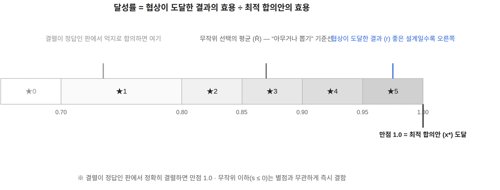
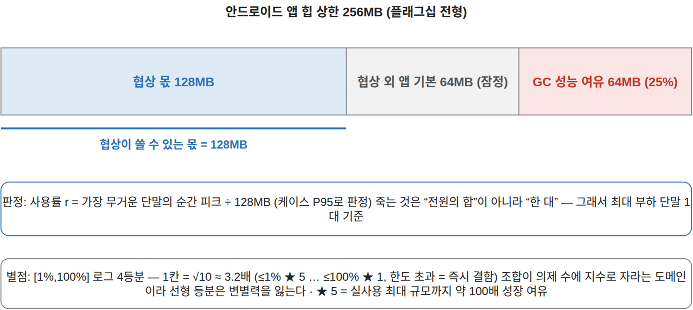
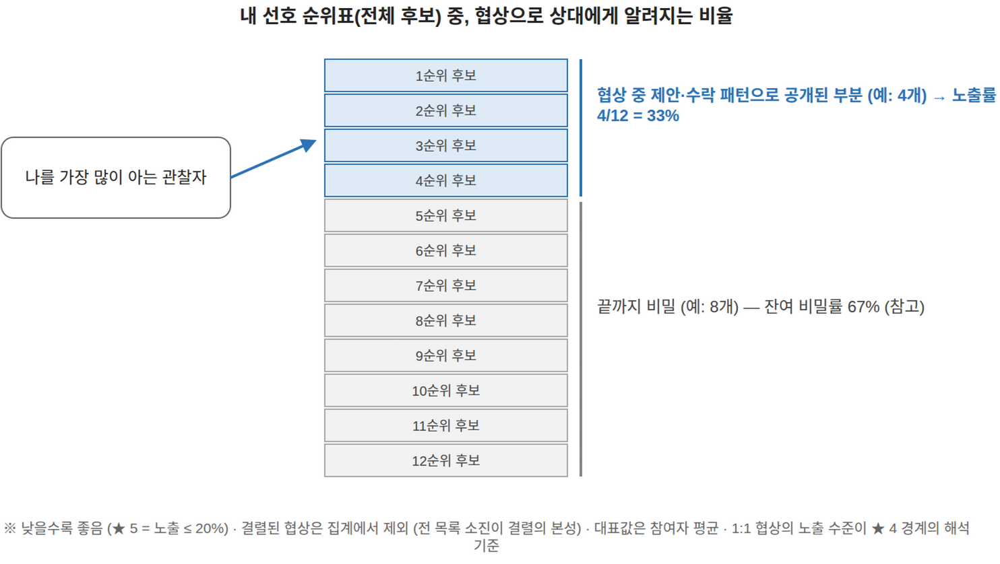
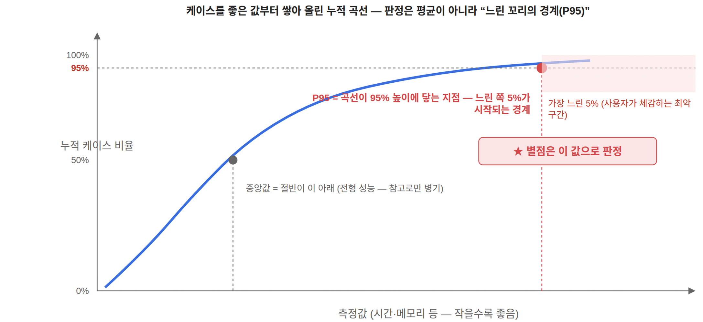
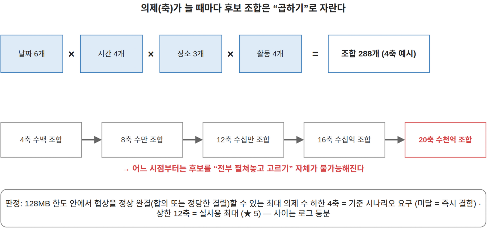

# 61. 핵심 QA 5종 임원 브리핑 — 정의·측정·별점 체계

> **용도**: 임원 보고 PPT 원고 — QA 1종당 슬라이드 1장 + 종합 스코어카드 1장. 각 장은 같은 틀(정의 → 왜 중요한가 → 측정 방법 → 별점 체계 → 실측 스냅샷 → 발표 노트)로 구성된다.
> **정본**: 모든 정의·수식·경계의 정본은 [`24-QA-측정-핸드북`](24-QA-측정-핸드북.md)이다. 본 문서는 그 요약이며, 어긋나면 24가 우선한다. "정본 측정"은 확정 데이터셋으로 수행한 공식 측정을 뜻한다.
> **그림**: 각 QA의 이해 보조 그림은 **개념 도식**이다 (방안·실측값 미포함 — 실측 분포·비교 그림은 DP별 보고 60·62·63 소관). 정본은 [`drawio/61-*.drawio`](drawio/) (규칙 6), PNG는 보조 첨부.
> **갱신 (2026-08-14)**: 24 §2 개정 반영 — RU 판정 = 사용률 r의 **P95**, 별점 = **로그(데케이드) 사다리**. 정본 데이터셋 교체 반영 — composite = FIN 500건([`63`](63-composite-final-측정-결과-보고.md)), nparty = **functional-ext2 480건**([`60`](60-functional-ext-측정-결과-보고.md)·[`64`](64-functional-ext2-교차검증-측정.md)).

**공통 원칙** — ① 별점 경계는 임의 상수가 아니라 **참조점(수학 상한·실측 앵커) 사이의 등분**으로 만든다. ② 등급의 문제가 아니라 존재 이유가 걸린 위반은 **즉시 결함**으로 별도 보고한다 — 한계 초과가 곧 성립 불가인 QA(자원·시간·확장성)는 별점표의 최하 칸을 ★0 대신 "결함"으로 표기한다. ③ 대안 비교는 동일 하니스·동일 시드·동일 표본에서 대안만 교체한다.

**측정 분업과 비교 대상** — 핵심 QA 5종은 설계 문제(DP) 2개가 나눠 잰다:

| 시나리오 | 담당 QA | 비교하는 설계안 |
|---|---|---|
| 다자 협상 (nparty) | 기능 정확성(FC) · 기밀성(CF) · 시간(TB) | **방안 1-A** (투표형 — 만장일치 O가 나온 첫 후보로 즉시 합의) vs **방안 2** (순위 수집형 — 전원의 순위 제출을 기다려 최적 후보로 합의) |
| 복합 의제 (composite) | 기능 정확성(FC) · 자원-메모리(RU) · 시간(TB) — 확장성-의제(SC)는 축 수 스윕으로 별도 판정 | **방안 1 (seq2)** (의제를 한 축씩 순차 확정 — 경로 의존) vs **방안 2 (pool)** (축별 상위값 조합 풀로 한 판에 협상 — 풀이 지수 성장) |

---

## 슬라이드 1 — 핵심 1위. Functional Correctness (기능 정확성)

> **정의: 협상이 도달한 결과가, 도달할 수 있었던 최적 합의안 효용의 몇 %인가 — 달성률.**

**왜 중요한가** — 협상 시스템의 존재 이유. 빨라도, 덜 새도, 나쁜 합의안에 도달하면 무의미하다. 그래서 QA 서열 1위.

**측정 방법** — 참여자 선호를 무작위 생성해 봉인하고, 협상 에이전트에게는 협상에 필요한 것만 준다. 채점기만 전체 선호를 보고 ① 전원 수락 가능한 후보를 거르고 ② 그중 총효용 최대인 **최적 합의안 x\*** 를 찾은 뒤 ③ 달성률 = 도달 결과의 효용 U(r) ÷ 최적의 효용 U(x\*)를 계산한다. 결렬도 항상 후보에 포함 — **결렬이 정답인 판에서 정확히 결렬하면 만점**이다.

**별점 체계** (만점 1.0부터 5%p 계단, ★1만 0.70-0.80 — 잠정):

| ★5 | ★4 | ★3 | ★2 | ★1 | ★0 |
|---|---|---|---|---|---|
| ≥0.95 | ≥0.90 | ≥0.85 | ≥0.80 | ≥0.70 | <0.70 |

**실측 스냅샷** — 다자 협상(정본 ext2 480건): 방안 2 **0.950 ★4** vs 방안 1-A 0.873 ★3. 단, 이 판은 무작위로 골라도 평균 0.86을 얻는 판이라(R̄) 1-A의 실체는 "무작위와 거의 동급"(개선율 s=0.07; 방안 2는 s=0.63)이다. 결렬이 정답인 96개 판은 양 방안 모두 96/96 정확히 결렬. 복합 의제(FIN 500건): pool **0.941 ★4** vs seq2 0.880 ★3 — 격차의 출처는 경로 함정 판(0.955 vs 0.569). **시사점: 두 DP 모두 합의 품질은 방안 2 계열의 우세 (다자 승패 259:29).**

**그림** — 달성률 눈금의 개념 (별점 대역과 기준점들의 위치, [`drawio 원본`](drawio/61-2-FC-달성률-개념.drawio)):

*발표 노트 — 과대평가 방어: 쉬운 판에서는 무작위도 높은 달성률을 얻으므로, 보조 지표 s = (달성률 − 무작위 평균) ÷ (1 − 무작위 평균)를 병기하고 s ≤ 0(무작위 이하)은 별점과 무관하게 즉시 결함 처리한다. 바닥선 밑 수락 등 FR 위반은 점수와 분리 검사 — 이번 측정 0건.*

---

## 슬라이드 2 — 핵심 2위. Resource Utilization-메모리 (자원 사용량)

> **정의: 협상 중 가장 무거운 단말의 순간 메모리 피크가, 협상에 허용된 몫(128MB)의 몇 %를 쓰는가 — 사용률 r.**

**왜 중요한가** — 온디바이스가 전제다. 협상이 스마트폰 앱 메모리를 침범하면 앱이 죽거나(OOM) 사용자 경험이 무너진다(GC 압박). 클라우드처럼 "더 쓰면 더 사면 된다"가 없다.

**측정 방법** — 세션 중 프로토콜 상태(후보·순위·집계 구조)의 크기를 라운드마다 실측(참조 객체까지 재귀 합산하는 deep-size 방식)해 **가장 무거운 순간·가장 무거운 단말**의 피크를 잡고, 방안과 무관한 공통 기저(자기 효용표·순위표 — 조합을 전개하지 않는 방안은 축별 선호 표현) 1인분을 더한다. N명의 합이 아니라 **최대 부하 단말 1대 기준** — 죽는 것은 합이 아니라 한 대이기 때문. **판정 = P95** (OOM은 꼬리 사건), **별점 = [1%,100%] 로그 4등분** — ★5(≤1%) = 실사용 최대 규모(≈10축)까지 성장(약 100배)해도 한도 내, 1칸 = √10 ≈ 3.2배. 한도 128MB는 안드로이드 앱 힙 상한에서 유도했다(상세: 발표 노트).

**별점 체계** (로그(데케이드) 사다리 — 24 §2.8 개정 2026-08-13):

| ★5 | ★4 | ★3 | ★2 | ★1 | 결함 |
|---|---|---|---|---|---|
| ≤1% | ≤3.2% | ≤10% | ≤32% | ≤100% | 한도 초과 |

**실측 스냅샷** (composite 정본 FIN 500건): seq2 **P95 0.30% ★5** vs pool 48.2% ★1 — 한도 초과 seq2 0건 vs pool **11건**(의제 18축 이상, 최악 4.7GB). seq2는 P95 0.39MB·최악 1.2MB로 전 구간 한도의 1% 미만이고, pool은 12축 0.5MB → 20축 110MB로 지수 성장(중앙값 기준 역전은 11축부터 — 소규모에선 pool이 더 가볍다). **시사점: 메모리는 seq2의 구조적 우위 — pool은 의제 16축 이하 조건부.**

**그림** — 한도 128MB의 유도 (앱 힙 256MB의 분해, [`drawio 원본`](drawio/61-3-RU-한도-유도-개념.drawio)):

*발표 노트 — 한도 유도: 플래그십 단말 전형의 앱 힙 상한 256MB × 75%(GC 여유 25% 차감) − 64MB(협상 외 앱 기본 점유, 잠정 — 실측 대체 예정) = 128MB. 사다리 근거: 선형 등분은 지수 도메인에서 포화(4-16축 전부 ★5 → 20축 절벽), ★5 = 1% 앵커는 실사용 최대까지의 성장 배수(약 100배, 실측 ×2.1/축)에서 유도 (24 §2.8 재개정 2026-08-14).*

---

## 슬라이드 3 — 핵심 3위. Confidentiality (기밀성)

> **정의: 협상이 끝난 뒤에도 내 선호(전체 후보에 대한 서열)가 얼마나 비밀로 남는가 — 잔여 비밀률.**

**왜 중요한가** — 협상 메시지는 암호화되지만(기능 요구 소관), 제안·수락의 **패턴 자체**가 선호를 흘린다. "무엇을 언제 냈는가"를 모으면 내 우선순위가 복원된다 — 일정·취향은 개인정보다.

**측정 방법** — 세션의 모든 관찰 이벤트를 기록하고, 관찰당하는 참여자별로 **나를 가장 많이 알게 된 상대**가 내 후보 몇 개를 내 것으로 지목·확인(귀속)했는지 센다. 노출 깊이 = 확인된 후보 수 ÷ 전체 후보 수 — 어떤 후보를 거부하는지도 비밀의 일부라 분모는 전체다. **집계 대상은 합의 완료 세션만** — 결렬은 어느 방안이든 전 목록을 소진하는 것이 본성이라 변별 정보가 없다(합의율 병기 의무). 대표값은 참여자 평균.

**별점 체계** (무노출 100%와 전량 공개 0% 사이 20%p 등분):

| ★5 | ★4 | ★3 | ★2 | ★1 | ★0 |
|---|---|---|---|---|---|
| >80% | >60% | >40% | >20% | >0% | 0% (전량 공개) |

**해석 앵커** — 같은 판의 1:1 협상 실측 잔여 = 70.8%: **"★4 이상 = 일반적인 2인 협상 수준으로 지킨다"**.

**실측 스냅샷** (nparty 정본 ext2 480건 중 합의 384건 — 합의율 80%, 양 방안 동일): 방안 1-A **68.3% ★4** (1:1 수준 근접) vs 방안 2 51.7% ★3. 합의 후보가 깊은 판에서 방안 2는 30%까지 하락. **시사점: 정확성을 취한 방안 2가 기밀성을 대가로 치른다 — 트레이드오프의 핵심 축.**

**그림** — "내 순위표 중 몇 개가 알려지고 몇 개가 비밀로 남나"의 개념 ([`drawio 원본`](drawio/61-4-CF-잔여-비밀률-개념.drawio)):

*발표 노트 — 관찰자가 여럿인 방안(브로드캐스트류) 비교를 위해 노출 배수 m(1:1 대비 총 노출량)을 보조 병기한다: 1-A 1.09 vs 방안 2 1.66.*

---

## 슬라이드 4 — 핵심 4위. Time Behaviour (시간 성능)

> **정의: 가장 단순한 기본 방식(naive) 대비, 제안 설계가 협상 시간을 얼마나 줄이는가 — 시간 비율의 상위 5% 경계(P95)로 판정.**

**왜 중요한가** — 사용자가 "약속 잡아줘"라고 말한 뒤 기다리는 시간이다. 다자 협상은 참여자 수에 비례해 느려질 수 있어, 설계가 그 증가를 눌러야 한다.

**측정 방법** — 시간은 벽시계가 아니라 **합성 모델**로 재현 가능하게 계산한다: T = 통신 단계 수 × t_통신 + (효용 평가 횟수 ÷ 참여자 수) × t_평가 + 전송량 ÷ 대역폭.

| 상수 | 값 | 출처 |
|---|---|---|
| t_통신 (단계 1회) | 75ms | LTE 클라우드 릴레이 편도 — 구간 분해·앵커 교차 검산 |
| t_평가 (효용 1건, 단말별 병렬 보정) | 1.4µs | PoC 실측 |
| 대역폭 | 20Mbps | LTE 보수 가정 |

같은 케이스를 **naive 기본 방식**(표준 교대 제안 프로토콜(SAOP)의 최단순 다자 확장 — 1명씩 돌아가며 제안·전원 회신)으로도 돌려 시간 비율 ρ = T_설계 ÷ T_naive를 얻는다. 후보 공간이 거대해도 naive는 해석적으로 계산해 반드시 숫자를 낸다.

**판정 통계 = P95** — 시간 품질은 "평소 빠른가"가 아니라 "**최악에 가까운 상황에서도 보장되는가**"로 판정한다. 서비스 SLO가 평균이 아닌 p95/p99 지연으로 정의되는 업계 관행과 동일 (전형 성능·최악값은 병기).

**별점 체계** (naive 등가 1.0과 순간 완료 0 사이 0.2 등분):

| ★5 | ★4 | ★3 | ★2 | ★1 | 결함 |
|---|---|---|---|---|---|
| ≤0.2 | ≤0.4 | ≤0.6 | ≤0.8 | ≤1.0 | >1.0 (naive만도 못함) |

**실측 스냅샷** — 다자 협상(정본 ext2 480건): **50인 협상도 약 3초 (1-A 2.7s · 방안 2 2.9s) — naive는 64.0초.** 판정은 1-A P95 0.543 ★3 vs 방안 2 0.660 ★2 (전형(중앙값)은 0.15 vs 0.17로 동급 — 갈리는 것은 느린 꼬리), 방안 2는 3인 소규모 최악 구간에서 naive 근접(P95 0.867). 복합 의제(FIN 500건): pool **P95 0.633 ★2** (T 중앙 2.0s) vs seq2 4.24 **★0 — 결함 152건**(함정 판 백트랙 49건 + 소규모 판 축별 세션 오버헤드 101건의 느린 꼬리, T 중앙 9.0s). **시사점: 다자 판은 1-A, 복합 판은 pool이 응답성 우위.**

**그림 — P95 판정이란** (개념 도식, [`drawio 원본`](drawio/61-1-P95-판정-개념.drawio)): 케이스를 좋은 값부터 쌓아 올린 누적 곡선에서 **95% 높이에 닿는 지점이 P95** — "느린 쪽 5%가 시작되는 경계"다. 중앙값(전형 성능)이 아니라 이 값으로 별점을 매긴다 — 사용자가 기억하는 것은 평균이 아니라 느렸던 경험이기 때문(서비스 SLO의 p95/p99 관행). 같은 원리가 RU(사용률 r)에도 적용된다. 실측 분포 그림은 60 H절·62 §4.4·63 H절 참조:

---

## 슬라이드 5 — 핵심 5위. Scalability-의제 수 (확장성)

> **정의: 메모리 한도 안에서 협상을 정상 완결할 수 있는 최대 의제(협상 축) 수.**

**왜 중요한가** — 실사용 협의는 "날짜만"이 아니라 날짜×시간×장소×활동…으로 축이 늘고, 후보 조합은 **축 수에 지수적으로** 폭발한다(10축이면 977만 조합). 설계가 조합 폭발을 견디는 한계가 곧 제품이 다룰 수 있는 협상의 복잡도다.

**측정 방법** — 의제 수를 4축부터 단계적으로 늘려가며(스윕) 각 단계에서 협상을 실행, RU와 같은 128MB 한도 안에서 **정상 완결**하는지 확인한다 (결렬 실행은 수용의 증거로 세지 않는다 — 24 §5.2). 판정값은 통과한 최대 축 수.

**별점 체계** (하한 4축과 상한 12축 사이 로그 등분):

| ★5 | ★4 | ★3 | ★2 | ★1 | 결함 |
|---|---|---|---|---|---|
| ≥12축 | 9-11 | 7-8 | 5-6 | 4 | <4 (요구 미달) |

**경계의 근거** — 하한 4축 = 기준 시나리오의 요구(날짜·시간·영화관·영화 — 미달이면 기본 기능 불가, 즉시 결함). 상한 12축 = 실사용 최대: 여행급 협의의 축 열거가 12개 내외에서 포화하고, 인지 한계(Miller 1956 — 동시 고려 7±2)와 자동 협상 벤치마크의 실세계 소재 도메인 규모(ANAC, 10이슈 내외)가 이를 뒷받침한다. 로그 등분인 이유: 조합 공간이 축 수에 지수적이라 축 1개의 난이도 증가가 상수가 아니기 때문.

**실측 스냅샷** (구 스윕 4-10축 — 갱신 예정): 두 방안 모두 **10축 통과 ★4** (관측 상한 도달, censored — 실제 한계는 그 이상). FIN 500건의 참고 관측: seq2는 20축에서도 한도 내(≤0.4MB)로 완결하는 반면, pool은 18축 이상에서 한도 초과가 발생해 실질 한계가 약 16축이다. **시사점: seq2는 만점권, pool은 실사용 상한(12축)은 넘기나 그 위가 막힌다 — 정식 SC 스윕 재판정이 후속 과제.**

**그림** — 조합 폭발의 개념 (왜 이 QA가 존재하는가, [`drawio 원본`](drawio/61-5-SC-조합-폭발-개념.drawio)):

*발표 노트 — 로그 등분의 실제 수열은 4·5.0·6.2·7.7·9.6·12의 반올림 (근거 상세: 24 §5.3-a).*

---

## 슬라이드 6 — 종합 스코어카드

| 다자 협상 DP | 방안 1-A | 방안 2 | | 복합 의제 DP | 방안 1 (seq2) | 방안 2 (pool) |
|---|---|---|---|---|---|---|
| 1. 기능 정확성 | ★3 | **★4** | | 1. 기능 정확성 | ★3 | **★4** |
| 3. 기밀성 | **★4** | ★3 | | 2. 자원-메모리 | **★5** | ★1 (결함 11) |
| 4. 시간 (P95) | **★3** | ★2 | | 4. 시간 (P95) | ★0 (결함 152) | **★2** |
| | | | | 5. 확장성-의제 (구 스윕) | **★4** | **★4** |

**읽는 법** — 다자 협상 DP는 **"정확한 방안 2 vs 빠르고 은밀한 방안 1-A"의 구조적 트레이드오프**이며, QA 서열 1위(기능 정확성) 기준 종합 우위는 방안 2다 (보완 택틱 적용 시 방안 2+는 FC 0.987 ★5 · CF 92.1% ★5 · TB 0.383 ★4로 전 축 우위 — [`62`](62-방안2-보완-택틱-설계-측정.md)). 복합 의제 DP는 **"품질·시간의 pool vs 메모리의 seq2"** — 서열 1위(FC)·4위(TB)가 pool 우세라 종합 우위는 pool이되, 의제 18축 이상에서 한도 초과가 실측되어 **적용 구간(16축 이하) 조건부**다 ([`63`](63-composite-final-측정-결과-보고.md)).

---

_실측 출처: nparty = [`60`](60-functional-ext-측정-결과-보고.md) (functional-ext 480건, 2026-08-13) · composite = `poc/total/results/composite-tracks/` (방안당 12케이스 + 4-10축 스윕). 모든 수치는 raw 데이터에서 재검산 가능._
