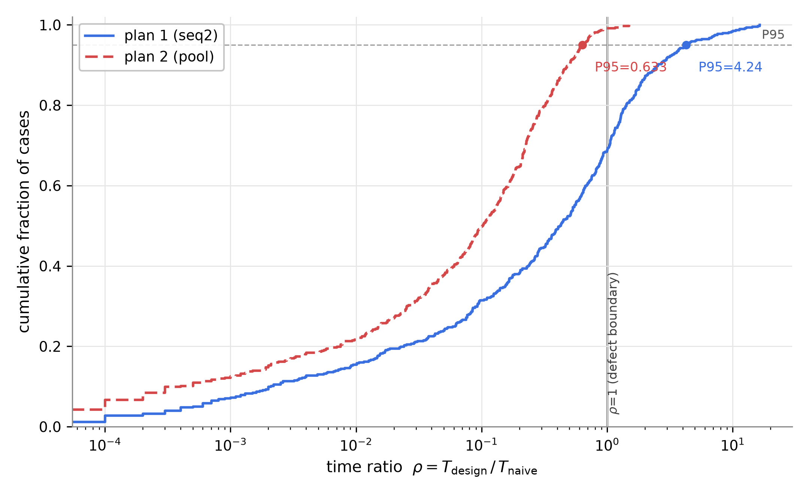
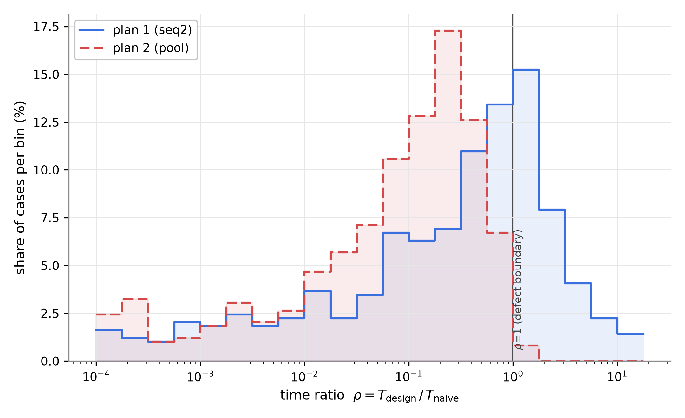
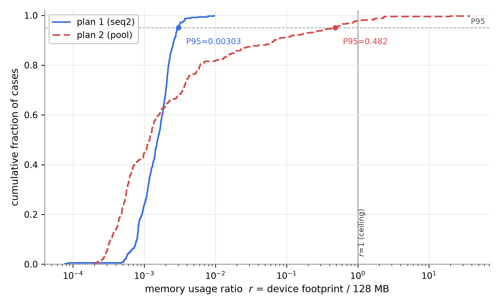
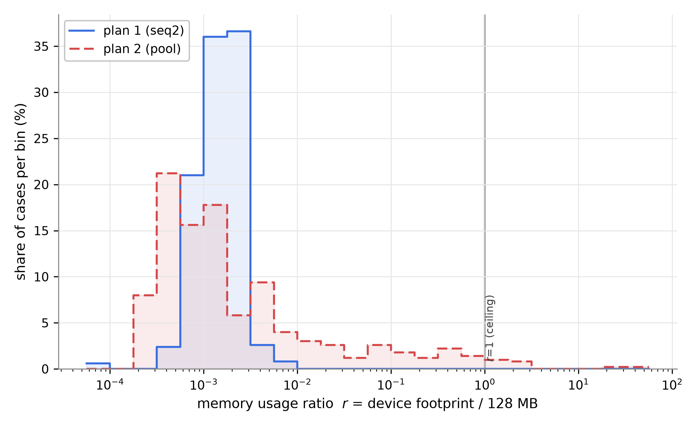

# 63. composite 정본 측정 결과 보고 — FIN 500건 (방안 1 seq2 vs 방안 2 pool)

> **지위**: dp-composite-agenda(복합 의제) 시나리오 **정본 측정 결과 보고서**. 판정 기준의 정본은 [`24`](24-QA-측정-핸드북.md), 측정값의 정본은 `poc/total/results/composite-final/`이며, 본 문서는 실측값을 보고용으로 정리·해석한다.
> **실측 원본**: [`composite-final-20260813T215301Z/`](../../poc/total/results/composite-final/composite-final-20260813T215301Z/) — raw.json(집계+측정 메타) · cases.jsonl(케이스×방안 1,000행, 스키마 = [`RAW-SCHEMA.md`](../../poc/total/results/composite-final/RAW-SCHEMA.md)) · breakdowns.json/md(재집계 파생물)
> **판정 체계**: 2026-08-13 PL 확정 완료판 — FC = 달성률 · RU = 사용률 r P95(로그 사다리) · TB = ρ P95. 본 실행이 이 체계로의 최종 정본 측정이다.

---

# 요약 (임원 보고용 — 본편)

## 슬라이드 1 — 무엇을 쟀고, 결과는

**대상**: 온디바이스 에이전트의 복합 의제(다축 조합) 2인 협상 프로토콜 설계안 2종. 문제의 본질은 **조합 폭발** — 의제(축)가 n개면 전체 후보는 축값의 곱(S)으로 지수 성장하므로, "전체 후보 공간을 만들지 않고 어떻게 협상하는가"가 설계 질문이다.

- **방안 1 (seq2, 축별 순차)** — 의제를 한 축씩 차례로 확정한다 (소프트 반영 + 최종확인 백트랙). 메모리는 축값 목록뿐이라 극소지만, 앞 축의 결정이 뒤 축을 묶는 **경로 의존**이 있다.
- **방안 2 (pool, 압축 풀)** — 축별 상위 k값의 조합 풀을 만들어 전 축을 한 판에 협상한다 (필요시 k 심화). 경로 의존이 없지만 풀이 **지수적으로 자란다**.

**측정 판**: FIN 정본 데이터셋 — 의제 4-20축 × 유형 4종 × 현실 시나리오(약속 잡기 도메인) = **500케이스 전수** (composite 담당 QA 3종 — CR 트랙 400건은 전 지표, 조합 최대 약 6×10^11의 RS 트랙 100건은 RU·TB).

| 핵심 QA (판정 지표) | 방안 1 (seq2) | 방안 2 (pool) | 우세 |
|---|---|---|---|
| **1. 기능 정확성** — 최적 합의안 효용 달성률 | 0.880 ★3 | **0.941 ★4** | **방안 2** (승패 143:186) |
| **2. 자원(메모리)** — 단말 총 점유÷한도 r의 P95 | **0.30% ★3** | 48.2% ★1 | **방안 1** (한도 초과 0 vs 11건) |
| **4. 시간** — naive 대비 시간 비율 ρ의 P95 | 4.24 ★0 (결함) | **0.633 ★2** | **방안 2** (T 중앙 9.0s vs 2.0s) |

(QA 번호는 24 §0 서열 — 서열 3위 CF는 nparty 시나리오 담당이라 본 보고 범위 밖이다.)

**한 줄 결론**: **"품질·시간의 방안 2 vs 메모리의 방안 1"** — 세 QA가 한 방향이 아닌 구조적 트레이드오프다. 종합 우위는 **방안 2**: 서열 최상위 QA(핵심 1위 FC)의 우세를 종합 판정의 1차 기준으로 삼는 관례(24 §0 서열의 취지, 60 보고와 동일)를 따르되, 하위 서열의 결함은 상쇄하지 않고 **조건**으로 남긴다 — 방안 2는 의제 18축 이상에서 한도 초과(즉시 결함 11건)가 실측되므로 **적용 구간(≤16축) 조건부**다 (규칙의 성격은 J 참조).

## 슬라이드 2 — 판정의 근거와 조건

1. **정확성 격차의 출처는 경로 의존이다.** 함정 없는 현실 판(plain 302건)에서는 0.917 vs 0.930으로 근소하지만, 앞 축의 인기값이 뒤 축을 봉쇄하는 경로 함정 53건에서 방안 1은 0.569 vs 방안 2는 0.955로 갈린다 — 방안 1은 함정 판 53건 중 43건을 **결렬**로 끝냈다(축별 확정을 되돌리는 백트랙이 세션 상한 안에서 회복에 실패). 억지 합의는 아니어서 FR 위반은 양쪽 0건이다.
2. **메모리는 방안 1의 구조적 우위 — 규모가 커질수록 절대적.** 방안 1의 단말 총 점유는 P95 0.39MB·최악 1.2MB — 전 구간 한도의 1% 미만(r 최악 0.96%)이다. 방안 2는 압축 풀의 지수 성장으로 12축 0.5MB → 18축 42MB → 20축 110MB(중앙)이고, 18-20축에서 **한도(128MB) 초과 11건**(최악 4.7GB — k 심화 폭주 꼬리)이 나왔다. 소규모(CR)에서는 오히려 방안 2가 더 가볍다(쌍대 중앙 0.55배) — 중앙값 기준 역전은 11축부터이고, 판정 통계(P95) 기준으로는 8축부터 방안 2가 무거워진다(E표).
3. **시간은 세션 상한(60스텝) 아래에서 방안 2 우위.** 라운드 중앙(방안 2 vs 방안 1) 14 vs 54(현실 판)·9 vs 121(함정 판), T 중앙 2.0s vs 9.0s. 방안 1은 ρ>1 결함이 152건(30.4%)으로 naive보다 느린 꼬리가 판정을 지배한다(ρP95 4.24 ★0). 대규모(RS)에서는 두 방안 모두 naive를 압도한다(14축부터 최악 ρ ≤ 0.21, 18축부터 ≤ 0.003) — 전체 공간을 만들지 않는 설계의 존재 이유가 수치로 확인된다.
4. **바닥 요건은 양쪽 다 완벽**: 결렬이 정답인 45케이스에서 두 방안 모두 45/45 정확히 결렬, FR 위반 0건, 무작위 이하(s≤0) 없음 (s = 0.46 vs 0.73).

**의사결정 프레임**: 합의 품질 우선(QA 서열 1위 FC)이고 의제가 16축 이하면 **방안 2**, 메모리 제약이 지배적이거나 의제가 그 이상이면 **방안 1** 또는 방안 2에 k 상한·의제 분할 보완(부록 K)을 적용한다. (방안 1의 TB 결함은 조합이 작은 판의 것이라 이 권고 구간과 겹치지 않는다 — J 참조.)

---

# 부록 (Appendix) — 상세 방어 자료

## A. 측정 체계 — QA 정의와 판정 규칙

### A1. 판정 지표 한눈에

| QA | 판정 지표 (한 줄) | 별점 사다리 | 경계의 근거 | 확정일 |
|---|---|---|---|---|
| FC | **달성률** = U(도달 결과) ÷ U(최적 합의안 x\*) — 표본 평균 | ≥0.95 ★5 / ≥0.90 ★4 / ≥0.85 ★3 / ≥0.80 ★2 / ≥0.70 ★1 / 미만 ★0 | 만점 1.0부터 5%p 계단 (잠정) | 2026-08-13 |
| RU | **사용률 r** = 단말 총 점유 ÷ 협상 몫 한도(128MB) — 케이스 **P95** | ≤0.01% ★5 / ≤0.1% ★4 / ≤1% ★3 / ≤10% ★2 / ≤100% ★1 / 초과 결함 | 로그(데케이드) 사다리 — 1칸 = 10배 여유 | 2026-08-13 |
| TB | **시간 비율 ρ** = T_설계 ÷ T_naive — 케이스 **P95** | ≤0.2 ★5 / ≤0.4 ★4 / ≤0.6 ★3 / ≤0.8 ★2 / ≤1.0 ★1 / 초과 결함 | naive 등가 1 - 순간 완료 0 등분 | 2026-08-13 |

세 지표 모두 [`24`](24-QA-측정-핸드북.md) §1·§2·§4가 정본이다. CF·SC-의제는 각각 nparty 담당·별도 스윕 소관이라 본 보고 범위 밖이다 (QA 분업 — PL 확정).

### A2. FC 상세 — 왜 달성률인가

- **달성률** = 협상이 실제 도달한 결과의 총효용 ÷ 도달 가능했던 최적(x\*)의 총효용. 결렬이 정답인 판에서 정확히 결렬하면 1.0.
- **유효 후보** = 하드 제약(축 간 의존성 + 참여자 제약) 통과 ∧ 전원 바닥선 이상 — 복합 의제 도메인은 "만들 수 있는 조합"과 "실행 가능한 조합"이 다르다. 하드 필터가 빠지면 실행 불가 조합이 x\*를 차지해 결렬 정답 케이스가 정확히 결렬해도 달성률 < 1이 되는 결함이 생긴다 (2026-08-13 실측 발견·수정 — `qa/fc.py` `is_feasible` 훅).
- **무작위 베이스라인 R̄**·**보조 s** = nparty와 동일 (24 §1.4). s ≤ 0(무작위 이하)은 즉시 결함.
- FC는 오라클(전수 열거)이 있어야 하므로 **CR 트랙(S ≤ 150,000)에서만** 판정한다. RS 트랙은 null 명시 — "안 쟀다"와 "0"을 구분한다.

### A3. RU 상세 — B안 기저와 로그 사다리 (2026-08-13 개정 2건)

- **단말 총 점유** = 공통 기저 + 프로토콜 상태 피크, 최대 부하 단말 1대 기준 (24 §2.8).
- **기저 정의 (B안)**: composite의 기저 = **축 정의 + 자기 선호 표현 1인분**. 전체 조합 공간 사본을 기저로 물리지 않는다 — 전체 공간을 만들지 않는 것이 두 설계 공통의 요점이고, 공간을 실제로 만드는 것은 채점 오라클(측정 인프라)이다. 방안이 **실물화한 후보 구조**(축값 목록/압축 풀)는 협상 중 생기므로 피크에 포함되며 `materialized` 계측으로 내역을 병기한다 — 이것이 방안 간 RU 변별의 실체다.
- **로그 사다리**: 조합 공간·실물화 구조는 의제 수에 지수 성장(축수 스윕 실측 축당 ×2.06-2.12 — [`01-축수-스윕-RU-분석.md`](../../poc/total/results/composite-per-case/01-축수-스윕-RU-분석.md))하므로 선형 15%p 등분은 상·하 포화한다 (실측: 4-16축 전부 ★5 → 20축 ★0 절벽). 로그 사다리는 1칸 = 10배 여유 = 의제 약 3.3개 분량 — "별점 1칸 = 수용 가능한 의제 수 차이"라는 운영 의미. 참조점(한도 r=1)은 불변.
- **판정 통계 = P95**: 메모리 한도 관리도 꼬리 지표다 — OS kill은 한 순간의 최악(§2.6)이지만, 최댓값 단독 판정은 이상치 1건이 표본 대표값을 정한다. TB ρ P95와 같은 SLO 논리. 중앙값(전형)·최댓값(최악) 병기.

### A4. TB 상세 — baseline·P95·세션 상한

- **naive baseline** = 2인 SAO 전 조합 순위 교대 제안: 각자 전체 조합 공간을 자기 효용 내림차순으로 순위화해 두고 1개씩 교대 제안 (lazy k-best로 열거 없이 계산 — `adapters/composite/baseline.py`). threshold·양보(boulware 5바퀴)는 설계안과 동일 조건.
- **합성 시간 모델** (24 §4.4): T = phase 수 × 75ms(LTE 릴레이 편도) + 평가 횟수÷N × 1.4µs(실측) + 전송량 ÷ 20Mbps. 벽시계가 아니라 결정론적 합성 — 재현 가능.
- **세션당 스텝 예산 60** (측정 캠페인 파라미터): 하네스 기본 200스텝은 임의값으로, 75ms 페이즈 기준 순수 프로토콜만 30초라 모바일 세션 상한을 넘는다. 세션당 60스텝(≈9초)을 선언 — boulware 양보가 n_steps에 비례하므로 상한이 곧 양보 속도다. pool은 전 축 한 세션이라 총 60, **seq2는 축별 세션 구조라 축당 60** (`n_steps_per_axis=60` — 같은 값이 원래 설계 정의)이고 세션이 n개인 비용은 T에 그대로 계상된다. naive 기준선은 자기 스케줄(5바퀴 소진)이 정의라 자르지 않는다 — 자르면 T_naive가 비용이 아니라 상한이 되어 ρ의 뜻이 무너진다.
- **판정 = P95**: nparty와 동일 (느린 꼬리 보장 — SLO 관행). baseline이 벽시계 상한에 걸린 케이스는 T가 하한(ρ는 상한)이라 보수 방향으로 판정 가능, 실패 케이스는 ρ 모수에서 제외하고 사유를 raw.json에 기록.

## B. 데이터셋 — FIN 500건 구성

### B1. 개요

| 항목 | 값 |
|---|---|
| 총 케이스 | **500건** = CR 400 + RS 100 |
| CR 트랙 | 의제 4-12축 9수준 — 경로 함정 53(8-10축) · 현실 모사 302 · 결렬 정답 45, 조합 S ≤ 150,000 (오라클 가능) |
| RS 트랙 | 의제 12/14/16/18/20축 × 20건 — 규모 스트레스, S 2.5×10^6 - 6.1×10^11 (RU·TB 경량 측정) |
| 도메인 | 하루 약속 잡기 — 날짜·시간·지역·영화·식당·메뉴·예산·극장·교통·카페·활동·디저트(+RS 확장 8축), 지역-소속·상영표·심야 귀가·예산-메뉴 의존성, 캘린더 하드 제약 |
| 선호 | frozen_profiles — 참여자별 가중치·값 점수를 fixture에 명시 고정 (시드 재생성 우회, 함정을 효용 수준에서 정밀 배치) |
| threshold | 참여자별 0.36-0.48 (결렬 (b)변형은 0.66-0.74) |
| 저장 위치 | `poc/total/datasets/composite/final/` — `FIN-<nn>ax-<유형>-<idx>.json` + MANIFEST.md |

### B2. 유형 4종 — 각 판이 검증하는 것

| 유형 | 건수 | 장치 | 검증 질문 |
|---|---|---|---|
| hard_path (경로 함정) | 53 (8-10축) | 앞 축 인기값(0.95)이 뒤 축의 좋은 값(0.90)을 하드 제약으로 봉쇄 — 봉쇄 후 0.52 | 축별 확정의 경로 의존 — 앞 축 유혹을 좇으면 뒤 축을 잃는 판에서 회복하는가 |
| plain (현실 모사) | 302 | 함정 없음 — mid 중심 충돌(선호 상관 0.15/0/−0.25), 정착 여유 ≥0.15 검산 | 평범한 현실 판의 합의 품질·비용 기준선 |
| no_deal (결렬 정답) | 45 | 서로소 캘린더 하드 제약 / 높은 바닥선+상극 선호 — 유효 조합 0 검산 | 결렬이 정답일 때 억지 합의를 안 만드는가 |
| stress (RS 규모) | 100 | 12-20축 — 조합 2.5×10^6 - 6.1×10^11 | 실물화·총점유의 규모 성장, 대규모에서의 시간 우위 |

**함정 = 의도 배치 + oracle 검산** (nparty B3와 동일 방법론): 생성 후 케이스마다 전수 열거로 (a) 기대 결과, (b) x\*의 함정 회피, (c) 미끼 조합이 "수락 가능하지만 나쁨" 대역에 실재함(**격차 0.22-0.35** · 미끼 바닥선 여유 ≥0.10 · 정답 여유 ≥0.12)을 검사하고 불변식 충족까지 시드 교체(상한 40). 불변식을 끝내 못 채우는 슬롯은 **plain으로 대체 산입**하고 `fallback_from`으로 기록한다 — 명목 함정 90 슬롯 중 유효 53건 (11-12축은 조합 상한 30k의 성긴 공간에서 0.22 이상 마진이 구조적으로 불가능해 전량 대체). **방안을 실행해 결과로 선별하지 않는다** — 그건 표본 조작이다. 함정의 실효는 본 보고 F절이 사후 보고한다.

공정성 장치: **pool_miss 변형** (명목 24/90 슬롯 — 대체가 miss 변형에 몰려 유효 함정 53건 중 9건, 17%) — 앞 축에 제2 미끼(0.88)를 심어 정답 대안을 한계효용 3위로 밀어 pool(k=2)의 초기 풀 밖에 두는 변형. 표본이 방안 1의 약점만 겨냥하지 않게 한다.

### B3. 구성이 이렇게 된 이유 — 파일럿·본 측정 반복 9회의 실측 (v1-v9)

정본 구성은 임의가 아니라 반복 실측의 산물이다 (생성기 헤더 「v6 구성 원리」·「v7 갱신」, [`00-설계안.md`](../../poc/total/00-설계안.md) §13-11):

1. **함정은 8축 이상에만**: 7축 이하에서는 두 방안의 라운드가 동급이라 함정이 FC만 가르고 TB를 못 가른다 (8축부터 seq2 백트랙 폭이 43-165라운드로 커짐).
2. **plain은 mid 충돌 중심**: 선호 상관 0.6이면 naive가 1-3제안에 즉시 합의해 어떤 협상 설계도 ρ>1이 되고(v5 누출 6/10), 상관 −0.5는 라운드 폭주. mid(상관 ≈ 0)가 FC 변별도 최대였다.
3. **no_deal은 S ≥ 2,500**: naive의 결렬 증명은 전수 소진이라 S에 비례해 느려진다 — 작은 판(S=500)에서는 설계의 결렬 인지가 naive와 비슷해져 ρ≈1 누출.
4. **초기 함정 설계(v1)는 교착 폭주**를 만들었다 — 미끼가 바닥선 밑이면 "품질 손실"이 아니라 "합의 불능 백트랙 폭풍"(seq2 346라운드)이 된다. 함정 불변식(미끼 정착 가능)이 그 교훈이다.
5. **세션 상한 60스텝 도입(v6b)** 으로 pool의 ρ>1 누출이 0이 되어, 함정 비중이 TB 판정을 오염하지 않게 됐다.
6. **함정 격차 대역 [0.22, 0.35] (v9)**: 대역 [0.15, 0.30]으로는 본 측정 2회(v7 0.9032, v8 0.9007)에서 seq2가 ★4 경계 위 0.001-0.003에 얹혔다 — 미세 구성 조정으로 경계를 넘나드는 접근이 취약함이 확인돼, 강도 자체를 올려 여유(0.020)를 만들었다. 상한(0.35)은 유지 — 무제한이면 별점 3칸+ 과대로 회귀한다.
7. **본 측정 전 FC 선검증**: 측정이 결정론이므로, 변경된 슬롯만 실측하고 불변 슬롯은 직전 본 측정값을 이월하면 판정 위치가 사전 확정된다 — v9는 이 선검증을 통과한 뒤에만 본 측정을 실행했다.

### B4. 재현 방법

생성: `python scripts/generate_composite_final.py` (BASE_SEED 20260813, 케이스별 시드 = f"{BASE_SEED}-{track}-{n}-{kind}-{idx}-{seed}") — 완전 재현. 불변식 미충족 함정은 plain으로 대체 기록(`fallback_from`). 생성 직후 케이스마다 oracle 검산(기대 결과·함정 마진·정착 여유) 통과.

## C. 측정 환경과 RAW 데이터 체계

### C1. 실행 환경

| 항목 | 값 |
|---|---|
| 실행 | `experiments/composite_final.py` — 500건 × 2방안 (CR 오라클 + RS 경량) |
| 결정론 | 시드 고정 + frozen_profiles — 재실행 시 동일 값 (벽시계 아닌 합성 시간) |
| 합성 상수 | phase 75ms(편도) · 평가 1.4µs(실측) · 대역폭 20Mbps · **세션당 60스텝** — raw.json meta에 스냅샷 |
| 파이썬 | 3.14.7 고정 (`pyversion.require` 강제 — nparty와 동일 환경) |
| 코드 스냅샷 | raw.json meta의 commit 해시 + 판정 규칙 문자열 — 결과만 보고도 정의 복원 가능 |

### C2. RAW 데이터 체계 (측정 전 계획 확정 — RAW-SCHEMA.md)

- **cases.jsonl** (정본): 케이스×방안 1행, 1,000행 — 식별·구성(트랙/유형/충돌/함정/축 수/S), FC 원값(달성률·R̄·s·FR — RS는 null 명시), RU 원값(피크·기저·실물화·r·한도 초과), TB 항(ρ·T·baseline·상한 여부), 통신 관측(라운드·phase·메시지·bytes).
- **breakdowns.json/md** (파생): [`scripts/aggregate_composite_final.py`](../../poc/total/scripts/aggregate_composite_final.py) 가 cases.jsonl만 읽어 종합·유형별·축 수별·트랙별·충돌별·함정 실효·쌍대 표를 재생성 — **재시뮬레이션 없이 수 초**. 본 부록의 모든 표가 이 파이프라인 산출물이다.

## D. 전체 결과 (정본 수치)

### D1. 종합 판정표

| 지표 | 방안 1 (seq2) | 방안 2 (pool) |
|---|---|---|
| **FC 달성률 (판정)** | 0.880283 **★3** | 0.940975 **★4** |
| FC 95% 신뢰구간 | [0.865, 0.895] | [0.935, 0.947] |
| 무작위 R̄ / 보조 s | 0.778 / 0.460 | 0.778 / 0.734 |
| FR 위반 케이스 | 0 | 0 |
| **RU r P95 (판정)** | 0.30% **★3** | 48.2% **★1** |
| RU r 중앙 / 최악 | 0.15% ★3 / 0.96% ★3 | 0.12% ★3 / 3,692% ★0 |
| 한도(128MB) 초과 | 0건 | **11건** (18-20축) |
| **TB ρ P95 (판정)** | 4.242 **★0 (결함)** | 0.633 **★2** |
| TB ρ 중앙 / ρ>1 결함 | 0.422 / **152건 (30.4%)** | 0.102 / 4건 (0.8%) |

- FC 신뢰구간은 정규 근사 — 두 방안 모두 **단일 등급 안**이라 24 §1.5-6의 재측정 조건(3개 등급 이상 걸침)에 해당하지 않는다.
- FC는 CR 트랙 400건(오라클) 판정, RU·TB는 500건 전수 (TB는 baseline 성립 492건 — 실패 8건은 C1·J 참조).
- RU에서 두 방안의 **중앙값은 동급 ★3**이다 — 격차는 전부 규모 꼬리(P95·최악)에 있고, 그것이 곧 "한 순간의 최악으로 죽는" OS 관점의 리스크다 (24 §2.6·§2.8).

### D2. 승패와 쌍대 (같은 케이스 직접 비교, CR 400건)

| 관점 | 값 |
|---|---|
| FC 승패 (방안1 승 / 무 / 방안2 승) | 143 / 71 / 186 |
| T(방안1) ÷ T(방안2) 중앙 | **4.23배** (방안 2가 빠름) |
| 총 점유(방안2) ÷ 총 점유(방안1) 중앙 | **0.55배** (CR 소규모에선 방안 2가 가벼움 — 중앙값 기준 역전 11축, rP95 기준 8축 — E 참조) |

FC 승패가 판정 격차(★3 vs ★4)보다 팽팽해 보이는 이유: 방안 1의 승리는 대부분 plain에서의 근소 우세(중앙 격차 수 %p)이고, 방안 2의 승리는 함정 판의 큰 격차(0.39)를 포함한다 — 평균 판정이 이 비대칭을 반영한다.

## E. 축 수별 분석

CR 트랙 (오라클 판정 — FC·ρP95·rP95, 수준당 44-45건):

| 축 | seq2 FC | pool FC | seq2 ρP95 | pool ρP95 | seq2 rP95 | pool rP95 | pool 실물화 중앙 |
|---|---|---|---|---|---|---|---|
| 4 | 0.951 | 0.952 | 2.48 | 0.88 | 0.36% | 0.13% | 0.003MB |
| 5 | 0.941 | 0.946 | 2.55 | 0.59 | 0.14% | 0.13% | 0.005MB |
| 6 | 0.915 | 0.940 | 2.34 | 0.58 | 0.18% | 0.15% | 0.006MB |
| 7 | 0.919 | 0.917 | 2.29 | 0.48 | 0.20% | 0.20% | 0.013MB |
| 8 | **0.828** | 0.935 | **9.71** | 0.60 | 0.24% | 0.33% | 0.017MB |
| 9 | **0.741** | 0.962 | **5.66** | 0.52 | 0.26% | 0.53% | 0.027MB |
| 10 | **0.745** | 0.948 | **14.26** | 0.84 | 0.31% | 0.42% | 0.028MB |
| 11 | 0.923 | 0.925 | 2.97 | 0.49 | 0.27% | 0.55% | 0.085MB |
| 12 | 0.954 | 0.942 | 2.81 | 0.47 | 0.22% | 1.43% | 0.118MB |

RS 트랙 (경량 — RU·TB, 수준당 20건 — **분위 대신 최악값 표기**: 수준당 표본이 20건이라 P95 규약(정렬 색인 int(0.95n))상 최악과 일치하며, "P95"라 쓰면 통계량을 오인시킨다. 전체 표본 판정 P95는 D1이 정본):

| 축 | seq2 ρ최악 | pool ρ최악 | seq2 r최악 | pool r최악 | pool 실물화 중앙 | pool 총 점유 중앙 |
|---|---|---|---|---|---|---|
| 12 | 1.22 | 0.084 | 0.37% | 1.9% | 0.24MB | 0.52MB |
| 14 | 0.21 | 0.016 | 0.28% | 6.4% | 1.00MB | 2.92MB |
| 16 | 0.07 | 0.008 | 0.56% | 13.7% | 3.20MB | 8.52MB |
| 18 | 0.003 | ≈0 | 0.42% | **3,692%** | 18.04MB | 42.01MB |
| 20 | 0.001 | ≈0 | 0.79% | **232%** | 38.09MB | 109.82MB |

> 각주: 동봉 [breakdowns.md](../../poc/total/results/composite-final/composite-final-20260813T215301Z/breakdowns.md)의 축수별 표는 CR·RS의 12축을 **합산**하므로, 트랙을 분리한 본 표와 12축 값이 다르다 (예: seq2 ρP95 2.81[CR만] vs 2.11[합산]).

읽는 법 3가지:

1. **FC·TB의 seq2 급락 구간(8-10축)은 함정 배치 구간**이다 — 함정이 없는 11-12축에서 seq2는 plain 수준(0.92-0.95)으로 복귀한다. 격차의 출처가 "경로 의존"이라는 인과의 축수별 증거.
2. **ρ는 규모가 커질수록 두 방안 모두 급락**한다 (naive의 전 조합 평가·순위화가 지수로 느려지므로). 12축 경계에서 seq2의 최악 ρ는 1.22로 아직 naive 언저리가 남지만, pool은 최악도 0.084 — 시간 우위의 규모 의존성.
3. **pool의 r는 축당 ×2 이상으로 지수 성장**해 18축에서 한도를 뚫는다. r 최악이 18축(3,692%) > 20축(232%)인 것은 건수가 몰려서가 아니라(한도 초과는 20축 8건 > 18축 3건) 18축에서 k 심화 폭주의 극단값 2건(r 1,973%·3,692% — 총점유 최대 4.7GB)이 나온 탓이다 (H 참조). seq2의 r는 전 구간 1% 미만.

## F. 유형별 분석 — 격차의 출처와 함정 실효

| 유형 | n | seq2 FC | pool FC | seq2 합의 | pool 합의 | seq2 ρ중앙 (ρ>1) | pool ρ중앙 (ρ>1) | 라운드 중앙 (1/2) |
|---|---|---|---|---|---|---|---|---|
| hard_path | 53 | **0.569** | **0.955** | **10/53** | 53/53 | 3.61 (49) | 0.31 (1) | 121 / 9 |
| plain | 302 | 0.917 | 0.930 | 298/302 | 301/302 | 0.63 (101) | 0.17 (3) | 54 / 14 |
| no_deal | 45 | 1.000 | 1.000 | 0 (정답) | 0 (정답) | 0.03 (1) | 0.02 (0) | 60 / 60 |
| stress | 100 | — | — | 92/100 | 94/100 | 0.003 (1) | ≈0.0005 (0) | 125.5 / 17 |

**함정 실효의 해부**: 경로 함정에서 방안 1은 앞 축의 미끼(0.95)를 먼저 확정하고, 뒤 축에서 좋은 값이 하드 봉쇄된 것을 발견한 뒤 백트랙을 시도한다. 세션 상한(축당 60스텝) 안에서 회복이 실패해 53건 중 43건이 결렬로 끝났다(결렬 달성률 = 바닥선 합 ÷ U(x\*) = 0.43-0.59 — 억지 합의가 아니므로 FR 0). 방안 2는 조합 풀에서 봉쇄를 우회해 53/53 합의·0.955를 유지한다. 같은 함정이 시간도 가른다: 라운드 121 vs 9.

## G. 공정성 검증

- **pool_miss 변형** (함정 53건 중 9건): 정답 대안을 한계효용 3위로 밀어 방안 2의 초기 풀(k=2) 밖에 두는 변형. 실측 — 방안 2 FC가 basic 0.957 → miss 0.947로 실제로 깎인다(변형이 작동함). 방안 1은 변형 무관(0.574/0.549 — 애초에 경로에서 걸림). 표본이 방안 1의 약점만 겨냥하지 않는다는 표식이되, 방안 2는 k 심화로 회복하므로 격차 자체는 유지된다. (단 유효 9건이라 0.010의 차이는 통계적 확증이 아니라 **방향 확인**이다 — 변형 비중 확대는 후속 과제.)
- **함정 배치는 실행 결과와 무관**: 생성 시 oracle 검산(불변식)만으로 채택하고, 방안을 돌려 보고 고르는 선별은 하지 않았다 (B2). 함정 실효는 이 절이 사후 보고한 것이다.
- **plain 격차의 근소함(0.013)** 자체가 공정성의 증거다 — 표본의 76%를 차지하는 무함정 판에서 두 방안은 대등하고, 격차는 구조적 약점을 겨냥한 판(함정 = 방안 1, 규모 = 방안 2)에서만 벌어진다. RU·TB가 방안 2의 약점(지수 성장·한도 초과 11건)을 그대로 드러내는 것도 같은 맥락이다.

## H. 분포 분석 — 대표값이 못 보여주는 것

판정이 P95(분위수)이므로 전체 분포를 함께 공개한다. 각 지표마다 그림 2장씩이다: **(a) 누적분포(ECDF, x 로그축)** — 곡선과 y=0.95 판정선의 교점이 곧 P95이고, 곡선이 경계선(x=1)에서 갖는 높이가 "경계 이내 비율"이다. **(b) 밀도(PDF 추정)** — 로그 등간격 구간(십진 자릿수당 4구간)당 케이스 비율(%)의 히스토그램으로, 질량이 어느 규모 대역에 모여 있는지를 보인다 (ρ·r는 연속 측정값이라 이산 변수의 PMF가 아니라 PDF의 추정이 맞다). 논문 삽입용 벡터 원본(pgfplots `.tex`)과 생성 스크립트는 그림 캡션에 병기했다.

**그림 H-1a — TB: 시간 비율 ρ의 누적분포** (baseline 성립 492건/방안):

**그림 H-1b — TB: ρ의 밀도(로그 구간 히스토그램).** 방안 2(pool)의 질량은 ρ=1 왼쪽에 집중되고 경계 너머는 급감하는 반면, 방안 1(seq2)은 경계 오른쪽(1-10배 구간)에 뚜렷한 두 번째 봉우리가 있다 — P95 격차(0.63 vs 4.24)의 실체가 이 꼬리 봉우리다:

> 원본: [`figures/63/fig-tb-rho-ecdf.tex`](figures/63/fig-tb-rho-ecdf.tex) · [`fig-tb-rho-hist.tex`](figures/63/fig-tb-rho-hist.tex) (standalone pgfplots) · 생성: [`poc/total/scripts/plot_composite_final_dist.py`](../../poc/total/scripts/plot_composite_final_dist.py)

ρ 분위 (전 케이스, baseline 성립 492건):

| 방안 | p50 | p75 | p90 | **p95 (판정)** | 최악 |
|---|---|---|---|---|---|
| seq2 | 0.42 | 1.21 | 2.52 | **4.24** | 16.32 |
| pool | 0.10 | 0.26 | 0.49 | **0.63** | 1.49 |

**그림 H-2a — RU: 사용률 r의 누적분포** (500건/방안). 방안 1(파랑) 곡선이 10^-2 부근에서 끝나는 것은 데이터 절단이 아니라 **최악값 자체가 0.96%** 이기 때문이다 — ECDF는 표본 최댓값에서 1.0에 도달하며 끝난다:

**그림 H-2b — RU: r의 밀도(로그 구간 히스토그램).** 방안 1(seq2)은 r ≈ 0.1% 부근의 좁은 봉우리로 끝나는 반면, 방안 2(pool)는 봉우리 위치는 비슷하지만 오른쪽으로 세 자릿수 넘게 이어지는 꼬리가 있고 그 끝이 한도(r=1)를 넘는다 — "평소엔 동급, 규모 꼬리에서 죽는다"는 압축 풀의 리스크 프로파일:

> 원본: [`figures/63/fig-ru-r-ecdf.tex`](figures/63/fig-ru-r-ecdf.tex) · [`fig-ru-r-hist.tex`](figures/63/fig-ru-r-hist.tex) (standalone pgfplots) · 생성: 동일 스크립트

r 분위 (전 케이스 500건):

| 방안 | p50 | p90 | **p95 (판정)** | 최악 |
|---|---|---|---|---|
| seq2 | 0.15% | 0.26% | **0.30%** | 0.96% |
| pool | 0.12% | 6.6% | **48.2%** | **3,692%** |

- **seq2의 ρ는 p75에서 이미 1을 넘는다** — "네 판에 한 판은 naive보다 느리다"가 중앙값(0.43)만 보면 안 보인다. 판정을 P95로 두는 이유.
- **pool의 r는 p50(0.12%)과 p95(48.2%)가 400배 차이** — 중앙값 판정이면 두 방안이 동급 ★3으로 뭉개진다. 최악 3,692%(≈4.7GB)는 18축 케이스에서 k 심화가 폭주한 꼬리로, "평소엔 가볍고 어느 순간 죽는다"는 압축 풀의 리스크 프로파일 그 자체다.
- 로그 사다리가 아니었으면 이 분포는 선형 15%p 등분에서 ★5 포화(소규모)와 ★0 절벽(대규모)으로만 보였을 것이다 (24 §2.8 개정 근거).

## I. 통신·시간 관측 (트랙×방안 중앙값)

| 트랙 | 방안 | 라운드 | phase | 메시지 | 전송량 | 합성 T |
|---|---|---|---|---|---|---|
| CR | seq2 | 62 | 120 | 121.5 | 1,253B | 9.00s |
| CR | pool | 14 | 26 | 27 | 2,394B | 1.95s |
| RS | seq2 | 125.5 | 227.5 | 243 | 2,765B | 17.07s |
| RS | pool | 17 | 33 | 34 | 6,071B | 2.48s |

방안 1은 **라운드가 많고 가벼운 메시지**, 방안 2는 **라운드가 적고 무거운 메시지**(풀 묶음 교환)다. 합성 시간은 phase 항(75ms×왕복)이 지배해 라운드 수가 곧 시간이다 — 방안 2의 시간 우위는 여기서 나온다.

## J. 예상 질문 방어 (FAQ)

- **Q. 함정이 방안 1만 겨냥한 표본 아닌가?** — 표본의 76%는 무함정 현실 판이고 거기서 두 방안은 0.917 vs 0.930으로 대등하다(G). pool_miss 변형이 방안 2의 약점도 실제로 깎으며(0.957→0.947), RU에서는 방안 2의 한도 초과 11건이 그대로 판정에 잡힌다. 표본은 "각 설계의 구조적 약점이 드러나는 판을 모두 포함"하도록 설계됐고, 그것이 이 데이터셋의 목적이다 (B2·B3).
- **Q. 세션 상한 60스텝은 자의적이지 않나?** — 하네스 기본 200이야말로 근거 없는 임의값이었다. 75ms 페이즈 기준 200스텝은 순수 프로토콜만 30초로 모바일 세션에서 비현실적이다. 60스텝(≈9초)을 두 방안에 같은 단위(협상 세션당)로 적용했고, boulware 양보가 상한에 비례하므로 이는 "데드라인 안에서 얼마나 잘 협상하는가"라는 현실 질문이다. naive 기준선은 비용의 정의이므로 자르지 않는다 (A4).
- **Q. RU 판정을 P95·로그 사다리로 바꾼 것이 방안 2에 불리한 조작 아닌가?** — 개정은 측정 전에 24 §2.8에 문서화됐고(근거: 선형 등분의 상·하 포화 실측), 어느 방안을 돕는 방향이 아니다 — 중앙값 판정이면 두 방안이 ★3 동급으로 뭉개져 방안 2의 실측 한도 초과 11건이 별점에 안 보이게 된다. 그쪽이 조작이다.
- **Q. 방안 1의 함정 판 달성률 0.57은 결렬 페널티인가?** — 아니다. 결렬 후보의 효용은 바닥선 합으로 정의되고(24 §1.3), 합의 정답 판(U(x\*) > 바닥선 합)에서 결렬하면 그 비율만큼만 얻는다. 바닥선 밑 억지 합의(FR)는 0건 — 방안 1은 "나쁜 합의"가 아니라 "합의 실패"로 지는 것이며, 그것이 경로 의존의 정확한 비용이다.
- **Q. baseline 실패 8건의 처리?** — 전부 RS 초대형(16-20축) 케이스로, naive의 lazy k-best 탐색이 상한(POP_CAP/90s)에 걸렸다. 해당 케이스는 ρ 모수에서 제외하고 raw.json에 사유를 남겼다(RAW-SCHEMA). 규모가 클수록 ρ는 두 방안 모두 0에 가까우므로(E) 제외가 판정을 바꾸지 않는다.
- **Q. 핸드북의 목표치(★5 기준) 대비로는 두 방안 다 미달 아닌가?** — 맞다, 그리고 감추지 않는다: 승자인 방안 2도 FC 0.941(★5 기준 0.95), r P95 48.2%(기준 0.01%), ρ P95 0.633(기준 0.2)로 전부 ★5 미달이다. 24 §0의 ★5 기준은 합격선이 아니라 사다리의 최상 등급이고, 본 측정의 목적은 절대 합격 판정이 아니라 **DP 대안 비교**다 — 별점이 목표까지의 거리를 표현한다. 구간별로 보면: TB ★5는 조합이 작은 판에서 naive 자체가 빠른 탓에 구조적으로 어렵고 규모가 커지면 두 방안 모두 도달한다(RS 18축부터 최악 ρ ≤ 0.003). FC·RU의 잔여 갭은 보완 택틱([`62`](62-방안2-보완-택틱-설계-측정.md))과 k 상한·의제 분할(K2)의 과제로 남긴다.
- **Q. "서열 1위 우세 → 종합 우위"는 어떤 규칙인가? 서열 2위(RU)의 ★1은 왜 상쇄되나?** — 상쇄하지 않았다. 종합 판정은 가중 합산이 아니라 **우선순위 관례**다: 서열(24 §0)은 품질 목표의 중요도 순서이고, 최상위 QA의 우세를 1차 기준으로 삼되(60 보고와 동일 관례) 하위 QA의 결함은 **적용 조건**으로 결론에 그대로 남긴다 — 그래서 결론이 "방안 2, 단 ≤16축"이지 "방안 2"가 아니다. 최종 채택은 시나리오 우선순위 협의(팀 의사결정) 사안이며, 본 보고는 그 협의의 실측 입력이다.
- **Q. TB ★0(결함)인 방안 1을 권고 후보로 남겨도 되나?** — 결함의 내용을 보면 된다: 방안 1의 ρ>1은 조합이 작은 판(CR)의 꼬리 30.9%이고, 프레임이 방안 1을 권하는 구간(메모리 지배·초대형 의제 = RS 14축 이상)에서는 최악 ρ가 0.21 이하로 결함 구간이 아니다 — **결함이 나는 구간과 권고 구간이 겹치지 않는다**. 소규모 판까지 방안 1로 통일한다면 그때는 TB 결함을 감수하는 선택이 된다.
- **Q. 함정 강도를 방안 1이 ★3으로 내려갈 때까지 올린 것 아닌가(B3-6)?** — 방향 자체는 맞고, 그것이 이 데이터셋의 설계 목표였다: PL 요구가 "두 방안이 수치와 별점 모두에서 유의미하게 갈리는 판별력 있는 정본"이고, 함정 강도는 판별력의 조절 변수다. 조작과의 경계는 절차가 지킨다 — ① 강도 대역 상한(0.35)으로 과대 격차(별점 3칸+) 차단, ② 채택은 oracle 불변식 검산만으로, 방안 실행 결과 선별 금지, ③ 표본의 76%(무함정 plain)에서 두 방안 대등(0.917 vs 0.930), ④ 반대 방향 장치(pool_miss, RU·TB의 규모 판) 포함, ⑤ 시드·생성기·조정 이력(v1-v9) 전체 공개로 재현 가능. "별점 격차는 구성의 함수"라는 성격 자체를 K5에 명시했다.
- **Q. 11-12축에 함정이 없는 이유?** — 함정 격차 대역(0.22-0.35)의 마진을 조합 상한 30k의 성긴 공간에서 만들 수 없어 전량 plain으로 대체됐다(B2). 경로 의존 검증은 8-10축 함정이, 11축 이상 커버리지는 plain(CR)·stress(RS 12-20축)가 담당한다 — 상보적이다.

## K. 한계와 후속

1. **FC는 CR(S ≤ 150k)에서만 판정** — RS 규모의 합의 품질은 오라클 부재로 미측정이다. "안 쟀다"를 null로 명시하는 원칙(C2)을 유지했다.
2. **방안 2의 18축+ 한도 초과**는 k 상한·의제 분할·전략 보완의 후속 설계 대상이다 — [`62`](62-방안2-보완-택틱-설계-측정.md)의 보완 택틱 계열과 연결된다.
3. **합성 시간 상수는 ENV-A(PoC) 유도값** — ENV-B(실기기) 실측이 오면 교체한다 (24 §4.4). RU 한도 128MB의 "앱 기본 점유 64MB"도 같은 지위의 잠정치다.
4. **함정 유형은 hard_path 1종** — soft_synergy(압축 함정)·mixed는 파일럿에서 두 방안 모두를 무차별 폭주시켜(FC 하락 + 라운드 폭주) 변별 없이 판만 흐려 정본에서 제외했다 (코드·생성 장치는 보존 — `plant_pool_trap`).
5. **케이스 행(cases.jsonl)에 함정 변형(variant) 필드가 없다** — G절의 변형별 분해는 fixture 메타와의 조인으로 재현해야 한다. 다음 측정 스키마에 variant 기록을 추가한다 (RAW-SCHEMA 개정 사안).
6. **별점 격차는 데이터셋 구성의 함수다** — 구성 원리(함정 수준·강도 대역·충돌 분포)는 전부 실측 근거와 함께 B3·[`00-설계안.md`](../../poc/total/00-설계안.md) §13-11에 기록했고, 시드까지 고정해 재현 가능하다. 구성이 바뀌면 격차도 바뀐다는 것을 감추지 않는다 — 이 보고의 판정은 "이 현실 모사 구성에서의 정본"이다.
