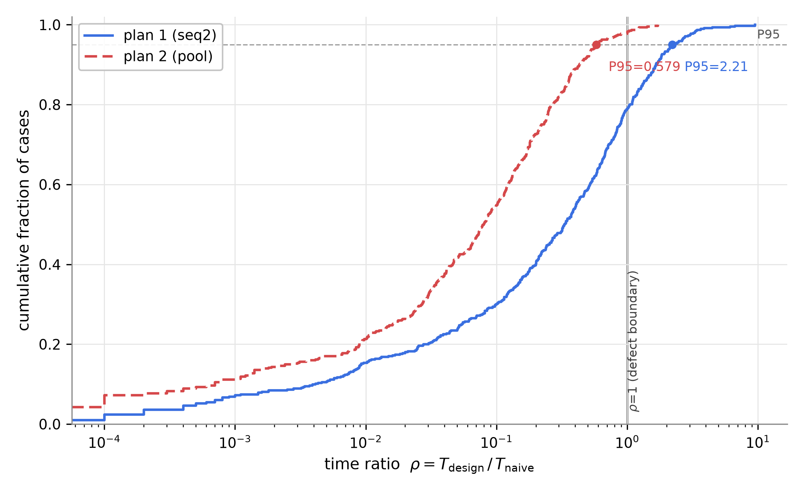
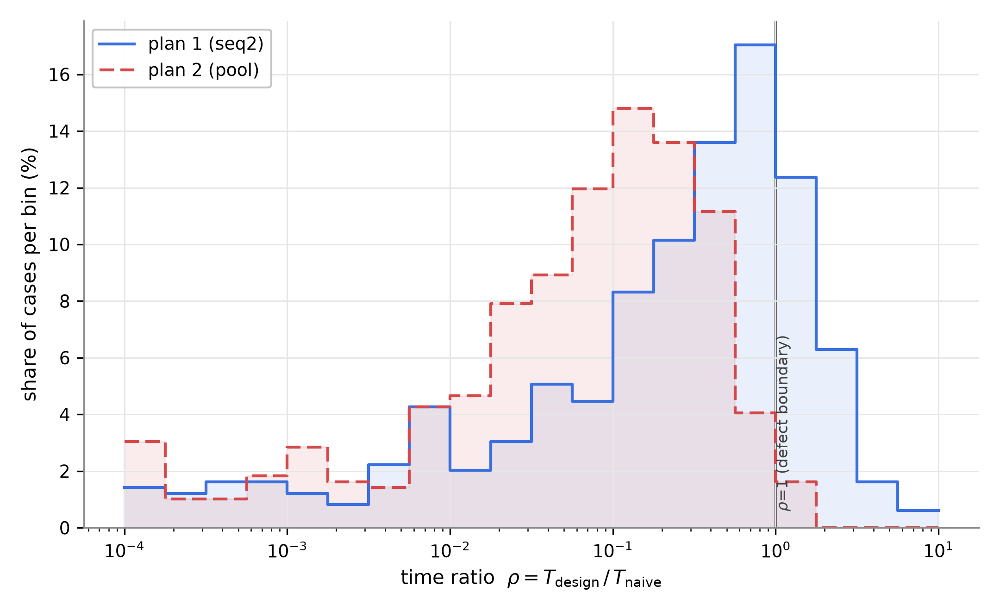
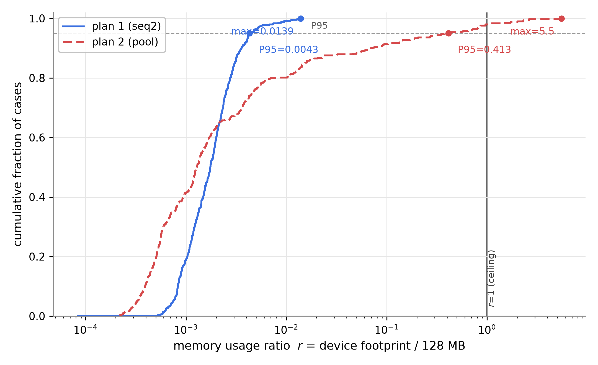
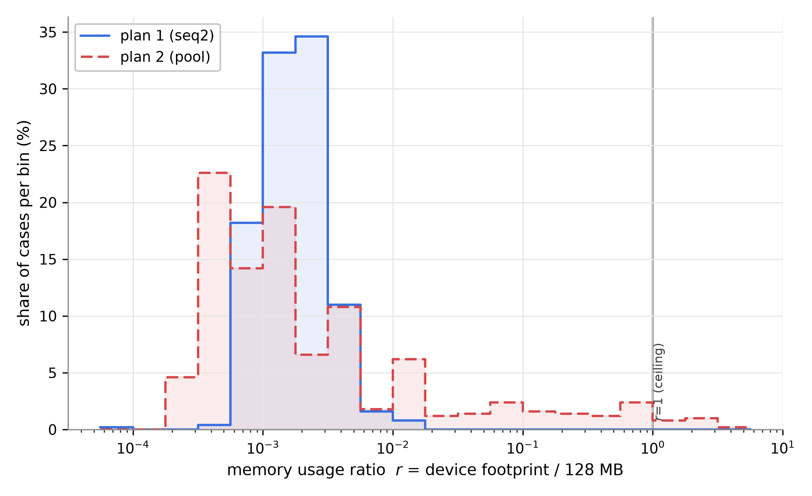

# 70. composite FIN2 측정 결과 보고 — 무함정 개정판 500건 (방안 1 seq2 vs 방안 2 pool)

> **지위**: dp-composite-agenda(복합 의제) 시나리오의 **FIN2 데이터셋 측정 결과 보고서**. FIN2는 정본 FIN([`63`](63-composite-final-측정-결과-보고.md))을 PL 지시(2026-08-14) 2건으로 개정한 판이다 — 구성 변경과 근거는 B절. 판정 기준의 정본은 [`24`](24-QA-측정-핸드북.md).
> **실측 원본 (RAW)**: [`composite-final-20260814T114929Z/`](../../poc/total/results/composite-final/composite-final-20260814T114929Z/) — raw.json(집계+측정 메타) · cases.jsonl(케이스×방안 1,000행, 스키마 = [`RAW-SCHEMA.md`](../../poc/total/results/composite-final/RAW-SCHEMA.md)) · breakdowns.json/md(재집계 파생물). 택틱(P6) 적용 측정은 [`71`](71-composite-final2-보완-택틱-적용-측정.md)에 별도 보고.
> **판정 체계**: FC = 달성률 · RU = 사용률 r의 **P95·최대값 2케이스 병행**(20%p 등분 사다리, 단일 인용 대표 = 최대값) · TB = ρ P95 — 24 §0 확정판(2026-08-14) 그대로. 63과 동일 세션 상한(60스텝)·합성 상수.

---

# 요약 (임원 보고용 — 본편)

## 슬라이드 1 — 무엇을 쟀고, 결과는

**대상**: 63과 동일한 복합 의제 2인 협상 설계안 2종 (방안 1 seq2 = 축별 순차 확정, 방안 2 pool = 압축 풀 일괄 협상).

**측정 판**: **FIN2 500건 전수** — FIN에서 두 가지를 개정한 판 (PL 지시 2026-08-14):

1. **경로 함정 제거 (전면 무함정)** — 8-10축의 경로 함정 53건을 일반(plain) 판으로 대체. 함정 판에서 seq2의 백트랙 시간이 과대해 결과가 왜곡된다는 판단. 결과적으로 FIN2는 **유효 함정 0건**이다 (11-12축 함정 슬롯은 FIN에서도 마진 불변식 미충족으로 전량 plain 대체였음 — 63 B2).
2. **18축 특이점 완화** — FIN의 RS(규모) 트랙에서 18축 2건만 pool의 k 심화(2→3)가 발동해 실물화가 3^18로 폭주(최악 4.7GB), 16축(13.7%)-20축(231%) 사이에서 18축(3,692%)만 비단조로 튀었다. FIN2는 RS 케이스에 **"k 심화 미발동" 안정 불변식**을 신설해 이 특이점을 생성 단계에서 제거했다 (방법·성격은 B3).

| 핵심 QA (판정 지표) | 방안 1 (seq2) | 방안 2 (pool) | 우세 |
|---|---|---|---|
| **1. 기능 정확성** — 달성률 | 0.922 **★4** | **0.938 ★4** | 방안 2 근소 (승패 157:172, 원값 +0.016) — **등급 동률** |
| **2. 자원(메모리)** ① r P95 | **0.43% ★5** | 41.3% ★3 | **방안 1** |
| **2. 자원(메모리)** ② r 최대 (대표) | **1.4% ★5** | 550% ★0 | **방안 1** (한도 초과 0 vs 10건 — 전부 20축) |
| **4. 시간** — ρ P95 | 2.21 ★0 (결함 103건) | **0.579 ★3** | **방안 2** (T 중앙 8.4s vs 2.2s) |

**한 줄 결론**: 함정을 걷어내자 **FC 격차는 등급 동률(★4)로 좁혀졌고**(FIN 0.880★3 vs 0.941★4 → 0.922 vs 0.938), 구도는 "시간의 방안 2 vs 메모리의 방안 1"로 남는다. 방안 2의 메모리 결함(20축 초과 10건)은 **P6 택틱으로 전량 해소됨을 71이 실측**했으므로(pool+P6: r 최대 4.9% ★5·초과 0건·FC −0.004), 종합 우위는 **방안 2 + P6** — 적용 조건은 FIN의 "≤16축"에서 "**20축까지 전 구간**"으로 확장된다. seq2의 시간 결함(ρ>1 103건)은 함정과 무관하게 남았다 — 축별 세션 구조의 상수 비용이 원인이다(슬라이드 2).

## 슬라이드 2 — 판정의 근거와 조건

1. **FC: 함정 제거 후에도 방안 2가 근소 우위다.** 일반 판(plain 355건)에서 0.912 vs 0.930 — FIN의 함정 판 격차(0.569 vs 0.955)가 사라진 자리에서, 남은 격차는 순차 확정의 근시(앞 축을 그때 최선으로 닫는 구조)가 만드는 상시 비용이다. 승패 157:71:172로 팽팽하다.
2. **RU: 특이점이 사라지고 순수한 지수 성장 프로파일이 남았다.** pool의 r 최악은 12축 2.0% → 14축 8.2% → 16축 37.8% → 18축 **96.3%(한도 이내)** → 20축 550%로 **단조** — FIN에서 18축만 튀던 왜곡이 제거됐다. 한도 초과 10건은 전부 20축(k=2 풀 자체가 한도를 넘는 규모). seq2는 전 구간 1.4% 이하.
3. **TB: seq2의 ρ>1 결함은 함정 탓이 아니었음이 분리 입증됐다.** 함정을 전부 제거해도 결함 103건(무함정 plain 101 + no_deal 2)이 남는다 — FIN의 152건 중 함정 몫(49건)만 사라진 것. 원인은 조합이 작은 판에서 축별 세션의 상수 비용(축당 통신 왕복)이 naive보다 비싼 구조다. ρ P95는 4.24 → 2.21로 절반이 됐지만 ★0(결함) 판정은 그대로다. 방안 2는 0.633 ★2 → **0.579 ★3**으로 한 계단 상승.
4. **바닥 요건은 양쪽 완벽**: 결렬 정답 45건 × 2방안 전건 정확 결렬, FR 위반 0, 무작위 이하 없음 (s = 0.66 vs 0.73).

**의사결정 프레임**: FC가 동급이 된 무함정 구도에서는 서열 2위(RU)·4위(TB)가 가른다 — 메모리는 P6 택틱으로 해소 가능(71 실측)하고 시간 결함은 seq2에 구조적으로 남으므로, **방안 2 + P6**를 기본 선택으로 권고한다. 경로 함정형 도메인(축 간 봉쇄가 실재하는 문제)에서는 FIN 측정(63)이 보여준 함정 격차를 함께 고려해야 한다 — 두 측정은 대체가 아니라 상보다(J 참조).

---

# 부록 (Appendix) — 상세 방어 자료

## A. 측정 체계 — QA 정의와 판정 규칙

63 A절과 동일하다 (정본 24 §1·§2·§4). 차이는 판정 체계의 시점뿐 — 본 측정은 24 §0 확정판(2026-08-14: RU 20%p 사다리 + P95·최대 2케이스 병행, FC 달성률, TB ρ P95)으로 **측정과 판정이 처음부터 일치**하는 실행이다 (63은 측정 후 사다리 개정분을 재환산 주석으로 반영했다).

## B. 데이터셋 — FIN2 500건 구성

### B1. 개요 (FIN 대비 변경 2건만 — 나머지 전부 동일)

| 항목 | FIN (63) | **FIN2 (본 보고)** |
|---|---|---|
| 총 케이스 | 500 = CR 400 + RS 100 | **동일** (수준별 건수·유형 비율·도메인·threshold 대역 동일) |
| 경로 함정 | 유효 53건 (8-10축) | **0건** — 8-10축 함정 슬롯 전부 plain 대체 (PL 지시: seq2 백트랙 시간 왜곡 해소) |
| RS 안정성 | 제약 없음 — 18축 2건 k 심화 폭주 (최악 4.7GB) | **k 심화 미발동 불변식** — 발동 판은 시드 교체 (18축 특이점 제거) |
| 시드 | BASE_SEED 20260813 | BASE_SEED **20260814** (케이스별 시드 체계 동일) |
| 저장 위치 | `datasets/composite/final/` (보존) | `datasets/composite/final2/` — `FIN2-*.json` + MANIFEST.md (**비파괴 신규**) |

구성 결과: plain 355(명목 함정 슬롯의 대체 28 포함) · no_deal 45 · stress 100. 생성 500건 · 실패 0.

### B2. 함정 제거의 성격

FIN의 hard_path 함정은 "앞 축 유혹을 좇으면 뒤 축을 잃는" 경로 의존 검증 장치였고, seq2 백트랙의 시간 비용(함정 판 라운드 중앙 121)이 TB 판정을 지배했다. PL 판단(2026-08-14)은 이 비용이 **일반적인 상황의 성능을 가리는 왜곡**이라는 것 — FIN2는 전 케이스가 일반 상황(현실 모사·결렬 정답·규모 스트레스)이다. 경로 의존 검증 자체는 폐기가 아니라 **FIN(63)의 몫으로 보존**된다 — 함정 실효의 기록(63 F절)은 그대로 유효하다.

### B3. RS 안정 불변식 — 방법과 성격 (정직한 기록)

- **방법**: RS 후보 케이스마다 pool을 세션 상한 60스텝으로 1회 실행해 **k 심화가 발동하는 순간 즉시 중단·기각**하고 시드를 교체한다 (기각 판은 심화 발동 사실만 확인 — 폭주를 실행하지 않는다).
- **성격**: 이것은 **방안 실행 결과에 의한 선별**이다 — 63 B2가 판정 트랙(CR)에 금지한 그 절차를, RS에 한정해 PL 지시로 도입했다. 정당화: RS 트랙의 목적은 합의 품질 판정이 아니라 **규모 성장의 수준 간 비교 관측**이고, k 심화는 수준 간 단조성을 깨는 이산적 특이 사건(발동하면 실물화가 (3/2)^n배 — 18축 3,325배)이라 "성장 추세"와 "심화 이벤트"를 한 표본에 섞으면 둘 다 못 읽는다. **CR(판정 트랙)에는 어떤 실행 선별도 없다.** 심화 동학 자체의 리스크는 사라진 것이 아니라 **P6 택틱(예산 게이트)의 설계 대상**으로 넘어갔다 — 71이 그 해소를 실측한다.
- 실측 검증: RS 100건 전부 불변식 통과, 측정에서도 심화 0회 — r 최악이 전 수준 단조가 됐다(E표).

### B4. 재현 방법

생성: `python scripts/generate_composite_final.py --v2` (BASE_SEED 20260814) — 완전 재현. CR은 oracle 검산(기대 결과·정착 여유), RS는 스키마 검증 + 안정 불변식. 측정: `experiments/composite_final.py --dataset final2` (+ `--plans poolka` = 71).

## C. 측정 환경과 RAW 데이터 체계

63 C절과 동일 (합성 상수·세션 상한 60스텝·결정론·RAW-SCHEMA 공유). 본 실행: commit `e4e4e37` · wall 2,928s (seq2+pool) · baseline 493/500 성공 (실패 7건 = RS 초대형의 POP_CAP/90s 상한 — ρ 모수 제외, raw.json 기록).

## D. 전체 결과 (정본 수치)

### D1. 종합 판정표

| 지표 | 방안 1 (seq2) | 방안 2 (pool) |
|---|---|---|
| **FC 달성률 (판정)** | 0.9222 **★4** | 0.9378 **★4** |
| 무작위 R̄ / 보조 s | 0.774 / 0.656 | 0.774 / 0.725 |
| FR 위반 케이스 | 0 | 0 |
| **RU r — 케이스 1: P95** | 0.43% **★5** | 41.3% **★3** |
| **RU r — 케이스 2: 최대값** (단일 인용 대표) | 1.4% **★5** | 550% **★0** |
| RU r 중앙 (참고) | 0.17% ★5 | 0.13% ★5 |
| 한도(128MB) 초과 | 0건 | **10건** (전부 20축) |
| **TB ρ P95 (판정)** | 2.207 **★0 (결함)** | 0.579 **★3** |
| TB ρ 중앙 / ρ>1 결함 | 0.330 / **103건 (20.6%)** | 0.080 / 8건 (1.6%) |

- FIN 대비 등급 변화: seq2 FC ★3→**★4**·TB P95 4.24→2.21(★0 유지), pool TB ★2→**★3**·RU 케이스1 ★3(48.2→41.3%). 방향 전부 "함정 왜곡 제거"와 정합.
- RU 중앙값은 동급 ★5 — 격차는 전부 규모 꼬리라는 63의 관찰이 그대로 재현된다.

### D2. 승패와 쌍대 (같은 케이스 직접 비교, CR 400건)

| 관점 | 값 |
|---|---|
| FC 승패 (방안1 승 / 무 / 방안2 승) | **157 / 71 / 172** (FIN 143/71/186 — 함정 몫이 빠져 접전) |
| T(방안1) ÷ T(방안2) 중앙 | **4.37배** (방안 2가 빠름) |
| 총 점유(방안2) ÷ 총 점유(방안1) 중앙 | **0.75배** (소규모에선 방안 2가 가벼움) |

## E. 축 수별 분석

CR 트랙 (오라클 판정 — 수준당 44-45건):

| 축 | seq2 FC | pool FC | seq2 ρP95 | pool ρP95 | seq2 rP95 | pool rP95 | pool 실물화 중앙 |
|---|---|---|---|---|---|---|---|
| 4 | 0.955 | 0.950 | 3.05 | 1.21 | 0.23% | 0.15% | 0.003MB |
| 5 | 0.908 | 0.933 | 3.34 | 1.00 | 0.21% | 0.13% | 0.005MB |
| 6 | 0.913 | 0.930 | 2.04 | 0.46 | 0.19% | 0.12% | 0.009MB |
| 7 | 0.923 | 0.938 | 2.06 | 0.51 | 0.23% | 0.19% | 0.013MB |
| 8 | 0.911 | 0.946 | 1.66 | 0.37 | 0.40% | 0.32% | 0.020MB |
| 9 | 0.916 | 0.929 | 1.93 | 0.39 | 0.51% | 0.37% | 0.041MB |
| 10 | 0.913 | 0.936 | 1.83 | 0.40 | 0.27% | 0.42% | 0.056MB |
| 11 | 0.928 | 0.942 | 1.82 | 0.28 | 0.41% | 0.52% | 0.086MB |
| 12 | 0.931 | 0.936 | 2.17 | 0.31 | 0.42% | 1.44% | 0.229MB |

FIN에서 함정 배치 구간(8-10축)에 있던 seq2 급락(0.741-0.828·ρP95 5.7-14.3)이 사라지고 **전 수준이 평평**해졌다 — 급락이 함정의 산물이었다는 63 해석의 대조 실증.

RS 트랙 (경량 — 수준당 20건, 최악값 표기):

| 축 | seq2 ρ최악 | pool ρ최악 | seq2 r최악 | pool r최악 | pool 실물화 중앙 | pool 총 점유 중앙 |
|---|---|---|---|---|---|---|
| 12 | 0.52 | 0.076 | 0.42% | 2.0% | 0.24MB | 0.71MB |
| 14 | 0.12 | 0.033 | 1.39% | 8.2% | 0.75MB | 2.13MB |
| 16 | 0.05 | 0.004 | 1.13% | 37.8% | 3.20MB | 8.52MB |
| 18 | 0.01 | 0.002 | 1.10% | **96.3%** | 13.50MB | 34.83MB |
| 20 | 0.001 | 0.0001 | 0.95% | **550%** | 57.05MB | 118.91MB |

**pool의 r 최악이 전 수준 단조**가 됐다 (FIN: 18축 3,692% > 20축 232%의 비단조). 초과는 20축에만 — k=2 풀(2^20 = 105만 조합) 자체가 한도를 넘는 규모라, 심화 없이도 초과하는 **구조적 경계가 18-20축 사이**에 있음이 드러난다. seq2의 r는 전 구간 1.4% 이하.

## F. 유형별 분석

| 유형 | n | seq2 FC | pool FC | seq2 합의 | pool 합의 | seq2 ρP95 | pool ρP95 |
|---|---|---|---|---|---|---|---|
| plain | 355 | 0.912 | 0.930 | 346/355 | **355/355** | 2.65 | 0.64 |
| no_deal | 45 | 1.000 | 1.000 | 0 (정답) | 0 (정답) | 0.76 | 0.21 |
| stress | 100 | — | — | 91/100 | 95/100 | 0.32 | 0.03 |

충돌 수준별 FC(plain): mid 0.926 vs 0.945 · low 0.927 vs 0.939 · high 0.912 vs 0.925 — 전 수준에서 방안 2가 근소 우위, 충돌이 높을수록 양쪽 다 하락.

## G. 공정성

함정이 없으므로 FIN의 함정 공정성 장치(pool_miss 등)는 해당 없음. 본 판의 공정성은 **양 방안에 동일한 일반 표본**이라는 사실 자체다: plain 격차 0.018은 구조(순차 근시 vs 압축 미스)의 차이만 반영하고, RU·TB는 각 방안의 구조 비용(지수 실물화 vs 축별 세션 상수 비용)을 그대로 드러낸다. RS 안정 불변식이 pool의 심화 리스크를 표본에서 제거한 것은 pool에 유리한 선별이므로 **B3에 성격을 명시**하고, 심화 리스크의 해소는 71(P6)이 실측으로 담당한다.

## H. 분포 분석

63 H절과 동일 규약 (ECDF + 밀도, ρ는 P95 마커·r는 P95/최대 2케이스 마커). 그림: [`figures/70/`](figures/70/) — 생성 스크립트 동일.

> 원본: [`figures/70/`](figures/70/)의 동명 `.tex` (standalone pgfplots) · 생성: [`plot_composite_final_dist.py`](../../poc/total/scripts/plot_composite_final_dist.py)

ρ·r 분위 (baseline 성립 493건 / 전 500건):

| 지표 | 방안 | p50 | p75 | p90 | p95 | 최악 |
|---|---|---|---|---|---|---|
| ρ | seq2 | 0.33 | 0.88 | 1.66 | **2.21** | 9.45 |
| ρ | pool | 0.08 | 0.22 | 0.43 | **0.58** | 1.71 |
| r | seq2 | 0.17% | — | 0.36% | **0.43%** | **1.4%** |
| r | pool | 0.13% | — | 7.1% | **41.3%** | **550%** |

seq2의 ρ는 p75(0.88)가 1 아래로 내려왔다(FIN은 p75 1.21) — 함정 몫이 빠진 효과. 그러나 p90(1.66)부터 결함 구간이라 ★0 판정은 유지된다.

## I. 통신·시간 관측 (트랙×방안 중앙값)

| 트랙 | 방안 | 라운드 중앙 | 합성 T 중앙 |
|---|---|---|---|
| CR | seq2 | 60 | 8.36s |
| CR | pool | 15 | 2.18s |
| RS | seq2 | 121 | 16.69s |
| RS | pool | 16 | 2.48s |

구조는 FIN과 동일 — 방안 1은 라운드 많고 가벼운 메시지, 방안 2는 라운드 적고 무거운 메시지. phase 항이 지배하므로 라운드 수가 곧 시간이다.

## J. 예상 질문 방어 (FAQ)

- **Q. 함정을 없앤 것은 방안 1(seq2)에 유리한 표본 조작 아닌가?** — 변경은 PL의 명시 지시이고 근거(백트랙 시간 왜곡)와 함께 B2에 기록했다. 효과도 대칭적이지 않다: seq2의 FC는 ★4로 올랐지만 **TB ★0 결함은 그대로 남아** "함정 탓"이라는 가설이 오히려 기각됐다. 그리고 FIN(63)은 폐기가 아니라 보존이다 — 경로 함정형 도메인의 판단에는 63을 쓴다. 두 측정의 관계는 "함정 있는 판 vs 없는 판"의 상보 관측이다.
- **Q. RS 안정 불변식은 pool에 유리한 선별 아닌가?** — 맞다, 그래서 B3에 성격("방안 실행 선별 — RS 한정, PL 지시")을 명시했다. 판정 트랙(CR)은 무선별이고, 제거된 심화 리스크는 은폐가 아니라 **P6 택틱의 해소 대상으로 이관**되어 71이 실측한다. FIN의 심화 폭주 기록(4.7GB)도 63에 그대로 남아 있다.
- **Q. FC가 등급 동률이 됐는데 왜 여전히 방안 2인가?** — 원값 +0.016·승패 172:157의 근소 우위에 더해, 서열 4위 TB에서 방안 2는 ★3, 방안 1은 결함(★0)이다. 방안 1이 이기는 축은 RU뿐인데 그 격차는 P6 택틱이 소거한다(71: 초과 0건·r 최대 4.9% ★5·FC 비용 −0.004). 반면 방안 1의 TB 결함은 축별 세션의 구조 비용이라 대응 택틱이 실측되지 않았다(66에서 S 계열 전부 PL 기각).
- **Q. seq2 ρ>1이 103건이나 남은 이유는?** — 전부 소규모 일반 판이다: 조합이 작으면 naive(전 조합 순위 교대)가 몇 제안 만에 끝나는데, seq2는 축마다 세션을 열어 축수 × 왕복의 상수 비용을 낸다. 규모가 커지면 역전된다 (RS에서 seq2 ρ 최악 0.001-0.52 — E표). 결함 구간과 seq2 권고 구간(대규모·메모리 지배)이 겹치지 않는다는 63 J의 해석도 그대로 성립한다.
- **Q. baseline 실패 7건 처리?** — 전부 RS 초대형(14-20축)의 POP_CAP/90s 상한. ρ 모수에서 제외하고 raw.json에 사유 기록(63과 동일 규약). 해당 규모에서 ρ는 양 방안 모두 0 근방이라 판정에 영향 없다.

## K. 한계와 후속

1. **FC는 CR에서만 판정** (오라클 한계) — 63과 동일.
2. **경로 의존 검증의 부재** — FIN2는 의도적으로 무함정이다. 경로 함정형 도메인 판단은 63과 상보로 읽어야 하며, FIN2 단독으로 "경로 의존이 문제없다"고 읽으면 오독이다.
3. **20축 한도 초과 10건**은 k=2 풀의 구조적 규모 — 심화와 무관하며, P6(예산 배분)로 해소 실측 완료(71). 원판 pool을 쓴다면 적용 구간은 "≤18축"(FIN의 ≤16축에서 완화).
4. 합성 상수·128MB 한도의 잠정성은 63 K3과 동일 (ENV-B 실측 대체 예정).
5. **별점 격차는 데이터셋 구성의 함수다** — FIN→FIN2에서 구성 변경만으로 FC 등급이 ★3→★4(seq2)로 움직였다. 구성·시드·변경 근거를 전부 공개하는 것(B절)이 이 한계의 관리 방식이다.
