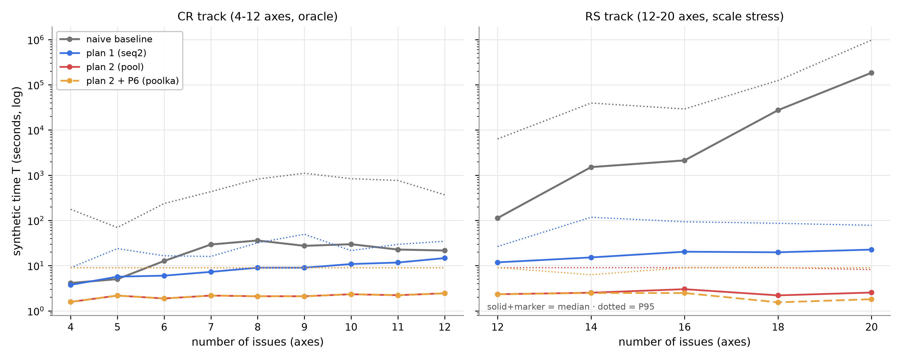

# 71. composite FIN2 보완 택틱 적용 측정 — P6 (k 비대칭 배분)

> **지위**: [`70`](70-composite-final2-측정-결과-보고.md)(FIN2 무함정 개정판 측정)의 짝 문서 — PL 채택 택틱 **P6(k 비대칭 배분)** 를 FIN2에 적용한 실측 보고. 택틱의 설계·후보 카탈로그·채택 경위는 [`66`](66-composite-보완-택틱-후보-분석.md), FIN(구성 변경 전)에서의 P6 실측은 66 §7이 정본이다.
> **실측 원본 (RAW)**: [`composite-final-20260814T113754Z/`](../../poc/total/results/composite-final/composite-final-20260814T113754Z/) — raw.json · cases.jsonl (`--plans poolka`, baseline 자체 계산 493/500 성공 — 70의 본 측정과 동일 실패 7건). 70의 본 측정과 **병렬 실행** (동일 commit `e4e4e37`, 동일 세션 상한·합성 상수).
> **판정 체계**: 24 §0 최종판 (RU [1%,100%] 로그 4등분 사다리 — 20%p에서 복귀 · P95·최대 2케이스 병행 · 단일 인용 대표 = 최대값).

---

## 1. 측정 대상

**P6 (k 비대칭 배분, `poolka`)** — pool의 축별 압축 폭 k를 전 축 동일(k=2) 대신 **가중치 비례로 차등 배분**하되 총 예산 ∏k_i를 지킨다 (예산 여유 시 k=2 바닥 보장 — 66 §7.2의 v2 확정판 그대로). 구현: [`tactics.py`](../../poc/total/src/total/adapters/composite/tactics.py) (vendor 불변 — 전략 서브클래스).

FIN2에서의 재측정 이유: ① 70의 무함정 판에서도 pool의 20축 한도 초과 10건이 남았고(FIN의 "18축+ 11건"에서 완화됐지만 소멸은 아님), ② FIN2의 RS 안정 불변식이 제거한 것은 **표본의 심화 특이점**이지 pool의 심화·규모 리스크 자체가 아니므로(70 B3), 그 해소를 택틱으로 실측해야 결론이 닫힌다.

## 2. 판정 결과 — pool(원판) vs pool+P6

| 판정 | 방안 2 (pool, 70 본 측정) | **방안 2 + P6 (poolka)** |
|---|---|---|
| **RU r — 케이스 1: P95** | 41.3% **★1** | **1.43% ★4** (29배 개선) |
| **RU r — 케이스 2: 최대값** (단일 인용 대표) | 550% (704MB) **★0** | **4.86% ★3** (113배 개선 — 결함 해소) |
| 한도(128MB) 초과 (전수 결함 게이트) | **10건** (전부 20축) | **0건** (결함 완전 해소) |
| FC 달성률 | 0.9378 ★4 | 0.9343 ★4 (−0.004 — 등급 불변) |
| 보조 s | 0.725 | 0.710 |
| TB ρ P95 | 0.579 ★3 | 0.594 ★3 (+0.015 — 등급 불변) |
| TB ρ 중앙 | 0.080 | 0.078 |

**핵심**: 무함정 판(FIN2)에서도 P6는 FIN에서와 같은 구조로 작동한다 — **메모리 결함(★0·초과 10건) 전량 해소 + 품질·시간 비용은 등급 불변 수준**. 로그 사다리에서 P6는 ★4·★3으로 seq2(★5·★4)에 한 칸 열세가 남는다 — 원값 3배 안팎의 차이(P95 0.43% vs 1.43%, 최대 1.4% vs 4.86%)가 등급에 반영된 것으로, 결함·한도 초과는 0이다.

## 3. RS 규모 프로파일 — 실물화 평탄화

| 축 | pool r최악 (원판) | **P6 r최악** | pool 실물화 중앙 | **P6 실물화 중앙** |
|---|---|---|---|---|
| 12 | 2.0% | 1.71% | 0.24MB | 0.24MB |
| 14 | 8.2% | 4.04% | 0.75MB | 0.32MB |
| 16 | 37.8% | 4.86% | 3.20MB | 0.47MB |
| 18 | 96.3% | 2.22% | 13.50MB | 0.40MB |
| 20 | **550%** | **2.28%** | 57.05MB | **0.53MB** |

원판 pool의 실물화가 축당 지수로 자라는(0.24 → 57MB) 반면, P6는 **축 수와 무관하게 0.24-0.53MB로 평탄**하다 — 예산 배분이 풀 크기의 상한을 고정하기 때문. FIN 측정(66 §7)의 "약 0.35MB 평탄"과 정합.

## 4. 카테고리별 종합 — FC · RU(P95·최대) · TB(ρ P95 + 실제 시간, naive 포함)

70 F2와 동일 규약 (시간은 합성 시간 모델의 절대값, naive T는 방안 무관):

**방안 2 + P6 (poolka):**

| 카테고리 | 건수 | FC | r P95 | r 최대 | ρ P95 | ρ 최악 | T 중앙 | T P95 | naive T 중앙 | naive T P95 |
|---|---|---|---|---|---|---|---|---|---|---|
| plain | 355 | 0.926 | 0.55% | 1.5% | 0.64 | 1.71 | 2.0s | 3.8s | 15.1s | 255.6s |
| no_deal | 45 | 1.000 | 0.18% | 0.9% | 0.21 | 0.82 | 9.0s | 9.0s | 270.3s | 2,176s |
| stress | 100 | — | **1.94%** | **4.9%** | 0.03 | 0.08 | 2.2s | 9.0s | 5,507s | 385,284s |

원판 pool(70 F2)과의 카테고리별 대비: **차이는 stress 한 칸에 집중**된다 — r P95 228.9% → 1.94%(118배), r 최대 550% → 4.9%(113배), T 중앙 2.5 → 2.2s(예산 풀이 더 작아 오히려 근소 단축). plain은 FC −0.004(0.930→0.926)·r P95 0.59→0.55%로 사실상 등가, no_deal은 완전 동일 결과(45/45 정확 결렬, ρ·T 동일)에 메모리만 가벼워졌다(r P95 0.51→0.18%). 즉 P6의 비용은 plain의 FC 미세 손실뿐이고 효과는 정확히 결함 지점(stress 규모)에 실린다.

### 4.1 축별 종합 (poolka)

70 E2와 동일 규약 (12축은 CR/RS 분리, naive T는 방안 무관):

| 축 | FC | r P95 | r 최대 | ρ P95 | ρ 최악 | T 중앙 | T P95 | naive T 중앙 | naive T P95 |
|---|---|---|---|---|---|---|---|---|---|
| CR 4 | 0.935 | 0.15% | 0.9% | 1.15 | 1.54 | 1.6s | 9.0s | 4.1s | 176.1s |
| CR 5 | 0.917 | 0.12% | 0.1% | 1.00 | 1.71 | 2.2s | 9.0s | 5.0s | 69.6s |
| CR 6 | 0.929 | 0.12% | 0.2% | 0.46 | 1.16 | 1.9s | 9.0s | 12.7s | 236.8s |
| CR 7 | 0.938 | 0.13% | 0.1% | 0.51 | 0.63 | 2.2s | 9.0s | 29.4s | 432.8s |
| CR 8 | 0.946 | 0.15% | 0.2% | 0.37 | 0.58 | 2.1s | 9.0s | 36.0s | 823.8s |
| CR 9 | 0.929 | 0.22% | 0.3% | 0.39 | 0.52 | 2.1s | 9.0s | 27.4s | 1,106.3s |
| CR 10 | 0.936 | 0.37% | 0.5% | 0.40 | 0.56 | 2.3s | 9.0s | 29.8s | 839.2s |
| CR 11 | 0.942 | 0.48% | 1.0% | 0.28 | 1.03 | 2.2s | 9.0s | 22.7s | 766.2s |
| CR 12 | 0.936 | 1.43% | 1.5% | 0.43 | 0.70 | 2.4s | 9.0s | 21.6s | 369.6s |
| RS 12 | — | 1.71% | 1.7% | 0.08 | 0.08 | 2.3s | 9.0s | 112.8s | 6,355.1s |
| RS 14 | — | 4.04% | 4.0% | 0.02 | 0.02 | 2.5s | 6.3s | 1,512.8s | 39,539.0s |
| RS 16 | — | 4.86% | 4.9% | 0.00 | 0.00 | 2.5s | 9.0s | 2,124.2s | 29,244.4s |
| RS 18 | — | 2.22% | 2.2% | 0.00 | 0.00 | 1.5s | 9.0s | 27,431.5s | 123,093.2s |
| RS 20 | — | 2.28% | 2.3% | 0.00 | 0.00 | 1.8s | 9.0s | 184,917.0s | 977,647.7s |

원판 pool(70 E2)과의 축별 대비 — 두 지점만 다르다:

- **RS 12-20축의 r가 지수 성장에서 평탄으로**: 원판 2.0 → 8.2 → 37.8 → 96.3 → 550% vs P6 1.7 → 4.0 → 4.9 → 2.2 → 2.3% — 예산이 풀 크기의 상한을 고정하므로 축이 늘어도 r가 자라지 않는다.
- **CR 4-5축의 FC 미세 하락** (0.950→0.935, 0.933→0.917): 소형 판에서는 예산 여유가 커서 P6가 k=2 바닥 위에 상위 축 후보를 추가 배분하는데, 이 더 넓은 풀이 일부 판에서 다른(더 나쁜) 합의로 이끈다 — §5의 "결과 상이 20건 (개선 5/악화 15)"의 실체이며 FC 순비용 −0.004의 출처다. 6축 이상 CR·ρ·T는 원판과 사실상 동일.

### 4.2 실제 시간(T) 통계 — 최소 · 평균 · 중앙 · P95 · 최대

poolka의 카테고리별 T 전 통계 (70 F3과 동일 규약 — naive는 70 F3 참조, 방안 무관):

| 카테고리 | 최소 | 평균 | 중앙 | P95 | 최대 |
|---|---|---|---|---|---|
| plain | 0.2s | 2.1s | 2.0s | 3.8s | 7.5s |
| no_deal | 0.0s | 8.2s | 9.0s | 9.0s | 9.0s |
| stress | 0.0s | 2.6s | 2.2s | 9.0s | 9.0s |

원판 pool과 사실상 동일하다 (plain 평균 2.1s 동률, stress 평균 3.1→2.6s — 예산 풀이 더 작아 근소 단축). 축 수별 시간 곡선은 70의 그림 E-1에 P6(주황 파선)가 함께 그려져 있다:

## 5. 안전성 게이트 (66 §5 규약)

- 결렬 정답 45/45 정확 결렬 · FR 위반 0 · 무작위 이하 없음.
- 원판 pool과 결과가 다른 케이스 **20건** (개선 5 / 악화 15 — 전부 plain) — FC 순비용 −0.0035. 악화가 다수인 것은 예산 배분이 균일 k=2와 다른 풀을 만드는 대가로, FIN 측정(66 §7.2 — 상이 11건)보다 소폭 늘었지만 등급에는 무영향.
- 한도 초과 결함 10 → 0건.

## 6. 결론

1. **70의 종합 권고("방안 2 + P6")의 실측 근거가 이것이다** — P6 적용으로 방안 2의 유일한 결함 축(RU)이 ★0·초과 10건에서 **★4·★3·초과 0건**이 되어, 적용 조건이 FIN의 "≤16축" → FIN2 원판의 "≤18축" → **P6 적용 시 20축까지 전 구간**으로 확장된다.
2. seq2 대비 최종 구도 (FIN2): FC 0.934 vs 0.922(P6 우위, 등급 동률 ★4) · RU는 P6 ★4·★3 vs seq2 ★5·★4 — **한 칸 열세**(결함은 아님) · TB **★3 vs ★0(결함)** — 결함 축은 seq2에만 남는다.
3. 잔여 과제: ① 두 케이스 모두 경계 직상 — P95 1.43%는 ★5 경계(1%), 최대 4.86%는 ★4 경계(3.2%)의 바로 위라 예산 상한(B_MAX) 스윕으로 한 칸 상승 여지가 있다 (66 §7.3과 동일 구도). ② FC 미세 비용(−0.004)도 같은 스윕의 조정 변수다.

---

_수치는 전부 RAW(run `composite-final-20260814T113754Z` · 원판 비교는 `composite-final-20260814T114929Z`)에서 재검산 가능하다._
