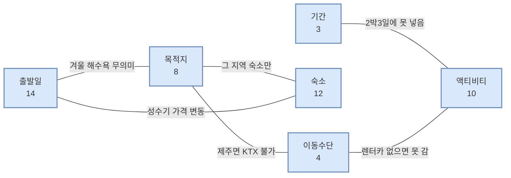
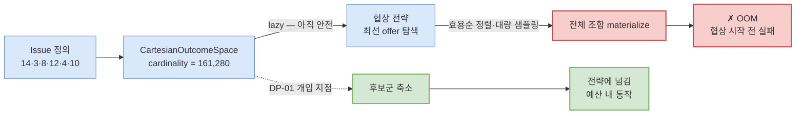
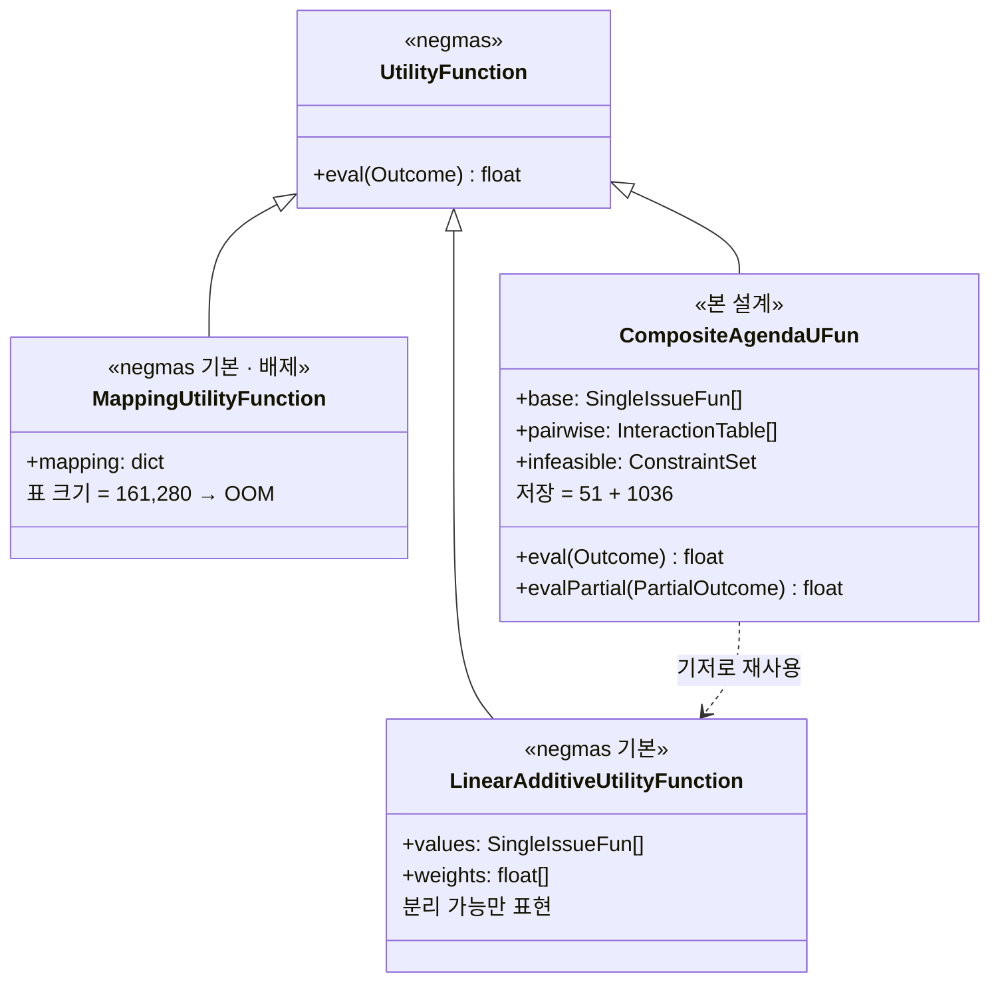
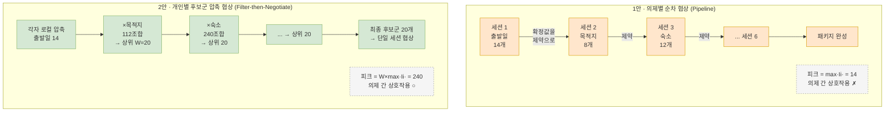

# DP-01 — 복합 의제 협상의 후보군 구성 전략

> **부제**: 메모리 예산 ↔ 합의 품질
> *Outcome-Space Construction Strategy for Multi-Issue Negotiation*
> **문서 성격**: 발표 슬라이드 2장(배경 / 설계) 내용 초안
> **대응 QA**: Resource Utilization(Memory) · Functional Correctness · Scalability(의제 조합 수)

## 후보안

| | 이름 | 아키텍처 스타일 | 전술(Tactic) | 한 줄 |
|---|---|---|---|---|
| **1안** | **의제별 순차 협상** | *Pipeline* | 자원 요구 관리 — 계산 오버헤드 감소 | **곱을 합으로** — 메모리 최소, 상호작용 포기 |
| **2안** | **개인별 후보군 압축 협상** | *Filter-then-Negotiate* | 자원 요구 관리 — 유지 개수 상한(W) | **곱은 두되 폭을 고정** — 상호작용 보존 |

---

# 슬라이드 1 — 배경

## 복합 의제 협상은 왜 시작조차 못 하는가

### 1. 복합 의제란

> 하나의 협상에서 **여러 의제를 한 묶음(패키지)으로** 합의하는 것.
> NegMAS 용어로 **multi-issue**, 후보군은 `OutcomeSpace`(조합 하나 = `Outcome`).

```
일정 잡기    날짜7 × 시간8                                  =      56
영화 예약    날짜7 × 영화6 × 영화관5 × 시간4                =     840
여행 계획    출발일14 × 기간3 × 목적지8 × 숙소12
             × 이동수단4 × 액티비티10                        = 161,280
                            ↑ 의제 2개 → 6개, 후보는 2,880배
```

후보 수 = **의제들의 곱** (`cardinality = ∏|Issue|`). 의제 하나 추가는 덧셈이 아니라 **배수**다.

### 2. 문제는 두 겹이다

**(1) 곱셈적 폭발 vs 상수 예산**

| | 성장 |
|---|---|
| 후보군 | **곱셈적** |
| 앱 가용 메모리 | **상수** |

클라우드라면 다 만들어놓고 고르면 된다. **온디바이스는 예산이 고정이라, 곱셈적으로 자라는 것을 상수 안에 넣어야 한다.** 코드 최적화로는 풀 수 없고 **성장률 자체를 바꿔야** 하는 문제다.

**(2) 쪼개서 줄이는 것도 안 된다 — 의제는 서로 얽혀 있다**



*"제주도인데 KTX"*, *"겨울인데 해수욕"* — **각 의제만 보면 다 괜찮은 값인데, 조합에서만 틀린 게 드러난다.**

> **효용은 조합에서만 정의된다.** 의제를 따로 떼어 평가할 수 없다.

→ 그래서 문제가 두 겹이다: **크면서 동시에 쪼갤 수도 없다.**

### 3. OOM은 어디서 터지는가



**핵심**: outcome space를 *만들 때*가 아니라, **협상 전략이 그 공간을 훑을 때** 터진다. Cartesian 공간 자체는 `Issue` 목록만 저장하므로 가볍지만, negotiator가 "지금 낼 최선의 offer"를 고르려면 후보를 효용순으로 정렬하거나 대량 샘플링해야 한다.

→ **전략에 넘기기 전에 후보군을 줄여야 한다.** 그 지점이 DP-01이다.

### 4. 왜 아키텍처 결정인가

**① 프레임워크가 이미 결정 지점을 남겨뒀다**

NegMAS는 전부 열거가 불가능할 수 있음을 전제로 `enumerate_or_sample()`, `sample(n_outcomes)`, `limit_cardinality()`를 제공한다. **"우리가 지어낸 문제"가 아니라, 프레임워크가 사용자에게 위임한 정책 결정이다.**

**② 되돌리기 비용이 크다**

후보군 생성 방식이 `OutcomeSpace`의 **타입 자체**를 정한다.

| | 만들어지는 타입 |
|---|---|
| 1안 | `CartesianOutcomeSpace` (세션마다 단일 issue) |
| 2안 | 열거형 `OutcomeSpace` (압축된 패키지 집합, issue 구조 없음) |

그리고 이 타입이 효용함수 표현·협상 전략의 전제가 된다. 나중에 바꾸려면 그 위에 쌓은 것을 함께 들어내야 한다.

**③ QA가 정면 충돌한다**

```
Resource Utilization(Memory)   ← 작게 만들어라
        ⇕
Functional Correctness          ← 최적해를 놓치지 마라
   U(합의결과) / U(최적합의안) ≥ α_th
```

**이 충돌의 조정이 곧 설계 결정이다.**

---

# 슬라이드 2 — 설계

## 곱을 합으로 바꿀 것인가, 폭을 고정할 것인가

### 1. 설계 요구 — 상호의존 전제 하에서

| | 요구 |
|---|---|
| ① | 평가는 **패키지 단위**여야 한다 (의제별 독립 점수 금지) |
| ② | 후보군 생성은 **전체를 만들지 않고** 예산 안에 머물러야 한다 |
| ③ | ①+② → **부분 패키지를 평가하며 점진 확장** |

> **왜 ①인가**: 압축 결과가 곱(∏) 형태로 표현되면 상호작용을 담을 수 없다.
> `(월,갈비) (화,초밥) (수,파스타)` 3개만 유효한데 이를 Cartesian으로 표현하면
> `날짜{월,화,수} × 식당{갈비,초밥,파스타}` = 9개 — **원치 않는 6개가 반드시 딸려온다.**
> Cartesian 구조는 **임의의 부분집합을 표현할 수 없다.**

### 2. 효용 표현 — LinearAdditive로는 부족하다



```
U(x₁..xₙ) = Σ wᵢ·uᵢ(xᵢ)        ← 분리 가능 기저 (LinearAdditive 재사용)
          + Σ cᵢⱼ(xᵢ, xⱼ)       ← 쌍별 상호작용 보정
          + penalty(불가능 조합)
```

| 표현 | 저장 항목 수 |
|---|---|
| Mapping (전체 표) | **161,280** — 효용함수가 OOM을 유발 |
| 의제별 표 Σ\|Iᵢ\| | 51 |
| 쌍별 표 Σ\|Iᵢ\|·\|Iⱼ\| (15쌍) | 1,036 |
| **합계** | **1,087 — 약 148배 작음** |

> **상호작용을 쌍 단위로 제한하면, 효용 표현이 곱에서 합으로 내려온다.**
> 3중 이상 상호작용은 포기하는 대신 실질적 상호작용 대부분을 잡는다.

### 3. 두 후보안



**1안 · 의제별 순차 협상** — 세션을 의제마다 열고, 앞 세션 확정값을 뒤 세션의 제약으로 주입한다.
던지는 offer는 **의제 값 하나** — `(제주도,)`

**2안 · 개인별 후보군 압축 협상** — 각 단말이 의제를 하나씩 붙이며 매 단계 상위 W개만 남겨 자기 최종 후보군을 만들고, 그 위에서 단일 세션으로 협상한다.
던지는 offer는 **패키지 통째** — `(6/14, 3박, 제주, 호텔A, 렌터카, 서핑)`

### 4. Trade-off

| | 1안 의제별 순차 협상 | 2안 개인별 후보군 압축 협상 |
|---|---|---|
| 아키텍처 스타일 | Pipeline | Filter-then-Negotiate |
| OutcomeSpace 타입 | Cartesian (단일 issue) | 열거형 (패키지 집합) |
| 세션 수 | 의제 수 (6) | **1** |
| offer 단위 | 의제 값 (1-튜플) | 패키지 (6-튜플) |
| **피크 메모리** | **14** (1/11,520) | 240 (1/672) |
| 의제 간 상호작용 | ✗ 구조적으로 불가 | ○ |
| **손실 지점** | **분해하는 순간** (구조적) | **압축하는 순간** (조절 가능) |
| 다이얼 | **없음** | **W (유지 개수)** |
| 실패 양상 | 뒤 의제에서 후보 전멸 → backtrack | 후보군 불일치 → 합의 실패 |

> **핵심**: 2안의 손실에는 다이얼이 있고, 1안의 손실에는 없다.
> 메모리를 더 써서 정확성을 되살릴 수 있는 쪽과, 더 써도 이미 정보를 버린 쪽의 차이다.

### 5. 측정 — 두 QA가 짝으로 trade-off를 포착

```
Resource Utilization(Memory)    "얼마나 아꼈나"          → 앱 가용 예산 ≤ α%
Functional Correctness          "아끼느라 얼마나 잃었나"   → U비율 ≥ α_th
Scalability(의제 조합 수)        "의제가 늘면 어떻게 되나"  → 증가량 ≤ α
```

어느 하나만으로는 결정할 수 없다 — **이 DP가 진짜 trade-off 결정임을 보여주는 구조**다.

**검증 시나리오 역할 분담**
- **영화 예약** (840): 불가능 조합이 지배적 → *제약 우선 축소*의 효과 검증
- **여행 계획** (161,280): 가능하지만 나쁜 조합이 지배적 → *후보군 압축*의 효과 검증

### 6. 미해결 (sub-decision)

1. **부분 조합 평가 방법** — NegMAS ufun은 완전 outcome을 전제한다. 미정 의제를 **낙관적 상한**으로 채우는 방식이 이론적으로 안전하다(좋은 후보를 실수로 버리지 않음).
2. **쌍별 상호작용 계수 cᵢⱼ의 출처** — 사용자 입력 / LLM 추론 / 도메인 규칙. 정확성의 상한을 정한다.
3. **2안의 유지 개수 W** — 메모리↔정확성 다이얼. 실측으로 결정.
4. **2안의 의제 확장 순서** — 피크가 `W × |다음 의제|`이므로 큰 의제를 뒤에 두면 피크가 커진다.
5. **1안의 backtrack 정책** — 뒤 의제에서 후보 전멸 시 어디까지 되돌아갈지.

---

## 부록 — 발표 시 논거 순서

가장 강한 순서로 배치한다.

1. **NegMAS가 이미 이 문제를 인정한다** (`enumerate_or_sample`, `limit_cardinality`) — 반박하기 가장 어려운 당위성 논거
2. **곱셈 vs 상수의 구조적 불일치** — 튜닝이 아니라 아키텍처 문제임을 확립
3. **쪼갤 수도 없다 (상호의존)** — 문제를 두 겹으로 만들어 난이도 부각
4. **두 QA가 짝으로 충돌한다** — 측정 가능한 trade-off로 마무리

## 확인 필요

- 클래스명(`MappingUtilityFunction` 등)과 열거형 OutcomeSpace의 정확한 클래스명은 설치된 NegMAS 버전에서 확인 필요
- 의제별 후보 개수(14·3·8·12·4·10)는 예시값 — 실제 유스케이스 정의값이 있으면 교체
- α%, α_th 값을 슬라이드에 숫자로 넣을지 기호로 둘지
- 여행 계획이 정식 범위인지, "확장 시나리오"로 표기할지
