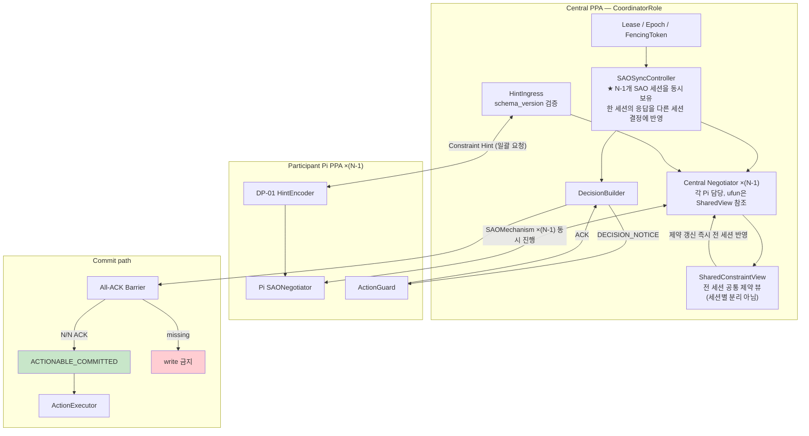
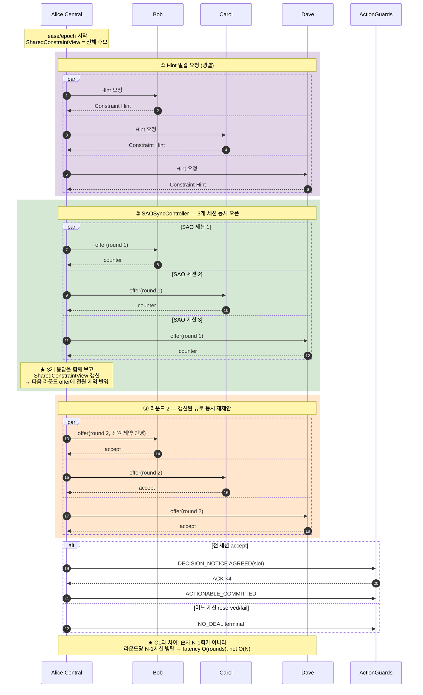

# DP-02 추가 후보 — C1-B Central Concurrent (일괄 제안 · 합의 반영)

> **역할:** [`DP-02`](DP-02-negmas-nparty-negotiation.md)의 C1(Central **Sequential**)에 대비되는 **Central Concurrent** 후보. 참가자를 한 명씩 순차로 만나는 대신, **N−1개 SAO 세션을 동시에 열고 각 라운드의 응답을 모아 다음 라운드 제안에 반영**한다.
> **주 QA:** QA-04 — Performance Efficiency > Time Behaviour (C1의 O(N) 직렬 latency 해소가 목적)
> **관련 QA:** QA-03 — Reliability > Maturity, **QA-SC-1** 특히 부하 집중 지수 κ와 메시지 확장 지수 b_msg
> **입력 계약:** [DP-01](DP-01-enhanced-candidates.md) Constraint Hint (권고)

---

## ⚠ 0. 먼저 구분해야 할 것 — "폐기된 Full Context"와 무엇이 다른가

DP-02 §1.2는 *"전체 수집 후 솔브"* 방식을 **폐기**했고, §2 매핑표는 *"C1 Full Context Coordinator → 강등 — raw Soft 수집은 Privacy·Memory 불리"* 라고 적었다. 본 C1-B는 겉보기에 "한 번에 다 보낸다"는 점이 비슷해 보이지만 **본질이 다르다.**

| | 폐기된 Full Context Coordinator | **C1-B Central Concurrent** |
|---|---|---|
| Central이 받는 것 | 참가자의 **raw Soft Preference 전체** | **Constraint Hint만** (DP-01 계약, C1과 동일) |
| 결정 방식 | Central이 **내부 CSP/휴리스틱으로 혼자 계산** | **실제 SAOMechanism 협상** ×(N−1), 참가자가 offer/counter로 실제 참여 |
| 참가자의 지위 | 정보 제공자 (협상 주체 아님) | **협상 주체** — 각자 자기 negotiator로 수락·거절·역제안 |
| Privacy | Soft 노출 → 불리 | C1과 동일 수준 (Hint만) |
| Memory | 전 참가자 Soft 테이블 상주 | Hint + N−1 세션 상태 |

즉 **폐기된 것은 "협상 없이 Central이 혼자 푸는 것"이지 "동시에 진행하는 것"이 아니다.** C1-B는 협상의 실체(SAO)를 유지한 채 *진행 순서만* 순차→병렬로 바꾼다.

한편 §1.2의 각주는 `SAOSyncController`가 *"on-device 1차 Central 기본이 아님 (예측 가능한 Memory·Latency를 위해 sequential 우선)"* 이라고 적었다. 본 후보는 그 판단을 **뒤집자는 것이 아니라, 측정으로 확인하자는 것**이다 — sequential의 O(N) latency가 N=7~10에서 deadline을 위협한다면 동시 세션의 Memory 비용을 지불할 가치가 있는지가 실측 대상이다.

---

## 1. 이해하기 쉬운 설명

C1(Sequential)이 **"총무가 A와 만나고 → 그 결과 들고 B와 만나고 → C와 만나는"** 방식이라면, C1-B는 **"총무가 A·B·C 모두에게 동시에 같은 안을 던지고, 세 사람 반응을 한꺼번에 받아본 뒤 다음 안을 만드는"** 방식이다.

단톡방에 비유하면:
- **C1**: 총무가 A에게 개인톡 → 합의 → B에게 개인톡 → 합의 → C에게 개인톡
- **C1-B**: 총무가 세 명에게 각각 개인톡을 **동시에** 보내고, 세 답장을 다 본 다음 2차 제안을 다시 동시에 발송

핵심은 **"각 라운드마다 전원의 반응을 함께 본다"** 는 것. C1은 Bob의 제약이 Carol과 협상할 때 반영되지만 *Carol의 제약은 Bob과 협상할 때 반영되지 못했다*(이미 지나간 순번). C1-B는 라운드 2부터 **전원의 제약이 전원에게 동시에 반영**된다.

---

## 2. 구조도 — 컴포넌트와 책임

**C1과의 컴포넌트 차이:**

| | C1 Sequential | C1-B Concurrent |
|---|---|---|
| 오케스트레이션 | `SequentialSaoOrchestrator` | **`SAOSyncController`** (NegMAS 표준 controller) |
| 상태 | `CumulativeState` — 앞 세션 결과가 순차 누적 | **`SharedConstraintView`** — 전 세션이 같은 뷰를 동시 참조 |
| Negotiator 수 | 1개 (상대만 교체) | **N−1개 동시 인스턴스** |

---

## 3. 구조도 — 시간 순서 (N=4, Central=Alice)

---

## 4. 단계별 동작

1. Participant 중 1명이 `CoordinatorRole` 활성화 (lease/epoch/fencing — C1과 동일).
2. **Hint 일괄 요청** — 전 참가자에게 동시 발송, 응답 수집. `HintIngress`가 schema 검증.
3. `SAOSyncController`로 **N−1개 `SAOMechanism` 동시 생성**. 각 세션의 Central 측 negotiator는 **같은 `SharedConstraintView`를 참조**하는 ufun을 가진다.
4. **라운드 루프**:
   - 전 세션에 동시 offer 발송
   - 라운드 배리어 — 전 세션 응답 수신 대기 (또는 라운드 timeout)
   - 수신한 응답으로 `SharedConstraintView` 갱신 → **다음 라운드 offer에 전원 제약 반영**
   - 전 세션 accept면 종료, 아니면 다음 라운드
5. 종료 시 `Decision` 생성 → `DECISION_NOTICE` → All-ACK → `ACTIONABLE_COMMITTED`.

**C1 대비 핵심 이득**: latency가 `Σ(세션별 시간)`이 아니라 `라운드 수 × 라운드 1회 시간`이 된다. 라운드 수가 N에 비례하지 않으면 **latency가 N에 대해 거의 평탄**해진다.

---

## 5. Failure

| Case | 동작 |
|---|---|
| Central fail-stop | backup이 lease delay 후 takeover; fencing으로 stale action 차단 (C1과 동일) |
| **일부 세션만 응답 없음** | 라운드 timeout 후 **미응답 세션을 reserved로 간주** → 기본 `NO_DEAL`. C1처럼 "그 지점에서 즉시 중단"이 아니라 *라운드 경계에서 판정*하므로 다른 세션의 진행 결과는 보존됨 |
| **라운드 배리어 지연** | 가장 느린 세션이 라운드 전체를 지연시킴 — C1-B의 고유 비용 (C1은 순차라 이 문제가 없음) |
| 세션 간 제약 모순 | Bob은 A안, Carol은 B안만 가능 → `SharedConstraintView`가 공집합 → 즉시 `NO_DEAL` |
| ACK 미수합 | commit·calendar write 금지 (전 후보 공통) |

---

## 6. NegMAS 매핑

| 개념 | NegMAS |
|---|---|
| 동시 세션 관리 | **`SAOSyncController`** — 여러 `SAOMechanism`에 동시 참여하며 세션 간 정보를 공유하는 표준 controller |
| 각 세션 | `SAOMechanism` (negotiator 2명: Central 측 + Pi) |
| 세션 간 정보 공유 | controller가 보유한 `SharedConstraintView`를 각 negotiator의 ufun이 참조 |
| 라운드 동기화 | controller의 `counter_all()` 계열 — 전 세션 응답을 모아 한꺼번에 다음 수를 결정 |
| 전략 | `AspirationNegotiator` 등 (C1과 동일) |

> `SAOSyncController`의 정확한 API 시그니처와 라운드 동기화 의미론은 구현 전 NegMAS 문서로 확인 필요. 본 문서는 *"동시 세션 + 세션 간 정보 공유"* 라는 개념 수준의 매핑만 확정한다.

---

## 7. 시나리오

| ID | 상황 | 일어나는 일 | 기대 결과 |
|---|---|---|---|
| C1B-S1 Happy | 3세션 모두 라운드 2에 accept | 병렬 진행 후 All-ACK | `AGREED`, latency ≈ 2라운드 |
| C1B-S2 제약 모순 | Bob과 Carol의 Hard가 상충 | 라운드 1 응답 취합 시 SharedView 공집합 | `NO_DEAL`, **C1보다 빨리 발견** (C1은 Carol 순번까지 가야 알 수 있음) |
| C1B-S3 느린 세션 | Dave 응답이 매 라운드 지연 | 라운드 배리어가 Dave를 기다림 | latency가 **최악 세션에 지배됨** — C1-B의 약점 |
| C1B-S4 Central crash | 라운드 2 진행 중 fail-stop | backup takeover + fencing; N−1 세션 상태 복원 필요 | **복원 대상이 C1보다 많음** (세션 1개 → N−1개) |
| C1B-S5 Memory 압박 | N=10, 9개 세션 동시 상주 | 세션 상태 × 9가 동시에 메모리 점유 | **QA-RU-1 측정 대상** — sequential 대비 피크 메모리 증가 |

---

## 8. C1 Sequential vs C1-B Concurrent 비교

| 항목 | C1 Sequential | C1-B Concurrent |
|---|---|---|
| Latency | **O(N)** — 세션 시간의 합 | **O(라운드 수)** — N에 거의 무관 |
| 동시 세션 상태 | 1개 | **N−1개** (Memory 부담) |
| 전원 제약 반영 시점 | 마지막 순번에서야 완성 | **라운드 2부터 전원 반영** |
| 모순 조기 발견 | 늦음 (해당 순번까지 진행해야) | **빠름** (라운드 1 취합에서) |
| Central 복구 비용 | 세션 1개 + CumulativeState | **N−1 세션 상태** |
| 지연 전파 | 없음 (순차라 각자 자기 시간) | **있음** — 최악 세션이 라운드 지배 |
| 부하 집중 κ | 높음 (N−1 세션 순차) | **더 높음** (N−1 세션 동시) |

**핵심 트레이드오프**: **Latency(C1-B 유리) ↔ Memory·복구 복잡도(C1 유리)**. QA-SC-1의 SC-N-1(시간 지수 b)에서는 C1-B가, QA-RU-1(자원)과 SC-N-3(κ)에서는 C1이 유리할 것으로 예상된다 — 실측으로 확인해야 한다.

---

## 9. 채택 방향

- C1-B는 **C1의 대안이지 대체가 아니다.** 두 후보를 동등 비교 대상으로 유지하고 측정 후 ADR로 확정한다.
- **선택 기준**: N=7~10에서 C1의 O(N) latency가 deadline(M04-1)을 위협한다면 C1-B의 Memory 비용을 지불할 가치가 있다. 반대로 Memory가 먼저 한계에 닿으면 C1이 옳다.
- §1.2 각주의 *"sequential 우선"* 판단은 **폐기가 아니라 검증 대상**으로 격상한다.

---

## 10. 남는 결정 사항

1. **라운드 배리어 timeout 값** — 느린 세션을 얼마나 기다릴지. 너무 짧으면 정상 세션도 reserved 처리, 너무 길면 C1-B의 latency 이점이 사라짐.
2. **부분 응답 라운드 진행 허용 여부** — N−1 중 일부만 응답해도 그 정보로 다음 라운드를 시작할지, 전원 대기할지. 전자는 빠르지만 SharedView 일관성이 흔들림.
3. **`SAOSyncController` 실제 API 확인** — 세션 간 정보 공유가 NegMAS에서 어느 수준까지 지원되는지 구현 전 검증 필요.
4. **Central 복구 시 N−1 세션 상태 복원 전략** — 전 세션을 복원할지, 처음부터 재시작할지. C1보다 복구 상태가 크다.

---

_본 문서는 [`DP-02`](DP-02-negmas-nparty-negotiation.md)의 C1에 대비되는 C1-B 후보다. §0에서 밝혔듯 폐기된 "Full Context Coordinator"(raw Soft 수집 + 내부 솔브)와는 본질이 다르며, Constraint Hint 계약과 실제 SAO 협상을 유지한 채 진행 순서만 병렬화한 안이다._
