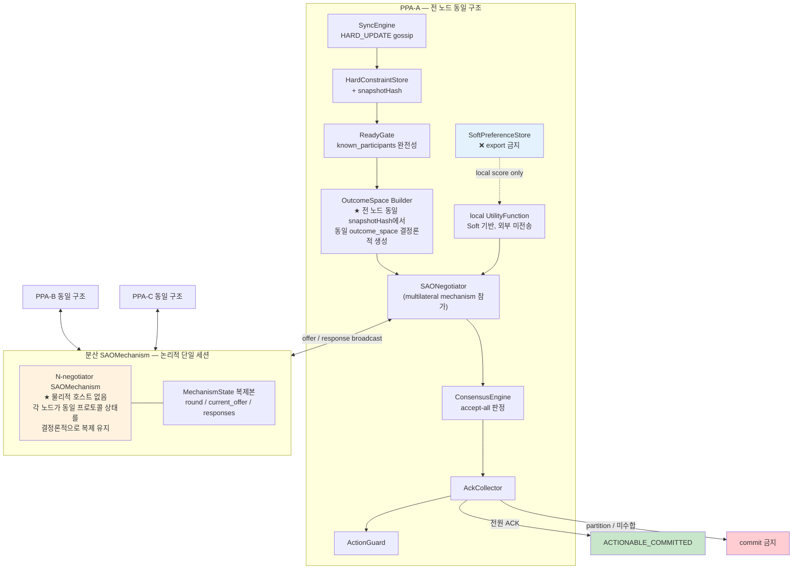
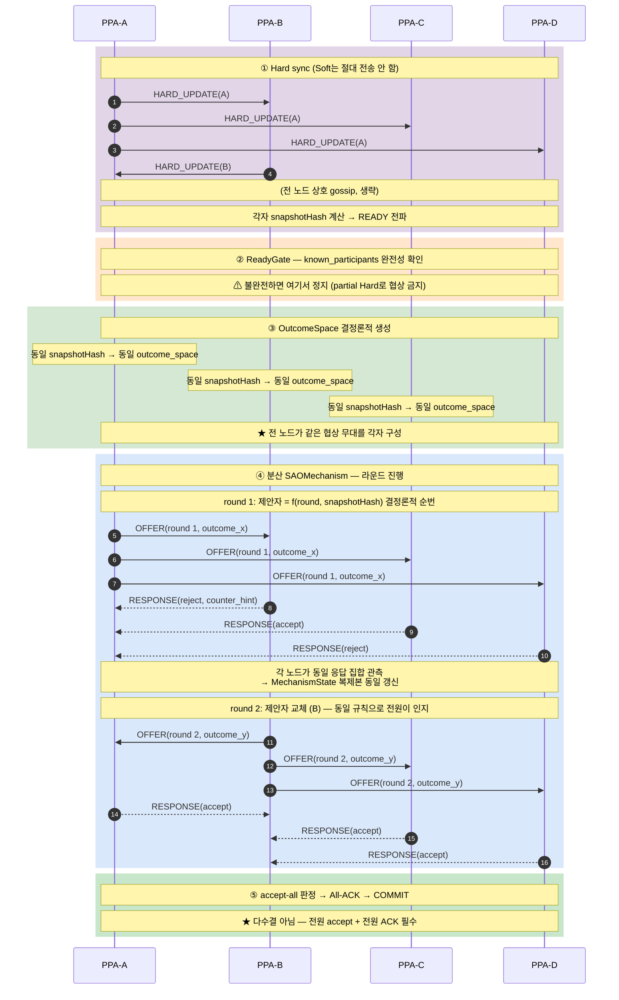

# DP-02 C2 상세 — Distributed NegMAS Multilateral (분산 협상의 NegMAS 적용)

> **역할:** [`DP-02`](DP-02-negmas-nparty-negotiation.md) §3.2의 C2를 **NegMAS 관점에서 심화**한다. 본 문서가 답하는 질문은 하나다 — **"중앙 호스트 없이 `SAOMechanism`을 어떻게 성립시키는가?"**
> **주 QA:** QA-03 — Reliability > Maturity (split-brain·부분 합의 방지)
> **관련 QA:** QA-01/02 — Confidentiality (Soft 미전송), QA-04 — Time Behaviour, QA-SC-1 특히 메시지 확장 지수 b_msg
> **입력 계약:** Hard Constraint만 공유 · Soft는 device-local (DP-01 Hint 경유 불필요 — Hint 자체를 안 보냄)

---

## 1. 핵심 난점 — NegMAS는 중앙 mechanism을 전제한다

NegMAS의 `SAOMechanism`은 **하나의 mechanism 객체가 라운드를 진행하고, 누가 언제 제안하는지 순서를 관리하며, 모든 negotiator의 응답을 수집**하는 구조다. 즉 프레임워크 자체가 *"협상을 주관하는 무언가가 한 곳에 있다"* 를 가정한다.

C1·C1-B는 그 "한 곳"이 Central 단말이라 자연스럽게 매핑된다. **C2는 그 한 곳이 없다.** 그래서 다음 질문이 생긴다:

> mechanism 객체를 **누가 호스팅하는가?** 아무도 안 한다면, 라운드 진행·순서 관리·응답 수집은 누가 하는가?

이 질문에 답하지 않으면 C2는 "NegMAS 기반"이라고 말할 수 없다. 본 문서의 §3이 그 답이다.

---

## 2. 이해하기 쉬운 설명

C2는 **"사회자 없이 모두가 같은 회의록을 각자 적어가며 진행하는 회의"** 다.

일반 회의(C1)는 사회자가 발언 순서를 정하고 회의록을 관리한다. C2는 사회자가 없는 대신 **"발언 순서 규칙"과 "회의록 작성 규칙"을 사전에 모두가 합의**해 두고, 각자 그 규칙대로 자기 회의록을 적는다. 규칙이 결정론적이면 **모두의 회의록이 저절로 같아진다.**

핵심은 **"같은 입력 + 같은 규칙 = 같은 결과"** 다. 이게 성립하려면 두 조건이 필요하다:
1. 모두가 **같은 입력**을 갖는다 → Hard sync + snapshotHash (§3.1)
2. 모두가 **같은 규칙**을 쓴다 → 결정론적 제안 순번·결정론적 outcome_space (§3.2)

---

## 3. 구조도 — 컴포넌트와 책임

### 3.1 같은 입력 보장 — snapshotHash

각 노드가 Hard Constraint를 gossip으로 모은 뒤 **`snapshotHash = H(정렬된 전체 Hard 집합)`** 을 계산한다. 이 해시가 같다는 것은 *"우리가 같은 제약 집합을 보고 있다"* 의 증명이다.

**`ReadyGate`가 여기서 결정적 역할을 한다** — `known_participants`가 세션 멤버와 완전히 일치할 때만 다음 단계 진입을 허용한다. 이게 없으면 일부 Hard만 받은 노드가 *다른 outcome_space*를 만들어 협상에 참여하게 되고, 그건 곧 split-brain이다.

### 3.2 같은 규칙 보장 — 결정론적 outcome_space와 제안 순번

| 요소 | 결정론 확보 방법 |
|---|---|
| **outcome_space** | 동일 snapshotHash → 동일 Hard 집합 → **동일 생성 알고리즘으로 동일 후보 집합** 도출. DP-01의 후보 생성 전략(제약 우선 축소 등)이 전 노드에서 같은 방식으로 동작해야 함 |
| **제안 순번** | `제안자 = f(round, snapshotHash)` — 라운드 번호와 해시로 결정. 누구도 순번을 정하지 않고 전원이 같은 답을 계산 |
| **종료 판정** | 전 노드가 같은 응답 집합을 관측 → 같은 시점에 accept-all 또는 timeout 판정 |

**이것이 C2가 "중앙 mechanism 없이" 성립하는 원리다.** mechanism 객체를 물리적으로 한 곳에 두는 대신, **각 노드가 동일한 `MechanismState` 복제본을 결정론적으로 유지**한다.

---

## 4. 구조도 — 시간 순서 (N=4)

---

## 5. 단계별 동작

1. **Hard sync**: 각 `SyncEngine`이 `HARD_UPDATE`를 broadcast/gossip. **Soft는 이 단계에서도 이후에도 절대 전송되지 않는다.**
2. **snapshotHash 계산 + READY 전파**: 정렬된 Hard 집합의 해시를 계산해 전파. 해시가 다르면 아직 sync 미완료.
3. **ReadyGate**: `known_participants`가 세션 멤버와 일치할 때만 통과. *불완전한 Hard로 협상 진입 금지.*
4. **OutcomeSpace 생성**: 각 노드가 동일 알고리즘으로 후보 집합 구성 (§3.2).
5. **라운드 루프**:
   - 결정론적 순번에 따라 이번 라운드 제안자 결정 (전원이 같은 답)
   - 제안자가 outcome을 broadcast
   - 각 노드가 **자기 local ufun**으로 평가 후 accept/reject broadcast
   - 전 노드가 동일 응답 집합을 관측 → `MechanismState` 동일 갱신
   - accept-all이면 종료, 아니면 다음 라운드
6. **All-ACK**: `DECISION` 확정 후 전원 ACK. **N/N일 때만** `ACTIONABLE_COMMITTED`.

> **다수결 금지 원칙**: DP-02 본문이 명시한 대로 quorum 다수결만으로는 캘린더 write를 허용하지 않는다. 분산 구조라도 최종 commit은 **전원 합의**여야 한다.

---

## 6. NegMAS 매핑 — 중앙 mechanism 없이

| 개념 | NegMAS | 분산 환경에서의 구현 |
|---|---|---|
| mechanism | `SAOMechanism` with N negotiators | **물리적 호스트 없음** — 각 노드가 동일 상태 복제본 유지 |
| outcome_space | `Issue` 기반 공간 | snapshotHash에서 결정론적으로 각자 생성 |
| negotiator | `SAONegotiator` × N | 각 노드가 자기 것 1개만 실제 보유 |
| ufun | `UtilityFunction` | **device-local Soft 기반, 절대 외부 전송 안 함** |
| 라운드 진행 | mechanism의 `step()` | 결정론적 순번 규칙 + 응답 broadcast로 대체 |
| 종료 | accept-all / timeout | 전 노드가 같은 응답 집합에서 같은 판정 |

> **구현 시 확인 필요**: NegMAS의 `SAOMechanism`을 그대로 쓰면서 상태만 복제할지, 아니면 프로토콜만 차용하고 mechanism 진행을 자체 구현할지는 실제 API 검토가 필요하다. 후자가 현실적일 가능성이 높다.

---

## 7. Failure

| Case | 동작 |
|---|---|
| **Partition (2 vs 2)** | 어느 쪽도 전원 ACK 불가 → **양쪽 모두 commit 금지** (split-brain 방지, M03-4=0) |
| **partial Hard로 진입 시도** | ReadyGate가 차단 — 불완전 snapshot으로 협상 금지 |
| **snapshotHash 불일치 발견** | 서로 다른 Hard 집합을 보고 있다는 뜻 → 재sync 후 재시작 |
| **한 노드 이탈** | 남은 노드는 accept-all 불가 → `NO_DEAL`. 전원 합의 원칙상 축소 진행 없음 |
| **응답 유실** | 해당 라운드 timeout → 전 노드가 동일하게 timeout 판정 (결정론) |
| **제안 순번 계산 불일치** | snapshotHash가 다르다는 신호 → 위 케이스로 귀결 |

---

## 8. 시나리오

| ID | 상황 | 일어나는 일 | 기대 결과 |
|---|---|---|---|
| C2-S1 Happy | Hard sync 완료, 공통 slot 존재 | READY → 결정론 outcome_space → 라운드 진행 → accept-all | `AGREED`, **Soft external 0** |
| C2-S2 No common Hard | sync 후 feasible 없음 | outcome_space 공집합 | `NO_DEAL`, 전원 동일 판정 |
| C2-S3 Split-brain | 2 vs 2 partition | 양쪽 모두 전원 ACK 불가 | commit 없음, **M03-4=0** |
| C2-S4 Partial Hard | 한 명 Hard 미수신 상태로 진입 시도 | ReadyGate 차단 | 협상 진입 금지 |
| C2-S5 snapshotHash 불일치 | A·B는 해시 X, C·D는 해시 Y | READY 단계에서 불일치 감지 | 재sync 트리거 |
| C2-S6 Message stress | N=10 | 라운드당 N(N−1) 메시지 | **QA-SC-1 SC-N-2(b_msg) 측정 대상** |

---

## 9. C1/C1-B 대비 위치

| 항목 | C1 Sequential | C1-B Concurrent | **C2 Distributed** |
|---|---|---|---|
| Central | 있음 (고정) | 있음 (고정) | **없음** |
| Soft 노출 | Hint 경유 | Hint 경유 | **전송 안 함** (최강) |
| 메시지 수 | O(N) | O(N × 라운드) | **O(N² × 라운드)** |
| split-brain 방지 | Central이 단일 진실 | Central이 단일 진실 | **전원 ACK + ReadyGate** |
| 결정론 요구 | 낮음 (Central이 결정) | 낮음 | **높음** — outcome_space·순번·종료 판정 모두 결정론이어야 함 |
| 구현 난이도 | 낮음 | 중간 | **높음** — NegMAS mechanism 분산화가 핵심 난제 |

**C2의 본질적 강점은 Confidentiality다.** Soft가 아예 단말을 떠나지 않으므로 QA-01/02 관점에서 다른 후보와 비교 불가한 우위를 갖는다. 대가는 **메시지 O(N²)** 와 **결정론 요구의 엄격함**이다.

---

## 10. 채택 방향

- C2는 **Confidentiality가 결정적 요구사항일 때** 선택지가 된다. Hint조차 보내지 않는 유일한 후보다.
- **선결 검증 항목**: NegMAS `SAOMechanism`을 분산 상태 복제로 성립시킬 수 있는지 — 이게 안 되면 프로토콜만 차용하고 자체 구현해야 하며, 그 경우 "NegMAS 기반"이라는 표현의 범위를 조정해야 한다.
- mobile reconnect·background 동작 검증이 C1 계열보다 훨씬 중요하다 (전원 참여가 전제이므로 한 명의 이탈이 곧 `NO_DEAL`).

---

## 11. 남는 결정 사항

1. **outcome_space 생성 알고리즘의 결정론 보장** — DP-01의 후보 생성 전략이 전 노드에서 *비트 단위로 동일한* 결과를 내는지 검증 필요. 부동소수점 연산이 개입하면 노드별 미세 차이가 발생할 수 있다.
2. **제안 순번 함수 `f(round, snapshotHash)` 설계** — 공정성(특정 노드가 유리한 순번을 반복해서 받지 않을 것)과 결정론을 동시에 만족해야 한다.
3. **NegMAS mechanism 분산화 방식** — 상태 복제 vs 프로토콜만 차용한 자체 구현. §6 각주 참조.
4. **라운드 timeout의 전 노드 동기화** — 각 노드의 시계가 다르면 timeout 판정 시점이 어긋난다. 논리 시계(라운드 카운터) 기반으로 할지 물리 시계로 할지 결정 필요.
5. **메시지 O(N²) 완화 가능성** — gossip 트리나 부분 broadcast로 줄일 수 있는지, 그 경우 결정론이 깨지지 않는지.

---

_본 문서는 [`DP-02`](DP-02-negmas-nparty-negotiation.md) §3.2 C2의 NegMAS 심화판이다. 핵심 기여는 §3 — **"중앙 mechanism 없이 SAOMechanism을 성립시키는 원리"**(같은 입력 + 같은 규칙 → 같은 결과)를 명시한 것이다._
