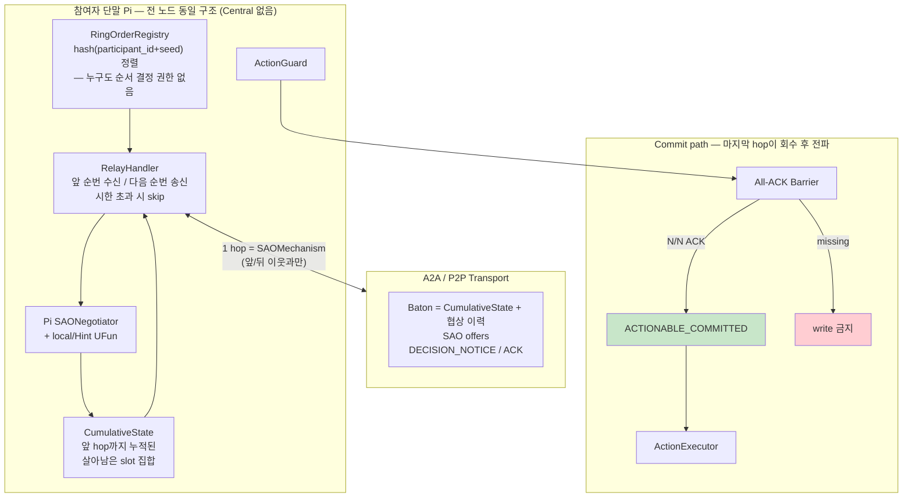
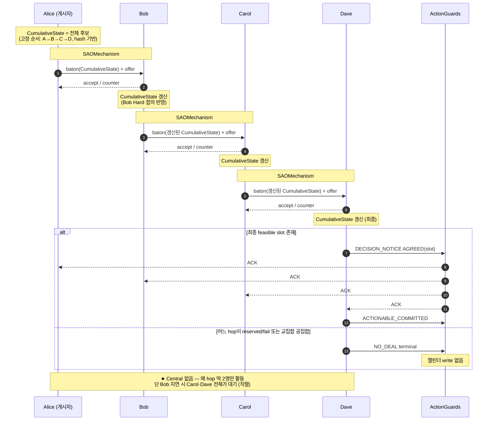
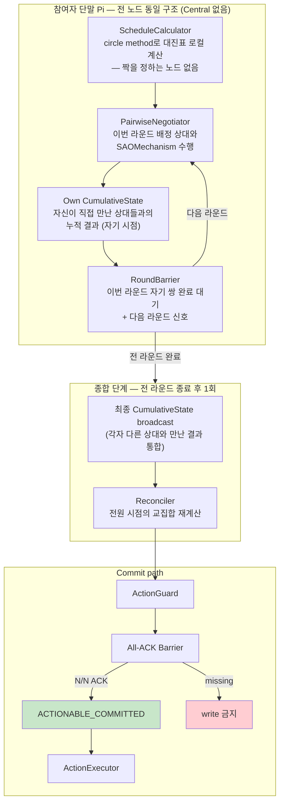
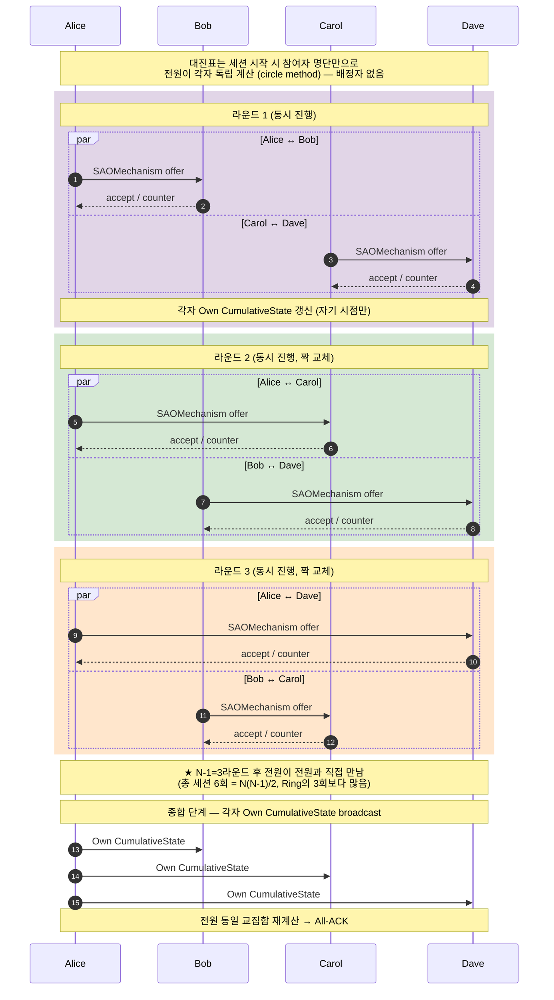

# DP-02 추가 후보 — Central 없이 번갈아 진행하는 구조 (Ring / Round-Robin)

> **역할:** [`DP-02`](DP-02-negmas-nparty-negotiation.md)의 C1(Central Sequential)·C2(Distributed Multilateral)에 이어, **Central 노드가 아예 없는 두 후보**를 같은 형식으로 정리한다.
> **주 QA:** QA-03 — Reliability > Maturity (Fault Tolerance 중심 — Central 집중 위험 제거가 목적)
> **관련 QA:** QA-04 — Performance Efficiency > Time Behaviour, **QA-SC-1 — Scalability(참여자 수)** 특히 부하 집중 지수 κ
> **선행 문서:** [`31 제안 토폴로지`](31-제안-토폴로지.md) 대안 C(Ring)의 NegMAS 재정의 + 신규 후보(Round-Robin Pairwise)

---

## ⚠ 0. 정정 사항 — 이 문서 작성 전 논의를 바로잡음

이전 논의에서 "Round-Robin이 Ring보다 빠르다(O(log N))"고 말했는데, 다시 계산하니 **정확하지 않다.** 전원이 전원과 직접 만나는 완전 순회형(Full Round-Robin)은 Ring과 **시간 스케일링이 동일하다** — 둘 다 O(N) 라운드. 대신 Round-Robin은 **총 세션 수가 O(N²)** 로 Ring(O(N))보다 많다. 즉 Round-Robin은 Ring보다 *빠르지 않고 오히려 총 작업량이 많다* — 그 대신 얻는 건 속도가 아니라 **순서 편향 제거·부분 실패 격리**다. 이 정정된 이해로 아래 본문을 작성한다.

---

## 1. 문제 정의

### 1.1 왜 Central 없는 순번 구조가 필요한가

DP-02의 C1(Central Sequential)은 QA-SC-1 §4.4(SC-N-3 부하 집중 지수 κ)에서 이미 짚었듯 **κ ≈ (N−1)/2로 N에 비례해 Central 단말에 부하가 쏠린다.** C2(Distributed)는 이 문제는 없지만 메시지가 N² 대칭 분산이라 온디바이스 배터리·메시지 폭증 부담이 크다.

**"Central은 없애되 C2처럼 한꺼번에 다 하지 말고, C1처럼 순서대로 하되 그 순서를 누구도 독점하지 않게"** 하는 게 본 문서 두 후보의 공통 목표다.

### 1.2 공통 예시 설정 (DP-02와 동일)

> **미팅:** Alice·Bob·Carol·Dave (N=4), 다음 주 1시간 미팅 1슬롯
> Hard가 서로 다름 → 공통 slot 탐색. Soft는 DP-01 Constraint Hint로만 전달.
> **성공 종료:** 전원 동일 `AGREED(slot=X)` 후 All-ACK → 캘린더 write
> **실패 종료:** 전원 동일 `NO_DEAL`

---

## 2. 후보안 한눈에 보기

| 후보 | 쉬운 비유 | 순서를 누가 정하나 | 세션 형태 | 총 세션 수 | 시간(라운드) |
|---|---|---|---|---|---|
| **C3 Ring** | 총무 없이 **바통을 옆 사람에게만** 넘김 | 해시로 자동 결정 (참여자 명단+seed) | 인접 쌍만 bilateral SAO | **N−1** | O(N) 직렬 |
| **C4 Round-Robin** | **원탁 리그전** — 매 라운드 짝을 바꿔 전원이 전원과 한 번씩 | 대진표(circle method)로 자동 결정 | 매 라운드 N/2쌍 병렬 bilateral SAO | **N(N−1)/2** | O(N) 라운드 (Ring과 동일) |

두 후보 모두 **"순서를 정하는 노드"가 없다** — 해시 함수나 대진표 공식으로 *전원이 각자 독립 계산*해서 같은 순서에 합의한다. 이게 C1의 Central과 본질적으로 다른 점이다.

---

## 3. C3 — Ring (Baton Relay Bilateral)

### 이해하기 쉬운 설명

**"협상 문서(바통) 하나가 고정된 순서로 이웃에게만 넘어간다"**는 구조다. Alice가 Bob과 협상해서 CumulativeState를 갱신하고, 그걸 Bob이 Carol에게 넘겨 협상하고, Carol이 Dave에게 넘긴다. **매 순간 인접한 두 명만 활동**한다.

[`31 제안 토폴로지`](31-제안-토폴로지.md) 대안 C(순차 릴레이형)와 같은 계열이나, 원문서는 "받은 사람이 단독으로 평가해 첨부"하는 **단방향 주석 방식**이었다. 본 문서는 DP-02의 NegMAS 프레임에 맞춰 **인접 쌍이 실제 SAOMechanism으로 양방향 협상**하는 형태로 재정의한다 — C1과 같은 협상 엔진을 쓰되 상대만 "Central"이 아니라 "다음 이웃"이 된다.

### 구조도 — 컴포넌트와 책임

### 구조도 — 시간 순서 (N=4, 순서 Alice→Bob→Carol→Dave)

### 단계별 동작

1. 세션 시작 시 전 참여자가 `RingOrderRegistry`를 각자 계산 — `sort(hash(participant_id + session_seed))`. 특정 노드가 순서를 정하지 않는다.
2. 첫 순번(개시자 또는 해시상 1번)이 CumulativeState = 전체 후보로 시작.
3. 각 인접 hop에서:
   - `SAOMechanism(Pi, Pi+1)` 실행 (`n_steps`/`time_limit` 필수, C1과 동일)
   - 성공 시 CumulativeState 갱신, 다음 이웃에게 baton 전달
   - 실패(reserved/공집합) 시 즉시 `NO_DEAL` 전파, 남은 hop 생략
4. 마지막 순번이 최종 CumulativeState로 `DECISION_NOTICE` 생성.
5. 전원에게 브로드캐스트(마지막 순번이 전 참여자에게 직접 통지 — Ring 경로를 다시 돌 필요 없음) → All-ACK → `ACTIONABLE_COMMITTED`.

### Failure

| Case | 동작 |
|---|---|
| 특정 hop 응답 없음 | 앞 순번이 시한 후 **다다음 순번으로 건너뜀** — 단 그 시한만큼 이후 전원이 대기 (직렬 구조의 본질적 비용) |
| baton 유실 | 마지막으로 보유했던 단말의 사본에서 복원 (31번 문서와 동일 원칙) |
| 중간 hop이 CumulativeState를 왜곡(버그·악의) | **구조적으로 탐지 불가** — Ring은 다음 hop이 이전 hop의 결과를 검증할 방법이 없다. Round-Robin과의 핵심 차이점 (§6 참조) |

### NegMAS 매핑

| 개념 | NegMAS |
|---|---|
| 인접 hop 1회 | `SAOMechanism` (negotiator 2명, C1과 동일 패턴) |
| 순서 결정 | 노드 없음 — 해시 함수로 세션 시작 전 전원 동일 계산 |
| 누적 의존 | 다음 hop의 ufun/outcome_space를 `CumulativeState`로 재구성 (C1과 동일 메커니즘) |

### 시나리오

| ID | 상황 | 일어나는 일 | 기대 결과 |
|---|---|---|---|
| C3-S1 Happy | 4명 순서대로 공통 slot 생존 | SAO 3회 모두 accept 계열 | `AGREED`, mismatch 0 |
| C3-S2 중간 hop 공집합 | Carol 단계에서 교집합 공집합 | 즉시 `NO_DEAL` 전파 | 전원 `NO_DEAL` |
| C3-S3 Bob 응답 없음 | Bob이 시한 내 무응답 | Alice가 시한 후 Carol에게 직접 전달 (Bob 제외) | Carol·Dave는 지연되지만 진행됨 |
| C3-S4 순서 편향 | 앞 순번(Alice·Bob)의 Hard가 뒷 순번(Dave)의 선택지를 크게 좁힘 | Dave는 이미 좁아진 공간만 봄 | **공정성 문제 — §6에서 상술** |

---

## 4. C4 — Round-Robin Pairwise (원탁 순환 대진)

### 이해하기 쉬운 설명

**"토너먼트 리그전처럼, 매 라운드 짝을 바꿔가며 전원이 전원과 한 번씩 직접 만난다"**는 구조다. 스포츠 대진표를 짜는 표준 방법(circle method)을 그대로 쓴다 — N=4면 3라운드에 걸쳐 (A,B)(C,D) → (A,C)(B,D) → (A,D)(B,C) 순으로 짝이 바뀌고, 그 사이 전원이 전원과 정확히 한 번씩 만난다.

Ring과 다른 점은 **매 라운드에 N/2쌍이 동시에 활동**한다는 것. Ring은 항상 딱 2명만 활동하지만, 여기는 라운드마다 참여자 전원이 동시에 누군가와 협상한다.

### 구조도 — 컴포넌트와 책임

### 구조도 — 시간 순서 (N=4, 3라운드)

### 단계별 동작

1. 세션 시작 시 전 참여자가 대진표를 각자 계산 (circle method — 참여자 명단을 원형으로 배치하고 한 명 고정, 나머지를 매 라운드 회전).
2. 각 라운드에서 N/2쌍이 **동시에** `SAOMechanism` 수행. 같은 라운드의 다른 쌍과는 무관하게 병렬 진행.
3. 각자 자신이 직접 만난 상대들과의 결과만으로 **Own CumulativeState**를 갱신 (다른 쌍의 결과는 아직 모름).
4. N−1라운드 반복 → 전원이 전원과 정확히 한 번씩 직접 만남 → 각자의 Own CumulativeState가 *사실상 완전한 정보*를 담게 됨(직접 대면했으므로).
5. **종합 단계** (Ring에는 없는 단계): 전원이 자신의 최종 Own CumulativeState를 브로드캐스트하고, 전원이 동일한 교집합을 재계산해 서로 일치하는지 확인.
6. 일치 확인 후 `DECISION_NOTICE` → All-ACK → `ACTIONABLE_COMMITTED`.

### Failure

| Case | 동작 |
|---|---|
| 특정 라운드의 한 쌍만 실패 | **그 쌍만 재시도** — 같은 라운드의 다른 쌍, 다른 라운드는 영향 없음 (Ring 대비 핵심 강점) |
| 한 참여자가 아예 이탈 | 남은 참여자로 대진표 재계산 필요 — 진행 중 이탈은 대진표 전체 재수립을 요구해 Ring의 "건너뛰기"보다 복잡 |
| 종합 단계에서 불일치 발견 | 서로 다른 라운드에서 모순되는 정보를 받았다는 뜻 — 재협상 트리거 (DP01에서 다룬 "부분 불일치" 문제와 동일 성격) |
| 라운드 장벽 지연 | 한 쌍이 오래 걸리면 그 라운드 전체가 대기 (Ring의 "1명 지연 시 전체 대기"보다는 범위가 좁음 — 그 라운드에 한정) |

### NegMAS 매핑

| 개념 | NegMAS |
|---|---|
| 라운드 내 쌍 | `SAOMechanism` × N/2 (병렬 인스턴스, 서로 독립) |
| 대진표 계산 | 노드 없음 — circle method 공식으로 세션 시작 전 전원 동일 계산 |
| 종합 단계 | 별도 NegMAS 컴포넌트 없음 — CumulativeState 교환 후 로컬 재계산 (C2의 Hard sync와 유사한 성격) |

### 시나리오

| ID | 상황 | 일어나는 일 | 기대 결과 |
|---|---|---|---|
| C4-S1 Happy | 3라운드 모두 정상 진행 | 종합 단계에서 전원 동일 결과 확인 | `AGREED`, mismatch 0 |
| C4-S2 한 쌍만 실패 | 라운드 2의 Bob↔Dave만 reserved | 그 쌍만 재시도, 라운드 3은 예정대로 진행 | 국소적 지연만 발생 (Ring과 대조) |
| C4-S3 종합 단계 불일치 | Alice·Carol이 라운드 2에서 서로 다른 조건으로 각자 이해 | 종합 단계 재계산에서 모순 발견 | 재협상 트리거, 즉시 `NO_DEAL` 아님(Ring보다 관대) |
| C4-S4 참여자 이탈 | 라운드 2 시작 전 Dave 이탈 | 대진표 재계산 필요 (N=3으로 축소) | 진행 중 재구성 비용 발생 |

---

## 5. 비교표 — C1·C2·C3·C4

| 후보 | Central | 총 세션 수 | 시간(라운드) | 부하 집중 κ | 부분 실패 격리 | 순서 편향 |
|---|---|---|---|---|---|---|
| **C1 Central Sequential** | 있음 | N−1 | O(N) 직렬 | **높음** (N−1)/2 | 없음 (Central 죽으면 전체 정지) | 없음 (Central이 매번 관여) |
| **C2 Distributed** | 없음 | 1 (다자 세션) 또는 vote | O(1)~O(N) (합의 라운드 수 의존) | 낮음 (대칭) | 부분적 (quorum 의존) | 없음 |
| **C3 Ring** | 없음 | **N−1** | O(N) 직렬 | 낮음 (순환) | **없음** (한 hop 실패 시 이후 전체 영향) | **있음** — 앞 순번이 뒷 순번의 선택지를 좁힘 |
| **C4 Round-Robin** | 없음 | **N(N−1)/2** | O(N) 라운드 (C3와 동일) | 가장 낮음 (완전 대칭) | **있음** — 한 쌍 실패가 국소화됨 | **없음** — 전원이 대등하게 직접 대면 |

---

## 6. C3 vs C4 — 무엇을 얻고 무엇을 내주는가

**C3(Ring)에서 C4(Round-Robin)로 바꾸면:**

| 얻는 것 | 내주는 것 |
|---|---|
| 순서 편향 제거 — 모두가 대등하게 직접 대면, "먼저 정한 사람이 유리"한 문제 해소 | 총 세션 수 N−1 → N(N−1)/2 (온디바이스 배터리·연산 총량 증가) |
| 부분 실패 격리 — 한 쌍의 실패가 전체를 막지 않음 | **종합 단계**라는 새 복잡도 추가 (Ring엔 없음) — 불일치 감지·재조정 로직 필요 |
| 중간 hop의 왜곡을 다른 직접 만남으로 교차 검증 가능 | 참여자 이탈 시 대진표 재수립 비용 (Ring은 건너뛰기만 하면 됨) |

**속도는 거의 같다(§0 정정 사항).** 그래서 이 선택은 *"빠른 걸 원하는가"*가 아니라 **"총 자원 비용을 더 쓰더라도 공정성·견고성을 살 것인가"** 의 문제다.

---

## 7. 채택 방향 (문서 단계 권고)

- C3·C4는 C1·C2와 **동등 비교 대상**으로 추가하고, 측정 후 ADR로 확정한다.
- **순서 편향(§3 C3-S4)이 실사용에서 문제가 되는 도메인**(예: 참여자 간 권력 차이가 있는 협상)이라면 C4를 우선 검토.
- **온디바이스 자원 제약이 빡빡한 환경**이라면 C3가 총 세션 수 관점에서 유리.
- 둘 다 QA-SC-1(§4.4 SC-N-3 κ)에서 C1보다 유리할 것으로 예상되나, **C4의 총 세션 수 증가가 QA-SC-1의 SC-N-2(메시지 확장 지수)에는 불리할 수 있다** — 측정 필요.

---

## 8. 남는 결정 사항

1. **C3의 순서 편향 완화책** — Ring 순서를 매 세션 무작위로 다르게 재계산(예: `hash(session_id)`를 seed에 포함)하면 *특정 개인이 항상 유리/불리*한 건 막을 수 있으나, *그 세션 내에서의* 편향(Alice가 항상 유리) 자체는 여전히 남음.
2. **C4 종합 단계의 불일치 처리 정책** — C4-S3처럼 라운드 간 모순 발견 시 즉시 `NO_DEAL`인지, 국소 재협상인지 정책 미정.
3. **C4 참여자 이탈 시 대진표 재계산 비용** — 이미 끝난 라운드의 결과를 재사용할지, 처음부터 다시 할지.
4. **QA-SC-1 측정에 C3·C4 포함 여부** — 현재 QA-SC-1 측정 계획(N∈{3,4,5,6,8,10})이 C1·C2만 상정했다면 C3·C4용 대안별 어댑터 추가 필요 (§5.2 시간 합성식 분리와 동일한 방식).

---

_본 문서는 [`DP-02`](DP-02-negmas-nparty-negotiation.md)의 C1·C2에 이어지는 C3·C4 후보다. §0에서 밝혔듯 Round-Robin의 속도 우위를 주장했던 이전 논의를 정정했다 — 실제 강점은 속도가 아니라 순서 편향 제거·부분 실패 격리다._
