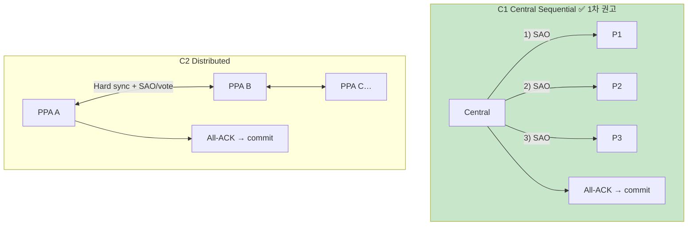
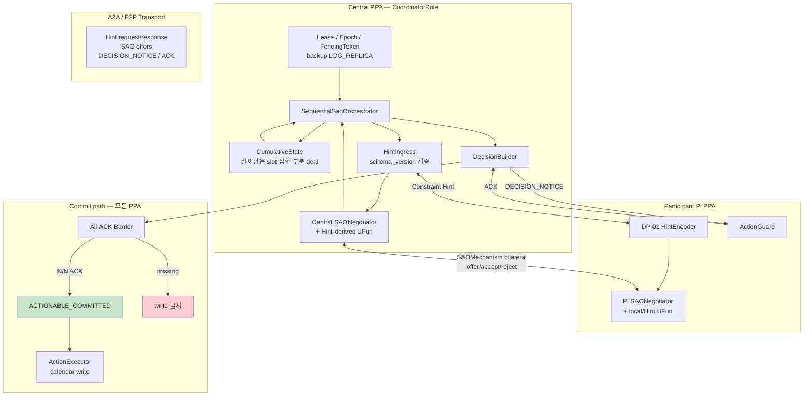
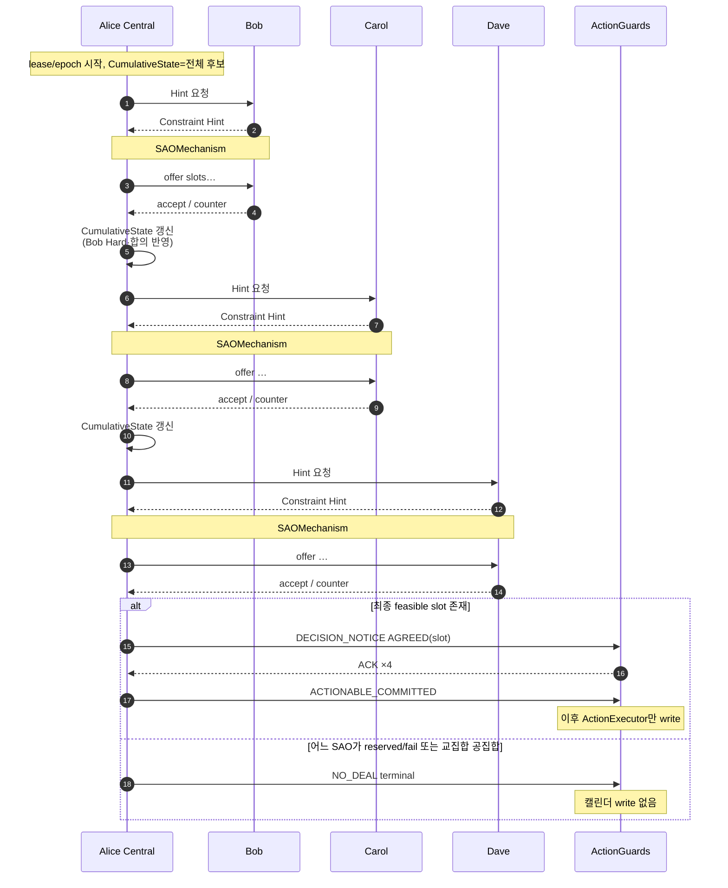
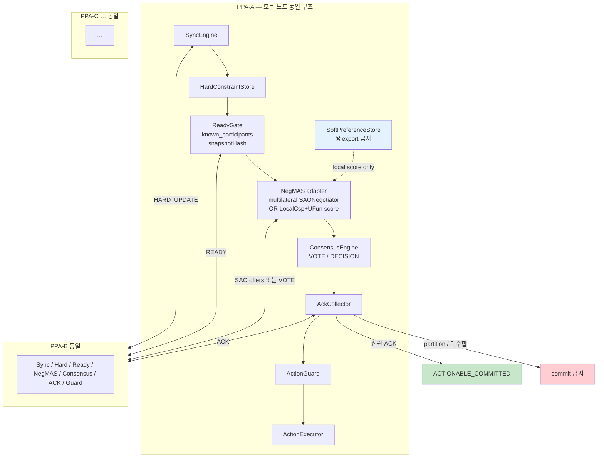
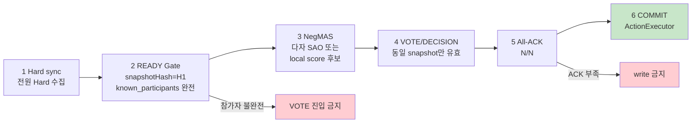

# DP-02 NegMAS 기반 N-party 협상 — Central Sequential Bilateral / Distributed

> **역할:** 기존 informal DP01의 다자간 협상 후보(C1 Coordinator / C2 Distributed)를 NegMAS 기반으로 재정의한다. Central 후보는 **참가자와 하나씩 순차 bilateral SAO**를 수행하는 flow로 변경한다.
> **주 QA:** QA-03 — Reliability > Maturity
> **관련 QA:** QA-04 — Performance Efficiency > Time Behaviour
> **입력 계약:** [DP-01](DP-01-negmas-constraint-hint.md) Constraint Hint (권고)
> **PoC evidence:** `development/poc/dp01_tradeoff_benchmark/`, `development/poc/docs/architecture_flow.md`

---

## 1. 문제 정의

### 1.1 기존 PoC가 남긴 결정 축

| 기존 옵션 | 구조 | 남긴 교훈 |
|---|---|---|
| C1 Full / Minimized Coordinator | 한 `PPA`가 proposal을 **한 번에 모은 뒤** 내부에서 common slot 결정 → All-ACK | latency·message에 유리, coordinator 집중 |
| C2 Distributed Quorum | Hard sync + Soft local + quorum/All-ACK | privacy·분산에 유리, latency/message↑ |

### 1.2 본 DP에서 바꾸는 것

1. 협상 core → NegMAS `SAOMechanism` / `UtilityFunction` / `Negotiator`.
2. Central: “전체 수집 후 솔브” **폐기** → **한 명씩** bilateral SAO → 누적 상태로 다음 상대.
3. Commit 안전장치(`All-ACK`, `ActionGuard`, `NO_DEAL`)는 유지.

> 동시 다세션용 `SAOSyncController`는 on-device 1차 Central 기본이 **아님** (예측 가능한 Memory·Latency를 위해 sequential 우선).

### 1.3 공통 예시 설정 (모든 후보가 같은 상황)

> **미팅:** Alice가 주최, 참가자 Bob·Carol·Dave (N=4, Alice=Central 후보일 수 있음)
>
> - 목표: 다음 주 1시간 미팅 1슬롯
> - Hard가 서로 다름 → 공통 slot을 찾아야 함
> - Soft는 DP-01 Constraint Hint로만 전달 (권고)
>
> **성공 종료:** 전원 동일 `AGREED(slot=X)` 후 All-ACK → 캘린더 write  
> **실패 종료:** 전원 동일 `NO_DEAL` (일부만 다른 결과를 가지면 Reliability FAIL)

---

## 2. 후보안 한눈에 보기

| 후보 | 쉬운 비유 | 누가 협상을 이끌나 | NegMAS 사용 방식 | Soft Preference |
|---|---|---|---|---|
| **C1** ✅ | 사회자가 **한 명씩** 차례로 조율 | 선택된 Central `PPA` | Central↔Pi **bilateral SAO를 순차** N-1회 | Hint만 Central이 수신 (DP-01) |
| **C2** | 전원 원탁에서 **동시에** 맞춤 | fixed coordinator 없음 | Hard sync 후 **다자 SAO 또는 local score+vote** | **각 기기 local** (밖으로 안 냄) |

### 기존 → 신규 매핑

| 기존 (informal DP01) | 신규 (DP-02) |
|---|---|
| C1 Full Context Coordinator | 강등 — raw Soft 수집은 Privacy·Memory 불리 |
| C1 Minimized Context Coordinator | **C1 NegMAS Central Sequential** + Constraint Hint |
| C2 Distributed Quorum | **C2 NegMAS Distributed** |

---

## 3. 후보안 상세

### 3.1 C1 — NegMAS Central Sequential Bilateral ✅ Android 1차 권고

#### 이해하기 쉬운 설명

C1은 “**사회자(Central) 한 명이 참가자를 한 명씩 불러 NegMAS로 협상**하고, 그 결과를 다음 사람과 협상할 때 반영한다”는 구조다.

예전 C1(한 번에 전부 모으고 내부 계산)과 다른 점:

| | 예전 Coordinator 솔브 | 이번 Sequential NegMAS |
|---|---|---|
| 협상 | 사실상 Central 내부 CSP/휴리스틱 | 매번 `SAOMechanism`(Central ↔ Pi) |
| 순서 | 전체 proposal 수집 후 1회 결정 | P1 → P2 → P3 … **순차** |
| 상태 | 전 proposal 테이블 | `CumulativeState` (지금까지 살아남은 제약/부분합의) |
| 입력 | Full 또는 Minimized | **Constraint Hint** 권고 (DP-01 C2) |

비유: 단체 약속을 잡을 때 단톡에 전원 의견을 한꺼번에 받기보다, 총무가 **A와 먼저 맞추고 → 그 결과를 들고 B와 맞추고 → C와 맞추는** 방식.

#### 구조도 — 컴포넌트와 책임

#### 구조도 — 시간 순서 (N=4 예시: Central=Alice, P=Bob→Carol→Dave)

#### 단계별 동작 (체크리스트)

1. Participant 중 1명이 `CoordinatorRole` 활성화 (lease/epoch/fencing).
2. 순서 큐: `[P1, P2, … Pn]` (Central 자신 제외 또는 정책에 따라 포함).
3. 각 Pi에 대해:
   - Hint 수신 → schema 검증
   - `SAOMechanism(Central, Pi)` 실행 (`n_steps`/`time_limit` 필수)
   - 성공 시 `CumulativeState` 갱신 / 실패 시 기본 `NO_DEAL` (또는 제한 re-plan 1회)
4. 전원 순회 후 `Decision` 생성.
5. `DECISION_NOTICE` → 전원 `ACK` → 만장일치일 때만 `ACTIONABLE_COMMITTED`.
6. `ActionExecutor`는 Guard가 허용한 committed decision만 실행.

#### Failure

| Case | 동작 |
|---|---|
| Central fail-stop mid-sequence | backup이 lease delay 후 takeover; fencing으로 stale action 차단 |
| Pi SAO → reserved/fail | 기본: 즉시 `NO_DEAL` terminal |
| ACK 미수합 | commit·calendar write 금지 |

#### NegMAS 매핑 (C1)

| 개념 | NegMAS |
|---|---|
| Central↔Pi 1회 | `SAOMechanism` (negotiator 2명) |
| 전략 | `AspirationNegotiator` 등 |
| 선호 | Hint-derived `UtilityFunction` |
| 누적 의존 | 다음 세션 ufun/outcome_space를 `CumulativeState`로 재구성 |
| 동시 controller | `SAOSyncController` — **비기본** |

#### 시나리오

| ID | 상황 | C1에서 일어나는 일 | 기대 결과 |
|---|---|---|---|
| C1-S1 Happy | Bob→Carol→Dave 순으로 공통 수 10:00 생존 | SAO 3회 모두 accept 계열 → All-ACK | `AGREED`, mismatch 0 |
| C1-S2 Hard mid-fail | Carol 단계에서 교집합 공집합 | SAO #2 reserved → `NO_DEAL` 전파 | 전원 `NO_DEAL`, write 없음 |
| C1-S3 Central crash | Alice가 Carol 협상 중 fail-stop | backup takeover + fencing; stale commit 차단 | premature_action 0 |
| C1-S4 Slow N | N=5, 각 SAO rounds 많음 | latency ≈ sum(session_i)+ack | M04-1 deadline 검사 |
| C1-S5 Stale ACK | 구 epoch의 COMMIT 수신 | fencing_token 불일치로 ActionGuard 거부 | stale blocked |

---

### 3.2 C2 — NegMAS Distributed Multilateral

#### 이해하기 쉬운 설명

C2는 “**사회자 없이** 모두가 같은 규칙으로 Hard를 맞추고, Soft는 각자 폰 안에만 둔 채 후보를 고른 다음, 전원 ACK로 확정한다”는 구조다.

- Hard Constraint만 서로 공유 (또는 gossip).
- Soft Preference는 **절대 전송하지 않음** — 각 기기가 local ufun으로 점수.
- NegMAS: (a) N명이 한 `SAOMechanism`에 참여하는 multilateral SAO, 또는 (b) 각 node가 local NegMAS scoring 후 `VOTE`로 합치기.
- 확정은 여전히 **All-ACK** — 다수결만으로 캘린더 write 금지 (기존 PoC Hard Completeness / All-ACK 교훈 유지).

비유: 단체 약속을 **단톡 투표+전원 확인**으로 끝내는 방식. 총무 SPOF는 없지만 메시지가 많다.

#### 구조도 — 모든 PPA가 동일 컴포넌트

#### 구조도 — 단계 파이프라인 (한 노드 시점)

#### 단계별 동작

1. 각 `SyncEngine`이 `HARD_UPDATE` broadcast/gossip.
2. `HardConstraintStore` 채운 뒤 `snapshotHash` 계산, `READY` 전파.
3. **READY Gate:** `known_participants`가 세션 멤버와 일치할 때만 다음 단계 (partial Hard로 VOTE 금지).
4. NegMAS 단계:
   - **옵션 A:** N-negotiator `SAOMechanism`이 offer 교환 → accept-all / timeout.
   - **옵션 B:** 각 node local ufun으로 candidate score → `VOTE` 집계.
5. `DECISION` broadcast 후 **All-ACK**.
6. N/N일 때만 `ACTIONABLE_COMMITTED` → `ActionExecutor`.

#### NegMAS 매핑 (C2)

| 개념 | NegMAS |
|---|---|
| N자 offer 교환 | `SAOMechanism` with N negotiators |
| Local scoring | device-local `UtilityFunction` (Soft never exported) |
| 종료 | accept-all / leave / timeout → decision 또는 `NO_DEAL` |

#### 시나리오

| ID | 상황 | C2에서 일어나는 일 | 기대 결과 |
|---|---|---|---|
| C2-S1 Happy | Hard sync 완료, 공통 slot 존재 | READY → NegMAS/vote → All-ACK | `AGREED`, Soft external 0 |
| C2-S2 No common Hard | sync 후 feasible 없음 | candidate 없음 또는 SAO reserved | `NO_DEAL` |
| C2-S3 Split-brain | 2 vs 3 partition | minority All-ACK 불가 | commit 없음, M03-4=0 |
| C2-S4 Partial Hard | 한 명 Hard 미수신인데 VOTE 시도 | READY Gate 차단 | incomplete snapshot으로 합의 금지 |
| C2-S5 Message stress | N=10 exploratory | message·latency 상승 | M04 exploratory only |

---

## 4. 후보안 비교표

| 후보안 | 장점 | 단점 | Trade-off |
|--------|------|------|-----------|
| **C1 NegMAS Central Sequential** ✅ 1차 권고 | • 세션 상태 단순, fencing 재사용 `[Reliability]` • Hint만 수신 `[Privacy]` `[ResourceUtilization]` • per-pair SAO 디버깅 용이 `[Modifiability]` | • O(N) sequential latency `[TimeBehaviour]` • Central failover 필요 `[Reliability]` | **Reliability·단순성 vs TimeBehaviour** 측정: M03-* + M04-1 판단: N≤5 deadline 만족 시 1차 PoC |
| **C2 NegMAS Distributed** | • coordinator SPOF 제거 `[Reliability]` • Soft local `[Privacy]` • per-node state 분산 `[ResourceUtilization]` | • sync/vote/message↑ `[TimeBehaviour]` • membership/partition 복잡도 `[Modifiability]` | **Privacy·분산 vs Latency/복잡도** 측정: M03-4=0, M04-1/2 판단: lifecycle·reconnect PoC 후 |

---

## 5. 채택 방향 (문서 단계 권고)

- C1·C2는 **동등 비교** 대상으로 유지하고, 측정 후 ADR로 확정한다.
- **Android 1차 PoC 권고:** DP-01 Constraint Hint + **C1 NegMAS Central Sequential Bilateral**.
- C2는 privacy/분산 강점이나 mobile reconnect·background 검증이 더 필요하다.

---

## 6. ATAM 평가

### 6.1 6-Part

| Portion | Value |
|---|---|
| Stimulus Source | N participants + failure injector |
| Stimulus | Happy / Hard conflict / Central fail / partition (§3 시나리오) |
| Artifact | SequentialSaoOrchestrator 또는 Distributed NegMAS + All-ACK |
| Environment | Deterministic PoC → Android candidate |
| Response | 동일 terminal, deadline 내 완료, premature action 0 |
| Response Measure | M03-1..4, M04-1..3 |

### 6.2 Risk

| Risk | 완화 |
|---|---|
| Sequential latency slope | DP-01 prune으로 rounds 감소; N=5 deadline gate |
| 무한 SAO | `n_steps`/`time_limit` 필수 |
| Cumulative state bug | 세션마다 Hard re-validate (M02-1) |
| Concurrent controller deadlock | C1 기본에서 `SAOSyncController` 미사용 |

---

## 7. 관련 QA·검증 Hook

| QA | 지표 | 비고 |
|---|---|---|
| QA-03 | M03 completion/mismatch/premature/split-brain | 기존 PoC target 승계 |
| QA-04 | M04 p95 / messages / sao_rounds | sequential 재측정 필수 |
| QA-01/02 | Hint 경유 시 DP-01 gate | C1 권고 경로 |

NegMAS 재구현 후 동일 seed로 `tradeoff_report`를 다시 만든다. 과거 C1 latency 우위가 sequential NegMAS에서도 성립하는지는 **재측정 전제**다.

---

## 8. 참고 산출물

- `development/poc/docs/architecture_flow.md`
- `development/poc/dp01_tradeoff_benchmark/results/tradeoff_report.md`
- `architecture/dp1_structure_validation.drawio`
- NegMAS: `SAOMechanism`, Controllers, `UtilityFunction`, `reserved_value`
