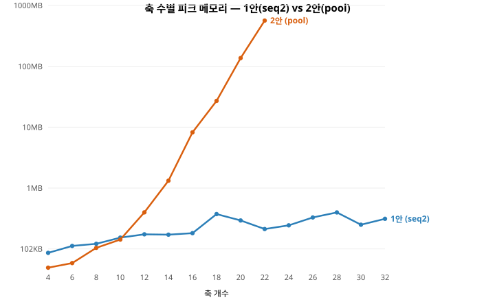
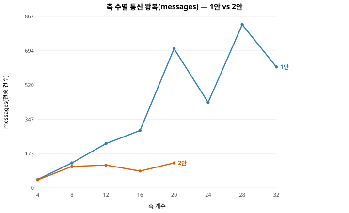
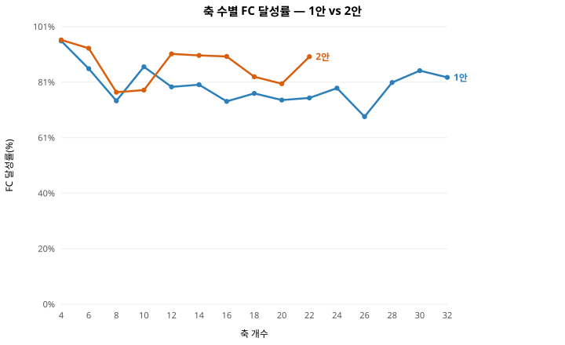

# 최종 QA 비교 — 1안 vs 2안

> **1안** = 의제별 순차 협상(축을 하나씩 협의·확정). **2안** = 개인별 후보 압축 후 복합 협상
> (각자 후보를 압축해 원본 공간에서 완성안 교환).
> 전제: **완벽 정보**(에이전트가 자기 진짜 선호를 정확히 앎), 정답 x\* 기준으로 정확도 채점.
> 원자료: `scaling_raw.jsonl`(메모리·축수·FC), `fixtures_result.jsonl`(고정 테스트).
> 그래프(§3): `mem_scaling.svg`·`comm_scaling.svg`(통신 왕복)·`fc_scaling.svg`. 측정 방법·예제: **부록 A**.
> **협상 시간은 wall time이 아니라 통신 왕복(messages)으로 잰다** — 실제 협상 지연 반영.

## 1. 테스트셋 (무엇을 돌렸나)

세 종류의 테스트를 돌렸다. 모두 **완벽 정보** 전제이고, 정답 x\*는 `exact_xstar`로 전수열거 없이
정확히 계산한다(작은 시나리오에서 오라클과 대조해 버그 0 검증).

### 1-1. 정의 시나리오 12종 — `scenarios/S01~S12.yaml`

하루 약속(영화+저녁 등)을 정하는 협상을 **난이도·구조별로 손설계**한 테스트 케이스. 각 TC는
축(의제)·후보값·축 간 의존성(하드/소프트)·2인 취향 프로파일·판정 기준을 담는다.

| TC | 축 | 이름 | 목적 / 특징 |
|---|:--:|---|---|
| S01 | 4축 | 기준 | 2인 영화+저녁(날짜·시간·지역·영화), 기본 케이스 |
| S02 | 4축 | 취향 유사 | 두 사람 취향 상관 +0.7 — 빠른 수렴 |
| S03 | 4축 | 취향 상극 | 상관 −0.7 — 1안 조기 좁힘 vs 2안 관전점 |
| S04 | 4축 | 독립 축 | 의존성 없는 순수 조합 폭발 (대조군) |
| S05 | 4축 | 부드러운 의존 | 소프트 의존 — 2안 재채점 vs 1안 순서 처리 |
| S06 | 4축 | 역방향 의존 | 인기작이 특정 시간만 상영 — **1안 약점 자극** |
| S07 | 4축 | 빡빡한 제약 | 유효 교집합 극소수 — 백트랙·압축 한계 |
| S08 | 4축 | 합의 불가능 | 하드 교집합 공집합 — **정상 결렬이 정답** |
| S09 | 6축 | 6축 확장 | 날짜·시간·지역·영화·식당·메뉴 |
| S10 | 4축 | 비대칭 2인 | 제약 많은 1인 vs 무관심한 1인 |
| S11 | 10축 | 축 수 스윕 | 하루 풀 플랜, 앞 4/6/8/10축을 잘라 축 수 스윕 |
| S12 | 6축 | 고아 강제 | 지역당 후보 다수(식당·영화관 3개) — **2안 압축의 고아 유발** |

(축당 후보 값은 축·시나리오에 따라 5~15개. S11은 10축 정의이나 축 수 스윕 TC라 앞 n개만 잘라 쓴다.)

### 1-2. 축 수 스윕 — 2~32축 (`scaling_raw.jsonl`)

S11(하루 풀 플랜)의 앞 10축에 **합성 독립축을 붙여** 축 수를 2→32로 늘린다(축당 값 5 균일).
각 축 수에서 협상을 돌려 **메모리·시간·FC**를 잰다(축 수당 시드 4개). **확장성**이 이 스윕으로 나온다.

### 1-3. 고정 테스트 fixtures 12개 — `fixtures/*.json`

축·후보·프로파일·**정답 x\***까지 전부 파일에 박제한 테스트. 시드 생성에 의존하지 않아
**돌릴 때마다 완전히 동일**하다. 고차원 10개(4·6·8·10·12·14·16·18·20·22축) + 소형 손검증 2개.

## 2. 별점 기준 (0~5, 절대 밴드)

| QA | 지표 | ★5 | ★4 | ★3 | ★2 | ★1 | ★0 |
|---|---|:--:|:--:|:--:|:--:|:--:|:--:|
| **FC (정확도)** | 달성률 U(합의)/U(x*) | ≥.95 | ≥.90 | ≥.85 | ≥.80 | ≥.70 | <.70 |
| **Scalability-의제수** | 최대 축(메모리 ≤100MB) | ≥30 | ≥20 | ≥14 | ≥10 | ≥6 | <6 |
| **RU-메모리** | 16축 피크 | ≤1MB | ≤10MB | ≤50MB | ≤200MB | ≤1GB | >1GB |
| **협상 시간(통신)** | 16축 messages(왕복 수) | ≤50 | ≤100 | ≤200 | ≤400 | ≤800 | >800 |

## 3. 측정 결과

### 메모리 — 축 스윕

| 축 | 1안 피크 메모리 | 2안 피크 메모리 |
|---|--:|--:|
| 12 | 0.17MB | 0.40MB |
| 16 | **0.18MB** | **8.2MB** |
| 18 | 0.37MB | 27MB |
| 20 | 0.29MB | 136MB |
| 22 | 0.21MB | **563MB** |
| 24~32 | 0.24~0.31MB | 중단(OOM) |

- **1안: 32축까지 ~0.3MB 평평.** **2안: 지수적 폭발**(후보 곱 kⁿ 물질화), 22축 563MB → 24축부터 실행 불가.
- **최대 지원 축 수(메모리 ≤100MB)**: **1안 ≥32 / 2안 18.**

### 협상 시간 — 통신 왕복 (messages) 기준

실제 협상 시간은 각 propose/respond가 **네트워크 왕복**이라 **메시지 전송 횟수(통신 단계)** 가 좌우한다
(팀 정본 29-1도 wall time이 아니라 phases/messages로 잰다). 왕복 수:

| 축 | 1안 messages | 2안 messages |
|---|--:|--:|
| 4 | 43 | 41 |
| 8 | 126 | 108 |
| 16 | **290** | **85** |
| 20 | 704 | 126 |
| 28 | 826 | (OOM) |
| 32 | 612 | (OOM) |

- **1안: 축마다 별도 세션을 열어 왕복이 증가**(4축 43 → 16축 290 → 32축 ~600). 통신 지연이 붙으면 축 수에
  비례해 느려진다.
- **2안: 단일 세션이라 왕복 ~85~126로 대체로 일정.** 통신 지연이 지배하는 배포(느린 네트워크)에선 2안이 유리.

> **참고 — 로컬 계산 시간은 정반대다**: 2안은 후보 곱 kⁿ 물질화로 **CPU 시간이 폭발**(20축 18.9초),
> 1안은 평평(~0.2초). 즉 **계산 자원이 병목이면 2안이 불리, 통신 지연이 병목이면 1안이 불리**하다.
> (CPU 폭발은 메모리와 같은 뿌리라 RU-메모리 별점에 이미 반영됨.) wall-time 그래프: `time_scaling.svg`.

### FC 달성률 (참고 그래프)

저차원 혼전, 중고차원(≥12축) 2안 우위:

### FC (정확도) — 데이터셋별

FC는 **축 범위에 따라 다르다**. 축을 넓게 담은 두 데이터셋이 일관되게 **2안 우위**:

| 데이터셋 (축 범위) | 1안 | 2안 | 차이 |
|---|--:|--:|---|
| 축 스윕 scaling_raw (4~22축, 4시드) | 80.0% | **86.7%** | 2안 +6.7%p |
| 고정 fixtures (4~22축) | 85.2% | **90.0%** | 2안 +4.8%p |

가장 낮은 축(정의 시나리오 4~6축)에서만 거의 동률이고, 축이 늘수록 2안이 앞선다. 별점은 가장
체계적인 축 스윕 기준: **2안 86.7%(★3) vs 1안 80.0%(★2).**

## 4. 별점 QA 비교 (1안 vs 2안)

| 핵심 QA | **1안** | **2안** | 승자 |
|---|:--:|:--:|---|
| **FC (정확도)** | ★2 (80.0%) | ★3 (86.7%) | **2안** |
| **Scalability-의제수** | ★5 (≥32축) | ★3 (18축) | **1안** |
| **RU-메모리** | ★5 (0.18MB) | ★4 (8.2MB) | **1안** |
| **협상 시간(통신)** | ★2 (290 msg) | ★4 (85 msg) | **2안** |
| **별점 합계** | **14 / 20** | **14 / 20** | 동점 |

## 5. 판정 — 트레이드오프

별점 합계 **14 대 14 동점**. 두 안은 서로 다른 축에서 이긴다:

- **1안이 이기는 것 — 자원(확장성·메모리)**: 축이 늘어도 메모리 평평(≥32축), 2안은 22축 563MB→OOM.
- **2안이 이기는 것 — 정확도·통신 왕복**: FC +5~7%p, 그리고 단일 세션이라 메시지 왕복이 적다(1안은
  축마다 세션을 열어 왕복이 축 수에 비례해 증가).

> **1안 = 메모리·확장성 우세(고차원 감당), 대신 정확도 −5~7%p·통신 왕복 많음(축마다 세션).
> 2안 = 정확도·통신 왕복 적음(단일 세션), 대신 후보 곱 물질화로 고차원 OOM·로컬 CPU 폭발.**
> 배포 병목에 따라: **메모리·고차원 확장이 병목(온디바이스)**이면 1안, **정확도·통신 지연이 병목
> (느린 네트워크·저중차원)**이면 2안.

### 단서

1. **FC 별점은 축 스윕 기준**(4~22축). 정의 시나리오(저차원)만 보면 동률로 보이나 저차원 편향.
2. **2안의 고정밀은 감당 가능한 축 수에 한함** — 그 이상은 OOM이라 못 돌린다(확장성이 FC를 제약).
3. **시간은 두 종류가 상충**: 로컬 CPU(2안 폭발) vs 통신 왕복(1안 증가). 별점의 "협상 시간(통신)"은
   실제 협상 지연을 좌우하는 **통신 왕복**을 기준으로 삼았고, 로컬 CPU 폭발은 메모리와 같은 뿌리라
   RU-메모리에 반영돼 있다.

## 부록 A. 측정 방법 (예제 포함)

모든 QA는 동일 하니스(`run_one`)로 협상 1회를 돌려 관측한다. 완벽 정보 전제.

### A1. FC (정확도)
- **정답 x\* 계산**(`exact_xstar`): 모든 하드·소프트 규칙이 소수 축(vertex cover)에만 붙는 **성긴
  구조**를 이용 — 그 축을 고정하면 나머지가 독립이 되어 **전수열거 없이 정확한 x\***(유효 후보 중
  total utility 최대)를 구한다. 작은 시나리오에서 오라클(전수열거)과 대조해 **버그 0** 검증.
- **달성률 = U(합의) ÷ U(x\*)**. U는 판정기의 봉인된 진짜 프로파일로 계산(Σ 가중치×점수 − 소프트 감점).
- **예제** (고정 테스트 fix-hi-08axis, U(x\*)=1.559):
  - 2안 합의 (fri, 11:00, 영등포, mv1, …) → U=**1.095** → 달성률 **70.2%**
  - 1안 합의 (thu, 15:00, 영등포, mv4, …) → U=**1.281** → 달성률 **82.1%**

### A2. Scalability-의제 수
- 축 수를 2→32로 스윕(§1-2). 각 축 수에서 협상 실행, 메모리·시간 기록.
- **최대 지원 축 수** = 예산(메모리 ≤100MB) 안에 드는 최대 축.
- **예제**: 2안 16축 8.2MB(예산 내) → 18축 27MB → 20축 136MB(초과) → **최대 18축**.
  1안은 32축에서도 0.3MB라 **≥32축**.

### A3. RU-메모리
- **tracemalloc peak**(협상 1회 전체 힙 피크). outcome space는 **팩터형**(축×값 리스트, 곱 안 만듦)이라
  작고, **후보 리스트가 지배**한다.
- 후보 1개 ≈ **~200B(10축 저장) / ~350B(빌드 peak)**. 2안은 후보를 kⁿ개 만들어 폭발.
- **예제**: 2안 16축 후보 12,254개 × ~350B ≈ **4MB**(+하니스 기저 ~수십 KiB). 1안은 완성 후보를
  안 만들어(축당 5개) **~0.2MB 평평**.
- (참고 — offer(메시지) 크기: 10축 offer = 인덱스 **10B** / 이름 ~**100B** / 비트팩 **4B**. 전송은 싸다.)

### A4. 협상 시간 (통신 왕복)
- 실제 협상 지연은 propose/respond의 **네트워크 왕복**이 좌우 → **messages(물리 전송 건수)/phases(직렬
  통신 단계)** 로 잰다(하니스의 `Comms`가 카운트). wall time(로컬 CPU)은 참고용.
- **예제**(16축): 1안 messages **290**(축마다 세션을 여러 번), 2안 **85**(단일 세션). 1안은 축이 늘수록
  세션이 늘어 왕복 증가(4축 43 → 32축 ~600), 2안은 ~100 근처 일정.
- (로컬 CPU 참고 — 방향 반대: 2안 20축 18.9초 vs 1안 0.27초. 2안 CPU 폭발은 후보 곱 물질화 = 메모리와 같은 뿌리.)

### 재현 스크립트
`run_scaling.py`(메모리·시간·축수·FC), `make_graphs.py`(그래프), `make_fixtures.py`/`run_fixtures.py`
(고정 테스트), `run_known_answer.py`(x\* 검증).
