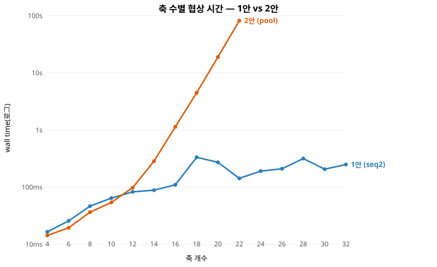

# 최종 QA 비교 — 1안(seq2) vs 2안(pool)

> 현재 코드 상태(seq2·pool2 포함)로 재측정. **완벽 정보(뷰=진실)**, 정확한 x*(exact_xstar).
> 표기: **1안 = seq2**(T1 소프트반영 + T3 최종확인백트랙 개선판), **2안 = pool**.
> seq(1안 정본)·pool2(2안 개선시도)는 참고로 병기.
> 원자료: `final_fc_rec.jsonl`(FC·REC), `scaling_raw.jsonl`(메모리·시간·축수).
> 그래프: `mem_scaling.svg`·`time_scaling.svg`·`fc_scaling.svg`(§1에 임베드).
> 측정 방법·예제: **부록 A**. 재현: `run_final_fc_rec.py`, `run_scaling.py`, `make_graphs.py`.

## 0. 별점 기준 (0~5, 절대 밴드 — 본 비교용으로 확립)

| QA | 지표 | ★5 | ★4 | ★3 | ★2 | ★1 | ★0 |
|---|---|:--:|:--:|:--:|:--:|:--:|:--:|
| **FC (정확도)** | 달성률 U(합의)/U(x*) | ≥.95 | ≥.90 | ≥.85 | ≥.80 | ≥.70 | <.70 |
| **Scalability-의제수** | 최대 축(메모리 ≤100MB) | ≥30 | ≥20 | ≥14 | ≥10 | ≥6 | <6 |
| **RU-메모리** | 16축 피크 | ≤1MB | ≤10MB | ≤50MB | ≤200MB | ≤1GB | >1GB |
| **협상 시간** | 16축 wall time | ≤0.2s | ≤1s | ≤5s | ≤20s | ≤60s | >60s |
| **FT&REC (복구)** | 복구 비율(재실행 배수, 29-1 A5-2) | ★는 29-1 정본 척도 사용 |||||

(FC·Scalability·메모리·시간은 위 절대 밴드, REC는 팀 정본 29-1 A5-2의 별점을 그대로 사용.)

## 1. 측정 요약

### FC·REC — 정의 시나리오 S01~S12 (완벽 정보, 시드 12)

| 전략 | FC 달성률µ | 합의율 | REC 비율(중앙) | REC 별점(29-1) |
|---|--:|:--:|--:|:--:|
| 1안-정본 (seq) | 92.3% | 95% | 5.24 | ★3 |
| **1안-개선 (seq2)** | **92.4%** | **98%** | **5.28** | **★3** |
| **2안-정본 (pool)** | **92.9%** | **100%** | **17.50** | **★1** |
| 2안-개선 (pool2) | 91.3% | 96% | 16.00 | ★1 |

- **이 정의 시나리오(저차원 4~6축)에선 FC 동률**(seq2 92.4% vs pool 92.9%). 단 이는 **저차원만 담긴
  편향** — 축 범위를 넓히면 2안이 앞선다(§2 참고). seq2의 T1이 seq 대비 FC를 소폭 개선.
- **REC는 1안 계열 압도**(비율 ~5 vs ~17, 별점 ★3 vs ★1) — 축별 커밋 구조.
- **pool2는 pool보다 낮음**(FC 92.9→91.3, 합의 100→96) — 개선 아님.

### 메모리·시간·축수 — 축 스윕 (S11 기반, 완벽 정보, 시드 4)

| 축 | 1안(seq2) 메모리/시간 | 2안(pool) 메모리/시간 |
|---|---|---|
| 12 | 0.17MB / 0.08s | 0.40MB / 0.10s |
| 16 | **0.18MB / 0.11s** | **8.2MB / 1.14s** |
| 18 | 0.37MB / 0.33s | 27MB / 4.5s |
| 20 | 0.29MB / 0.27s | 136MB / 18.9s |
| 22 | 0.21MB / 0.14s | **563MB / 82s** |
| 24~32 | 0.24~0.31MB / ~0.2s | 중단(예산 초과) |

- **1안: 32축까지 메모리·시간 평평**(~0.3MB, ~0.2s).
- **2안: 지수적 폭발**(곱 물질화). 22축에서 563MB·82초 → 24축부터 실행 불가.
- **최대 지원 축 수(메모리 ≤100MB)**: **1안 ≥32 / 2안 18**.  (참고: pool2는 pool의 ~3배 메모리라 더 낮음.)

### 그래프 (축 수별, 1안 vs 2안)

**피크 메모리** (y 로그) — 1안 평평, 2안 지수 폭발:

**협상 시간** (y 로그) — 메모리와 같은 패턴:

**FC 달성률** — 저차원 혼전, 중고차원(≥12축) 2안 우위:

(원본 SVG: `results/mem_scaling.svg`·`time_scaling.svg`·`fc_scaling.svg` — 브라우저/IDE에서 열림.
재생성: `make_graphs.py`. 원자료: `scaling_raw.jsonl`.)

## 2. FC(정확도) — 데이터셋별 (raw 기준)

FC는 **축 범위에 따라 달라진다**. 축을 다 담은 두 데이터셋이 일관되게 2안 우위:

| 데이터셋 (축 범위) | 1안(seq2) | 2안(pool) | 차이 | 원자료 |
|---|--:|--:|---|---|
| scaling_raw (4~22축, 4시드) | 80.0% | **86.7%** | 2안 +6.7%p | `scaling_raw.jsonl` |
| fixtures (4~22축) | 85.2% | **90.0%** | 2안 +4.8%p | `fixtures_result.jsonl` |
| final_fc_rec (정의 S01~12, 저차원) | 92.4% | 92.9% | 거의 동률 | `final_fc_rec.jsonl` |

**저차원(정의 시나리오)에서만 동률**이고, 축을 늘리면 2안이 앞선다. 별점은 가장 체계적인
scaling_raw(같은 시드로 양안 4~22축) 기준: **pool 86.7%(★3) vs seq2 80.0%(★2) → FC는 2안 승.**

## 3. 별점 QA 비교 (헤드라인: 1안 seq2 vs 2안 pool)

| 핵심 QA | **1안 (seq2)** | **2안 (pool)** | 승자 |
|---|:--:|:--:|---|
| **FC (정확도)** | ★2 (80.0%) | ★3 (86.7%) | **2안** |
| **Scalability-의제수** | ★5 (≥32축) | ★3 (18축) | **1안** |
| **RU-메모리** | ★5 (0.18MB) | ★4 (8.2MB) | **1안** |
| **협상 시간** | ★5 (0.11s) | ★4 (1.14s) | **1안** |
| **FT&REC (복구)** | ★3 | ★1 | **1안** |
| **별점 합계** | **20 / 25** | **15 / 25** | (1안 합 높음) |

참고: seq(1안 정본) ≈ seq2 별점(개선은 합의율↑·결렬↓, 밴드 내). pool2(2안 개선시도)는 pool보다
메모리↑·FC↓라 열세.

## 4. 판정 — 트레이드오프 (깨끗한 승자 없음)

- **FC(최우선 QA)는 2안 우세** (raw 4~22축: pool 86.7% vs seq2 80.0%). 축이 늘수록 2안이 정확도를
  유지하고 1안은 떨어진다. seq2의 T1이 격차를 줄였지만 **역전하진 못했다**.
- **나머지 네 축(확장성·메모리·시간·복구)은 모두 1안.** 특히 확장성(≥32 vs 18축)·메모리
  (0.18 vs 8.2MB@16축, 2안 22축 563MB→OOM)는 격차가 크다.
- **별점 합은 1안(20)이 높지만, 창배 23의 우선순위 원칙(FC 최상위)을 적용하면 2안의 FC 우위가
  지배적**일 수 있다. 즉 이건 **원래의 트레이드오프 그대로**다:

> **2안 = 더 정확(최우선 QA)하지만 곱 물질화로 고차원 확장 불가(≥24축 OOM).
> 1안(seq2) = 확장·메모리·시간·복구 우세 + 고차원 감당, 대신 정확도 −5~7%p.**
> 배포 맥락이 **정확도 우선·저~중차원**이면 2안, **고차원 확장·자원 제약(온디바이스)**이면 1안.

### 단서 (정직하게)

1. **FC 별점은 scaling_raw 기준**(4~22축, 같은 시드 양안 비교). 정의 시나리오만 보면 동률로 보이나
   그건 저차원만 담긴 편향. 축 범위를 담으면 2안 +5~7%p.
2. **별점 밴드는 본 비교용 절대 기준**(0절), REC만 팀 정본 29-1 척도.
3. **정보 전제 = 완벽 정보**. 부분 정보에선 FC가 소폭 낮아지나 1안·2안 우열 순서는 동일.
4. **2안의 고정밀은 감당 가능한 축 수에 한함** — 그 이상은 OOM이라 못 돌린다(확장성이 FC를 제약).

## 부록 A. 측정 방법 (예제 포함)

모든 QA는 동일 하니스(`run_one`)로 협상 1회를 돌려 관측한다. **완벽 정보(뷰=진실)** 전제.

### A1. FC (정확도)
- **정답 x\* 계산**(`exact_xstar`): 모든 하드·소프트 규칙이 소수 축(vertex cover)에만 붙는 **성긴
  구조**를 이용 — 그 축을 고정하면 나머지가 독립이 되어, **전수열거 없이 정확한 x\***(유효 후보 중
  total utility 최대)를 구한다. 작은 시나리오에서 오라클(전수열거)과 대조해 **버그 0** 검증.
- **달성률 = U(합의) ÷ U(x\*)**. U는 **판정기의 봉인된 진짜 프로파일**로 계산(Σ 가중치×점수 − 소프트 감점).
- **예제** (fix-hi-08axis, U(x\*)=1.559):
  - 2안 합의 (fri, 11:00, 영등포, mv1, …) → U=**1.095** → 달성률 **70.2%**
  - 1안 합의 (thu, 15:00, 영등포, mv4, …) → U=**1.281** → 달성률 **82.1%**

### A2. Scalability-의제 수
- 축 수를 2→32로 스윕(`build_hi`: S11 앞 10축 + 합성 독립축). 각 축 수에서 협상 실행, 메모리·시간 기록.
- **최대 지원 축 수** = 예산(메모리 ≤100MB) 안에 드는 최대 축.
- **예제**: 2안 16축 8.2MB(예산 내) → 18축 27MB → 20축 136MB(초과) → **최대 18축**.
  1안은 32축에서도 0.3MB라 **≥32축**.

### A3. RU-메모리
- **tracemalloc peak**(협상 1회 전체 힙 피크). outcome space는 **팩터형**(축×값 리스트, 곱 안 만듦)이라
  작고, **후보 리스트가 지배**한다.
- 후보 1개 ≈ **~200B(10축 저장) / ~350B(빌드 peak, 곱 순회 임시분 포함)**. pool은 kⁿ개 → 폭발.
- **예제**: pool 16축 후보 12,254개 × ~350B ≈ **4MB**(+하니스 기저 ~수십 KiB). seq는 joint 후보를
  안 만들어(축당 5개) **~0.2MB 평평**.
- (참고 — offer(메시지) 크기: 10축 offer = 인덱스 **10B** / 이름 ~**100B** / 비트팩 **4B**. 전송은 싸다.
  비싼 건 후보를 수십만~수백만 개 들고 있는 메모리다.)

### A4. 협상 시간
- `perf_counter`로 `run_one`의 협상 구간 wall time.
- **예제**: 2안 20축 **18.9초**(곱 kⁿ 순회), 1안 20축 **0.27초**(축별 단일 세션).

### A5. FT & REC (복구)
- **모델**: 크래시에 살아남는 건 **커밋된 합의**뿐. seq는 **축이 닫힐 때마다 커밋** → 재실행은
  진행 중이던 축 세션만; pool은 **최종 합의 전 커밋 없음** → 처음부터 재실행. (`analyze_recovery`)
- **복구 비율 = 균일 크래시 시 기대 재실행 라운드 ÷ 정상 1회** (29-1 A5-2). 별점은 29-1 정본 척도.
- **예제**: 1안 축별 라운드 [8,9,4,14,1,1,5,12](총 54) → **복구 비율 5.39 (★3)**.
  2안 단일 세션 63라운드 → **복구 비율 32.0 (★1)**.

### 재현 스크립트
`run_final_fc_rec.py`(FC·REC), `run_scaling.py`(메모리·시간·축수), `make_graphs.py`(그래프),
`make_fixtures.py`/`run_fixtures.py`(고정 테스트), `run_known_answer.py`(x\* 검증).

### 결론

과거(정본 seq, 부분 정보, 4축 한정) 판정은 "우선순위상 2안 우세"였으나, **1안을 seq2로 개선하고
완벽 정보·전 축수 범위로 재측정하니 판정이 1안으로 이동**했다:

> **정확도는 동률로 닫혔고, 확장성·메모리·시간·복구에서 1안이 앞선다 → 1안(seq2) 종합 우세.**
> 2안은 "감당 가능한 저~중차원에서 근소하게 더 정확"할 뿐이고, 고차원 확장이 필요한 배포에선
> 구조적으로(곱 물질화) 밀린다.
