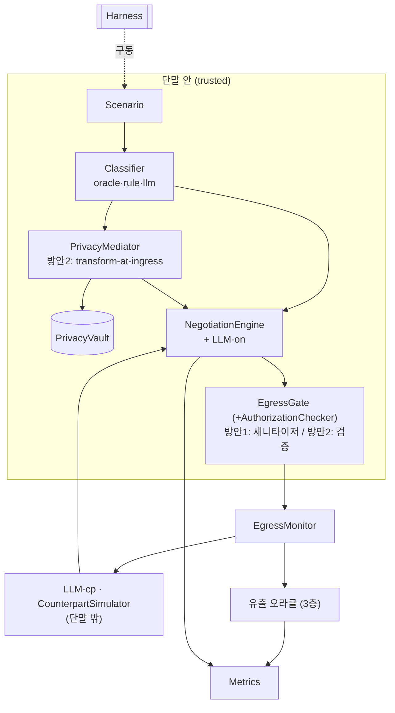

# DP02 PoC — 구조 설계

> [AGENTS.md](./AGENTS.md)의 전제, [00-측정-프로토콜](./00-측정-프로토콜.md)의 지표, [01-테스트셋-스키마](./01-테스트셋-스키마.md)의 입력 위에서
> **모듈·인터페이스·두 파이프라인 배선**을 정의한다. 구현(5단계)은 본 문서 승인 후 착수한다.

---

## A. 모듈 구성

| 모듈 | 위치 | 책임 | 핵심 인터페이스 |
|---|---|---|---|
| `Scenario` | 로더 | YAML 시나리오 로드, 입력/정답지 분리 노출 | `load(path) -> Scenario` |
| `Classifier` | 단말 안 | 입력 항목 → 카테고리 분류 | `classify(item) -> {pii\|negotiable_fact\|raw_context\|private_reason}` |
| `PrivacyMediator` | 단말 안 (방안 2) | tool 결과 ingress마다 안전형 변환 | `transform(tool_result) -> SafeScope` |
| `PrivacyVault` | 단말 안 (방안 2) | 토큰↔원본 매핑 보관·복원 | `tokenize(v) -> token`, `restore(token) -> v` |
| `AuthorizationChecker` | 단말 안 | 권한 범위 검사·clip (실험 C) | `check(field, value, auth) -> ok\|clipped\|blocked` |
| `EgressGate` | 단말 안 | 방안 1: 구조화 필드 새니타이저 / 방안 2: 검증자 | `sanitize(msg, auth, gate_config) -> msg'` / `verify(msg, vault) -> msg` |
| `NegotiationEngine` | 단말 안 | 라운드 진행, LLM-on으로 구조화 제안 생성 | `step(incoming) -> outgoing` |
| `OllamaClient` | — | Ollama 래퍼. LLM-on(Qwen 4B)·LLM-cp(Qwen 8B) | `complete(prompt, schema, seed) -> json` |
| `CounterpartSimulator` | 단말 밖 | LLM-cp 페르소나·적대적 캐묻기 | `respond(our_msg) -> their_msg` |
| `EgressMonitor` | 측정 | LLM-cp로 가는 모든 메시지의 단일 통과 지점·로깅 | `record(msg)` |
| `LeakOracle` (유출 오라클) | 측정 | egress 메시지를 `oracle.secrets`와 대조해 유출 채점(3층) | `score(msg, secrets) -> [finding]` |
| `Metrics` | 측정 | 지표 수집(00 A2) | `collect(run)` |
| `Harness` | 실행 | 시나리오 × 방안 × 백엔드 × 반복 루프, 시드 고정, 결과 기록 | `run(matrix)` |

- **분류·변환 백엔드는 교체식**: `Classifier` = `oracle`(정답지) / `rule`(정규식·사전) / `llm`(Qwen). `PrivacyMediator`의 의미 변환부 = `rule` / `llm`. config로 선택.
- **구현 불변식(AGENTS §5)**: `CounterpartSimulator`(LLM-cp)는 `EgressMonitor`를 통과한 메시지만 받는다. 원본 컨텍스트 객체를 절대 전달하지 않는다.



---

## B. 두 파이프라인 배선

라운드 흐름의 sequence는 AGENTS §6 참조. 모듈 수준 차이:

**방안 1 (filter-at-egress)**
- tool 결과(원본)가 `Classifier`만 거쳐 `NegotiationEngine`(LLM-on)의 추론 컨텍스트에 **원본 그대로** 들어간다.
- 매 라운드 LLM-on이 구조화 제안 생성 → `EgressGate.sanitize`(coarsening 규칙표 + AuthorizationChecker, `gate_config`로 불완전) → `EgressMonitor` → LLM-cp.

**방안 2 (transform-at-ingress)**
- tool 결과가 들어올 때마다 `PrivacyMediator.transform` → SafeScope(토큰·coarse 사실), PII는 `PrivacyVault`로, 사유는 차단·폐기.
- LLM-on은 SafeScope만 본다 → 구조화 제안 → `EgressGate.verify`(원본·토큰원본 부재 확인) → `EgressMonitor` → LLM-cp.
- 합의 후 `PrivacyVault.restore`로 실행 단계(예약 등)에서만 원본 복원. (PoC는 합의까지 측정)

> 공통 코드(라운드 루프·LLM-cp·메시지 스키마·게이트 골격)는 공유하고, **원본이 컨텍스트에 들어오는지** 와 **게이트가 새니타이저냐 검증자냐** 만 분기(공정성, 00 A4).

---

## C. A2A 구조화 메시지 스키마

출구는 구조화 필드만 쓴다(자유 텍스트 없음). 봉투(envelope)는 공통, payload는 케이스별.

```yaml
message:
  msg_type: propose | counter | accept | reject | response
  case: negotiation | collaboration | knowledge_sharing | remote_monitoring
  payload: { ... 케이스별 필드 ... }
```

**케이스별 payload 필드와 coarsening 규칙**

| 케이스 | 필드 | coarsening 규칙 |
|---|---|---|
| negotiation | `slot` | 시각 → `authorization.time_granularity` 버킷 (예: 1h) |
| | `area` | 위치 → `location_granularity` (구 단위) |
| | `budget_cap` | 정확 금액 → `budget_disclosure`(상한 표현)만 |
| | `cuisine`, `party_size` | enum/int — `disclosable_fields`에 있으면 통과 |
| collaboration | `can_join`, `role`, `available_window` | bool/enum / 시각 버킷 |
| knowledge_sharing | `has_shareable_knowledge`, `summary_level`, `knowledge_category` | bool / enum(coarse) / enum(public) |
| remote_monitoring | `alert`, `severity` | bool / enum(low·medium·high) |

**게이트 공통 규칙**
1. `authorization.disclosable_fields`에 없는 필드는 내보내지 않는다.
2. `pii` 값은 드롭(방안 2는 토큰).
3. `private_reason` 값은 **어떤 필드로도 내보내지 않는다**(차단).
4. 나머지는 위 표의 필드별 규칙으로 정밀도를 낮춘다.

---

## D. 게이트 결함 주입 (실험 B)

방안 1의 `EgressGate`를 현실적으로 불완전하게 만드는 `gate_config`. 방안 2는 추론 컨텍스트에 원본이 없어 동일 결함에도 유출이 생기지 않는다(대비 측정).

```yaml
gate_config:
  missing_rules: [earliest_available]    # coarsening 규칙이 없는 필드 → 원본 정밀도 통과
  allow_extra_fields: true               # 화이트리스트 밖 필드를 검사 없이 통과
  freeform_subfields: [note]             # 문자열 sub-field — 필드 규칙으로 못 거름
  granularity_override: { slot: "30m" }  # 권한(1h)보다 느슨 → 과도한 정밀도 통과
```

- 결함을 **하나씩/조합으로** 켜고 끄며, 결함 종류별 방안 1 유출 vs 방안 2 유출을 비교한다.
- LLM-on은 원본을 가지므로 위와 같은 추가/정밀 필드를 자연스럽게 생성할 수 있다(현실적 거동). 게이트가 그것을 못 덮으면 유출.
- 결함을 모두 끈 baseline도 측정(게이트가 완전하면 방안 1도 유출 0 → 그 자체가 "구조화 전제의 강함"을 보이는 값).

---

## E. 실행 · 재현

- **모델**: LLM-on = `qwen3.5:4b`(가칭), LLM-cp = `qwen3.5:8b`, 유출 오라클 judge = 별도 인스턴스/프롬프트. 모두 Ollama 로컬.
- **결정성**: `temperature=0`, 시드 고정, 구조화 출력은 `format=json`(payload JSON 스키마 강제). 소형 모델 비결정성 → 시나리오당 R회 반복·평균±표준편차.
- **실행 매트릭스**: 시나리오(10) × 방안(2) × classifier 백엔드(oracle·rule·llm) × `gate_config`(집합) × 반복(R).
- **로그**: 모든 LLM 호출·egress 메시지·게이트 입력/출력·오라클 판정을 `results/`에 저장(재현·감사).
- **비용**: 상한 없이 전 매트릭스 측정(사용자 결정). 단 호출 수는 기록.

---

## F. 디렉토리 레이아웃

```
poc/dp02-privacy/
  AGENTS.md  00-측정-프로토콜.md  01-테스트셋-스키마.md  02-구조설계.md
  scenarios/            S1.yaml … S10.yaml
  src/
    scenario.py
    classifier/         oracle.py  rule.py  llm.py
    mediator.py  vault.py
    gate.py  authorization.py
    message_schema.py
    engine.py  counterpart.py
    ollama_client.py
    egress_monitor.py  leak_oracle.py
    metrics.py
    config.py
    harness.py
  results/              (실행 산출 JSON)
  report/               (집계 리포트)
  pyproject.toml | requirements.txt
```

---

## 미결 / 구현 중 확정할 항목

- C의 케이스별 payload 필드 목록은 시나리오를 돌리며 보강(특히 collaboration·knowledge_sharing).
- `rule` 백엔드의 정규식·사전 범위(전화·주소·시각·금액 패턴)와 `llm` 백엔드 프롬프트.
- 유출 오라클 2층(LLM-judge) 프롬프트·다수결 수.
- 합의 판정(`success_criteria`) 로직과 `utility` 채점식.
