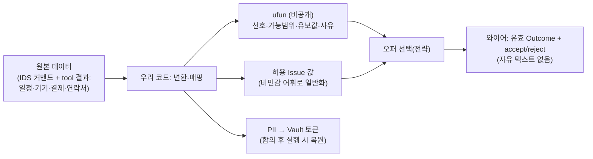

# DP02 PoC — NegMAS 프레임워크와 OutcomeSpace 어휘 설계

> **작성 배경:** 협상(negotiation) 케이스가 **NegMAS 프레임워크** 사용으로 거의 확정됨에 따라,
> NegMAS의 구조가 DP02(민감정보 처리 구조)의 설계 판단에 미치는 영향을 정리한다.
> **표기 원칙:** NegMAS 공식 문서에서 확인한 **사실(근거)** 과, 그로부터 도출한 **DP02 관점의 해석(의견)** 을 구분해 적는다.
> **범위:** 본 문서는 **negotiation 케이스에 한한다.** knowledge_sharing(내용 전달형)과
> 오퍼 패턴 기반 **역추론(opponent modeling)** 문제는 의도적으로 제외한다(별도 검토 대상).

---

## 1. NegMAS가 협상에서 실제로 주고받는 것 (근거)

NegMAS는 "상황화된 협상(situated negotiation)"을 위한 Python 라이브러리다. 협상의 구성요소는 다음과 같다.

- **OutcomeSpace(결과 공간):** 협상 대상인 **Issue(쟁점)** 들의 집합. Issue는 가격·시간·장소처럼 협상되는 변수다.
  - Issue의 값 유형: **Categorical/Discrete(범주·이산), Ordinal(순서), Range/Continuous(범위·연속)** 등.
  - `outcome_is_valid`, `enumerate_issues`, `discretize_and_enumerate_issues` 등으로 값의 유효성·열거를 강제·지원한다.
- **Outcome(결과):** 각 Issue에 값을 **하나씩 배정한 튜플**. 예: `(slot=목_19-20, area=을지로, price=50000)`.
- **프로토콜:** 표준은 **SAO(Stacked Alternating Offers, 교대 제안)** — `SAOMechanism`.
- **메시지(라운드별 응답):** 협상자는 매 라운드 **`SAOResponse = (ResponseType, Outcome)`** 을 반환한다.
  - `ResponseType ∈ { ACCEPT_OFFER, REJECT_OFFER, … }`. REJECT 시 카운터 오퍼(다음 Outcome)를 함께 낸다.
  - **즉 와이어에 실리는 것은 "미리 정의된 OutcomeSpace 안의 오퍼 + 수락/거절"이 전부다. 자유 텍스트 채널이 프로토콜에 없다.**
- **선호·효용(ufun):** 협상자의 선호는 **`ufun`(utility function)** 이라는 **로컬 객체**로 표현된다(예: `LinearAdditiveUtilityFunction`).
  - ufun은 Outcome → 실수(효용)로 매핑하며, **상대에게 전송되지 않는다.** 상대는 내 **오퍼만** 볼 뿐 내 ufun은 못 본다.

---

## 2. DP02 관점의 함의 (해석)

위 구조가 DP02의 핵심 질문("개인정보 누출 차단을 어떻게 달성하는가")에 주는 영향:

1. **자유형 누출 채널이 협상에선 애초에 없다.**
   PoC가 측정한 유출은 전부 `note`(자유 텍스트)를 통해 났는데, NegMAS에는 그런 필드가 없다.
   → PoC의 헤드라인 누출 벡터는 *PoC 자체의 메시지 설계가 만든 산물*이며, NegMAS를 쓰면 재현되지 않는다.

2. **선호·협상 약점·사유는 ufun에 들어가 구조적으로 비전송된다.**
   급전·예산 한계·긴급도·"왜 그 시간만 되는지" 등은 **ufun(로컬 효용)** 에 인코딩되고, 프레임워크는 이를 전송하지 않는다.
   상대는 내가 어떤 오퍼를 내고 안 내는지만 볼 뿐, 그 **이유(사유)** 는 보지 못한다.

3. **"enum 강제"가 프로토콜에 내장되어 온다.**
   NegMAS는 `outcome_is_valid`로 OutcomeSpace **밖의 값을 거부**한다. LLM을 협상자 두뇌로 감싸도,
   그 출력이 유효한 Outcome이 아니면 프로토콜이 받지 않는다.
   → PoC가 갖지 못했던 "스키마(enum) 강제"가 프레임워크 차원에서 보장된다.

4. **프라이버시의 결정권이 "런타임 필터"에서 "OutcomeSpace 설계"로 이동한다.**
   보낼 수 있는 값 자체가 OutcomeSpace로 한정되므로, 누출 차단의 수준은 **Issue 값 어휘를 어떻게 설계했는가**가 정한다(§3).

5. **방안 1 vs 방안 2 논쟁은 협상 와이어에서 거의 사라진다.**
   NegMAS가 원본을 와이어에 못 올리게 하므로(유효 Outcome만 전송), 두 방안의 차이는
   "**온디바이스 추론 컨텍스트에 원본이 앉아 있느냐**"로 축소된다 — 이는 상대 에이전트행(㉡)이 아니라
   **서버 LLM행(㉠, QS-009, v2)** 위협에서나 의미가 있다. (자세히는 §5)

---

## 3. OutcomeSpace 어휘 설계란 (해석)

**정의:** 협상 도메인에 대해 **"어떤 Issue를 두고, 각 Issue에 어떤 값들을 허용할지"를 설계타임에 정하는 일.**
상대에게 보낼 수 있는 단어 자체를 여기서 정하므로, 이것이 **프라이버시의 바닥(floor)** 을 결정한다.

### 예시 — 저녁 약속 협상

사용자의 원본 데이터: 목요일 19:00–21:00 가능(그 전엔 진료) · 당뇨·할랄 · 예산 정확히 47,000원 · 집 주소·이름.

| Issue | 허용 값(어휘) | 설계 결정 |
|---|---|---|
| `slot` | {목_18-19, 목_19-20, 목_20-21, 금_18-19, …} | 1시간 버킷으로 이산화 |
| `area` | {강남, 을지로, 마포, …} | 구 단위 목록. **정확 주소는 값에 없음** |
| `cuisine` | {한식, 양식, 일식, …} | enum |
| `dietary` | {제한없음, **해산물제외**, 돼지고기제외, 채식} | ⚠️ **핵심 결정(아래)** |
| `price` | 범위 `[0, 50000]` | 상한만, 정확 금액(47,000) 없음 |

**가장 중요한 결정은 `dietary` 어휘다:**

- **나쁜 설계:** `dietary ∈ {당뇨식, 할랄, …}` → 값을 고르는 순간 질환·종교가 그대로 노출. 자유 텍스트를 없앤 의미가 사라진다.
- **좋은 설계:** `dietary ∈ {해산물제외, …}` → 상대가 메뉴를 정하는 데 필요한 **행동 정보만** 담고, **"왜"(당뇨·할랄)는 어휘에 아예 없다.**

> 어휘 설계 = **"상대가 합의하는 데 필요한 만큼만 표현하고, 그 원인(사유)은 값 목록에서 빼는" 작업.**
> 무엇을 Issue로 두지 **않느냐**(건강·신원·사유)도 똑같이 중요하다 — Issue가 아니면 보낼 수조차 없다.

---

## 4. 원본 데이터의 두 갈래: ufun(비공개) vs 오퍼(전송)

사용자의 진짜 사정은 두 군데로 나뉜다.

- **ufun (비공개, 전송 안 됨):** "목_19-20 효용 0.9 / 목_18-19 효용 0(진료라 불가) / price>50000 효용 0."
  → 사용자가 *7시 전엔 안 되는 이유(진료)* 는 **"이른 슬롯의 효용이 낮다"** 로만 인코딩된다.
  상대는 내가 그 슬롯을 안 내민다는 것만 볼 뿐, 이유는 못 본다.
- **오퍼 (전송됨):** OutcomeSpace 안의 값 조합. 어휘가 이미 비민감하니 안전하다.

---

## 5. 방안 1/2와의 관계 (해석)

- 협상 와이어에서는 **방안 1/2의 차이가 거의 사라진다.** 프레임워크가 (a) 구조화된 Outcome만 전송하고 (b) ufun을 비공개로 두기 때문.
- **§4의 "변환·매핑"이 사실상 방안 2(사전 변환)의 정체다.** NegMAS를 쓰면, 방안 2는 "협상 경로를 보호하는 별도 아키텍처"가 아니라
  **"OutcomeSpace와 ufun을 원본으로부터 만들어내는 전처리"** 로 자연스럽게 흡수된다.
- 남는 방안 1/2의 차이는 **"온디바이스 추론 컨텍스트(LLM-on의 프롬프트)에 원본이 들어가느냐"** 뿐이며,
  이는 상대 에이전트행(㉡)이 아니라 **서버 LLM행(㉠, QS-009)** 위협에 해당한다(v0 범위 밖, v2).

---

## 6. 정리

- NegMAS 채택은 협상에서 누출 차단을 **"런타임 필터(방안 1/2)"에서 "OutcomeSpace/Issue 어휘 설계 + 원본→(ufun·값) 매핑"으로 이동**시킨다.
- 진짜 결정점은 **비민감 Issue 어휘를 누가·어떻게 닫힌 집합으로 정의하느냐**이다.
- PII는 협상 대상(Outcome/ufun)이 아니라 **Vault**로 분리되어 합의 후 실행 단계에서만 복원된다.
- (범위 밖 메모) 오퍼 패턴 기반 **역추론**과 **knowledge_sharing**(내용 전달)은 본 구조로 덮이지 않으며 별도 검토가 필요하다.

---

## 근거·출처

NegMAS 구조에 관한 §1의 사실은 아래 공식 문서·저장소에서 확인했다. §2~§6은 그로부터의 DP02 관점 해석이다.

- NegMAS Overview (outcomes·issues·preferences·mechanisms): https://negmas.readthedocs.io/en/v0.10.20/overview.html
- NegMAS — Develop a new negotiator (`respond()`·`ResponseType`·`ufun`): https://negmas.readthedocs.io/en/v0.10.23/tutorials/03.develop_new_negotiator.html
- NegMAS GitHub: https://github.com/yasserfarouk/negmas
- negmas · PyPI: https://pypi.org/project/negmas/

_본 문서는 사용자 지시(2026-06-26)로 작성되었으며, NegMAS 사실부와 DP02 해석부를 구분한다._
