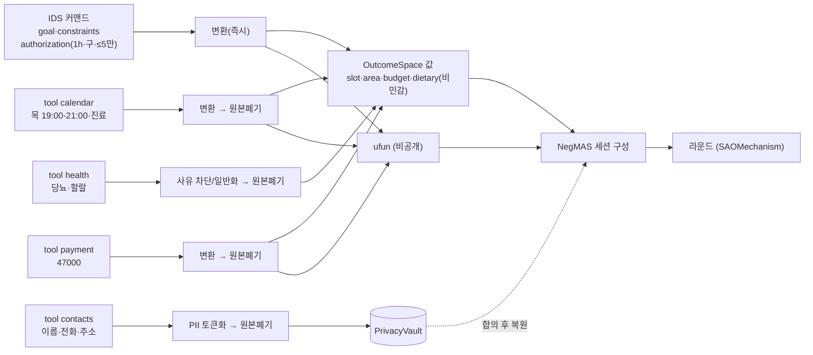
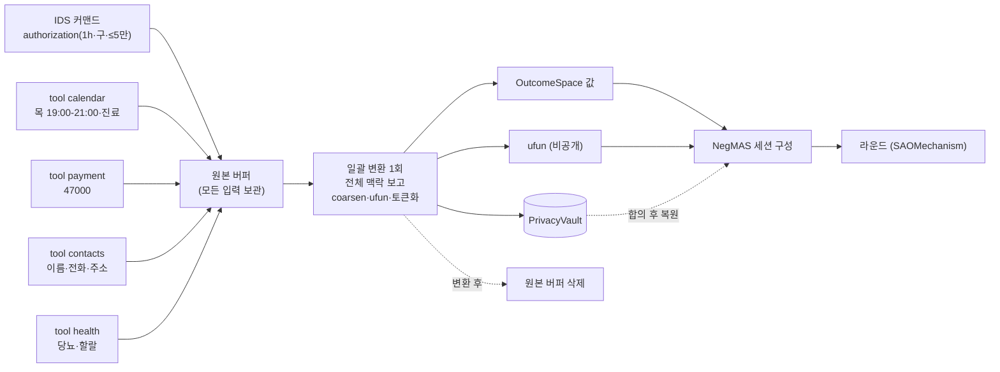
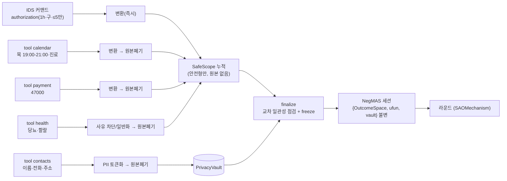

# DP02 PoC — D2 후보안: 3변환의 시점·배치 (Transform Placement)

> **배경:** NegMAS 채택으로 협상 누출 차단의 결정권이 "런타임 필터(방안1/2)"에서 "원본→(ufun·값) 매핑 + OutcomeSpace 어휘 설계"로 이동했다([04-negMAS-프레임워크-정리](./04-negMAS-프레임워크-정리.md)).
> 그 매핑(=3변환)을 **파이프라인 어느 시점·어디서 수행하는가**가 본 후보안(D2)의 주제다.
> **평가축:** DP02·PoC 품질속성 6개([AGENTS.md](./AGENTS.md) 8항) — 기밀성·Latency·자원·Task 성공률·세션 복구·유지보수성.
> **범위:** negotiation(NegMAS) 기준.

---

## 1. D2가 결정하는 것

**3변환:**
1. **원본 → Issue 값 매핑** (coarsen·일반화 → OutcomeSpace의 비민감 값)
2. **ufun 구성** (선호·유보값 → 효용함수, 비공개·비전송)
3. **PII → Vault** (식별정보 토큰화, 합의 후 실행 시 복원)

**NegMAS 제약:** ufun·OutcomeSpace는 라운드가 시작되기 *전에* 존재해야 한다. 따라서 3변환은 본질적으로 **셋업 단계에서 1회** 일어나며, 라운드마다 반복되지 않는다(옛 "출구 필터/라운드" 방식은 NegMAS에 부적합).
→ D2의 진짜 결정은 "라운드냐 셋업이냐"가 아니라 **셋업 *안에서* 어떻게 하느냐**이다.

---

## 2. 세 후보

- **A — tool-ingress 스트리밍:** tool 결과가 도착하는 즉시 각각 변환하고 **원본을 바로 폐기**. 원본을 통째로 모으지 않음. 통합 단계 없음.
- **B — 셋업 배치:** tool 결과를 **원본 버퍼에 모두 모은 뒤 한 번에** 변환. 전체 맥락을 보고 일괄 처리.
- **절충 — 스트리밍 + finalize:** 변환·원본폐기는 A처럼 스트리밍하되, 라운드 1 전에 **finalize**(모인 *안전형*만 교차 일관성 점검 + freeze)를 둔다. **원본은 절대 모으지 않고, 안전형만 모아 통합.**

---

## 3. 데이터 흐름도 (IDS + tool 예시 → NegMAS 진입)

### A — tool-ingress 스트리밍

**차이 핵심:** 변환이 각 tool에 붙어 **원본 즉시 폐기**(기밀성·메모리↑). 단 **전체를 함께 보는 통합 단계가 없음** → 교차 일관성 약함(Task 성공률 risk).

### B — 셋업 배치

**차이 핵심:** **원본을 버퍼에 모았다가** 한 번에 변환(전체 맥락 → 일관된 coarsen, Task 성공률↑). 단 **원본이 잠시 통째로 머묾**(기밀성·피크 메모리 cost).

### 절충 — 스트리밍 + finalize

**차이 핵심:** 변환·원본폐기는 A처럼 스트리밍(원본 버퍼 없음), 그러나 **finalize에서 모인 *안전형*만 교차 점검·freeze**(B의 일관성 이점). 원본은 절대 모으지 않는다.

---

## 4. 속도(Latency) 분석

세 안 모두 변환은 셋업에서 1회뿐이라 **라운드 속도는 동일**하다. 차이는 셋업 단계의 *일회성* 지연이며, 두 가지가 가른다.

1. **변환에 LLM을 쓰는가:** rule 변환이면 변환 비용 ≈ 0(PoC 실측 0.1~1.2 ms) → **A·B·절충 사실상 동일.** llm 분류기를 쓰면 셋업에 한 번 ~2.7초(PoC 실측)가 붙는다.
2. **tool 대기와 겹치는가:** A·절충(스트리밍)은 변환이 **tool I/O 대기 뒤에 숨고**, B(배치)는 마지막 tool *뒤에* **직렬로** 붙는다.

| 변환 backend | A | B | 절충 |
|---|---|---|---|
| **rule** (변환 ≈ 0ms) | 동일 | 동일 | 동일 |
| **llm** (셋업 분류 ~2.7s) | I/O와 겹쳐 숨김 | 직렬로 뒤에 붙음(가장 불리) | 겹침 + finalize 소량 |

→ 속도 차이는 "llm 분류기를 쓸 때 셋업에서 몇 초"가 전부이고, **B만 그 몇 초를 직렬로 더 떠안는다.** 라운드에 누적되지 않으므로 Latency 예산(협상 60초)엔 일회성으로만 잡힌다.

---

## 5. 6축 비교 (기밀성·메모리 분리)

| 축 | A 스트리밍 | B 배치 | 절충 |
|---|:--:|:--:|:--:|
| **기밀성**(단말 내 원본 체류 창) | ★★★ | ★☆ | ★★★ |
| **자원/메모리**(피크) | ★★★ | ★☆ | ★★☆ |
| **속도**(셋업 일회성) | ★★★ | ★★ | ★★★ |
| **Task 성공률**(교차 일관성) | ★★ | ★★★ | ★★☆ |
| **세션 복구**(직렬화 경계) | ★★ | ★★★ | ★★★ |
| **유지보수성**(변경 국소화) | ★★ | ★★★ | ★★☆ |

- **기밀성 ≠ 메모리:** A·B에선 같은 방향이지만 **절충에서 갈린다** — 절충은 원본을 안 모으니 기밀성은 A와 동급(★★★)인데, 안전형 누적 + finalize 버퍼로 **메모리는 A보다 약간 불리(★★☆)**.
- **기밀성 별 차이의 범위:** "단말 안에서 원본이 머무는 창"에 대한 것. 상대에게 나가는 A2A 와이어는 NegMAS가 세 안 모두 동일하게 막으므로, 이 차이는 *서버 LLM행(㉠)·온디바이스 위협면*에서만 의미가 있다.

---

## 6. 검토 결론

- **상충은 하나뿐:** 기밀성·메모리(A 유리) ↔ Task 성공률(B 유리). 나머지(속도·복구·유지보수성)는 "**단일·정적 셋업 경계**"를 가리킨다.
- **권고(절충):** 단일 셋업 경계에서 불변 `{OutcomeSpace, ufun, vault}` 삼중쌍을 만들되, tool 결과는 도착 즉시 스트리밍 변환·원본 폐기(A의 기밀성·메모리), 라운드 1 전에 **finalize**로 안전형 교차 일관성 점검 후 freeze(B의 합의 품질·복구). → 상충 대부분을 동시에 확보.
- **남는 결정(DP 방향에서):** 협상 중 **동적 재구성**(사용자 개입으로 ufun/공간 재빌드)을 허용할지. 허용 시 복구·유지보수성에 비용이 발생하므로 별도 판단 필요.

---

_2026-06-26: D2(변환 시점·배치) 후보안 — 사용자 지시로 작성. 평가축은 AGENTS.md 8항 6개 기준._
