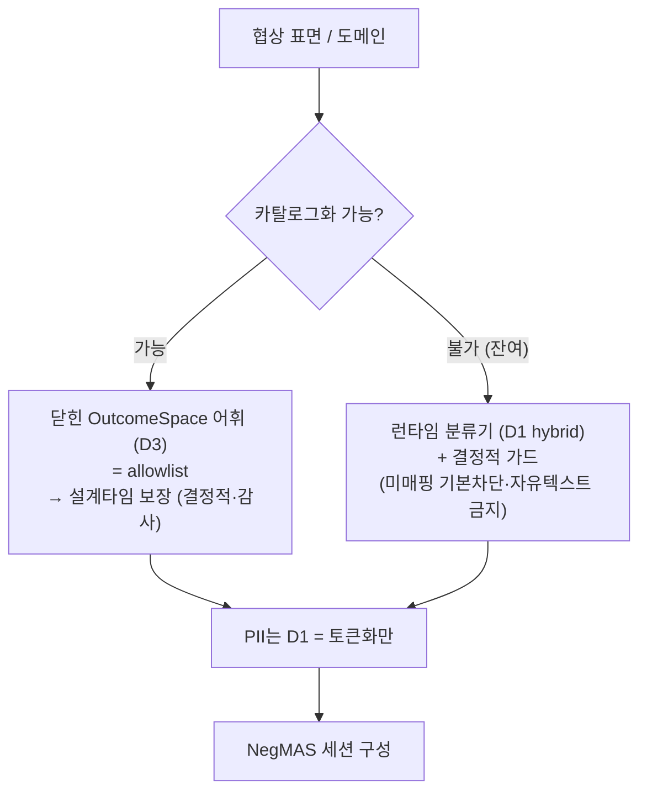

# DP02 PoC — D1·D3 통합 후보안: 보장의 위치 (Guarantee Placement)

> **배경:** D1(원본→값 매핑의 분류기 backend)과 D3(OutcomeSpace 어휘 거버넌스)는 따로 보면 각각 "rule/llm"과 "닫힘/열림"의 선택 같지만, 실제로는 **하나의 결정의 양 끝**이다.
> 본 문서는 둘을 한 결정으로 묶는다. 전제는 [04-negMAS-프레임워크-정리](./04-negMAS-프레임워크-정리.md)(협상 누출 차단이 어휘 설계 + 매핑으로 이동).
> **평가축:** DP02·PoC 품질속성 6개([AGENTS.md](./AGENTS.md) 8항) — 기밀성·Latency·자원·Task 성공률·세션 복구·유지보수성.
> **범위:** negotiation(NegMAS) 기준.

---

## 1. 통합 결정

> **민감정보가 OutcomeSpace 밖으로 못 나가게 하는 *보장*을, 설계타임 닫힌 어휘(D3)에 둘지 / 런타임 분류기(D1)에 둘지, 그리고 그 경계를 어디서 자를지.**

이를 가르는 단일 변수: **"협상 표면을 사전에 얼마나 카탈로그화할 수 있는가."** 카탈로그화한 만큼 D3로 덮이고, 나머지가 D1로 떨어진다.

- **D1** — 원본 값을 어느 카테고리로 인식해 어떻게 처리할지(PII→Vault / 사실값→Issue 값 / 사유→차단)의 **런타임 분류기**. 후보: rule / llm / hybrid. (oracle은 측정 전용)
- **D3** — Issue·값 집합·granularity를 **누가·어떻게 정의·공유·진화**시킬지의 **설계타임 어휘 거버넌스**. 후보: 닫힌 카탈로그 / 런타임 협상형 / 하이브리드.

---

## 2. 두 극(極)

### 극 A — 설계타임 보장 (D3 닫힌 카탈로그 + D1 최소)

- 어휘를 닫으면 매핑 안 되는 값은 *못 나감*(allowlist) → **사유 탐지 자체가 불필요.** D1은 PII 토큰화 수준으로 축소.
- 보장이 **결정적·감사 가능.**
- 대가: 예상 못 한 도메인·속성은 표현 불가(커버리지↓), 진화에 중앙 거버넌스.

### 극 B — 런타임 보장 (D3 열린/협상형 + D1 분류기)

- 무엇이든 표현(커버리지↑). 사유 탐지를 llm/hybrid 분류기가 떠안음.
- 대가: 보장이 **확률적·검증 불가**(llm), 비결정성(복구 risk), 상대가 스키마에 영향(공격면), 사유 false-negative 잔존.

---

## 3. 결합 규칙 (가장 중요)

> **D3를 닫은 만큼 D1의 부담과 위험이 사라진다.** "D1을 얼마나 강하게(llm) 할까"는 **"D3를 얼마나 닫을 수 있나"를 먼저 정해야** 답이 나온다.
> **D3가 상위 레버, D1은 그 잔여(residual)를 메우는 안전망.**

---

## 4. 6축 통합 비교 (D1·D3가 함께 움직임)

| 축 | 설계타임 보장 (닫힘 + 최소 D1) | 런타임 보장 (열림 + 분류기) |
|---|:--:|:--:|
| **기밀성** | ★★★ 결정적·감사 | ★☆ 확률적·검증불가 |
| **Latency** | ★★★ | ★★ (분류·스키마 핸드셰이크) |
| **자원** | ★★★ | ★★ |
| **Task 성공률**(커버리지) | ★★ 예상 내만 | ★★★ 무엇이든 |
| **세션 복구** | ★★★ 고정·결정적 | ★★ 비결정·세션 스키마 |
| **유지보수성** | ★★☆ (버전 거버넌스) | ★★ (분산·감사난) |

→ 한쪽이 압도하지 않는다. **커버리지(성공률) 하나만 런타임 쪽, 나머지 5축은 설계타임 쪽**이 유리하다.

---

## 5. 결정 절차 (실무)

1. 도메인을 **카탈로그화 가능 / 불가**로 가른다.
2. 가능 도메인 → **닫힌 카탈로그(D3) + allowlist**, D1은 PII 토큰화만.
3. 불가 잔여 → **런타임 분류기(D1 hybrid)** 로 메우되, 보안상 그 잔여를 **최소화**하고 결정적 가드(미매핑 값 기본 차단·자유텍스트 금지)를 둔다.
4. 진화 → 코어 카탈로그를 **버전 레지스트리 + 우리측 검증 게이트**로(상대가 Issue 못 만들게).

---

## 6. 어느 쪽을 골라도 의식적으로 설계해야 할 3가지 (녹지 않는 점)

1. **닫힘 vs 커버리지** — 타협으로 사라지지 않는 프론티어.
2. **보안 보장을 검증 불가 llm에 둘지 vs 감사 가능 어휘에 둘지** — 보안 속성(0건)엔 후자가 정석. "사유는 llm" 결론을 보안 관점에선 경계.
3. **공유 어휘의 함의** — ① 상대가 Issue 형성 못 하게(공격면), ② 정밀도 공통분모(개인 프라이버시 상한), ③ 어휘(공유) vs 허용 부분집합(비공개) 분리.

---

## 7. PoC 함의 (미실시 측정)

이 결정을 데이터로 받치려면 두 가지를 재야 하는데, **PoC가 둘 다 가렸다**:

1. 협상 표면의 **카탈로그화 비율**(닫을 수 있는 정도).
2. 잔여에 대한 분류기 **사유 false-negative율** — 단, 정답지·과적합 사전(`PRIVATE_KW`가 시나리오 정답 단어와 1:1 일치)을 빼고 **독립 민감어휘·held-out 시나리오**로 측정.

→ DP02에서 **가장 우선순위 높은 미실시 측정.**

---

## 8. 한 줄 결론

> DP02의 진짜 결정은 D1도 D3도 아니라 **"보장을 설계타임에 얼마나 끌어올 수 있나"** 하나다.
> 닫을 수 있는 코어는 닫고, 못 닫는 잔여만 런타임 분류기로 — 그 잔여를 최소화하는 것이 곧 보안 자세이며, 그 비율은 **DP 방향(도메인 개방도)** 이 정한다.

---

_2026-06-26: D1·D3 통합 후보안(보장의 위치) — 사용자 지시로 작성. 평가축은 AGENTS.md 8항 6개 기준._
