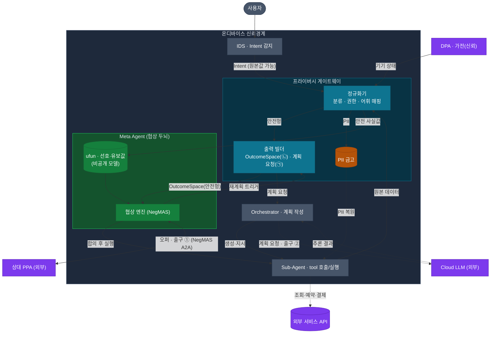

# 민감정보 처리 구조 — 신뢰경계와 구조화 출구

> 본 문서는 DP02(민감정보 처리)를 다시 쓰기 위한 **설계 기준**이다.
> 범위: 협상(negotiation), A2A는 NegMAS로 수행. 평가 관점: [00-결정사항.md](./00-결정사항.md)의 품질속성 6개(기밀성·Latency·자원·Task 성공률·세션 복구·유지보수성).

---

## 1. 문제

협상이 성립하려면 단말은 상대와 서버에 무언가를 전달해야 한다. 그 "무언가"에 사용자의 사생활(식별정보·일정·예산·그 근거가 되는 사유·기기 맥락)이 섞이면 곧 유출이다. 풀어야 할 것은 **"협상과 계획이 동작하도록 충분히 전달하되, 사용자의 민감정보는 단말을 떠나지 않게 하는" 데이터 처리 구조**다.

민감정보는 한 덩어리가 아니라 처리 방식이 다른 종류로 나뉜다.

- **식별정보(PII):** 이름·전화·정확 주소. 협상엔 불필요하고 실행(예약 등)에만 필요 → 단말 내 토큰으로 보관, 실행 시점에만 복원.
- **협상 사실값:** 가능 시간대·예산 상한·지역 등. 협상에 필요 → 사전 정의된 값으로 표현해 전달.
- **사유(Private Knowledge):** 진료·종교·재정난 등. 공개할 이유가 전혀 없음 → 어떤 출구 메시지에도 값으로 담기지 않는다(아래 §2).
- **원본 맥락:** 기기 원본값(예: 특정 시각의 기기 상태). 출구로 나가지 않으며, 필요한 사실값으로만 변환된다.

---

## 2. 설계 불변식 (Spine)

> **신뢰경계(온디바이스) 밖으로 나가는 모든 메시지는, 프라이버시 게이트웨이가 구성·매개한 구조화 메시지다 — 필드와 값이 모두 사전 정의되어 있고, 자유 텍스트가 없다. 사유·PII·원본은 *런타임에 탐지해서 거르는 것이 아니라, 메시지를 정의하는 어휘·인터페이스 단계에서 애초에 배제*된다.**

이 한 줄이 구조 전체를 지탱한다. 함의:

- **단일 enforcement 지점.** 무엇이 밖으로 나갈 수 있는가를 **Meta Agent와 분리된 프라이버시 게이트웨이** 한 곳이 결정한다 — 상대 PPA 채널은 게이트웨이가 구성한 *비민감 OutcomeSpace*로 보장되고(NegMAS는 그 위의 유효 오퍼만 전송), Cloud LLM·실행 채널은 게이트웨이가 직접 매개한다. PII 금고·계획 요청·어휘 정의가 한 곳에 모인다. Meta Agent는 협상 전략(ufun·오퍼)만 갖는다.
- **사유는 전송 메시지에 값으로 존재하지 않는다.** 사유는 오직 단말 내부의 사용자 선호(예: "그 시간대는 효용이 낮다")로만 반영되고, 밖으로는 그 결과인 *선택*만 나간다. 따라서 "사유 탐지기"의 정확도에 보안을 의존하지 않는다.
- **PII는 협상 대상이 아니다.** 협상 메시지의 어떤 필드도 PII를 담지 않는다. PII는 토큰으로 단말에 남았다가 합의 후 실행에서만 복원된다.
- **자유 텍스트가 없으므로** 출구에서 "무엇이 샐 수 있나"가 메시지 정의만 보면 결정론적으로 확인된다.

---

## 3. 신뢰경계와 두 출구

신뢰경계는 **온디바이스**이고, 밖으로 나가는 모든 트래픽은 **Meta Agent와 분리된 프라이버시 게이트웨이**가 구성·매개한다. 목적지는 둘이며, 둘 다 구조화 메시지만 받는다.

| 출구 | 목적지 | 내용 | 사용자 사생활 처리 |
|---|---|---|---|
| **① 협상** | 상대 PPA (외부, 불투명) | 사전 정의 OutcomeSpace 위의 **오퍼**(값 조합) | 선호·유보값은 전송하지 않고 단말 내 ufun에만 둔다 |
| **② 계획** | **Cloud LLM** (온디바이스 Orchestrator가 호출) | **구조화 계획 요청**(intent 유형·필요 capability·구조 파라미터) 및 **재계획 트리거** — *계획서가 아니라, Orchestrator가 계획을 짜기 위한 입력* | 원문·사유 부재. 잔여 PII는 능동 제거 |

- 상대 PPA는 **불투명한 외부 에이전트**로 취급한다. 상대가 무엇으로 구현됐는지는 우리 설계와 무관하며, 보호는 *우리가 오퍼에 무엇을 담는가*(어휘 정의)가 결정한다.
- **출구 ①의 전송은 NegMAS다.** 게이트웨이는 그 와이어에 앉지 않는다 — 게이트웨이가 만든 비민감 OutcomeSpace 위에서 NegMAS가 유효 오퍼만 주고받으므로 오퍼는 본질적으로 안전하다. 출구 ②·실행은 NegMAS가 없어 게이트웨이가 계획 요청 생성·PII 복원을 직접 한다. (NegMAS 직렬화 출력을 게이트웨이가 추가 감사하는 defense-in-depth는 선택이며, 보장의 근거는 OutcomeSpace 구성이다.)
- **Orchestrator는 온디바이스 컴포넌트**이며 계획 작성을 위해 **외부 Cloud LLM을 호출**한다. 외부로 나가는 것은 그 호출(출구 ②)이고, DP02는 그것이 **구조화 계획 요청뿐**임을 보장한다. (Cloud LLM 사용 범위·정책은 별도 DP.)

---

## 4. 프라이버시 게이트웨이 — 내부 구성과 산출물

게이트웨이는 단일 블록이 아니라 **공유 프리미티브 + 채널 어댑터**로 나뉜다(전체 데이터 흐름은 §5 도식에 통합되어 있다). 내부 모듈:

| 내부 모듈 | 역할 |
|---|---|
| **정규화기 (Normalizer)** | 분류 + 권한 결속 + 어휘 매핑: 원본 입력 → 안전 어휘 값 |
| **출력 빌더 (Output Builder)** | 채널별 산출 — OutcomeSpace(㉡) · 계획 요청(㉠) |
| **PII 금고 (Vault)** | PII 토큰 보관·실행 시 복원 |

*(Egress 검증기는 선택적 defense-in-depth라 도식에서 생략.)*

### 산출물 (소비처별)

수집한 입력 — **IDS Intent와 Sub-Agent/DPA의 원본 데이터** — 으로 게이트웨이가 만들어내는 산출물은 **소비처가 다르므로 분리해 다룬다.** 입력은 **출처와 무관하게 동일한 변환(정규화)** 을 거친다. IDS 출력도 형식은 구조화돼 있으나 값에 PII(예: 상대 연락처)·원문 맥락이 실릴 수 있어 예외가 아니다.

| 산출물 | 소비처 | 만들어지는 시점 | 민감정보 처리 |
|---|---|---|---|
| **OutcomeSpace 값** | 출구 ①(오퍼) | 협상 셋업 | 원본을 사전 정의 어휘 값으로 매핑(원본 미포함) |
| **ufun** (선호·유보값) | 협상 엔진(단말 내) | 협상 셋업 | 비공개, 전송 안 됨. 사유는 여기에만 흡수 |
| **계획/재계획 요청** | 출구 ②(Cloud LLM, Orchestrator 경유) | 초기 1회 + 트리거 시 | 구조화 요청, 원문·사유 없음, PII 제거 |
| **PII 토큰** | 실행(Sub-Agent) | 입력 수신 시 | Vault 보관, 합의 후 실행에서만 복원 |

핵심: **밖으로 나가는 것은 OutcomeSpace 값과 계획 요청뿐**이고, 둘 다 사전 정의 어휘다. ufun과 PII 토큰은 단말을 떠나지 않는다. **정규화·PII 금고·출력 빌더는 프라이버시 게이트웨이가 소유**하고, **Meta Agent는 ufun과 협상 전략만** 갖는다.

> 입력 측 주의: **IDS Intent도 tool 원본과 동일하게 변환을 거친다** — 그 안의 PII(상대 연락처 등)는 Vault로, 원문·사유 단서는 배제된다. 'IDS = 이미 안전한 입력'이라는 가정을 두지 않는다.

---

## 5. 라이프사이클 (데이터 흐름)

시간 순:

1. **IDS**가 Intent를 감지한다. IDS 출력은 형식은 구조화돼 있으나 값에 PII(상대 연락처 등)·원문 맥락이 실릴 수 있어 **tool 원본과 동일한 변환(정규화)** 대상이다.
2. **초기 계획:** IDS Intent를 정규화한 **비식별 계획 요청**을 온디바이스 Orchestrator가 **외부 Cloud LLM 호출**로 계획화하여(출구 ②) 필요한 Sub-Agent/Tool을 생성한다.
3. **데이터 수집:** Sub-Agent(온디바이스, 외부 API 호출)와 DPA(기기)가 원본 데이터를 반환한다 — 이 원본은 **신뢰경계 안에만** 머문다.
4. **협상 셋업(정규화):** 프라이버시 게이트웨이가 IDS Intent + 원본 데이터 → {OutcomeSpace 값, ufun, PII 토큰}으로 정규화. 사유는 ufun에 흡수되어 밖으로 나갈 형태가 없다.
5. **협상 라운드:** 협상 엔진이 **게이트웨이가 구성한 OutcomeSpace** 위에서 오퍼를 만들어 **NegMAS로** 상대 PPA와 주고받는다(출구 ①). 어휘가 비민감하므로 오퍼는 본질적으로 안전하다 — 게이트웨이가 와이어를 가로채지 않는다. 선호·유보값은 단말 내 ufun에만 있다.
6. **재계획(트리거 시):** 교착·도구 실패·새 capability 필요 등은 **구조화 재계획 요청**으로 Orchestrator에 전달된다(출구 ②) — 현재 협상 원문은 보내지 않는다.
7. **합의 후 실행:** Vault에서 PII를 복원해 Sub-Agent가 예약·등록을 수행한다.

---

## 6. MAF 내 배치

- **온디바이스 컴포넌트:** 프라이버시 게이트웨이(정규화·PII 금고·출력 빌더), **Meta Agent**(ufun·협상 엔진·오퍼 전략), **Orchestrator**(계획 작성), **Sub-Agent**(tool 호출/실행), IDS. 신뢰경계 = 온디바이스 전체.
- **입력 출처:** IDS Intent, Sub-Agent(외부 API 호출 결과)·DPA(가전, 사용자 소유=신뢰)의 원본 데이터 — **모두 게이트웨이에서 동일하게 정규화.** IDS도 예외가 아니다(그 안의 PII는 Vault로, 원문·사유는 배제).
- **외부 목적지(신뢰경계 밖):** 상대 PPA(출구 ①, NegMAS), **Cloud LLM**(출구 ②, Orchestrator가 호출), 외부 서비스 API(Sub-Agent의 조회·실행). 출구 ①·②는 게이트웨이가 구성·매개한 구조화 메시지만 내보낸다.
- 원본 데이터는 게이트웨이 안에 머물고 **Cloud LLM으로 거슬러 올라가지 않는다.**

---

## 7. 품질속성 6개 충족 방식

| 품질속성 | 본 구조가 충족하는 방식 |
|---|---|
| **기밀성** | 무엇이 나갈 수 있나를 프라이버시 게이트웨이가 한 곳에서 결정(상대 채널은 비민감 OutcomeSpace로, 그 외는 직접 매개). 밖으로는 사전 정의 어휘만이고 사유·PII·원본은 어휘·인터페이스에서 *배제*되어, 출구 정의만으로 결정론적으로 확인 가능 |
| **Latency** | 변환은 셋업에서 수행되어 협상 라운드 임계경로에 누적되지 않음. 비용 대부분은 LLM 추론 |
| **자원** | 변환·매핑은 온디바이스 처리. ufun·Vault만 단말 내 상태로 보관 |
| **Task 성공률** | OutcomeSpace 어휘가 합의에 필요한 표현력을 제공(어휘 설계가 유용성을 좌우) |
| **세션 복구** | {OutcomeSpace, ufun, Vault, 협상 상태}가 단말 내 직렬화 가능한 상태로 존재 |
| **유지보수성** | 보안이 어휘·인터페이스 *정의* + **프라이버시 게이트웨이** 한 곳에 모이므로, 변경이 국소화 |

---

## 8. 후속 구체화 항목

- **OutcomeSpace 어휘 정의·버전 관리** 방식(도메인별 비민감 값 집합을 누가·어떻게 정의·갱신하는가).
- **재계획 시 갱신 범위** — 협상 중 OutcomeSpace/ufun이 어디까지 다시 만들어질 수 있는가.
- **계획 요청·재계획 트리거의 구조(닫힌 분류)** 구체화.
- **잔여 PII 제거** 규칙(계획 요청 경로).

---

_2026-06-26 작성. DP02 재작성 기준. 결정 근거는 [00-결정사항.md](./00-결정사항.md)._
