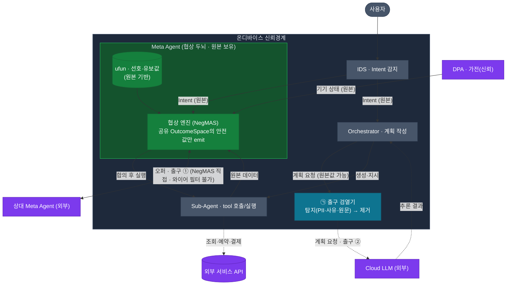

# DP02 대안 A — 출구 필터형 (Filter-at-Egress)

> 본 문서는 [07-민감정보-처리-구조-설계](./07-민감정보-처리-구조-설계.md)(이하 **현재안**: 설계타임 배제 + 프라이버시 게이트웨이)와 **같은 깊이로 비교**하기 위한 **대안 설계**다.
> **같은 것:** 문제·평가 6축([00-결정사항.md](./00-결정사항.md))·고정 결정(A2A=NegMAS, 자유텍스트 미전송, 역추론 제외).
> **다른 것(핵심 축):** 민감정보를 **언제·어떻게 막는가** — 현재안은 *설계타임에 어휘로 배제*, 대안 A는 *런타임에 출구에서 탐지·검열*.

---

## 1. 문제

현재안과 동일하다. 협상·계획이 동작하도록 충분히 전달하되, 사용자의 민감정보(PII·사유·과정밀 사실값·원본 맥락)는 단말을 떠나지 않아야 한다.

민감정보 분류도 동일하다 — 식별정보(PII) / 협상 사실값 / 사유(Private Knowledge) / 원본 맥락.

---

## 2. 설계 불변식 (Spine)

> **에이전트는 원본을 보유해 추론하고, 안전화는 *출구에서* 수행한다. 단 NegMAS 오퍼(㉡)는 공유 OutcomeSpace에 묶여 와이어에서 거를 수 없고, *Cloud LLM 호출(㉠)·실행* 출구에서만 검열기가 PII·사유·과정밀값을 런타임에 탐지·제거한다.**

함의(현재안과의 대비):

- **에이전트는 원본을 자유롭게 쓴다.** Meta Agent·Orchestrator는 정확 시각·이름·사유 등 **원본을 추론(ufun·전략·계획 요청 작성)에 그대로** 사용한다(사전 변환 없음).
- **㉡(오퍼)에는 출구 필터가 불가능하다.** NegMAS는 협상자가 낸 Outcome을 메커니즘이 상대에게 *그대로* 전달하며(가로채기 지점 없음), 오퍼 값은 양측이 *공유 OutcomeSpace*로 해석하므로 전송 중 값을 바꾸면 프로토콜이 깨진다. → ㉡의 안전은 **협상자가 처음부터 공유 어휘의 안전한 값만 emit**하는 것으로만 달성된다(= 현재안과 같은 *공유 OutcomeSpace* 레버).
- **㉠·실행 출구에서만 검열이 성립한다.** Cloud LLM 호출·외부 실행은 일반 API라, 나가는 내용을 검열기가 가로채 제거할 수 있다. **대안 A의 진짜 차별점은 "원본 보유 + ㉠ 출구 검열"** 이지, NegMAS 오퍼의 와이어 필터가 아니다.
- **정직한 한계:** 원본이 추론·온디바이스 전반에 흐르므로 ㉠ 검열 빈틈 = 유출(확률적). ㉡에선 결국 공유 OutcomeSpace 설계에 의존하게 된다.

---

## 3. 신뢰경계와 두 출구

신뢰경계는 **온디바이스**다. 밖으로 나가는 목적지는 둘(+실행)이며, **출구마다 안전화 방식이 다르다.**

| 출구 | 목적지 | 내용 | 사생활 처리 |
|---|---|---|---|
| **① 협상** | 상대 Meta Agent (외부, 불투명) | NegMAS 오퍼 | **검열 불가(와이어 없음).** 협상자가 공유 OutcomeSpace의 안전 값만 emit |
| **② 계획** | Cloud LLM (온디바이스 Orchestrator가 호출) | 계획 요청(원본값이 섞일 수 있음) | **검열기가 PII·사유·원문 제거**(일반 API라 가로채기 가능) |

- **출구 ①과 NegMAS:** 협상자가 낸 Outcome을 메커니즘이 상대 Meta Agent에 **직접** 전달한다 — 중간에 검열기를 끼울 수 없고, 값을 바꾸면 공유 OutcomeSpace 해석이 깨진다. → ㉡의 안전은 **공유 OutcomeSpace가 안전한 값만 담는 것**으로 달성(현재안과 동일한 레버).
- **출구 ②는 일반 API.** Orchestrator의 Cloud LLM 호출은 검열기가 가로채 PII·사유·원문을 제거할 수 있다 — **여기가 대안 A의 "출구 필터"가 실제로 성립하는 곳**이다.
- **Vault 불필요:** 에이전트가 원본을 보유하므로 실행(예약 등)에 원본을 직접 쓴다(현재안의 토큰화·복원 단계 없음).

---

## 4. 출구 검열기 — 내부 구성

검열기는 **탐지 + 검열**의 두 단계다(현재안의 게이트웨이보다 모듈이 적다 — OutcomeSpace 빌더·Vault 없음).

| 내부 모듈 | 역할 |
|---|---|
| **탐지기 (Detector)** | 나가는 메시지에서 PII·사유·과정밀값 탐지 (정규식·사전·LLM 백엔드 교체식) |
| **검열기 (Redactor/Coarsener)** | 탐지된 항목 드롭·정밀도 저하(시각→버킷, 위치→구 단위, 금액→상한) |
| *(선택)* **화이트리스트 검증** | 허용 필드/값만 통과(defense-in-depth) |

> **현재안과의 모듈 차이:** 현재안은 *입력*을 정규화하고 OutcomeSpace를 *구성*하며 PII를 *금고*에 둔다. 대안 A는 입력을 그대로 두고 **출구에서만** 탐지·검열한다 → 모듈은 단순하나, **부담 전부가 탐지 커버리지에 실린다.**

---

## 5. 라이프사이클 (데이터 흐름)

시간 순:

1. **IDS**가 Intent를 감지해 **원본** Intent를 Meta Agent·Orchestrator에 전달한다(정규화 없음).
2. **초기 계획:** Orchestrator가 원본 기반 계획 요청을 만들고 → **출구 검열기**가 PII·사유·원문을 제거한 뒤 외부 Cloud LLM을 호출한다(출구 ②).
3. **데이터 수집:** Sub-Agent·DPA가 **원본 데이터**를 반환해 Meta Agent에 들어온다.
4. **협상 셋업:** Meta Agent가 **원본으로 ufun(선호·유보값)을 구성**한다. 단 *공유 OutcomeSpace는 안전(coarse) 값*으로 양측이 공유한다.
5. **협상 라운드:** 협상 엔진이 **공유 OutcomeSpace의 안전 값 중에서** 오퍼를 골라 NegMAS로 상대 Meta Agent에 보낸다(출구 ①). 이 경로엔 검열기가 없다 — 오퍼는 이미 안전 값이다.
6. **재계획(트리거 시):** 원본 기반 재계획 요청 → ㉠ 검열기 → Cloud LLM.
7. **합의 후 실행:** Meta Agent가 보유한 원본 PII로 Sub-Agent가 예약·등록을 수행한다(복원 단계 없음).

---

## 6. MAF 내 배치

- **온디바이스 컴포넌트:** IDS, **Meta Agent(원본 보유)**, Orchestrator(계획 작성), Sub-Agent(tool 호출/실행), **출구 검열기**(단일 egress 관문). 신뢰경계 = 온디바이스 전체.
- **입력 출처:** IDS Intent·Sub-Agent·DPA의 **원본 데이터가 정규화 없이** Meta Agent/Orchestrator로 들어간다.
- **외부 목적지:** 상대 PPA(출구 ①, NegMAS), Cloud LLM(출구 ②), 외부 서비스 API(Sub-Agent). 출구 ①·②는 **검열기를 통과해야** 나간다.
- **원본은 에이전트와 검열기 안에 머문다** — 단, 검열기가 놓치면 그대로 밖으로 나간다.

---

## 7. 품질속성 6개 충족 방식

| 품질속성 | 대안 A가 충족하는 방식 / 한계 |
|---|---|
| **기밀성** | ㉠은 검열기 커버리지에 의존(확률적)·원본이 추론에 흐름 → 빈틈 = 유출. ㉡은 공유 OutcomeSpace에 의존(현재안과 동일). 종합적으로 현재안(원본 미도달)보다 약함 |
| **Latency** | 검열기 CPU는 가벼우나 매 출구마다. **원본 보유로 프롬프트가 커질 수 있어** 추론 비용은 오히려 증가 여지 |
| **자원** | OutcomeSpace 빌더·Vault가 없어 **모듈은 단순**. 단 원본 컨텍스트 보유로 메모리·KV 캐시 증가 |
| **Task 성공률** | **닫힌 어휘가 불필요해 표현이 자유** → 합의·신규 속성에 유리할 여지 |
| **세션 복구** | 상태(원본+ufun)가 단순해 직렬화 쉬움. 단 **복구 대상에 원본이 포함**되어 민감 |
| **유지보수성** | 스키마를 안 닫아도 됨(신규 도메인 쉬움) ↔ **검열기 탐지 규칙(패턴·사전·프롬프트) 유지보수 부담**과 누락 위험이 상존 |

---

## 8. 한계 (정직하게)

- **보장이 탐지 커버리지에 의존** — 검열기가 못 덮는 형태·필드·표현이 있으면 샌다. 결정론적 확인이 어렵다(현재안은 출구 정의만으로 확인 가능).
- **원본이 추론·온디바이스 전반에 흐른다** → 공격면이 넓다. 특히 **㉠ Cloud LLM 프롬프트에 원본이 섞일 위험**이 검열기 정확도에 걸린다.
- **㉡(오퍼)엔 출구 필터가 불가능하다** — NegMAS가 Outcome을 상대 Meta Agent에 직접 전달하고, 값을 바꾸면 공유 OutcomeSpace 해석이 깨진다. 따라서 ㉡ 안전은 결국 *공유 OutcomeSpace 설계*에 의존하게 되어 **그 채널에선 현재안과 차별점이 사라진다.** 대안 A의 실질 차별은 **㉠·실행 출구에 한정**된다.
- **대조:** 현재안은 ㉠ 빈틈마저 *"원본 미도달"* 로 구조적으로 없앤다 — 대안 A의 핵심 약점이 곧 현재안의 존재 이유다.

---

## 9. 후속 구체화 항목

- **탐지기 백엔드**(정규식·사전·LLM)와 **커버리지 검증** 방법(held-out·독립 민감어휘로 false-negative 측정).
- **과정밀값 coarsening 규칙**(시각·위치·금액).
- **A2A 출구 훅** 구현(NegMAS 직렬화 지점 가로채기).
- **㉠ 경로 redaction** — 계획 요청에서 PII·원문 제거 규칙.

---

_2026-06-26 작성. 현재안([07](./07-민감정보-처리-구조-설계.md)) 대비 대안 A. 평가 6축·고정 결정은 [00-결정사항.md](./00-결정사항.md)._
