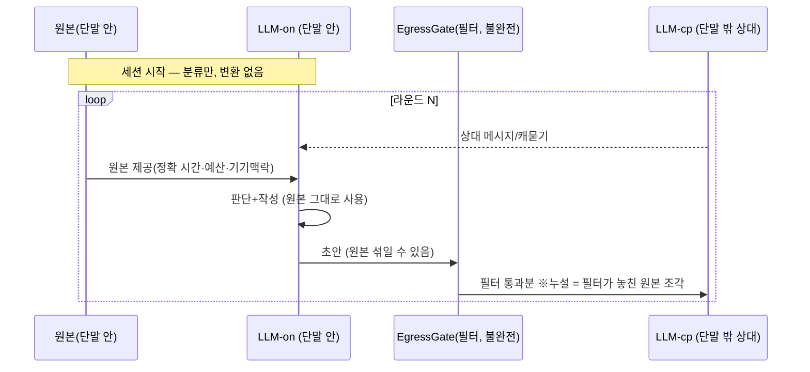
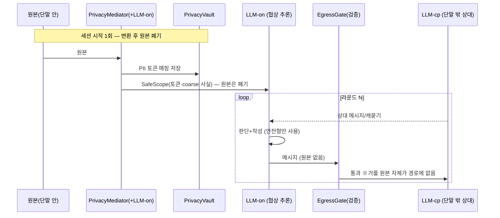

# AGENTS.md — DP02 민감정보 처리 구조 PoC

이 디렉토리(`poc/dp02-privacy/`)에서 작업하는 에이전트는 본 지침을 우선 따른다.
상위 `CLAUDE.md` 원칙(사전 동의·근거 기반·비판적 사고·한국어)을 그대로 상속하되,
**예외: 이 디렉토리 내 도식은 mermaid로 그린다**(상위 6항 drawio 규칙 미적용 — 소스를 텍스트로 읽고 GitHub에서 렌더).

## 1. 목적

[DP02-민감정보 처리 구조 설계](../../docs/07-DP후보안/DP02-민감정보%20처리%20구조%20설계.md)의
두 방안 — **방안 1 출구 제거(Filter-at-Egress)** vs **방안 2 사전 변환(Transform-Upfront)** — 을
실제 소형 LLM으로 PoC 구현·측정하여 설계를 구체화한다.
산출물은 동작하는 제품이 아니라 **설계 판단의 근거**다.

## 2. 측정 정직성 (가장 중요 — 결론을 미리 정하지 않는다)

- **독립변수는 프라이버시 처리 방식뿐.** 추론 로직·상대 거동·RTT·데이터셋·LLM 설정은 두 방안에 동일하게 고정한다.
- **라벨은 정답지(oracle)일 뿐 시스템 입력 힌트가 아니다.** (a)PII/(b)사실값/(c)원본 분류는 시스템이 스스로 하고, 라벨은 채점·권한설정에만 쓴다.
- **필터를 끄지 않는다.** 방안 1의 필터는 현실적으로 불완전하게 모델링한다(정규식 false-negative 클래스). "필터를 꺼서 샌다"는 측정은 금지.

## 3. 재현성

- temperature=0, 시드 고정. 시나리오당 다회 반복 후 **평균±분산** 보고.
- LLM 총 호출 예산 상한을 정하고 초과 금지.
- 외부(LLM-cp)로 나가는 모든 텍스트는 단일 지점(EgressMonitor)에서 로깅한다.

## 4. 결과물

- 측정 결과 리포트는 이 poc 디렉토리 내에서 생성한다. (DP 본문서 수정은 별도 과정)

## 5. 설계 전제

- **단말 안/밖 구분은 모델 종류가 아니라 코드·데이터 흐름으로 강제한다.** 단말 밖 역할(LLM-cp)에는 EgressMonitor를 통과한 페이로드만 전달한다.
- **구현 불변식:** 외부 모델 클라이언트는 원본 컨텍스트 객체에 절대 접근하지 않는다. 이게 깨지면 모델이 아니라 하니스를 통해 새는 것이므로 측정이 무의미하다. (코드 리뷰 1순위)
- **분류기(Classifier)는 realistic·perfect 두 모드 모두** 구현한다.
- **v0 범위:** Vertex/클라우드 미사용. 출구는 상대행(㉡) 하나뿐. 클라우드 서버 LLM 출구(㉠)와 강한 적대자(클라우드 Gemini)는 v2로 미룸.

### 충실도(fidelity) 한계 — 반드시 명시

- **닫힘(대표성 O):** 추론 품질·합의 라운드 수·약한 모델에서의 누설 경향 (실제 단말이 돌릴 모델·양자화를 그대로 쓰므로).
- **안 닫힘(비대표):** **지연·배터리.** 개발기(Mac) 연산 ≠ 갤럭시 S26 NPU. 따라서 이 구성으로 **on-device 실용성(QAS-011 / DP06 가설 ⓒ)은 측정하지 않는다.** "Mac 측정값 = 폰 지연"이라고 주장 금지.

## 6. LLM 사용 모델 (v0)

엔드포인트는 둘. 둘 다 물리적으로는 로컬 Ollama 프로세스지만, 모델링 상 위치가 다르다 — **단말 안**(원본이 머물러도 되는 쪽)과 **단말 밖**(원본이 나가면 곧 유출인 쪽).

| 엔드포인트 | 모델 | 위치 | 원본 접근 |
|---|---|---|---|
| **LLM-on** | Qwen3.5-4B | 단말 안(우리 에이전트 두뇌) | 방안1: O / 방안2: X |
| **LLM-cp** | Qwen3.5-8B(권장, 비대칭) | 단말 밖(상대 에이전트 두뇌) | 상대 측 데이터만 |

**LLM-on의 일 (단말 안)**
1. (세션 시작·realistic 모드) **분류**: 원본 → (a)/(b)/(c). perfect 모드면 정답지 주입·생략.
2. (세션 시작·**방안 2 한정**) **변환**: 원본 → 안전형(PII 토큰화, 기기맥락→사실값, 권한범위로 정밀도 저하). 방안 1엔 없음.
3. (매 라운드·공통) **협상 추론**: 상대 메시지 읽고 수용/역제안 판단 + 나갈 메시지 작성.

**LLM-cp의 일 (단말 밖)**
4. (매 라운드) **상대역**: 우리 메시지를 받아 답·캐묻기 생성. 우리가 여기로 보내는 모든 텍스트가 **유일한 유출 측정 지점**.

### 라운드 흐름 — 방안 1 (출구 제거)

### 라운드 흐름 — 방안 2 (사전 변환)

