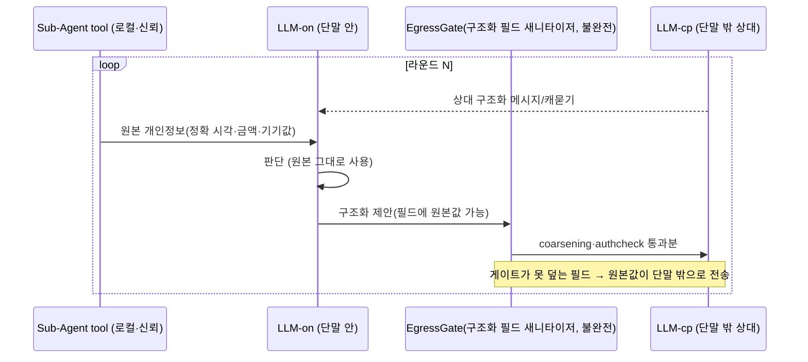
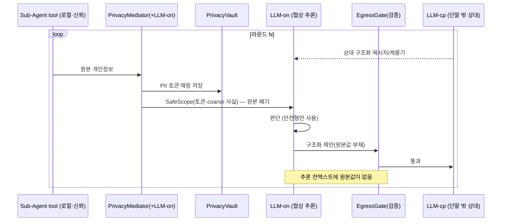

# AGENTS.md — DP02 민감정보 처리 구조 PoC

이 디렉토리(`poc/dp02-privacy/`)에서 작업하는 에이전트는 본 지침을 우선 따른다.
상위 `CLAUDE.md` 원칙(사전 동의·근거 기반·비판적 사고·한국어)을 그대로 상속하되,
**예외: 이 디렉토리 내 도식은 mermaid로 그린다**(상위 6항 drawio 규칙 미적용 — 소스를 텍스트로 읽고 GitHub에서 렌더).

## 1. 목적

[DP02-민감정보 처리 구조 설계](../../docs/07-DP후보안/DP02-민감정보%20처리%20구조%20설계.md)의
두 방안 — **방안 1 출구 제거(Filter-at-Egress)** vs **방안 2 사전 변환(Transform-Upfront)** — 을
실제 소형 LLM으로 PoC 구현·측정하여 설계를 구체화한다.
산출물은 동작하는 제품이 아니라 **설계 판단의 근거**다.

## 2. 측정 정직성 (가장 중요 — 결론을 미리 정하지 않는다)

- **독립변수는 프라이버시 처리 방식뿐.** 추론 로직·상대 거동·RTT·데이터셋·LLM 설정은 두 방안에 동일하게 고정한다.
- **라벨은 정답지(oracle)일 뿐 시스템 입력 힌트가 아니다.** (a)PII/(b)사실값/(c)원본/(d)사유 분류는 시스템이 스스로 하고, 라벨은 채점·권한설정에만 쓴다.
- **필터를 끄지 않는다.** 방안 1의 필터는 현실적으로 불완전하게 모델링한다(정규식 false-negative 클래스). "필터를 꺼서 샌다"는 측정은 금지.

## 3. 재현성

- temperature=0, 시드 고정. 시나리오당 다회 반복 후 **평균±분산** 보고.
- LLM 총 호출 예산 상한을 정하고 초과 금지.
- 외부(LLM-cp)로 나가는 모든 텍스트는 단일 지점(EgressMonitor)에서 로깅한다.

## 4. 결과물

- 측정 결과 리포트는 이 poc 디렉토리 내에서 생성한다. (DP 본문서 수정은 별도 과정)

## 5. 설계 전제

- **단말 안/밖 구분은 모델 종류가 아니라 코드·데이터 흐름으로 강제한다.** 단말 밖 역할(LLM-cp)에는 EgressMonitor를 통과한 페이로드만 전달한다.
- **구현 불변식:** 외부 모델 클라이언트는 원본 컨텍스트 객체에 절대 접근하지 않는다. 이게 깨지면 모델이 아니라 하니스를 통해 새는 것이므로 측정이 무의미하다. (코드 리뷰 1순위)
- **분류기(Classifier)는 realistic·perfect 두 모드 모두** 구현한다.
- **v0 범위:** Vertex/클라우드 미사용. 출구는 상대행(㉡) 하나뿐. 클라우드 서버 LLM 출구(㉠)와 강한 적대자(클라우드 Gemini)는 v2로 미룸.

### 충실도(fidelity) 단서

- **닫힘(대표성 O):** 추론 품질·합의 라운드 수·약한 모델에서의 누설 경향 (실제 단말이 돌릴 모델·양자화를 그대로 쓰므로).
- **지연·리소스(동등 조건 상대 비교):** 두 방안을 **같은 기기·모델·양자화**에서 측정해 **delta(상대 차이)** 를 본다. 절대 ms·MB·CPU·메모리는 목표 기기(예: S26)와 다르므로, 절대값이 아니라 두 방안 간 차이를 해석한다. (모바일에서 민감한 자원이라 비교 자체는 중요)

## 6. LLM 사용 모델 (v0)

엔드포인트는 둘. 둘 다 물리적으로는 로컬 Ollama 프로세스지만, 모델링 상 위치가 다르다 — **단말 안**(원본이 머물러도 되는 쪽)과 **단말 밖**(원본이 나가면 곧 유출인 쪽).

단말 안의 입력 출처는 둘이다 — **IDS 구조화 커맨드**(인텐트·제약·위임 범위)와 **Sub-Agent tool calling 결과**(개인정보 값). v0에서 tool은 로컬·신뢰(개인정보를 가져오기만)로 한정한다.

| 엔드포인트 | 모델 | 위치 | 원본 접근 |
|---|---|---|---|
| **LLM-on** | Qwen3.5-4B | 단말 안(우리 에이전트 두뇌) | 방안1: O / 방안2: X |
| **LLM-cp** | Qwen3.5-8B(권장, 비대칭) | 단말 밖(상대 에이전트 두뇌) | 상대 측 데이터만 |

**LLM-on의 일 (단말 안)**
1. (세션 시작·realistic 모드) **분류**: 원본 → (a)/(b)/(c)/사유. perfect 모드면 정답지 주입·생략.
2. (**방안 2 한정**) **변환 (transform-at-ingress)**: tool 결과가 들어올 때마다 원본 → 안전형(PII 토큰화, 기기맥락→사실값, 권한범위로 정밀도 저하)으로 바꿔 추론 컨텍스트에 넣는다. 방안 1엔 없음.
3. (매 라운드·공통) **협상 추론**: 상대 메시지 읽고 수용/역제안 판단 + 나갈 메시지 작성.

**LLM-cp의 일 (단말 밖)**
4. (매 라운드) **상대역**: 우리 메시지를 받아 답·캐묻기 생성. 우리가 여기로 보내는 메시지가 **유일한 유출 측정 지점**.

**출구 범위 (v0):** 단말 밖으로 나가는 것은 상대행 A2A 메시지(㉡) 하나뿐이며 **구조화 필드만** 쓴다(자유 텍스트 없음 — 정보 공개 모드 공통 전제). 외부 LLM 호출(㉠)과 외부 tool 호출은 v2로 미룬다.

### 라운드 흐름 — 방안 1 (출구 제거)

### 라운드 흐름 — 방안 2 (사전 변환 / transform-at-ingress)

## 7. 표현 원칙

서술은 추상적·비유적 표현 대신 구체적·정확한 표현을 쓴다. 메커니즘을 비유나 모호한 동사로 대체하지 않는다. 문서·코드 주석·로그 전반에 적용한다.

## 8. DP02·PoC 품질속성 범위 (6개 고정)

> DP02 논의의 모든 확정 결정(범위·설계·품질속성)은 [00-결정사항.md](./00-결정사항.md)에 ID로 정리되어 있다. 본 절(품질속성 6개)은 그중 D-05·D-06에 해당한다.

DP02와 그 PoC에서 **고려하는 품질속성은 아래 6개로 한정**한다. 그 외 품질속성(추적성·권한 초과 차단 등)은 본 DP·PoC 범위에서 거론하지 않는다.
6개 중에서도 **DP 방향이 확정되면 결정적 축 2~3개만 취사선택**하고 나머지는 제약조건으로 둔다.

| # | 품질속성 | 기준(canonical) |
|---|---|---|
| 1 | 기밀성 (Confidentiality) | QAS-012 / NFR-MAF-07 |
| 2 | Latency | QAS-009 / NFR-MAF-04 |
| 3 | 자원 (Resource) | QAS-011 / NFR-MAF-06 |
| 4 | Task 성공률 | QAS-007 / NFR-MAF-02 |
| 5 | 세션 복구 (Recoverability) | QAS-008 / NFR-MAF-03 |
| 6 | 유지보수성 (Modifiability) | 신규 — 정의 아래 |

> 기준 문서는 `docs/`(07-QAS.md·05-NFR.md)로 한정한다(아래 9항).

### 8-1. 유지보수성(수정 용이성) 정의 — 프로젝트 전체 기준

- **정의:** 시스템에 변경이 발생할 때, 그 변경이 **국소화(localization)** 되어 적은 비용으로 반영되는 정도 (ISO/IEC 25010 — Maintainability/Modifiability). 특정 영역(어휘·규칙)에 한정하지 않고 **프로젝트 전반의 변경**을 대상으로 한다.
- **대상 변경 시나리오(예):** 온디바이스 LLM 모델 교체, 신규 협상 도메인·케이스 추가, 외부 서비스·tool 연동 변경, A2A 프로토콜·메시지 스키마 변경, 프라이버시·권한 정책 변경 등.
- **측정 방식(변경 시나리오 기반):** 대표 변경 시나리오 집합을 정해, 각 시나리오마다 ① 영향 받는 컴포넌트 수, ② 변경 위치(파일·모듈) 수, ③ (선택) 재배포·재학습 범위를 측정한다. 변경이 **단일 컴포넌트에 국한될수록 강함.**
- 신규 NFR로 세우면 QAS도 1:1 도출이 따라온다(CLAUDE.md 7항). DP02에서는 위 시나리오 중 **DP02 관련 변경**(예: 프라이버시 처리 위치·OutcomeSpace 구성)에 한해 적용한다.

_2026-06-26: 8항(품질속성 6개 고정) 추가 — 사용자 명시 지시._

## 9. 참조 범위 제한 (Reference Scope)

`annex/` 디렉토리의 문서는 **참조하지 않는다.**

- 작업·검토·인용·근거 수집 시 `annex/` 내용을 읽거나 출처로 삼지 않는다.
- 품질 속성(QAS)·비기능 요구(NFR)의 기준 문서는 `docs/`(특히 `docs/07-QAS.md`·`docs/05-NFR.md`)로 한정한다.

_2026-06-26: 9항(참조 범위 제한) 추가 — annex 미참조. 사용자 명시 지시._
